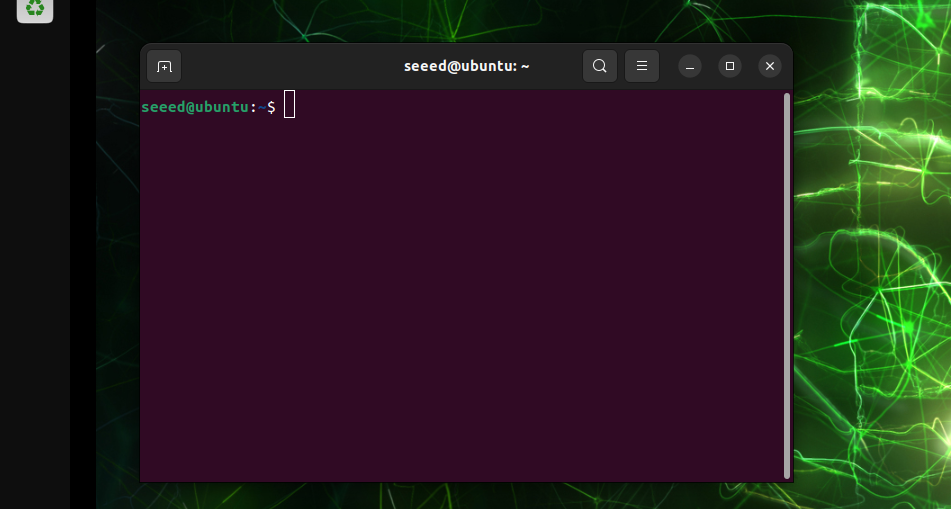
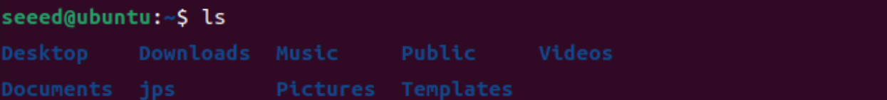
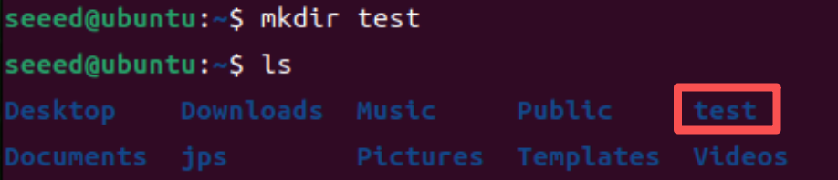
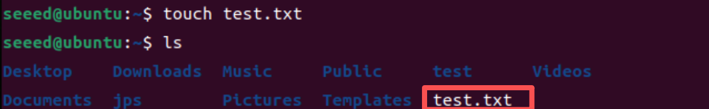
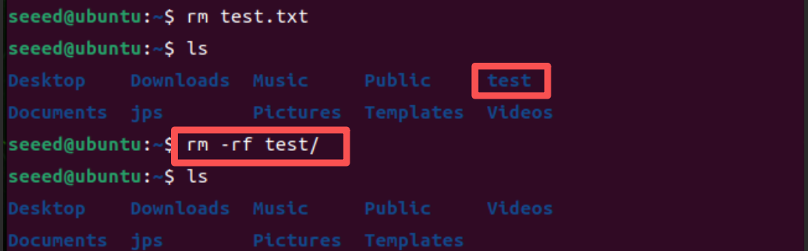
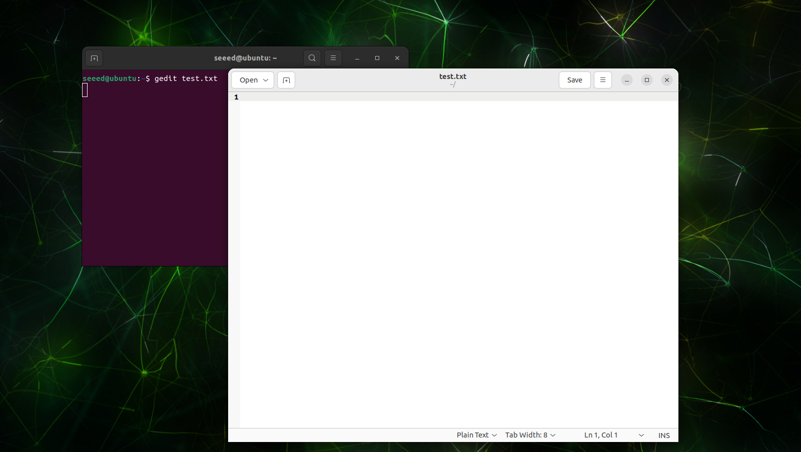
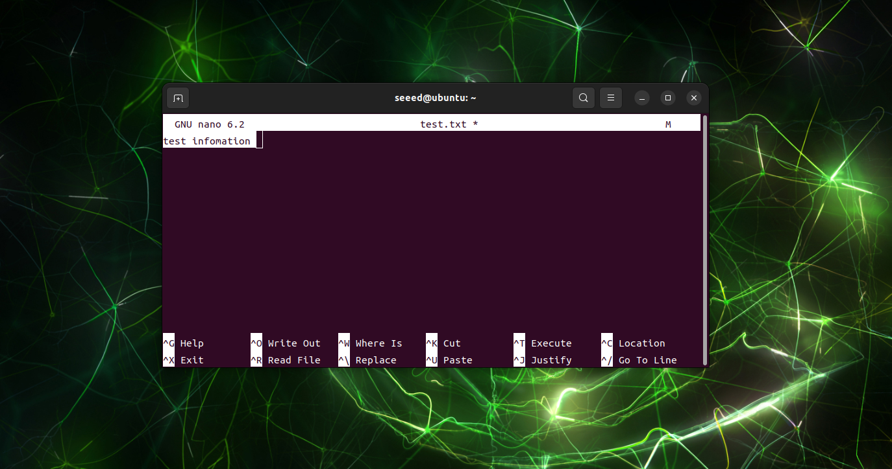
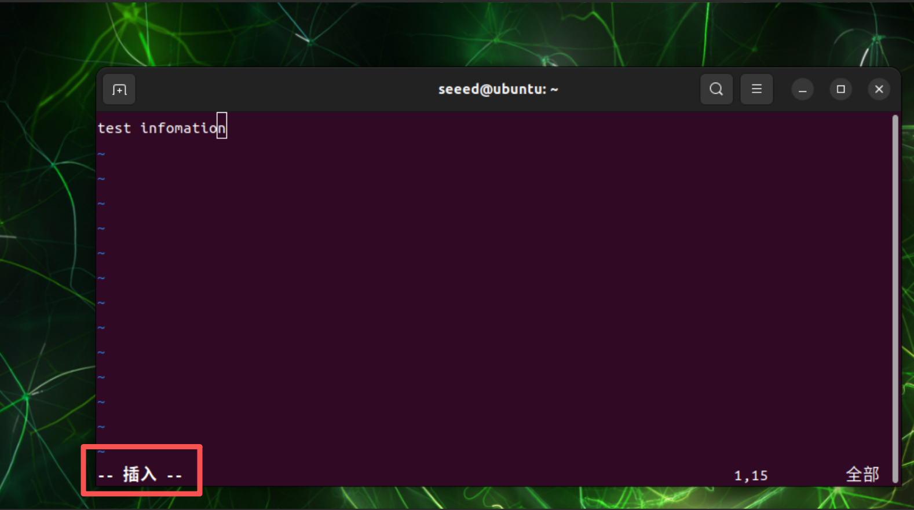
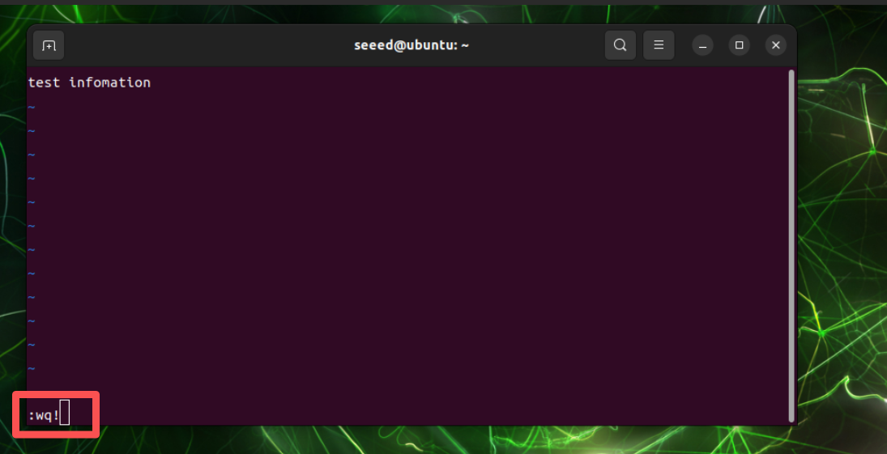

# Linux Terminal and Text Editors

[Back to Module 3](../README.MD) | [Back to Table of Contents](../../Table-of-Contents.md)

## Basic use

This course will describe the use of commonly used terminal operating commands and text editing tools for the Linux system.

### Terminal

Linux's terminal (Terminal) is a command line interface through which you can directly enter the command to operate the system without relying on a graphical interface. It can be used to manage files, run programs, install software, view system information, etc., and is a very core tool in Linux. In short, the terminal is the window of the dialogue with the system. When entering the Jetson desktop, the keyboard can open a terminal by pressing Cltr + Alt + T.

> In addition, a terminal window for the Jetson device can be opened remotely through SSH. We will follow up with details.



Almost all the things that can be done in the graphical interface can be done with commands in the terminals and are usually more efficient and direct. Examples include: basic document operations, system management and monitoring, software package management, document content editing, etc. The orders frequently used in terminals are described below.

### Linux Base Command

See what is in the current directory



```bash
ls
```



Create a folder in the current directory


```bash
mkdir test
# Create nested directories
mkdir -p test/src
```



Enter directory


```bash
# `cd` + directory path
cd test/
# Return to the parent directory
cd ..
```



Create File

```bash
# touch test.txt
```

Show Current Directory

```bash
pwd
```

Delete files and remove folders

```bash
# Delete a file
rm test.txt
# Delete a folder recursively with `-rf`
rm -rf test/
```

Clear the content of the current terminal output

```bash
clear
```

### Shortcuts in Terminal Window

Termination of current running program/command

> Ctrl + C

Automatically complete file name or folder name



> Tab

Suspend Current Process

> Ctrl +Z



Mouse selects terminal text for copying, pasting

Copy

> Ctrl+Shift+C

Paste



> Ctrl + Shift + V



## Text editing tool

### Gedit

Gedit is a simple graphical text editor under Linux for editing code and text files. There's the image GUI. Enter the following command in the terminal window to create and open a file:

```bash
# `gedit` + file name
gedit test.txt
```

#### Nano.

Nano is a lightweight text editor used in terminals that is simple and suitable for rapid editing of files. No graphical GUI:

```bash
#Installnano
sudo apt update
sudo apt-get install nano -y
# Edit the text
nano test.txt
```

### Vim/Vi

vi is the most classic command line editor in the Unix/Linux system, which has existed since 1976 and is the standard editor for almost all Unix systems. Vim is an enhanced version of vi, compatible vi but more powerful.

```bash
# Open the editing page
vim test.txt
```

> Press i to edit text after entering the editor

> After editing, enter: Select edit mode for next action
> Common mode command:
> Save File
> Other Organiser
> Exit
> :q
> Save and exit
> :wq
> Force exit without saving
> :q!
> Force saving and exit
> :wq!
> Remove All
> %d
> Find Text
> : /xxx xx as the text to be found, confirm on return and select the next matching entry by n

### 14 Use Vim Editor

## Vim Basic

Vim is a command-line text editor commonly used in Linux/Unix. It is highly efficient, lightweight, and can be edited without mouse and is widely used in server, embedded and development environments.

Before formally introducing the basic use of Vim, describe the mode of work of Vim, which is key to understanding the operation of Vim.

Three common modes for Vim

Normal Mode (Normal Mode)
Vim's startup default mode, which is used to move, delete, copy, etc.

Insert Mode
to enter and edit text.

Command Mode
to save, exit, search, replace, etc.

[Back to Module 3](../README.MD)
