# Network and Wi-Fi on Jetson

[Back to Module 3](../README.MD) | [Back to Table of Contents](../../Table-of-Contents.md)

## 02 Web Knowledge (WIFI Configuration)

### Introduction

This section will describe how to connect Jetson to the network and to regular network configurations.

### Wi-Fi Configuration

### Connect Wi-Fi

Mode 1: GUI Connection

Enter the Jeton system desktop and click the power icon at the top right corner - >Wi-Fi icon - >Wi-Fi Setting.

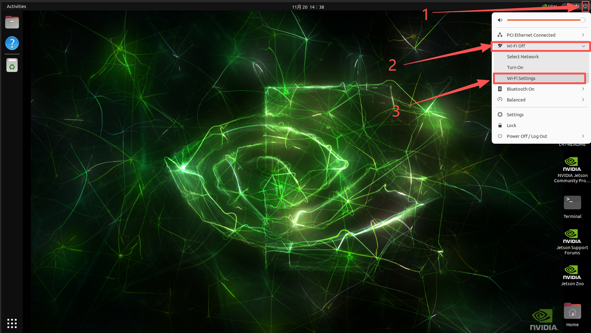

Select the WiFi that you want to connect to, and check if the wireless card is equipped with antennas or antennas if both are scanned.

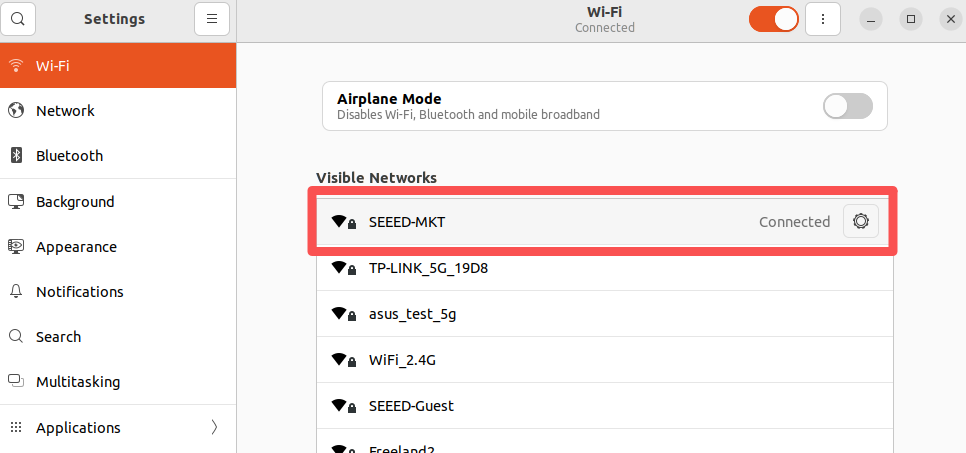

Click the connected WiFi settings icon to view WiFi information.

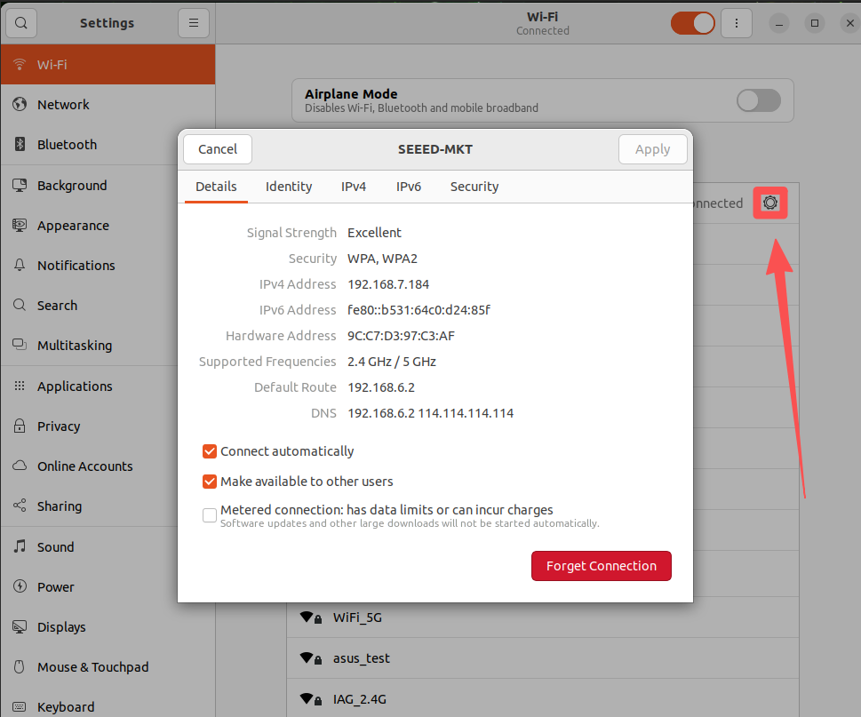

View the IP addresses of all network connections and open the terminal to enter the following commands:

```bash
ifconfig
```

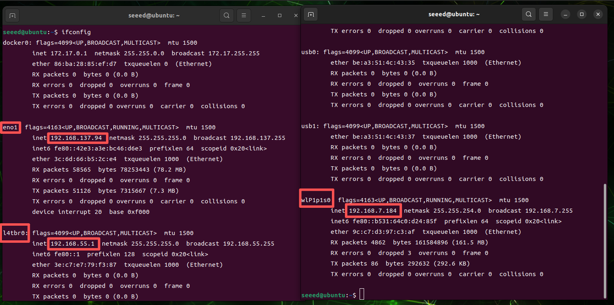

If the above figure is an IP address for a web-based interface, l4tbr0 is an IP address assigned to Jetson for the Type interface and wlP1p1s0 is an IP address for the WiFi interface,

Mode 2: Command line connections

Open the terminal to enter the following command to query the wfi signal in the current environment:

```bash
nmcli device wifi list
```

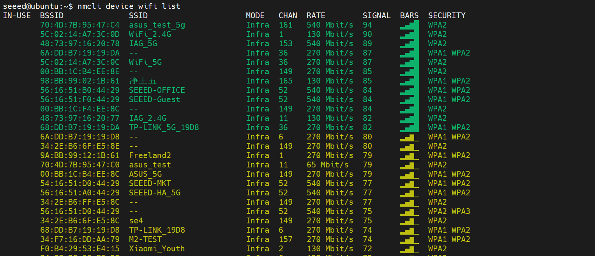

Connect WiFi with the command below

```bash
nmcli device wifi connect "WiFi-Name" password "Password"
```

### Set static IP

Set Options for Open Wi-Fi

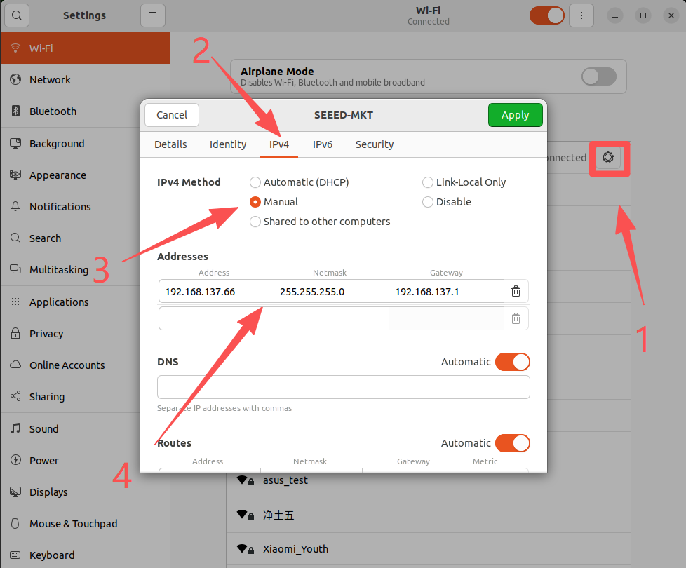

> Address: Fill in an IP address that requires a fixed IP address and an assignable IP address range
> Netmask: Fill in 255.255.255.0
> Gateway: Fill in WiFi default gateway address

Reconnecting WiFi is effective.

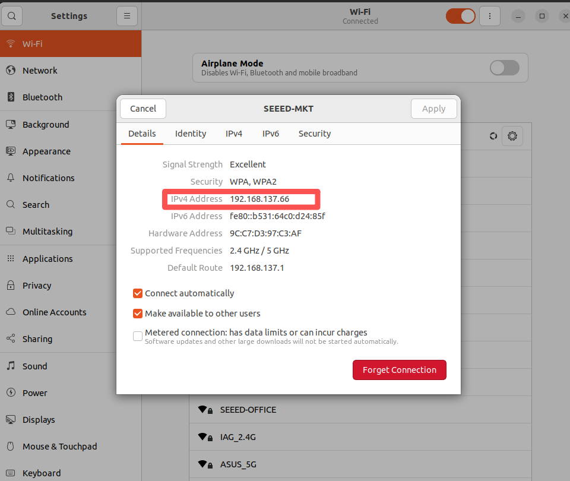

### Wi-Fi Hot

In development, it is sometimes necessary to connect the Jetson hotspot to control and debug the program. Here's how to turn on the hot spots.

> Attention, need a wireless card to support the AP working mode!

Open Wi-Fi Hotspot

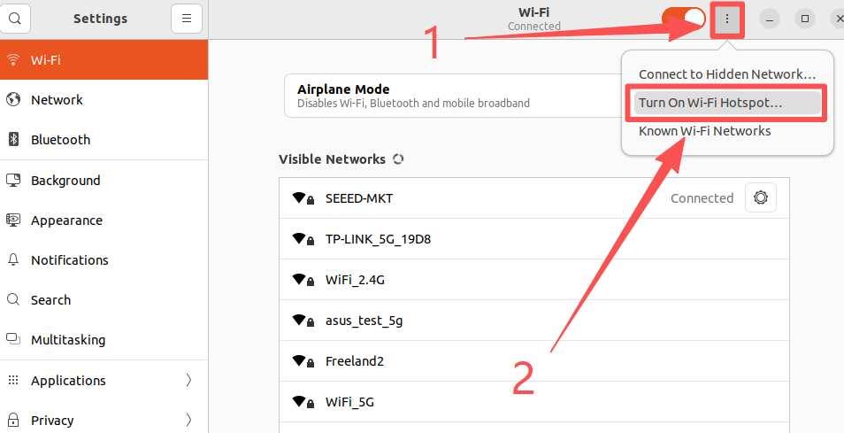

Configure hot spots and open them

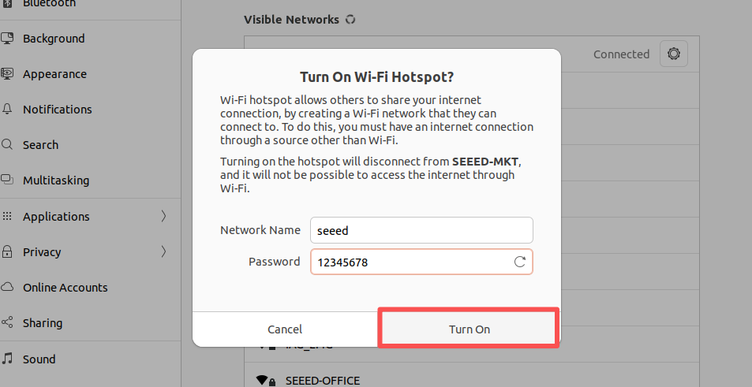

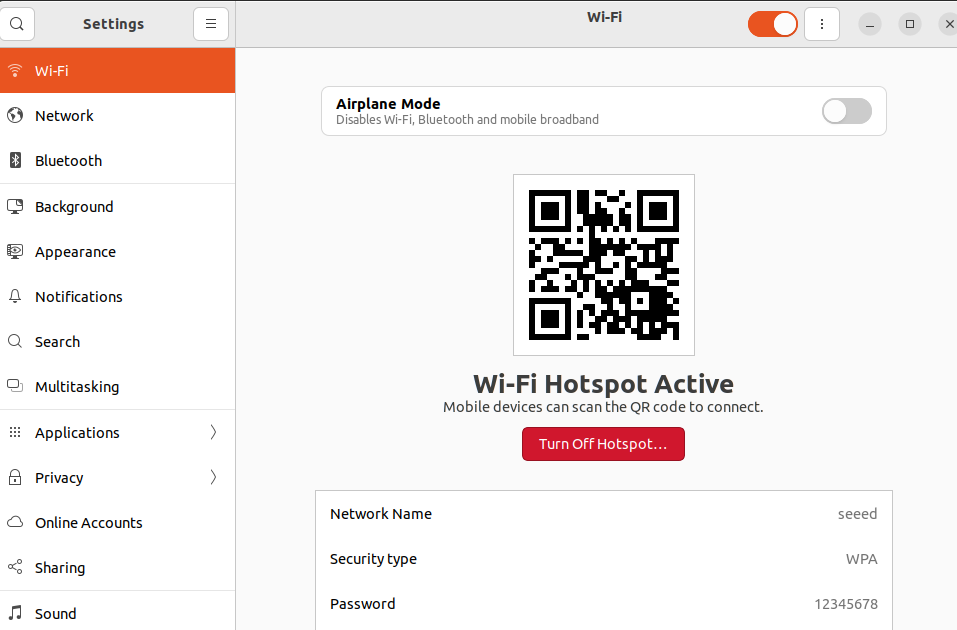

The Hotspot Connection opened by Jetson can be detected normally on Windows PC

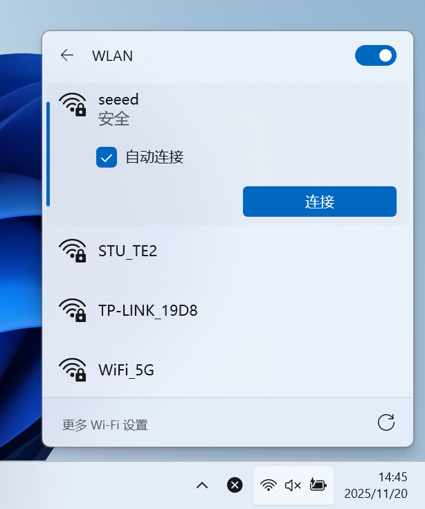

### Wireless connection

Just connect the network to Jetson's portal.

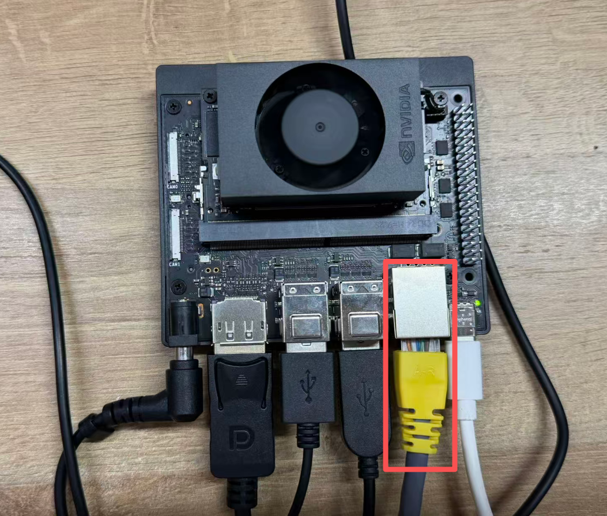

[Back to Module 3](../README.MD)
