# SSH Remote Access

[Back to Module 3](../README.MD) | [Back to Table of Contents](../../Table-of-Contents.md)

## 03 SSH Remote Landing

### Introduction

SSH (Secure Shell) is a secure remote connection protocol that allows you to log in via the network to another computer, execute orders, and transfer files. The reason for using SSH is that it encrypts communication, is safe and reliable and allows remote server management or embedded equipment (e.g. Jetson, berry pie) without contact with physical equipment.

### Three ways to connect SSH

### WiFi Connection

> Use the ssh remote connection requires two devices under the same local area network, so make sure your PC and Jetson are connected to the same WiFi!

Enter the IP address of the Jetson WiFi interface for the following command in the Jetson terminal window.

```bash
ifconfig
```

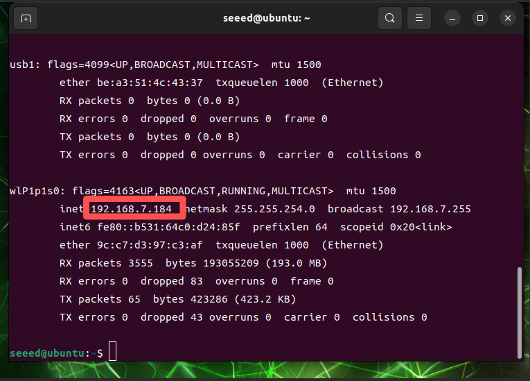

Once we have the IP address of the Jetson device, we can access the Jetson device remotely from other devices in the local area network.

The PC end-end SSH connects to Jetson in a variety of ways, where the MobaXterm software is demonstrated.

First we need to download and install MobaXterm.

https://mobaxterm.mobatek.net/download.html


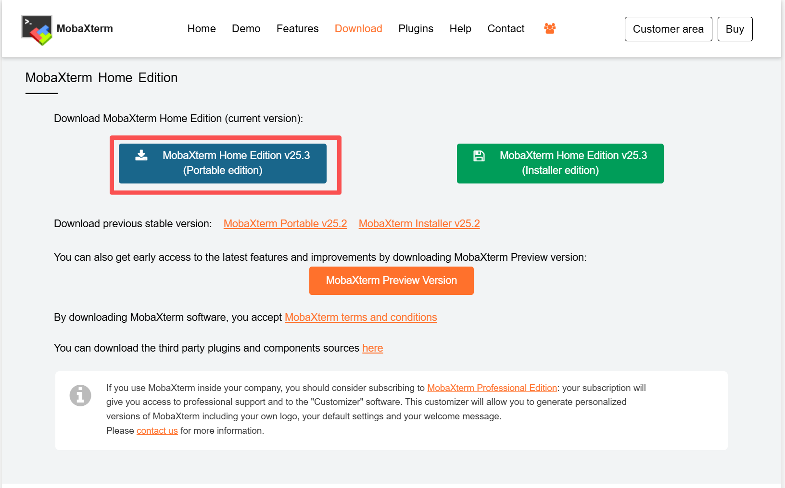

When the download is finished, depress the pressure and double-click the executable to start MobaXterm.

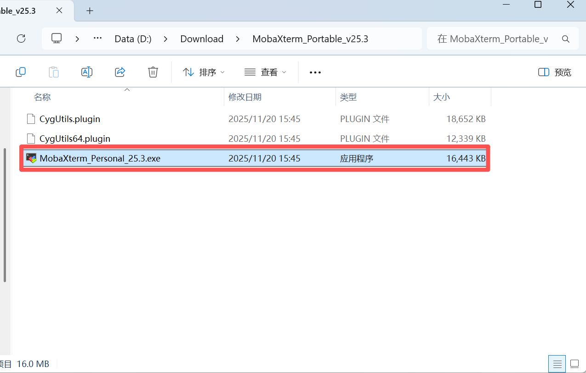

Opens an operating terminal in MobaXterm.

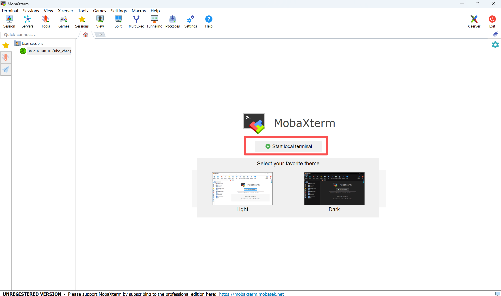

Performs remote connection landing orders in terminals.

```bash
# The text before `@` is the Jetson username, and the text after `@` is the Jetson IP address
ssh seeed@192.168.7.184
```

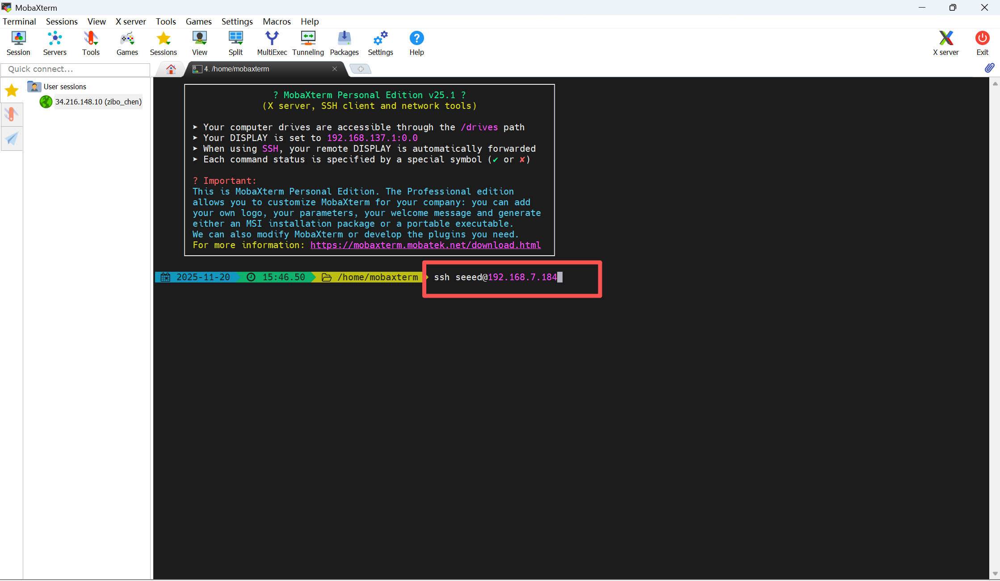

A password is required for the first log-in upon return to enter the Jetson device.

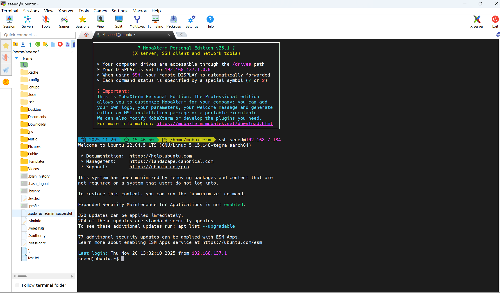

Enter a jtop to see the utilization of the Jetson resource.

> If your terminal printing does not have a jtop command, prove that your jetson does not run a jtop service, you can use the 06 jtop tool to manually install jtop.

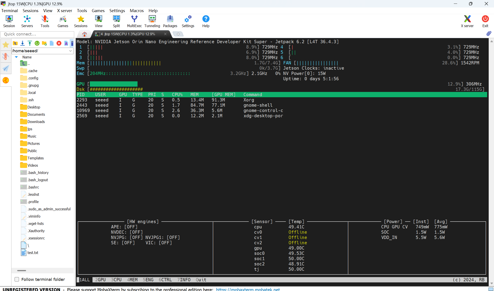

### Network connectivity

PC connects WiFi and shares the network with jeton via the portal, which also allows for a remote connection between jetson and jetson in the event that jetson cannot connect WiFi

Prepare a wire to connect PC and Jetson to the chart below.

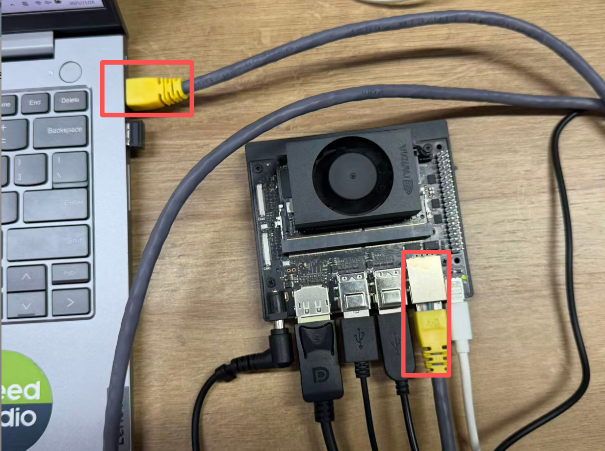

PC Open Control Panel

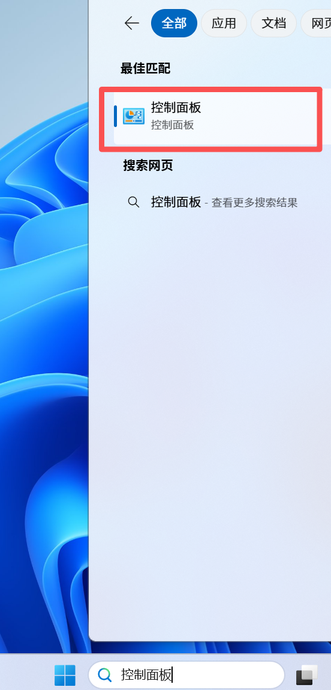

Choose Network and Internet > Network and Sharing Center > Change Setup

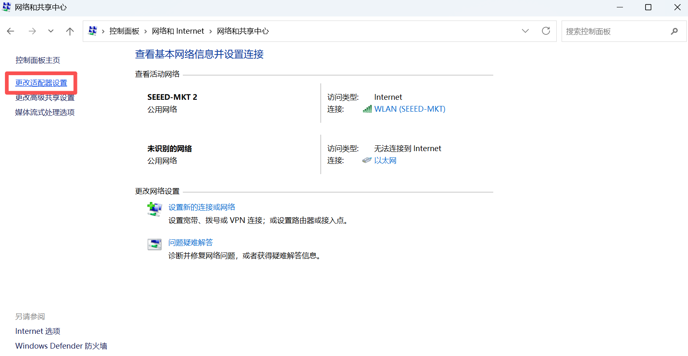

Click WLAN to select properties -- click share -- allow other network users to connect through this computer's Internet connection -- choose Ethernet -- OK

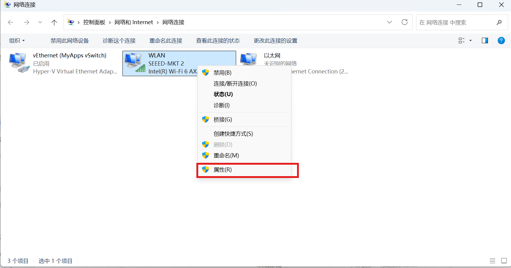

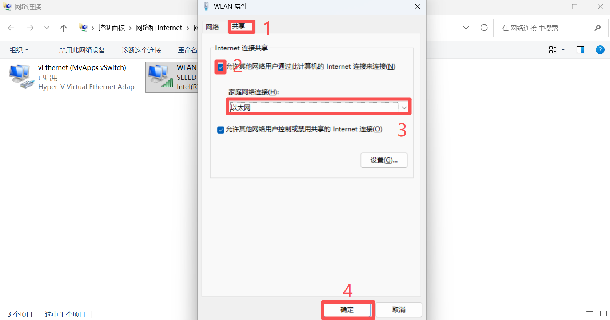

Turning on Jetson, you can see the connection to the cable network.

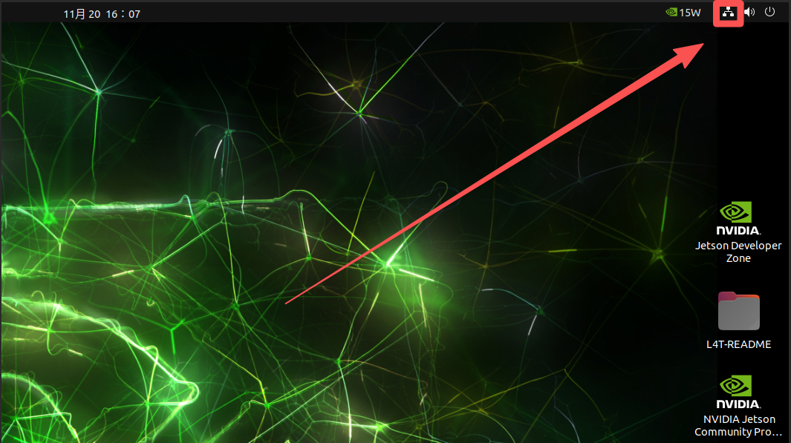

View cable IP

```bash
ifconfig
```

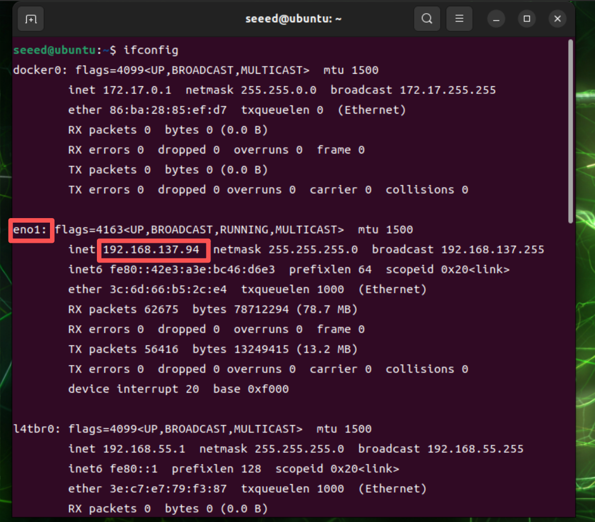

Now also use MobaXterm to connect Jetson.

```bash
# Enter the wired-network IP address
ssh seeed@192.168.137.94
```

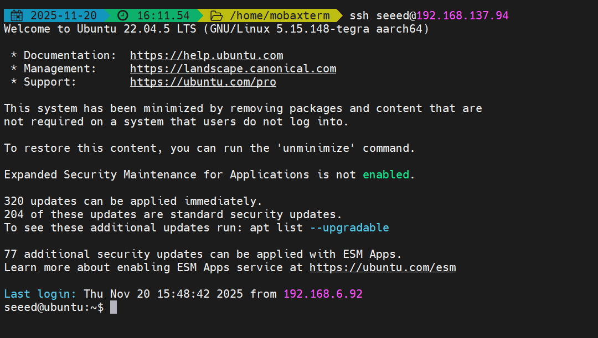

[Back to Module 3](../README.MD)
