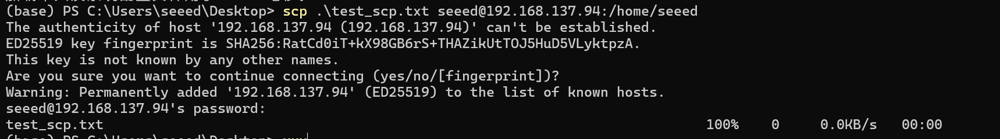
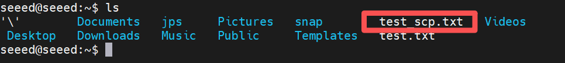
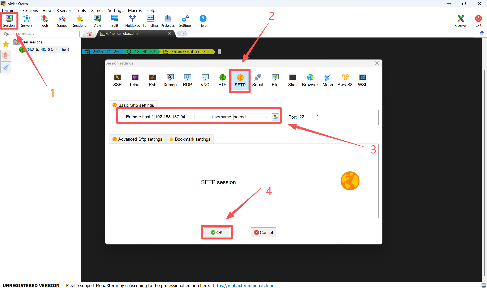
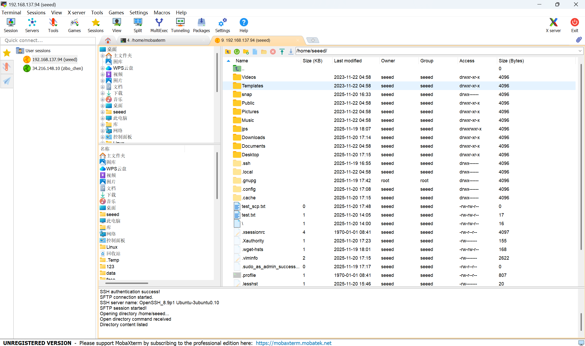

# Remote File Transfer

[Back to Module 3](../README.MD) | [Back to Table of Contents](../../Table-of-Contents.md)

## 05 File Remote Transfer

### Introduction

Data transfer between PC and Jetson is often required in the development process, so this section will describe how documents are transmitted between PC and Jetson.

### scp method

SCP (Secure Copy) is a SSH-based secure file transfer command that can be used to quickly and encrypt files or folders between this machine and a remote server. It is simple to operate by uploading a document to a remote device or downloading it from a remote device to a local location with a single command and is well suited to secure data transmission between different devices.

Transfer File

Transfers the PC file to Jetson.

Run the following command in the Linux PC terminal window to copy the `https://download.docker.com/linux/ubuntu/dists/ ' file from the current directory to the `/home/seeed ' directory of jetson devices.

```bash
scp test_scp.txt seeed@192.168.137.94:/home/seeed
```

Enter Jetson password



At this point, you can see an additional test scp.txt file under the /home/seeed/ directory for Jetson



### Use MobaXterm

File transfer using MobaXterm as described in the 03 SSH Remote Landing Chapter

Create a new Seesion->SFTP->Input Jetson IP and Username->OK



When the connection is successful, you can transmit the file.



[Back to Module 3](../README.MD)
