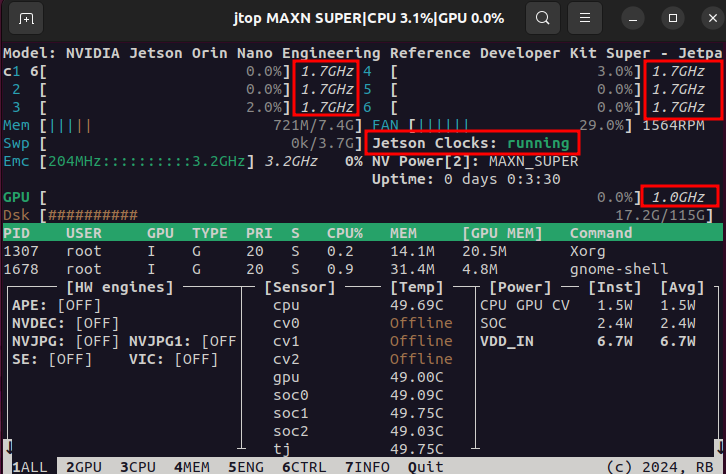
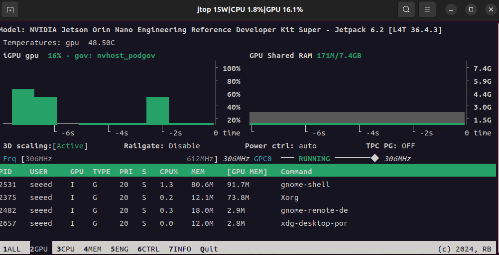
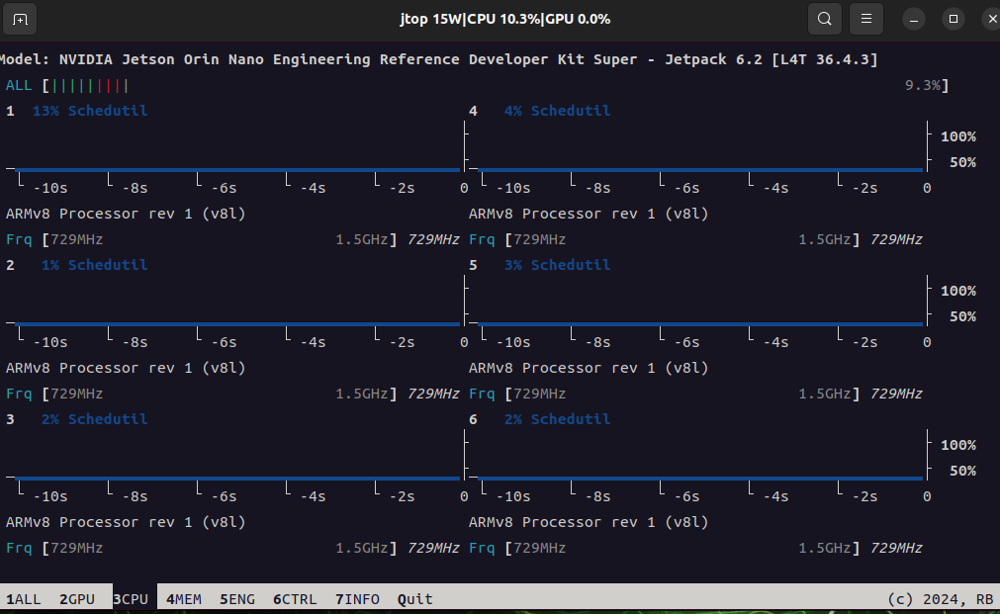
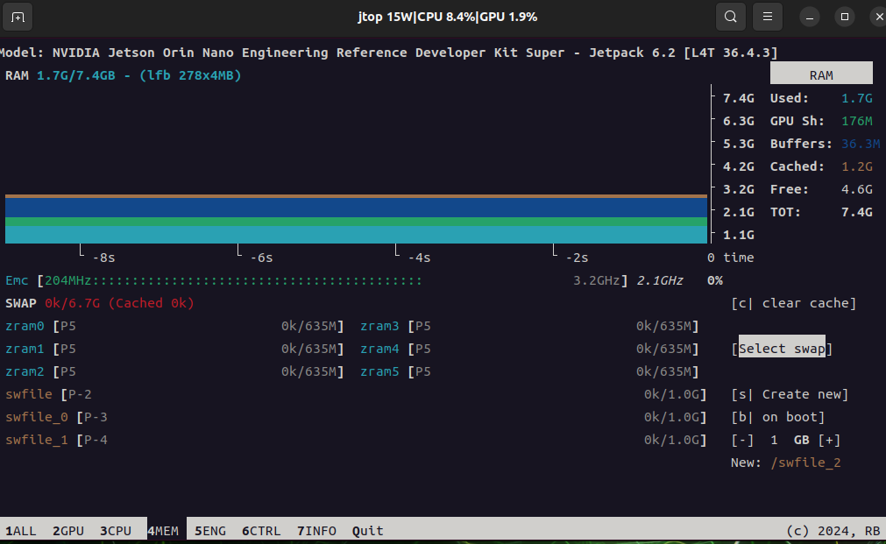
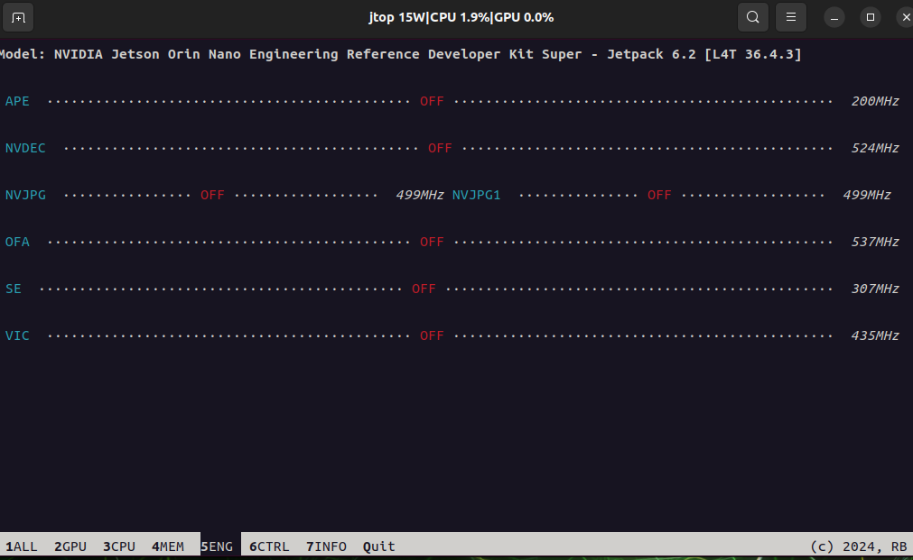
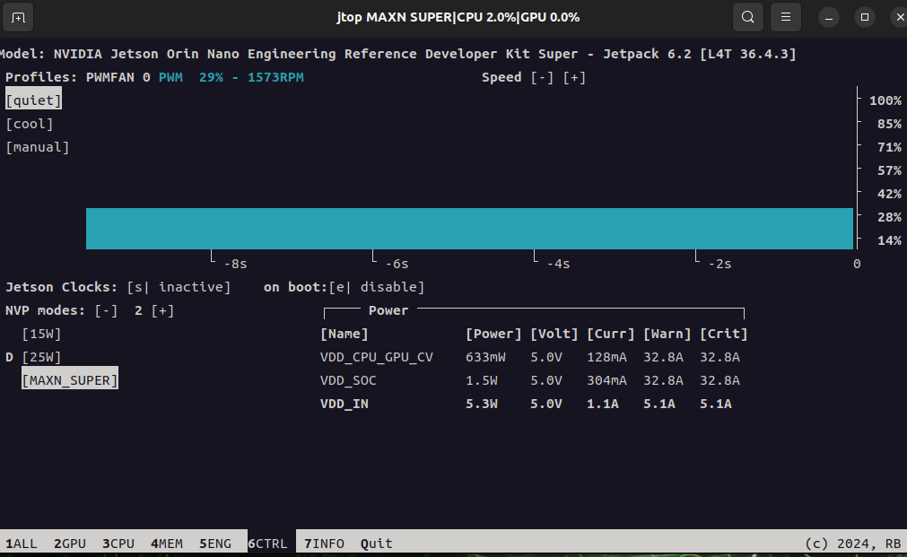
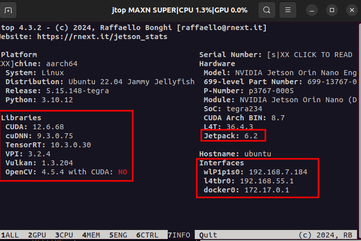

# Jtop and System Monitoring

[Back to Module 3](../README.MD) | [Back to Table of Contents](../../Table-of-Contents.md)

## 06 jtop tool

### System Resource Monitoring Tool - Jtop

### Introduction

Jtop is a Jetson-specific system monitoring tool that allows real-time viewing of CPU/GPU usage, memory, power consumption, temperature, NVPModel, power mode, fans, process information, like htop. It helps you to quickly diagnose bottlenecks, monitor resource consumption in modelling, and is one of the most common debugging tools that Jetson has developed.

Step1. Install Jtop

Enter the following command in the jetson terminal.

```bash
sudo apt update
sudo apt-get install python3-pip -y
sudo -H pip install -U jetson_stats
```

The first installation of Jtop requires restarting the device to start Jtop's system service.

```bash
sudo reboot
```

Step2. Start maximum power and Jefferson clock

```bash
# Enable Jetson MAXN SUPER mode
sudo nvpmodel -m 2
# Enable Jetson clocks so the CPU and GPU run at their maximum frequency
sudo jetson_clocks
# Open `jtop` to inspect system resources
jtop
```

Hardware resource information to monitor the system



In Jtop, you can switch information from different pages by number 1, 2, 3...

Page 2 here monitors the use of GPU and the process uses GPU.



Page 3 CPU Surveillance Interface



Page 4 Memory Management


You can increase the exchange area by s,b,+,-button



Page 5



Page 6 Control Page to allow you to adjust the hardware running mode, heat-dissemination policy and clock frequency of Jetson Orin Nano



Page 7 allows access to Jetpack, various environmental components and system information such as web IP



Finally, press the q on the keyboard to exit jtop.

[Back to Module 3](../README.MD)
