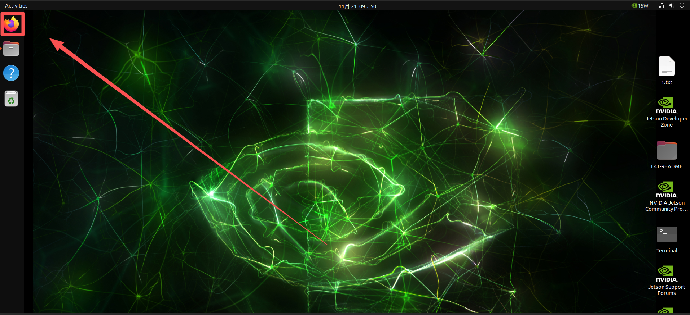
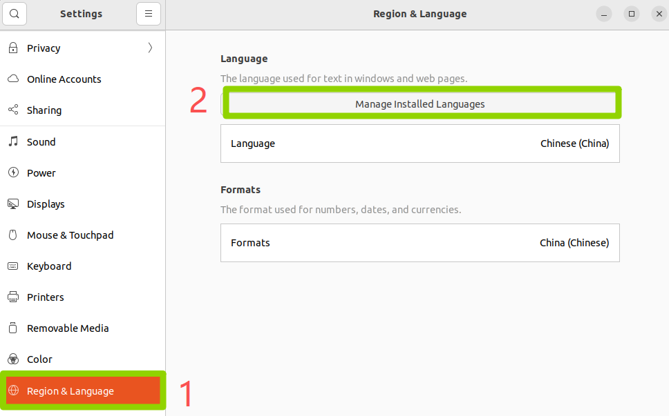
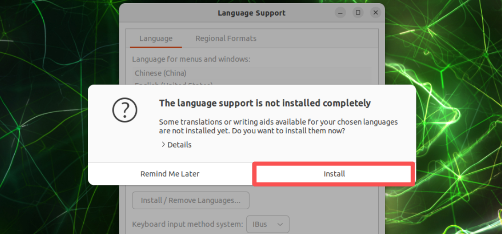
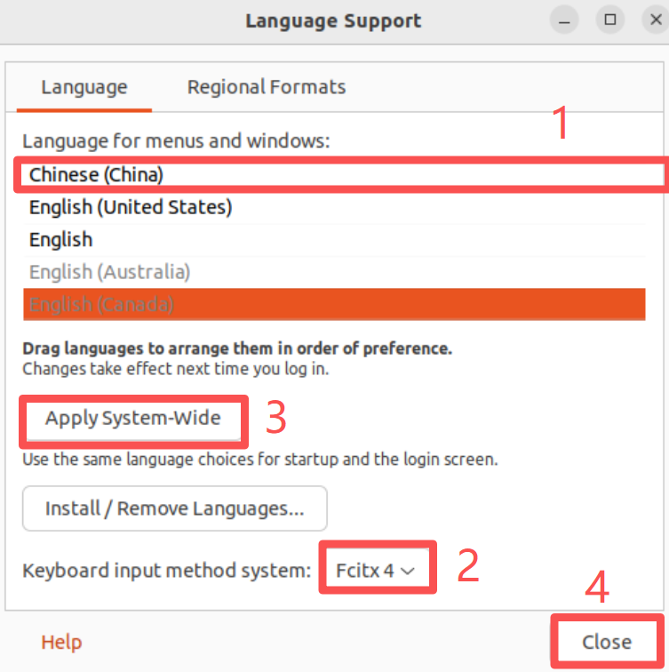
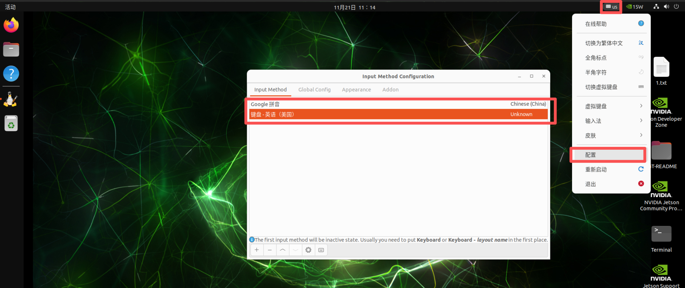

# Browser and Chinese Input Method

[Back to Module 3](../README.MD) | [Back to Table of Contents](../../Table-of-Contents.md)

## 09 Install Browser

### Introduction

In Jetson 's original system, the browser is usually not brought by default, so we need to install the browser manually. This article will show how to install a common Firefox browser on Jetson.

### Firebox installation

Opens the jetson terminal and runs the following commands to install a Firefox browser

```bash
sudo apt update
# Download Firefox
sudo apt install firefox
# If the APT-installed version does not open, run the following commands to fix it
cd ~/Downloads/
# Downgrade `snap`
snap download snapd --revision=24724
sudo snap ack snapd_24724.assert
sudo snap install snapd_24724.snap
sudo snap refresh --hold snapd
```

When installation is complete, the Firefox browser icon will appear on the desktop.



## Installation of Chinese input method

### Introduction

The Jetson default system language is English, so the input method is also English, which is not easy for us to search for some information, so this section will describe how to install the Chinese input method on Jetson.

> Jetson is an ARM system that does not support dog search input.

### Install Chinese Input Method

Enter the desktop of Jetson, open a terminal and execute the following installation orders:

```bash
#Installgooglepinyin
sudo apt-get install fcitx-googlepinyin -y
```

Open Settings





Add Chinese (china), keyboard input system selection: fcitx4.



Restart System

```bash
sudo reboot
```

Click on the keyboard icon -- > Configure -- > Select Google spelling and English



The medium English input switch allows the use of the default shortcut Ctrl+space switch

[Back to Module 3](../README.MD)
