# Install VS Code on Jetson

[Back to Module 3](../README.MD) | [Back to Table of Contents](../../Table-of-Contents.md)

## 11 Install VSCode

### Introduction

VS Code is a lightweight, cross-platform code editor that supports Windows, MacOS and Linux. It activates fast, eco-rich plugins, incorporates smart completion, Git integration, debuggers, terminals, etc., and almost meets the needs of the front-to-back end, from script to embedded development. This paper will describe how VSCode will be installed in the Jetson device.

### Install VSCode

Opens the VSCode official network in the browser.

Select the version of Arm64 in the other platform and download the corresponding Deb installation package.

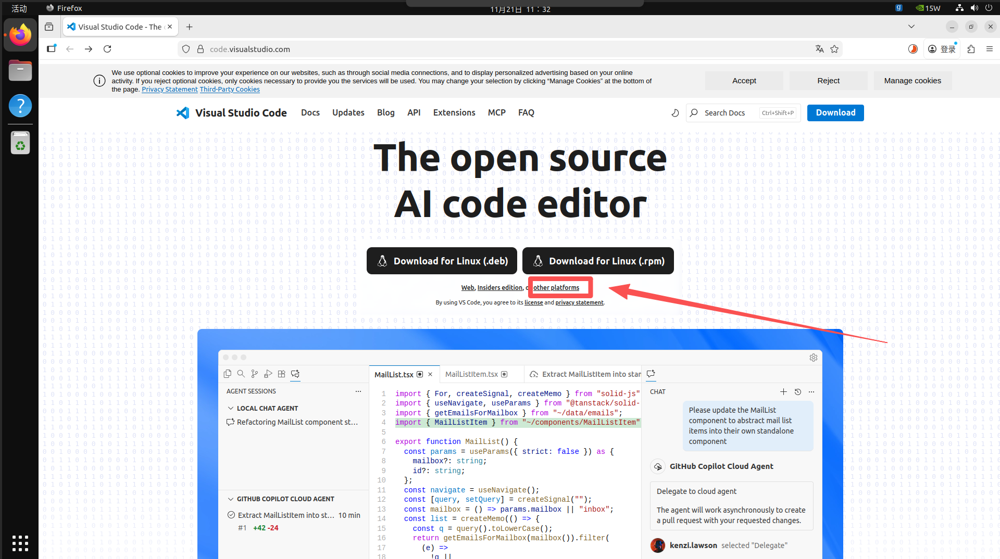

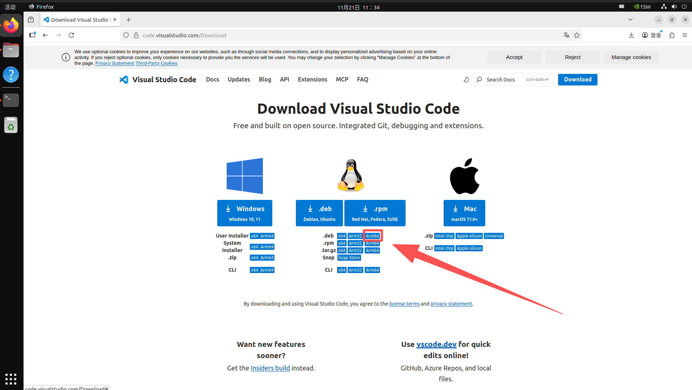

Terminal enters download directory, runs installation commands

```bash
# Enter the `Download` directory
cd ~/Downloads
# Run the install command; type `code` and press Tab to auto-complete the package name
sudo dpkg -i code_xxxxxxxxxxxx
```

Open application after installation is complete

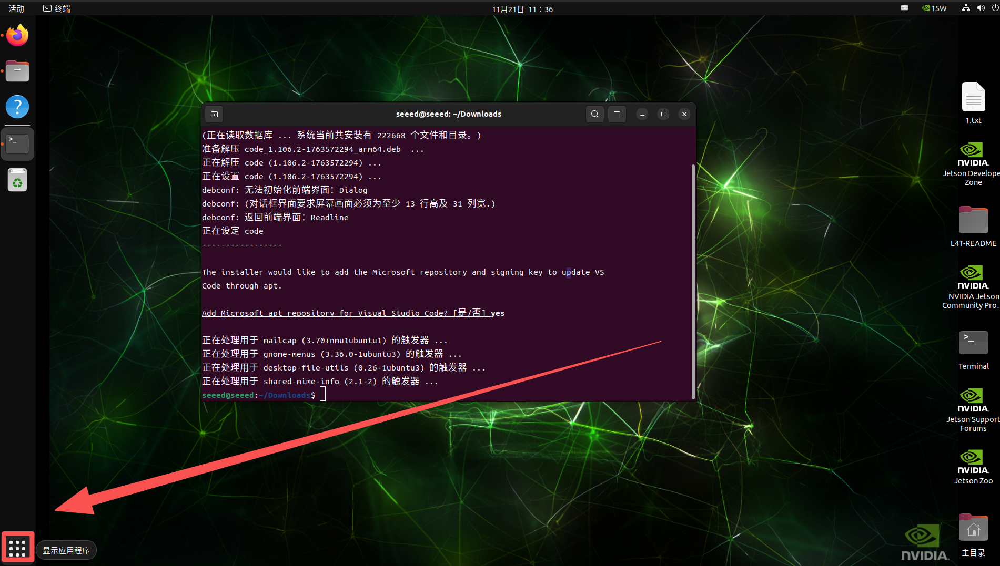

Found VSCode to add it to the desktop menu bar

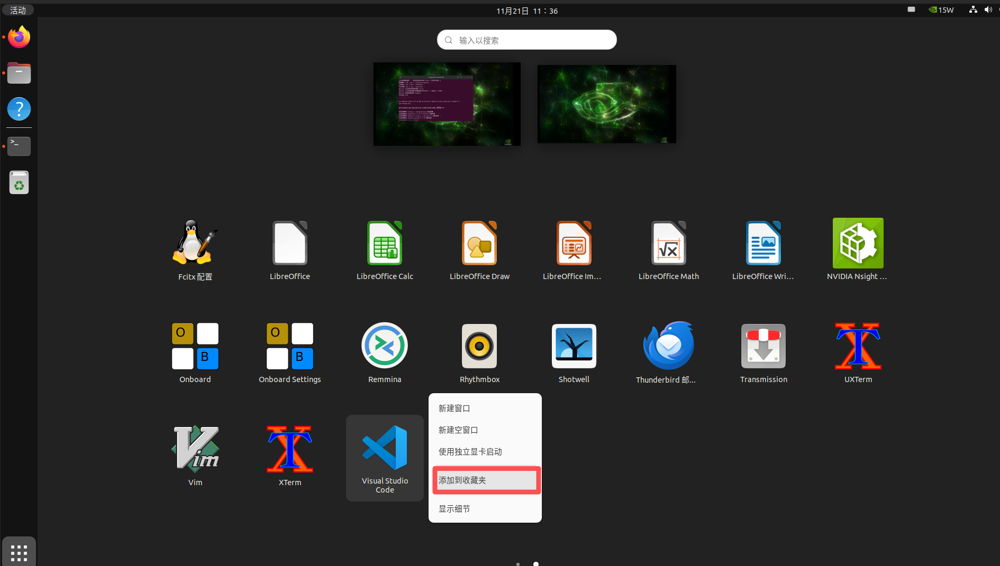

### Installation basic extension

Extension of installation base

Expand the search box to search for python and select Python for installation:

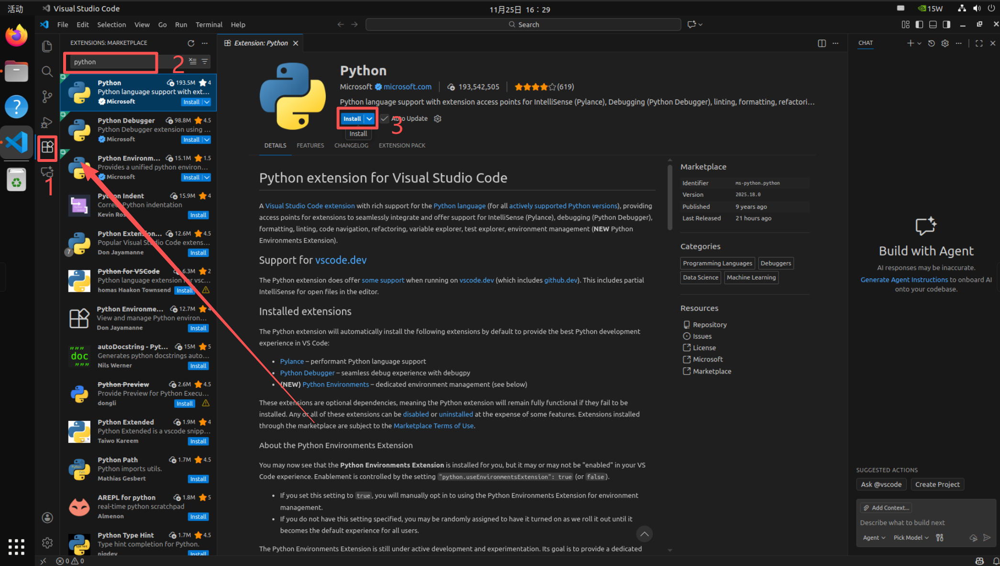

C/C+

Installation of C and C++ outreach

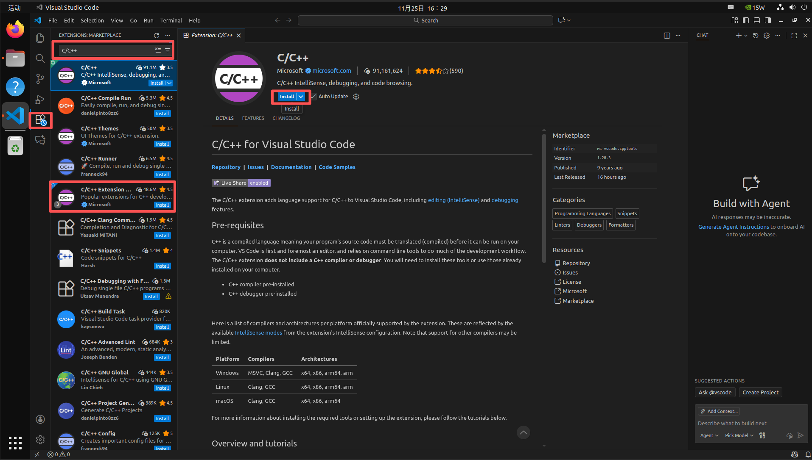

"Material Icon Theme

Select Materal Icon Theme for installation

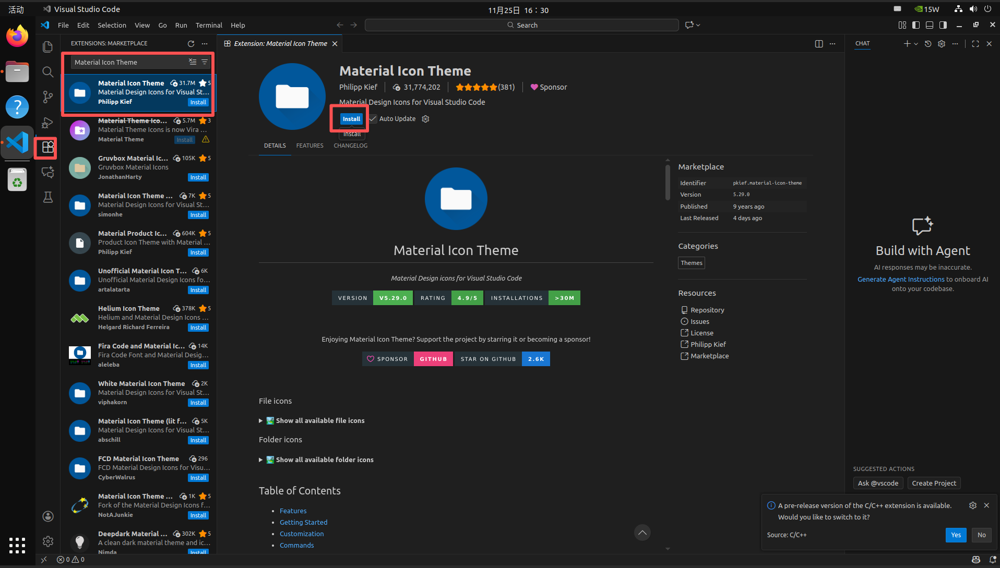

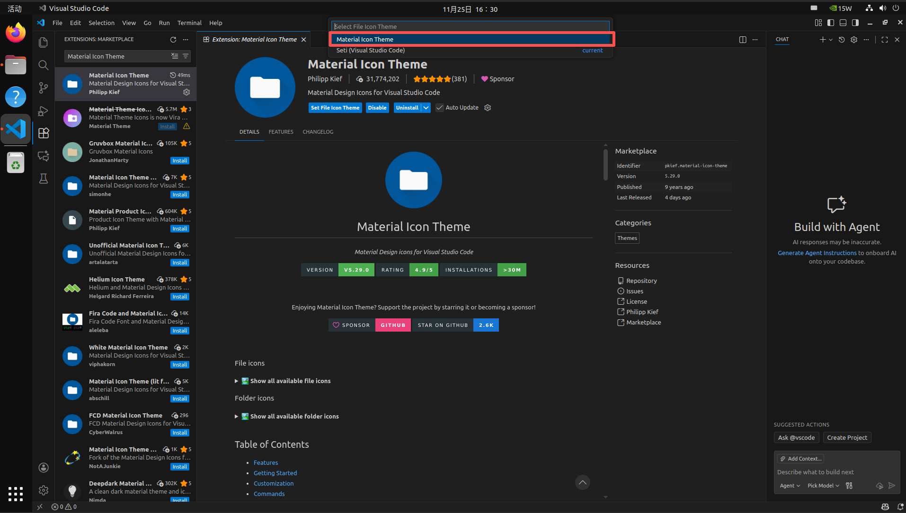

Remote-SSH

Select Remote-SSH for installation

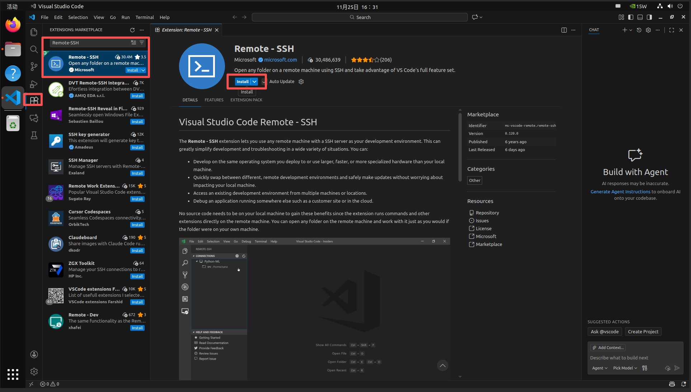

Basic use of SSH outreach

Configure remote device information

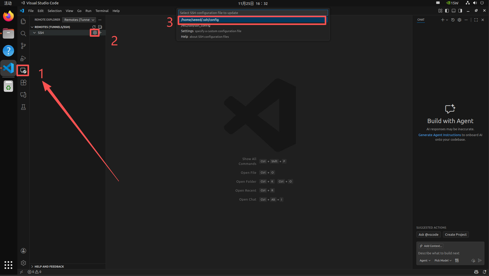

Configure remote device information

```bash
Host PC  # Remote device alias
  HostName 192.168.137.1 # Remote device IP
  User seeeed  # Remote device username
```

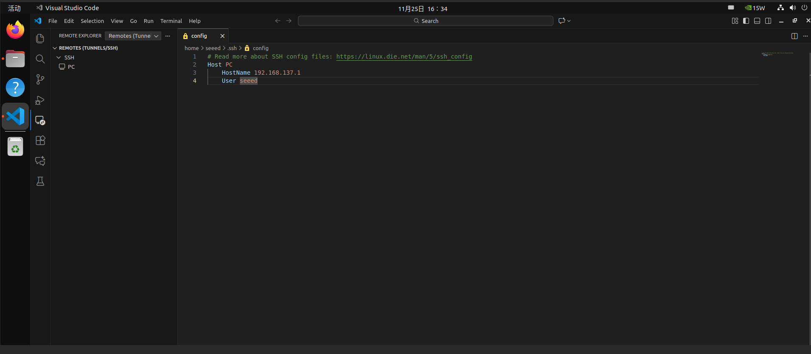

Select remote device to connect

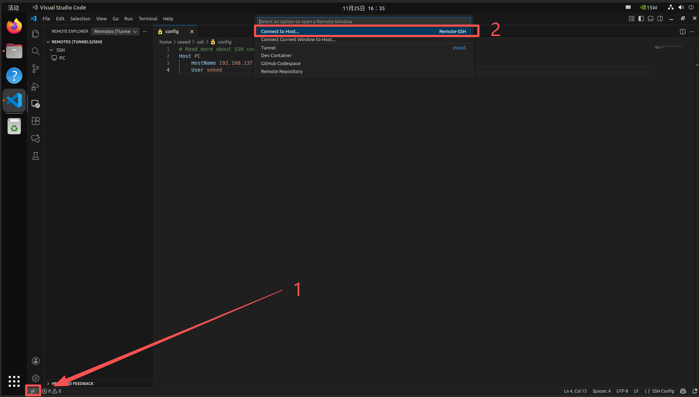

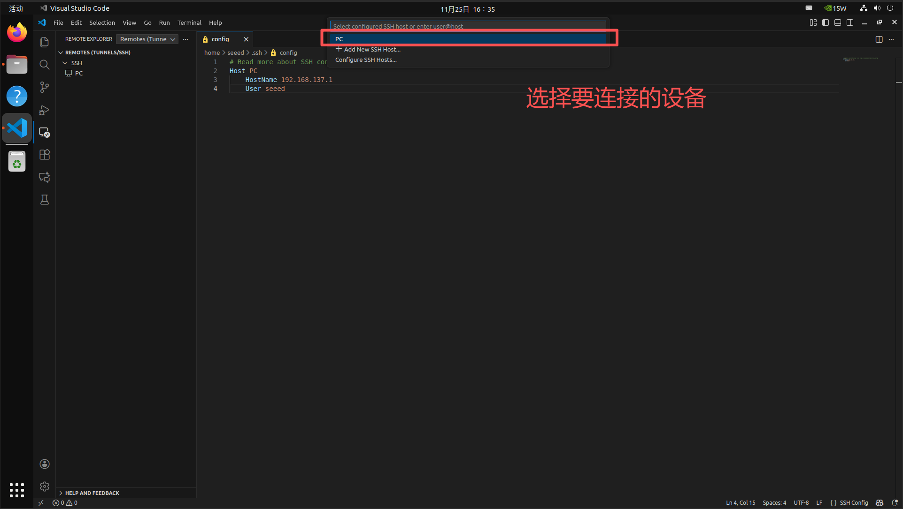

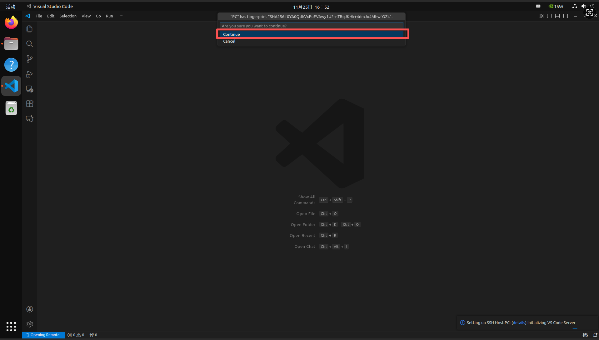

Just enter the password and get back to the car.

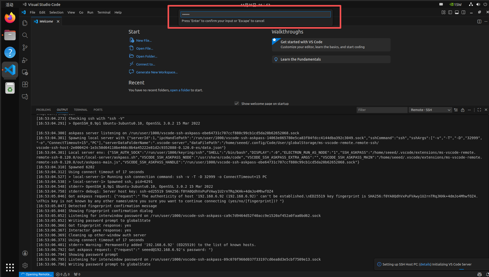

[Back to Module 3](../README.MD)
