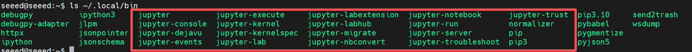
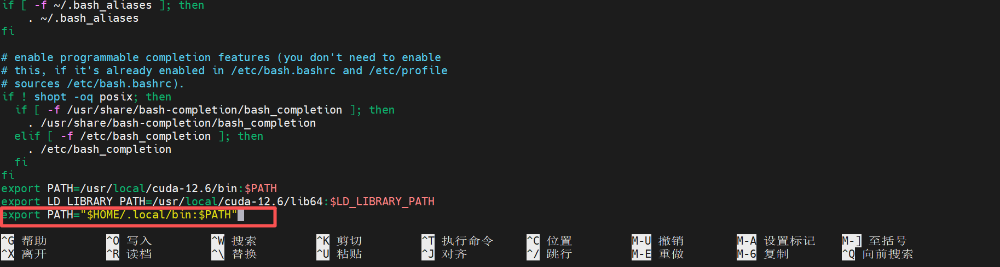
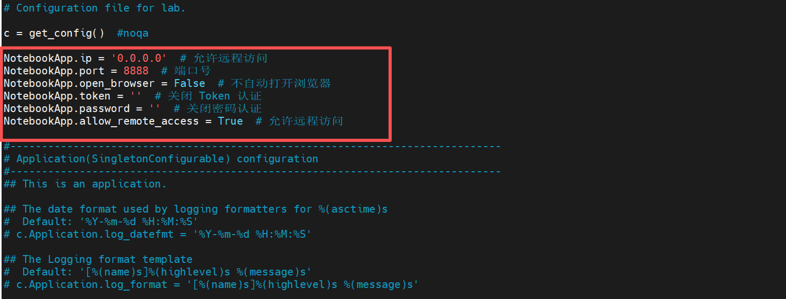
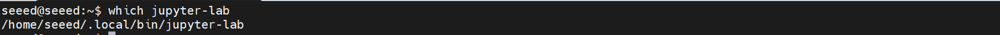
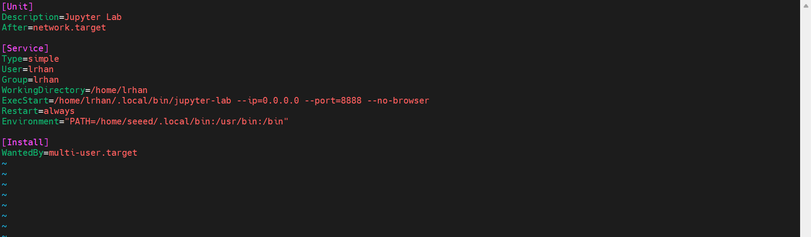
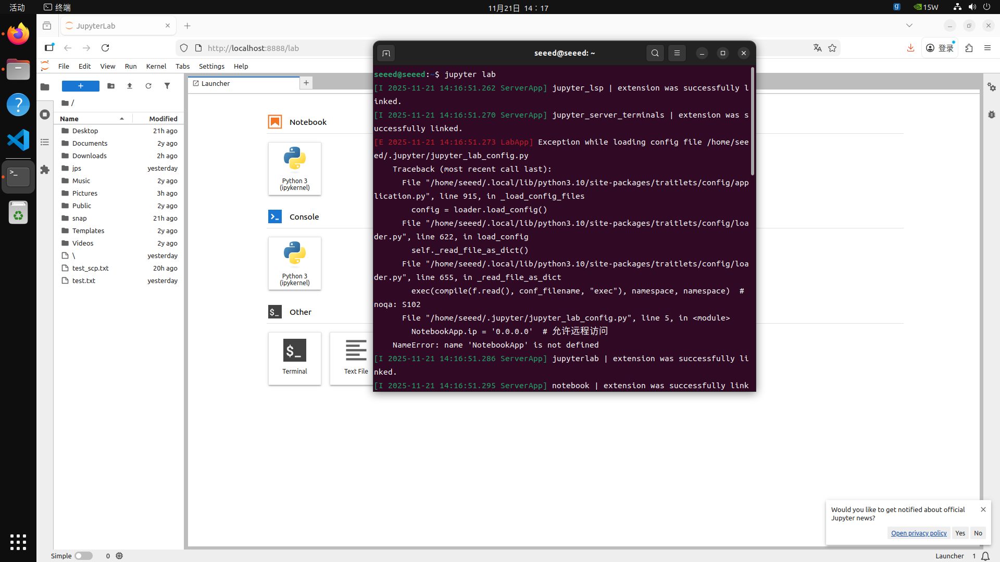

# Install and Run JupyterLab

[Back to Module 3](../README.MD) | [Back to Table of Contents](../../Table-of-Contents.md)

## 12 Install JupyterLab

### Introduction

JupyterLab is a modern interactive data science and development environment that supports the simultaneous operation of codes in browsers, viewing data, editing documents and building interactive visualization. It is an upgraded version of Jupyter Notebook, which provides a more flexible multi-label layout, a richer ecology of plugins, and support for multiple programming languages, and is well suited for data analysis, machine learning, scientific computing and teaching.

### JupyterLab installation

Open the Jetson terminal and execute the installation command

```bash
# Update `pip3` to the latest version
pip3 install --upgrade pip
# Install or update JupyterLab
pip3 install jupyter jupyterlab
```

Once installed, it's under the ~https://download.docker.com/linux/ubuntu/dists/ path



Add local/bin to the environment variable

```bash
nano ~/.bashrc
# Add the following at the end
export PATH="$HOME/.local/bin:$PATH"
# Press Ctrl + X to save
# Update the environment variables
source ~/.bashrc
```



Generate Profile

```bash
# Running the following command creates a `jupter_lab_config.py` file in the `.jupyter` directory
jupyter lab --generate-config
```


Edit Profile

```bash
# sudo vim /home/seeed/.jupyter/jupyter_lab_config.py
```

Write the following:

```bash
NotebookApp.ip = '0.0.0.0'  # Allow remote access
NotebookApp.port = 8888  # Port number
NotebookApp.open_browser = False  # Do not open the browser automatically
NotebookApp.token = ''  # Disable token authentication
NotebookApp.password = ''  # Disable password authentication
NotebookApp.allow_remote_access = True  # Allow remote access
```



Press Esc to enter: wq! Force save exit.

Set on startup

Enter the following command in the jetson terminal to determine the location of the jupyter-lab installation

```bash
which jupyter-lab
```



Create jupyter.service

```bash
sudo vim /etc/systemd/system/jupyter.service
```

Write the following:

```bash
[Unit]
Description=JupyterLab
After=network.target

[Service]
Type=simple
User=lrhan
Group=lrhan
WorkingDirectory=/home/lrhan
ExecStart=/home/lrhan/.local/bin/jupyter-lab --ip=0.0.0.0 --port=8888 --no-browser
Restart=always
Environment="PATH=/home/seeed/.local/bin:/usr/bin:/bin"

[Install]
WantedBy=multi-user.target
```



Restart the Jupyter service to make the new configuration effective

```bash
# Stop Jupyter-related processes
pkill -9 -f jupyter
# Restart the Jupyter service
sudo systemctl restart jupyter
```

Open a terminal on Jetson to run JupyterLab

```bash
jupyter lab
```

Auto-open browser running Jupyter service after running



If you want to access the Jepyter service remotely from another computer, you can open the following links in the remote computer browser:

```bash
http://<jetson_ip>:8888/lab
```

> of which <jetson ip> is the ip address of the jetson device in the local area network.

[Back to Module 3](../README.MD)
