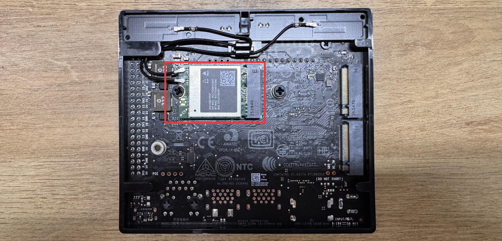
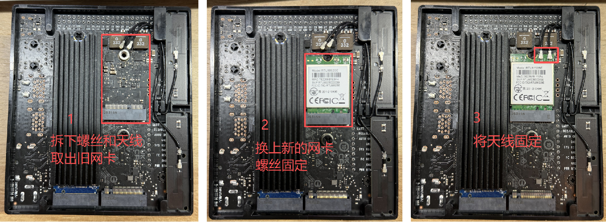

# 3.22 Wi-Fi Adapter

> [!IMPORTANT]
> This page is intended for the Seeed `reComputer J401` carrier-board family, such as [`reComputer J4012`](https://www.seeedstudio.com/reComputer-J4012-p-5586.html). Wi-Fi card compatibility, antenna layout, and internal hardware structure may differ on other Jetson devices and carrier boards.

## Introduction

The Wi-Fi adapter provides wireless networking and Bluetooth connectivity for the Jetson platform. On a J401-based system, it is commonly used for internet access, package downloads, SSH or VNC remote control, and short-range wireless communication with nearby devices.

## Hardware Installation

The J401-based kit supports a replaceable wireless card. If you need to replace the preinstalled module, power off the device first and then follow the basic replacement flow shown below.

1. Remove the antennas.
2. Unscrew the existing Wi-Fi module and remove it from the slot.
3. Insert the new module, secure it with the screw, and reconnect the antennas.

> Note: Different wireless cards may require different Linux drivers. Always install the driver package recommended by the card vendor if the module is not recognized automatically.

## Usage Notes

After the card is installed, configure the network from the operating system as usual. If you need help connecting to a wireless network from the terminal, refer to [3.12 Network and Wi-Fi](../3.12-Network-and-Wi-Fi/README.md).
