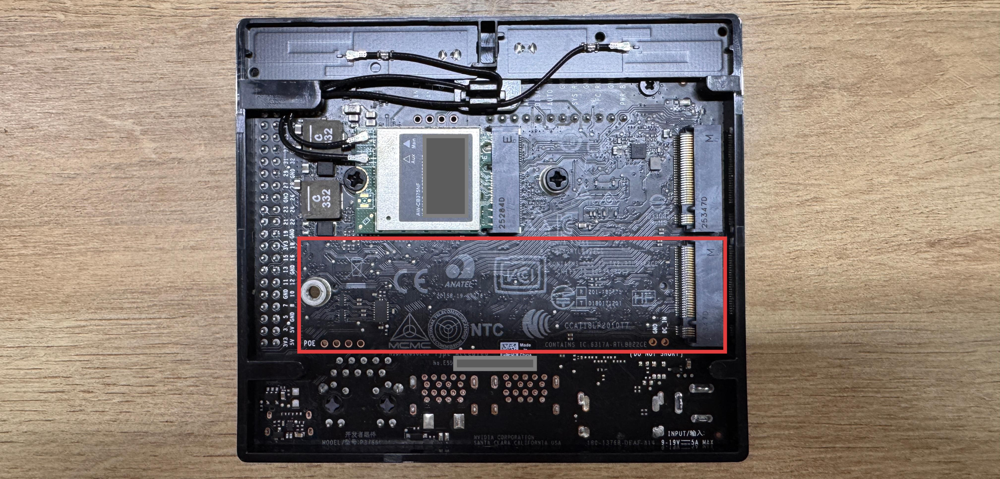

# 3.23 SSD Expansion

> [!IMPORTANT]
> This page is intended for the Seeed `reComputer J401` carrier-board family, such as [`reComputer J4012`](https://www.seeedstudio.com/reComputer-J4012-p-5586.html). SSD slot type, boot flow, and mounting layout may differ on other Jetson carrier boards.

## Introduction

Adding an NVMe SSD is one of the most practical upgrades for Jetson development. It improves storage capacity for datasets, containers, models, and logs, and it also makes daily development smoother than relying only on a small default system disk.

If you purchased a Seeed `reComputer J401` kit, it may already include a preinstalled SSD in the M.2 Key M slot with the operating system prepared on it.

## Expansion Guidance

If the existing SSD capacity is not enough for your workloads, replace it with a larger NVMe SSD that matches the supported form factor of the J401 hardware.

After replacing the SSD, reinstall or migrate the operating system as needed, then move your development environment, datasets, and project files onto the new drive.
