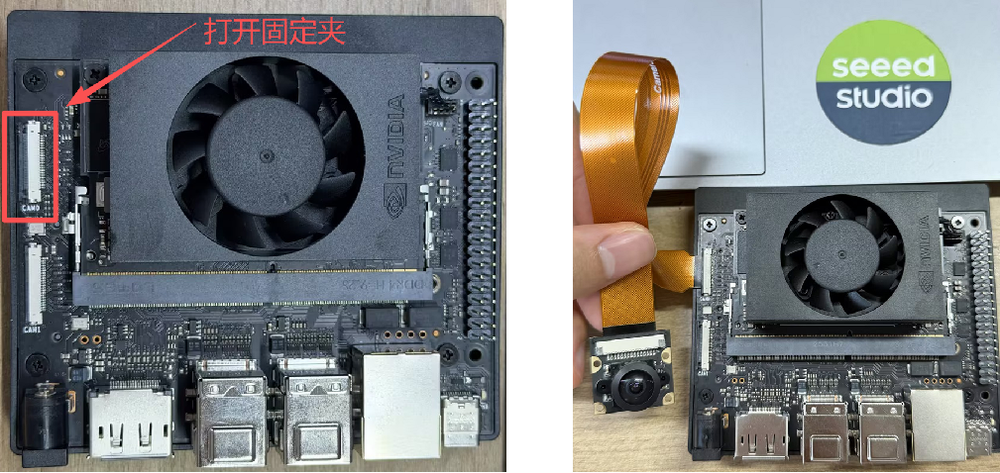
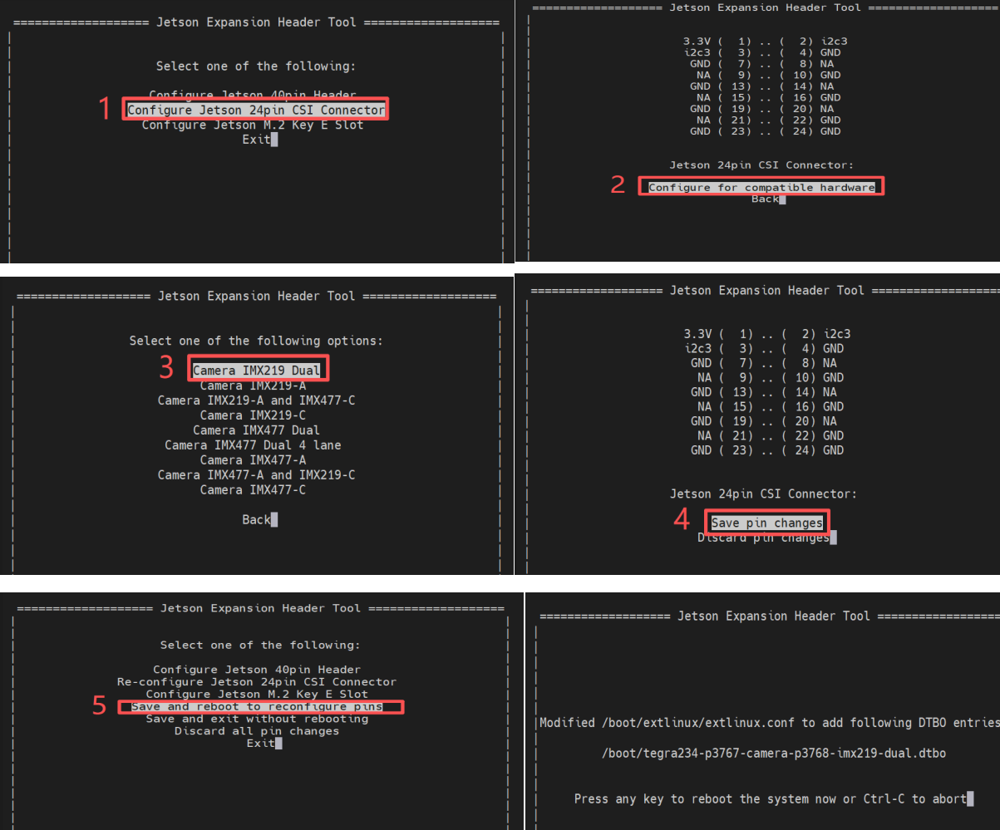
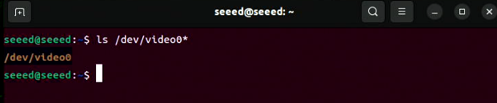
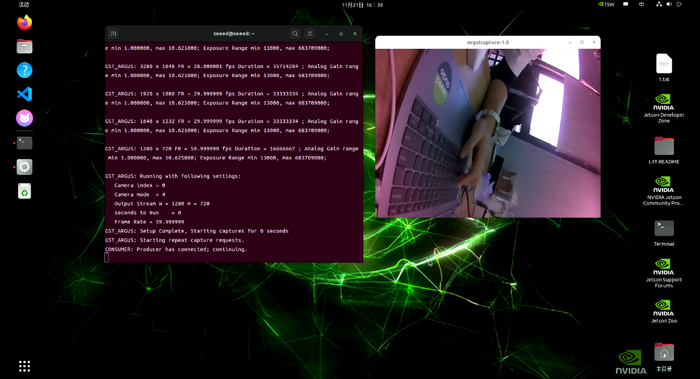

# 3.24 CSI Camera

> [!IMPORTANT]
> This page is intended for the Seeed `reComputer J401` carrier-board family, such as [`reComputer J4012`](https://www.seeedstudio.com/reComputer-J4012-p-5586.html). CSI connector count, camera orientation, and supported sensor overlays may differ on other Jetson boards.

## Introduction

A CSI camera connects directly to the Jetson platform through the MIPI CSI interface. Compared with USB cameras, CSI cameras are often preferred for embedded vision because they offer low latency, efficient bandwidth usage, and direct integration with Jetson multimedia pipelines.

## Hardware Requirements

- J401-based Jetson system with JetPack 6.2 installed
- A compatible MIPI CSI camera such as an IMX219 module

## Hardware Installation

Power off the device before connecting or disconnecting the CSI ribbon cable.



## Enable the CSI Camera

Open a terminal and launch `jetson-io`:

```bash
sudo /opt/nvidia/jetson-io/jetson-io.py
```

Use the on-screen menu to enable the CSI camera profile for your hardware, then save the configuration and reboot.



After rebooting, verify that the camera node is present:

```bash
ls /dev/video*
```



## Preview the Camera

Use `nvgstcapture-1.0` to preview the CSI stream:

```bash
nvgstcapture-1.0
```



## Common Preview Options

If two CSI cameras are installed, you can choose a specific sensor:

```bash
nvgstcapture-1.0 --sensor-id=1
```

You can also specify a preview resolution:

```bash
nvgstcapture-1.0 --sensor-id=1 --cus-prev-res=1280x720
```
