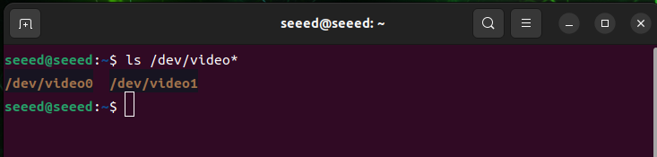
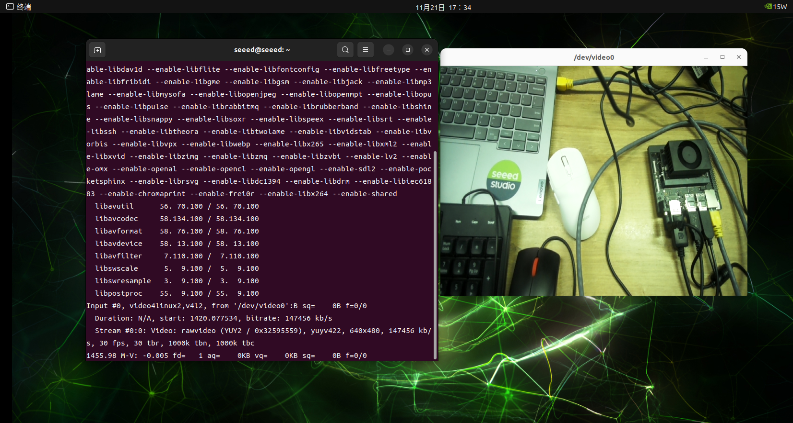

# 3.25 USB Camera

> [!IMPORTANT]
> This page is intended for the Seeed `reComputer J401` carrier-board family, such as [`reComputer J4012`](https://www.seeedstudio.com/reComputer-J4012-p-5586.html). USB topology and available ports may differ on other Jetson platforms.

## Introduction

A USB camera is a practical choice for quick testing because it is easy to connect and usually works through the Linux UVC driver. It is widely used for video calls, monitoring, simple vision experiments, and rapid prototyping.

## Hardware Requirements

- J401-based Jetson system with JetPack 6.2 installed
- A USB camera, such as a 1080p UVC-compatible camera

## Hardware Connection

Connect the camera directly to a USB port on the Jetson device and check whether Linux created a video node:

```bash
ls /dev/video*
```



Linux may expose multiple `/dev/video*` nodes for a single USB camera. The main video stream is often available at `/dev/video0`.

## Preview the Camera

Install `ffmpeg`:

```bash
sudo apt update
sudo apt install ffmpeg -y
```

Open the camera with a specified frame rate and resolution:

```bash
ffplay -f v4l2 -framerate 30 -video_size 640x480 /dev/video0
```


