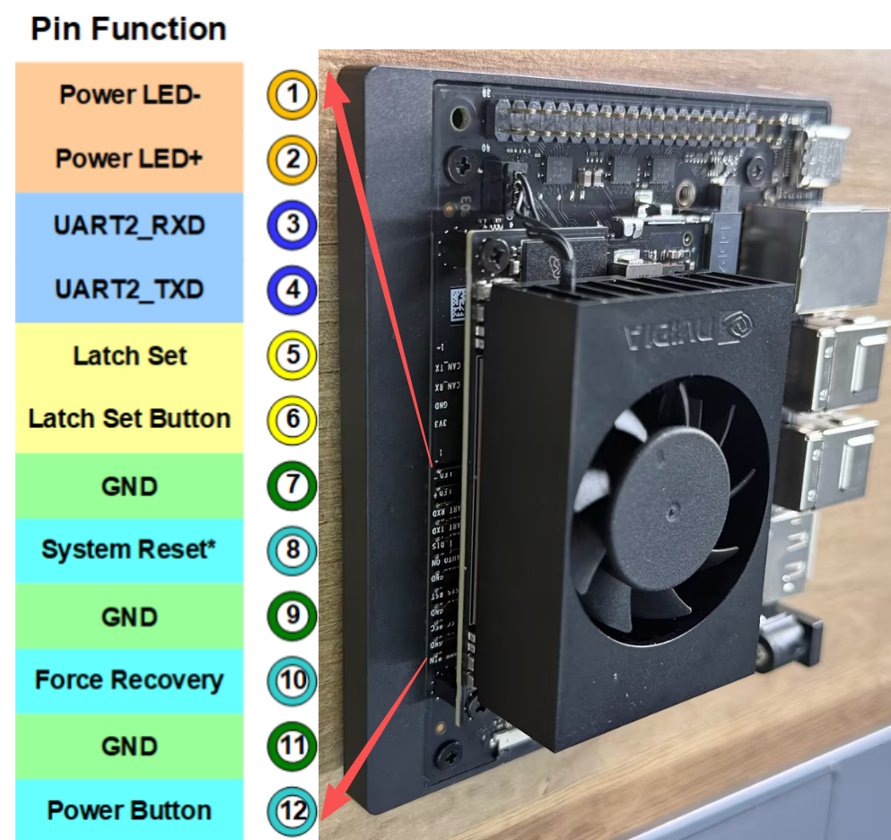

# 3.26 GPIO Basics

> [!IMPORTANT]
> This page is intended for the Seeed `reComputer J401` carrier-board family, such as [`reComputer J4012`](https://www.seeedstudio.com/reComputer-J4012-p-5586.html). The 40-pin header layout and pin behavior are board-specific and should not be assumed to match other Jetson carrier boards.

## Introduction

GPIO stands for General Purpose Input/Output. These pins let software read external digital signals or drive simple peripherals such as LEDs, buttons, buzzers, and control lines.

## Numbering Modes

The `Jetson.GPIO` library supports two common numbering schemes:

| Mode | Description | Typical Use |
| --- | --- | --- |
| `BOARD` | Numbers pins by their physical location on the 40-pin header | Best when you are wiring directly from the header silkscreen or a pinout diagram |
| `BCM` | Numbers pins by the GPIO mapping used by the library | Best when you are following Python GPIO examples that refer to logical GPIO IDs |

## `GPIO.BOARD` Layout

## `GPIO.BCM` Layout

## Example Pin Reference

The image below shows an additional pin-reference example that is useful before testing input or output functions.

