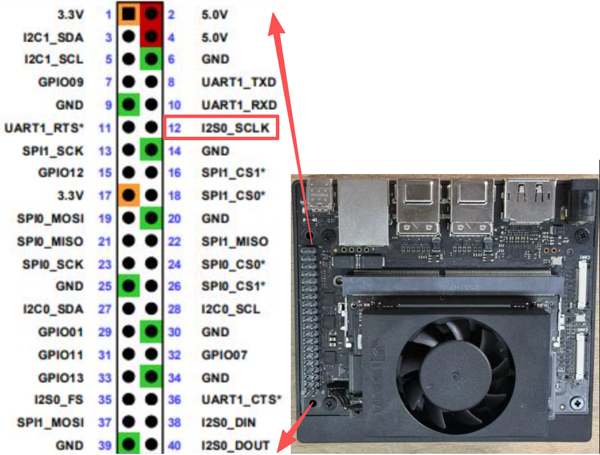
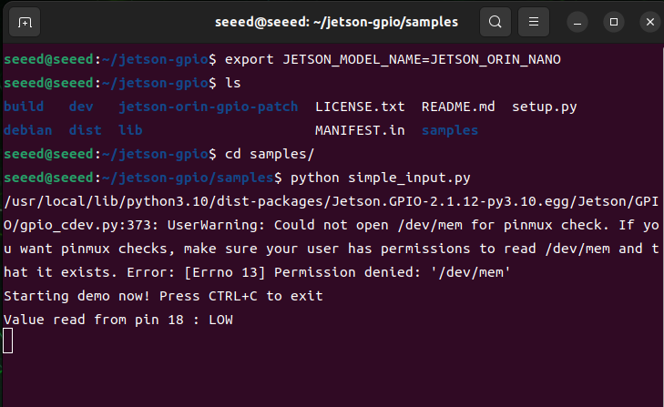
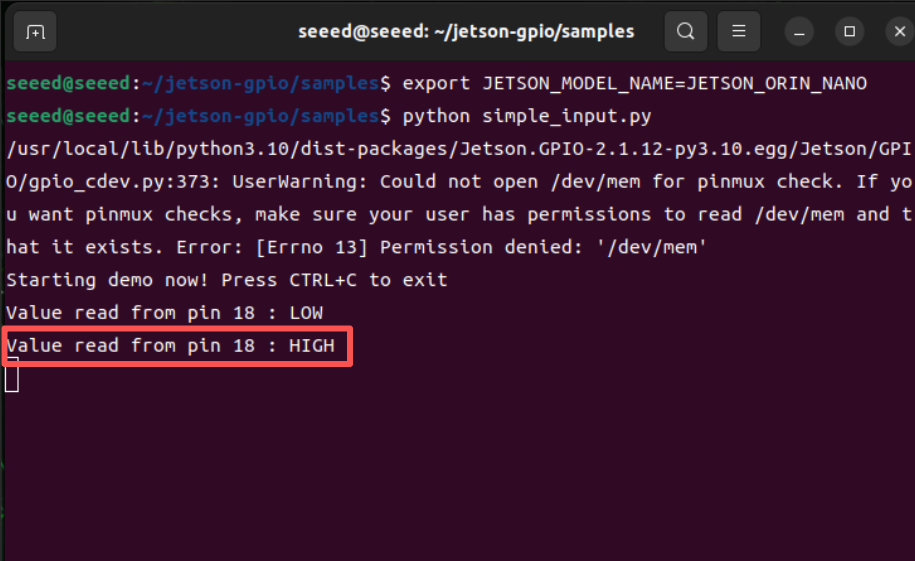

# 3.28 GPIO Input

> [!IMPORTANT]
> This page is intended for the Seeed `reComputer J401` carrier-board family, such as [`reComputer J4012`](https://www.seeedstudio.com/reComputer-J4012-p-5586.html). Do not copy the wiring blindly to a different carrier board.

## Introduction

This section shows how to read a GPIO input on Jetson by connecting a test pin to `GND` and `3.3V` and observing the input state in software.

## Hardware Connection

Use jumper wires to connect the header pins as shown below. A simple test method is to connect `GPIO.BOARD 12` to `GND` first.




> Caution: Double-check the pin mapping before wiring. Incorrect connections can short the board.

## Read the Signal

Run the sample script from the `jetson-gpio` examples:

```bash
cd /opt/seeed/development_guide/05_gpio/jetson-gpio/samples
sudo python3 simple_input.py
```



If the result matches the expected low level, reconnect the test pin from `GND` to `3.3V` and run the script again:

```bash
cd /opt/seeed/development_guide/05_gpio/jetson-gpio/samples
export JETSON_MODEL_NAME=JETSON_ORIN_NANO
python3 simple_input.py
```



The terminal output should now report a high-level signal.
