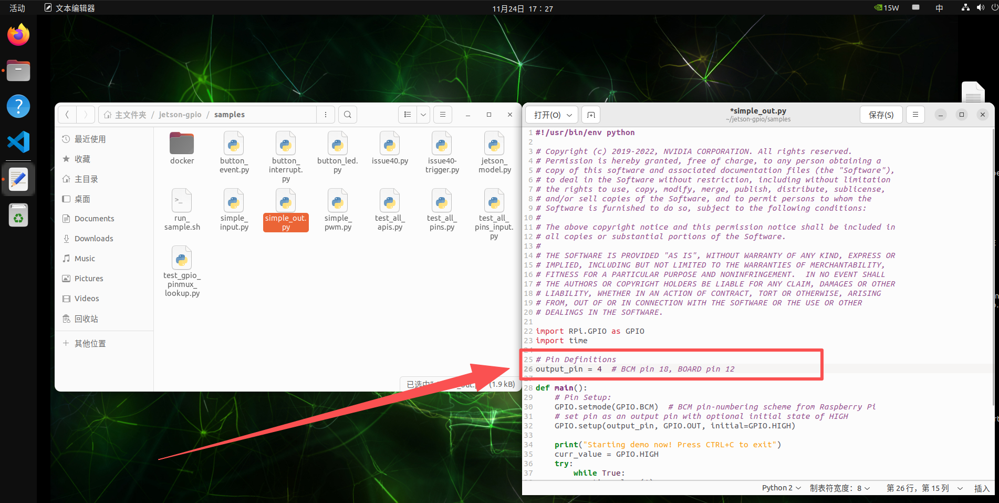
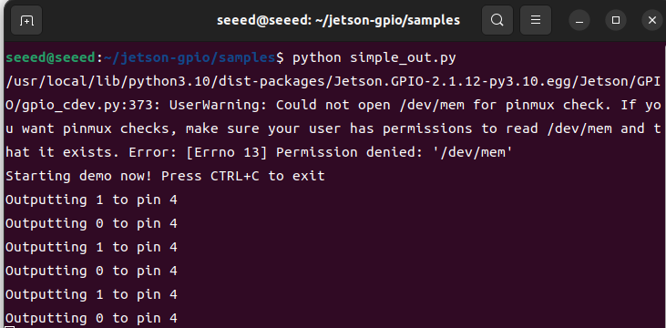
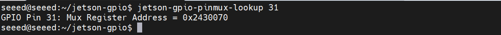
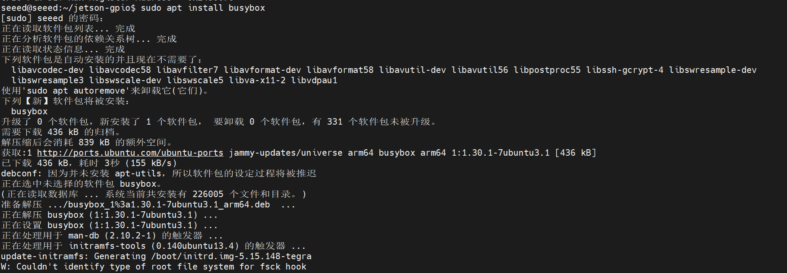
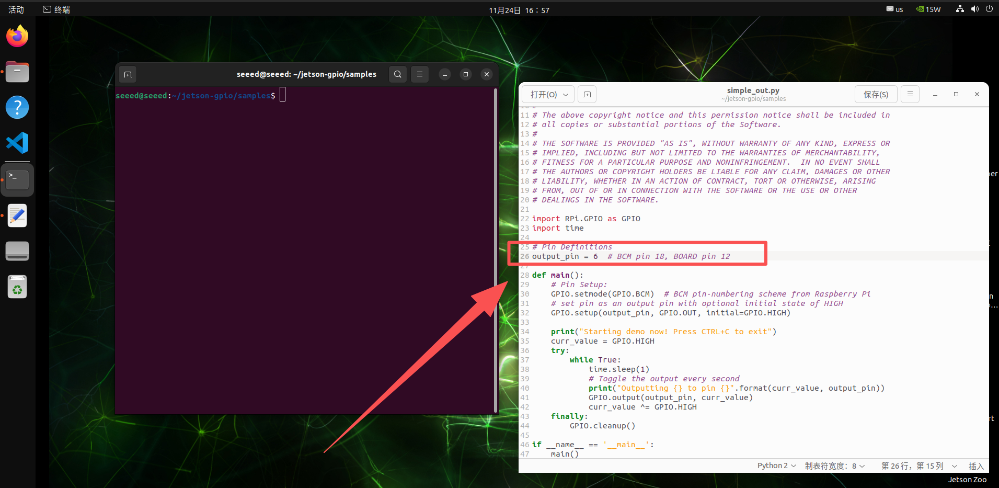
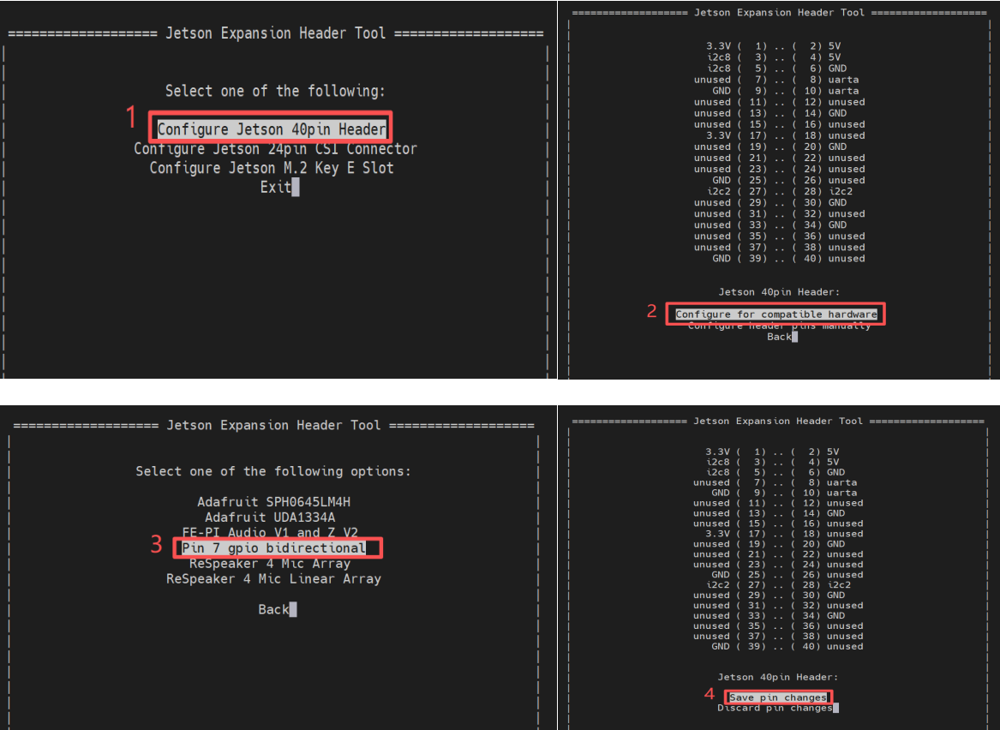
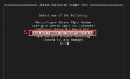

# 3.29 GPIO Output

> [!IMPORTANT]
> This page is intended for the Seeed `reComputer J401` carrier-board family, such as [`reComputer J4012`](https://www.seeedstudio.com/reComputer-J4012-p-5586.html). GPIO output capability on JetPack 6.2 depends on the board pinmux configuration, so do not assume the same behavior on other Jetson devices.

## Introduction

On JetPack 6.2, many pins that previously supported both input and output may behave as input-only until the pinmux is adjusted. This page introduces two practical ways to restore output behavior on supported pins:

1. A temporary `busybox devmem` method
2. A more persistent device-tree overlay method

## Method 1: Temporary Output with `busybox`

### Step 1: Query the Pinmux Register

Use `jetson-gpio-pinmux-lookup` to find the register address for a header pin:

```bash
jetson-gpio-pinmux-lookup 31
```


The example below shows the returned register value for pin 31.



### Step 2: Configure Output Mode

Install `busybox` if needed:

```bash
sudo apt install busybox
```

Then write the pinmux register value:

```bash
sudo busybox devmem 0x02430070 w 0x004
```



### Step 3: Run the Output Test

Update the sample script to use the correct BCM pin for your test case, then run it:





```bash
cd /opt/seeed/development_guide/05_gpio/jetson-gpio/samples
export JETSON_MODEL_NAME=JETSON_ORIN_NANO
python3 simple_out.py
```


You can verify the output level change with a multimeter or oscilloscope.

## Method 2: Device-Tree Overlay

This method is better if you want the pin configuration to persist.

Clone the helper project and edit the DTS file:

```bash
cd /opt/seeed/development_guide/05_gpio/jetson-gpio
git clone https://github.com/jetsonhacks/jetson-orin-gpio-patch.git
cd jetson-orin-gpio-patch
vim pin7_as_gpio.dts
```



Adjust the pin definition for the GPIO you want to change, then build the overlay:

```bash
dtc -O dtb -o pin7_as_gpio.dtbo pin7_as_gpio.dts
sudo cp pin7_as_gpio.dtbo /boot
sudo /opt/nvidia/jetson-io/jetson-io.py
```


After the overlay is enabled, use the known BCM pin number in the test script.



Run the output test again:

```bash
cd /opt/seeed/development_guide/05_gpio/jetson-gpio/samples
python3 simple_out.py
```



## References

- https://github.com/NVIDIA/jetson-gpio/issues/120
- https://docs.nvidia.com/jetson/archives/r36.4.3/DeveloperGuide/HR/JetsonModuleAdaptationAndBringUp/JetsonOrinNxNanoSeries.html
- https://developer.nvidia.com/embedded/downloads#?search=pinmux
