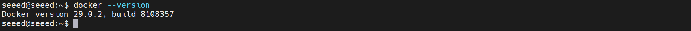
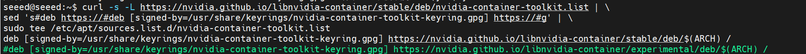

# Docker on Jetson

[Back to Module 3](../README.MD) | [Back to Table of Contents](../../Table-of-Contents.md)

## 13 Install Docker and Basic Use

### Introduction

Docker is a lightweight containerized platform for packaging applications and their reliance into separate, portable containers, thus achieving “the same functioning anywhere”. It makes development, testing, deployment processes more consistent and automated through isolation, rapid deployment and efficient use of resources. Docker can significantly improve efficiency and stability, whether through local development, server deployment or large-scale micro-service structures.

### Install Docker on Jetson

Install Docker CE

```bash
sudo apt update
# Install dependencies
sudo apt install -y apt-transport-https ca-certificates curl software-properties-common
```

Add Docker official GPG key:

```bash
# Add the Aliyun Docker repository key
curl -fsSL https://mirrors.aliyun.com/docker-ce/linux/ubuntu/gpg | sudo gpg --dearmor -o /usr/share/keyrings/docker-ce.gpg
# Add repository
echo \
"deb [arch=$(dpkg --print-architecture) signed-by=/usr/share/keyrings/docker-ce.gpg] \
https://mirrors.aliyun.com/docker-ce/linux/ubuntu \
$(lsb_release -cs) stable" | sudo tee /etc/apt/sources.list.d/docker.list
# Install
sudo apt update
sudo apt install docker-ce docker-ce-cli containerd.io
# Verify the installation
docker --version
```



Add access rights

```bash
sudo usermod -aG docker $USER
newgrp docker
```

Upon execution of the above command, you can use the docker command without using the sudo command

Install NVIDIA Container Toolkit

```bash
distribution=$(. /etc/os-release;echo $ID$VERSION_ID)
# Add key
curl -s -L https://nvidia.github.io/libnvidia-container/gpgkey | \
sudo gpg --dearmor -o /usr/share/keyrings/nvidia-container-toolkit-keyring.gpg

# Add repository
curl -s -L https://nvidia.github.io/libnvidia-container/stable/deb/nvidia-container-toolkit.list | \
sed 's#deb https://#deb [signed-by=/usr/share/keyrings/nvidia-container-toolkit-keyring.gpg] https://#g' | \
sudo tee /etc/apt/sources.list.d/nvidia-container-toolkit.list
```



Install nvidia-container-toolkit

```bash
sudo apt update
sudo apt install -y nvidia-container-toolkit
```

Enable Docker GPU support

```bash
sudo nvidia-ctk runtime configure --runtime=docker
sudo systemctl restart docker
# Test whether GPU access is available inside the Docker container
sudo docker run --rm --runtime=nvidia --gpus all --network host ubuntu nvidia-smi
```

> You may need a proxy or mirror source when downloading Docker images or packages.

If you cannot install Docker Engine from the official APT repository, you can also download the `.deb` packages manually and install them yourself.

First open the Docker download directory that matches your Ubuntu version:

https://download.docker.com/linux/ubuntu/dists/

Select the corresponding directory according to your current Ubuntu version:

| Ubuntu Version | Version Designator | Example of download path |
| --- | --- | --- |
| Ubuntu 20.04 LTS | focal | `dists/focal/pool/stable/` |
| Ubuntu 22.04 LTS | jammy | `dists/jammy/pool/stable/` |
| Ubuntu 24.04 LTS | noble | `dists/noble/pool/stable/` |

Select one of the architecture directories that match your system after entering the corresponding version of the directory:

amd64:x86 64 Server / PC

Arm64: ARM 64-bit systems, including Jetson

Armhf

S390x

In that directory, download these five `.deb` packages with matching versions:

- `containerd.io_<version>_<arch>.deb`
- `docker-ce_<version>_<arch>.deb`
- `docker-ce-cli_<version>_<arch>.deb`
- `docker-buildx-plugin_<version>_<arch>.deb`
- `docker-compose-plugin_<version>_<arch>.deb`

Then install Docker (using dpkg) to enter the directory where you download the Deb file, execute:

```bash

sudo dpkg -i ./containerd.io_<version>_<arch>.deb \
  ./docker-ce_<version>_<arch>.deb \
  ./docker-ce-cli_<version>_<arch>.deb \
  ./docker-buildx-plugin_<version>_<arch>.deb \
  ./docker-compose-plugin_<version>_<arch>.deb
```

If the hint depends on the missing:

```bash

sudo apt -f install
```

If you need to verify Docker service status:

```bash

sudo systemctl status docker
```

Docker usually starts automatically after installation is complete. If not started, manually:

```bash

sudo systemctl start docker
```

### Docker Basics

The Docker Engine includes Docker CLI, which provides the command-line tools used to interact with the Docker daemon.

Before officially introducing the basic use of Docker, we would like to add the basic concepts of “Image” and “Container” in Docker to help readers better understand what follows.

Image
Docker images are read-only templates that contain the environment, dependencies, and configuration required to run software. An image does not run by itself; it is the base used to create a container.

Container
A Docker container is a running instance of an image. Once an image is launched, a container is created. Containers have isolated runtime environments and can be started, stopped, removed, and managed independently.

In short:

> An image is like an installation package, while a container is a running program instance.

When the relationship between mirrors and containers is understood, it will be followed by a specific example of Docker's commonly used commands and basic usage methods.

### 1. View details

> docker info

### 2. View version number

> docker --version

### 3. Pull mirrors

> docker pull <image_name>

If no label is specified, the default pulls the mirror of the last label.

Manually pull the assigned docker mirror:

> docker pull <image_name>:<tag>

### 4. Run mirrors

If there is no local mirror to run, docker automatically pulls the corresponding mirror.

> docker run <image_name>

Start container from specified mirror:

> Docker run ubuntu: 18.04 /bin/bash

This starts the container in interactive mode. Type `exit` to leave the container.

### 4.1. Viewing running containers

> docker ps

### 4.2. Viewing functioning or stopping containers

> docker ps -a

### 5. Cleaning of containers

> docker container prune

### 6. View local mirrors

> Docker images

### 7. Remove mirrors

Note: Mirrors to be deleted need to be disabled and cleaned

> Docker rmi <image name>

### 8. Preservation of containers as new mirrors

> Docker company <container id>

Note: Based on the actual CONTAINER ID and the custom mirror name and tag suffix

### 9. Stop the container

If the container is operated in an interactive mode and the end enters the inner packaging, the exit can be entered inside the container to stop the container;

[Back to Module 3](../README.MD)
