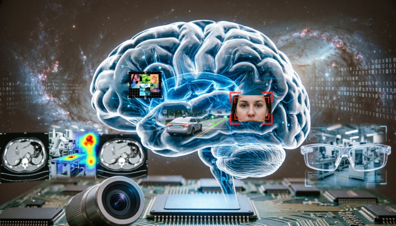
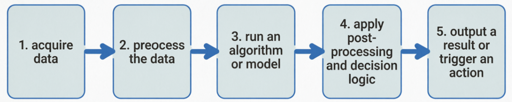

# 4.1 Introduction to Computer Vision

## What is CV?

**Computer vision** (CV) is a field of artificial intelligence that enables computers to interpret and understand visual information from the world, such as images and videos. By using techniques like deep learning and pattern recognition, computer vision systems can identify objects, detect faces, track movement, and analyze scenes with high accuracy. It is widely used in applications such as autonomous driving, medical imaging, security surveillance, industrial inspection, and augmented reality, helping machines make decisions based on what they “see.” 

## Learning Objectives

By the end of this section, you should be able to:

- explain what computer vision is
- describe the main problems the field tries to solve
- identify major application areas
- understand the difference between image understanding and video understanding
- see how the rest of the course is organized

### Why Computer Vision Is Hard

Humans solve many visual tasks effortlessly because we have years of embodied experience in the world. Computers do not. Real-world vision is hard because:

- lighting changes
- objects look different from different viewpoints
- scenes are cluttered
- some objects are small, blurred, or occluded
- cameras introduce noise and distortion
- video adds time as another dimension

This is why computer vision has evolved from simple image processing to deep learning and multimodal systems.

### Major Tasks in Computer Vision

The field can be divided into several major tasks:

| Task | Core Question | Example |
| :-- | :-- | :-- |
| Classification | What is in the image | cat vs dog, defective vs normal |
| Detection | What objects are present and where | person, helmet, vehicle |
| Segmentation | Which pixels belong to which region or object | road area, background, product contour |
| Pose Estimation | What are the keypoints or body structure | human joints, hand landmarks |
| Tracking | Which detected object is the same over time | follow person 17 through video |
| OCR | What text appears in the scene | number plates, labels, receipts |
| Event Understanding | What happened in the scene | line crossing, intrusion, fall |

### Image vs Video

An image captures a single moment. A video is a sequence of frames evolving over time.

This distinction matters because some tasks can be solved from one image, while others require temporal reasoning:

- image classification works on a single frame
- object tracking requires continuity across frames
- event analysis depends on motion and time

### The Standard Vision Pipeline

Although implementations vary, many computer vision systems follow a common logic:

1. acquire data
2. preprocess the data
3. run an algorithm or model
4. apply post-processing and decision logic
5. output a result or trigger an action

## Common Misunderstandings

- "Computer vision is just object detection."
  - Detection is important, but the field is much broader.
- "If a model runs on one image, it is ready for deployment."
  - Real deployment needs stable input, latency control, and failure handling.
- "Video is just many images, so it is not much harder."
  - Video introduces time, continuity, and system constraints.

## Exercises / Reflection

1. Pick three products or systems you use in daily life and identify where computer vision may be involved.
2. For each of the following, decide whether it is mainly a classification, detection, segmentation, tracking, or event understanding task:
   - a face unlock on a phone
   - counting cars in a parking lot
   - reading a receipt
   - detecting whether a worker wears a helmet
3. Write a short paragraph explaining why video understanding is usually harder than image understanding.

## Summary

Computer vision is about turning raw visual data into useful understanding. It includes many tasks, from classification and detection to OCR and event reasoning. 

## 

