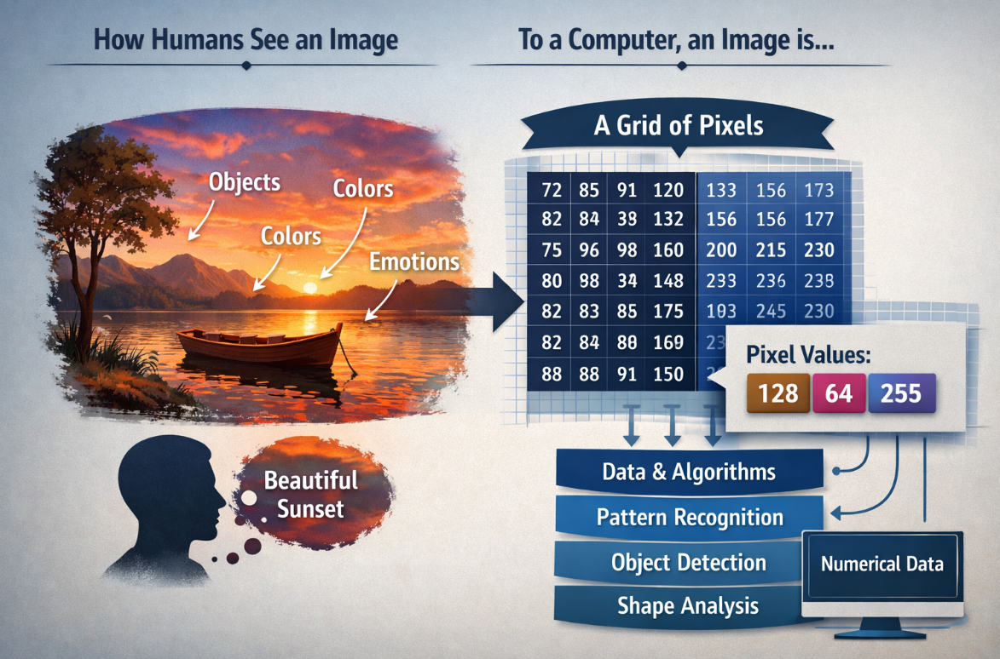
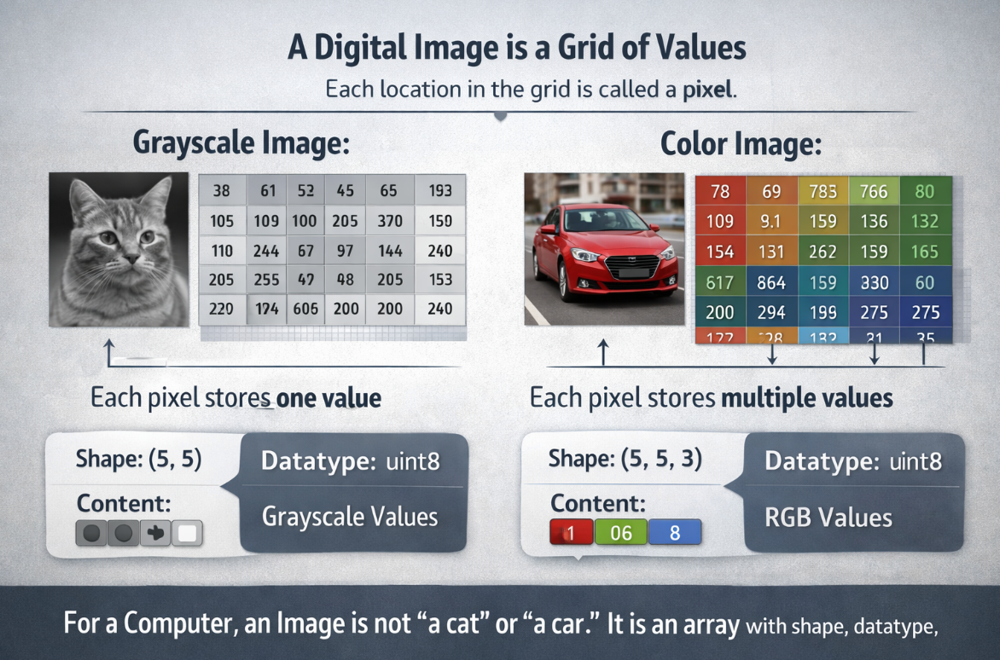
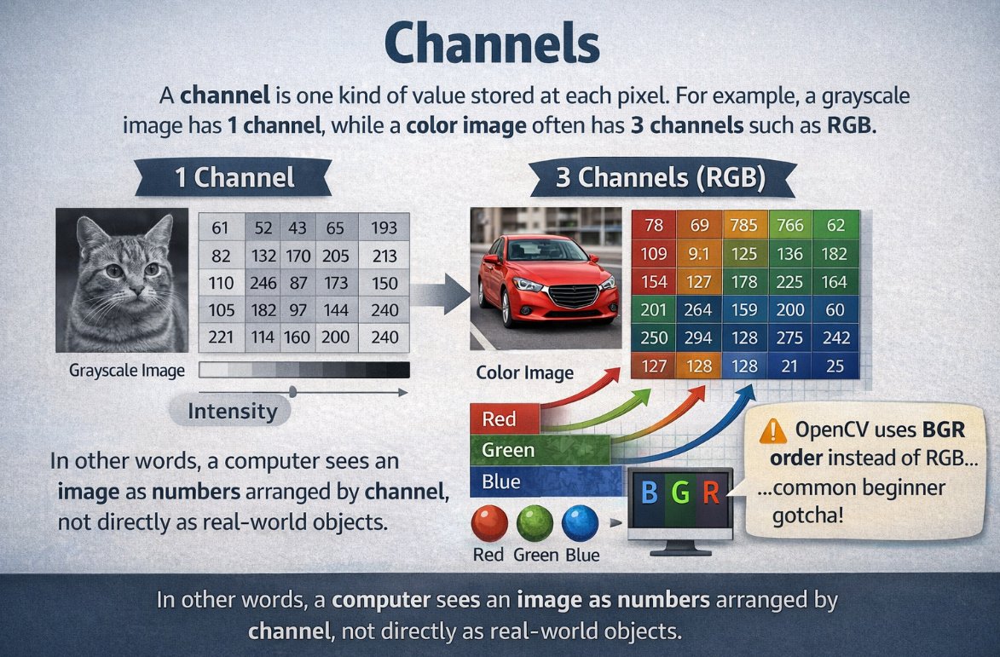
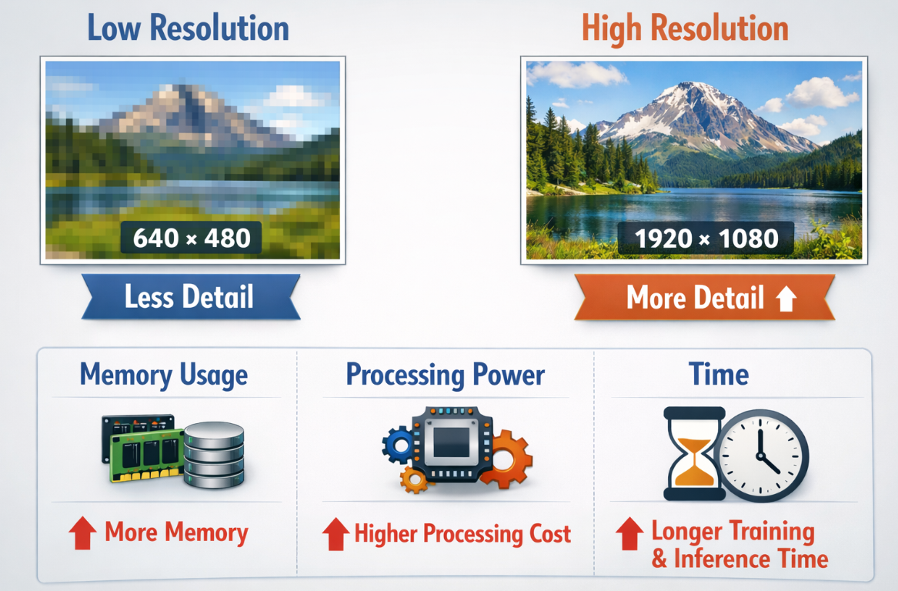
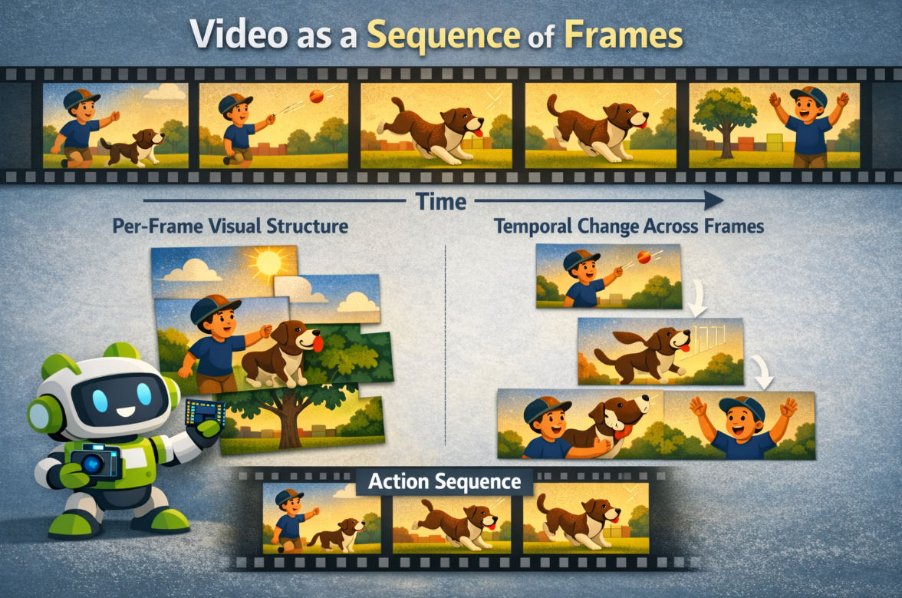
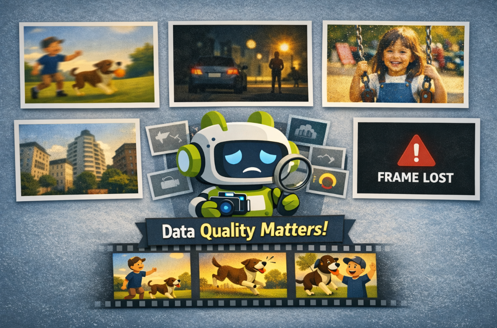
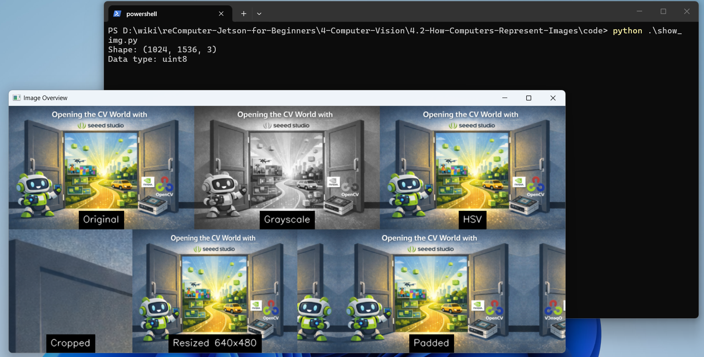

# 4.2 How Computers Represent Images

## What is image?

If you want to understand how computers recognize and interpret images, you first need to know what an image actually is from a computer’s point of view.



To humans, an image may look like a meaningful scene filled with objects, colors, and emotions. But to a computer, an image is simply a grid of numerical data made up of pixels, where each pixel stores values that represent brightness or color. By processing these numbers with mathematical models and algorithms, computers can begin to detect patterns, identify shapes, distinguish objects, and ultimately make decisions about what an image contains. Understanding this difference between human perception and machine representation is the first step toward understanding how computer vision works.

### Images as Arrays of Numbers



A digital image is a grid of values. Each location in the grid is called a pixel.

- In a grayscale image, each pixel usually stores one value.
- In a color image, each pixel stores multiple values, one for each channel.

For a computer, an image is not "a cat" or "a car." It is an array with shape, datatype, and numeric content.

### Channels



A **channel** is one kind of value stored at each pixel.For example, a grayscale image has **1 channel**, while a color image often has **3 channels** such as RGB. In other words, a computer sees an image as numbers arranged by channel, not directly as real-world objects. OpenCV also often uses **BGR** order instead of RGB, Many beginners first meet images as RGB images. But different tasks use different channel layouts.

| Representation | Meaning |
| :-- | :-- |
| Grayscale | one intensity value per pixel |
| RGB / BGR | three color channels per pixel |
| HSV | hue, saturation, value |

OpenCV commonly uses `BGR` order instead of `RGB`, which is an important practical detail.


### Resolution

Resolution describes how many pixels the image contains, such as **640 x 480** or **1920 x 1080**.



Higher resolution usually gives more detail, but it also increases:

- memory use
- processing cost
- training and inference time

### Video as a Sequence of Frames

A video is a time-ordered stream of images.



That means video introduces two layers of complexity:

- per-frame visual structure
- temporal change across frames

### Challenge



Real camera input can be affected by:

- motion blur
- low light
- noise
- lens distortion
- compression artifacts
- dropped frames

This is why good computer vision work depends not only on models, but also on data quality.

## Have a try

### Operate an Image with OpenCV

```bash
#clone the source code
git clone https://github.com/Seeed-Projects/reComputer-Jetson-for-Beginners
cd reComputer-Jetson-for-Beginners/4-Computer-Vision/4.2-How-Computers-Represent-Images/code
# Install opencv if you don't install before
pip install opencv-python
#run the script
python show_img.py
```

**You will see the output:**



### Reading Video

```python
python show_video.py
```

**You will see the output:**


## Exercises / Reflection

1. Load one image and print its `shape` and `dtype`.
2. Convert the same image into grayscale and HSV. Describe what changes visually.
3. Resize one image to two different resolutions and compare file size or processing time.
4. Open a short video and count approximately how many frames are displayed in 10 seconds.

## Summary

Images are structured numeric data, not just pictures. Understanding pixels, channels, resolution, and video frames is essential because every later algorithm, from thresholding to CNNs, operates on these representations.

## Suggested Next Step

Continue to [4.3 Classical Computer Vision](../4.3-Classical-Computer-Vision/README.md).

## References

- [OpenCV Documentation](https://docs.opencv.org/4.x/index.html)
- [OpenCV Python Tutorials](https://docs.opencv.org/4.x/d6/d00/tutorial_py_root.html)

