# 4.3 Classical Computer Vision

## Why This Matters

Before learning about modern computer vision algorithms, it is helpful to first understand what traditional computer vision methods did. This gives us a strong foundation and makes it easier to understand more advanced algorithms later.

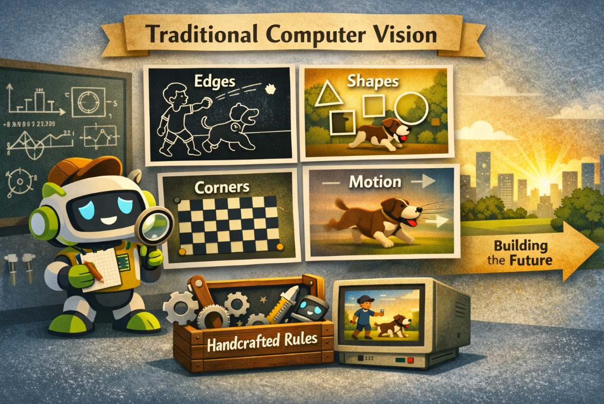

Traditional computer vision focused on teaching computers how to find useful information in images, such as edges, shapes, corners, and movement. These methods relied on rules designed by humans, rather than learning automatically from large amounts of data like modern deep learning models do. Although they were simpler, they helped solve many basic vision tasks and laid the foundation for today’s more powerful computer vision techniques.

## Classical  methods

### Filtering

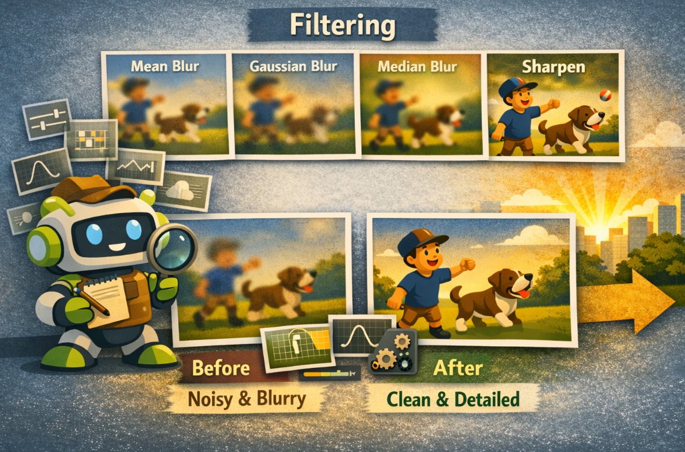

Filtering changes local image structure. Some filters reduce noise, while others enhance detail.

Filtering works by letting each pixel be **updated using its nearby pixels**. In other words, the algorithm slides a small window, called a **kernel**, across the image and computes a new value for each position. 

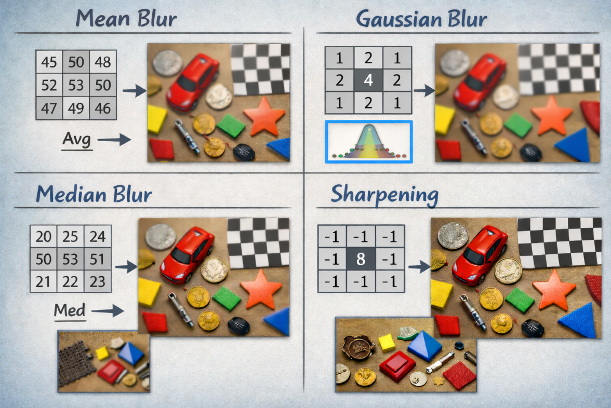

Examples:

- **Mean blur** : replaces a pixel with the average of its neighbors, so the image becomes smoother
- **Gaussian blur** : gives more weight to nearby pixels, which usually makes the blur look more natural
- **Median blur** : replaces a pixel with the middle value in its neighborhood
- **Sharpening** : increases local differences so edges and fine details stand out more clearly

These filters are useful because real camera images often contain noise, small brightness fluctuations, or unstable details that need to be either smoothed or enhanced before later vision steps.

**Have a try:**

```bash
cd 4.3-Classical-Computer-Vision/code
python filtering.py
```

> 🚀 You can try dragging the slider to see different filtering modes and modify different kernel parameters to observe the changes in the image.

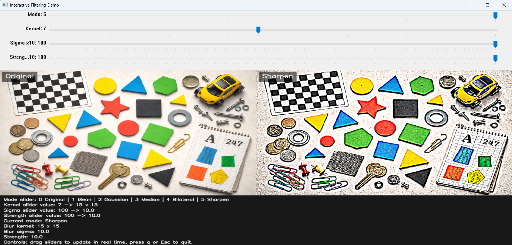

### Thresholding

Thresholding is a simple way to turn a gray image into a **black-and-white result**. The basic idea is: choose a **threshold value**, then compare every pixel to it. If a pixel is brighter than the threshold, it becomes white; otherwise, it becomes black. This changes continuous pixel values into a much simpler yes-or-no decision, which makes objects easier to separate from the background.

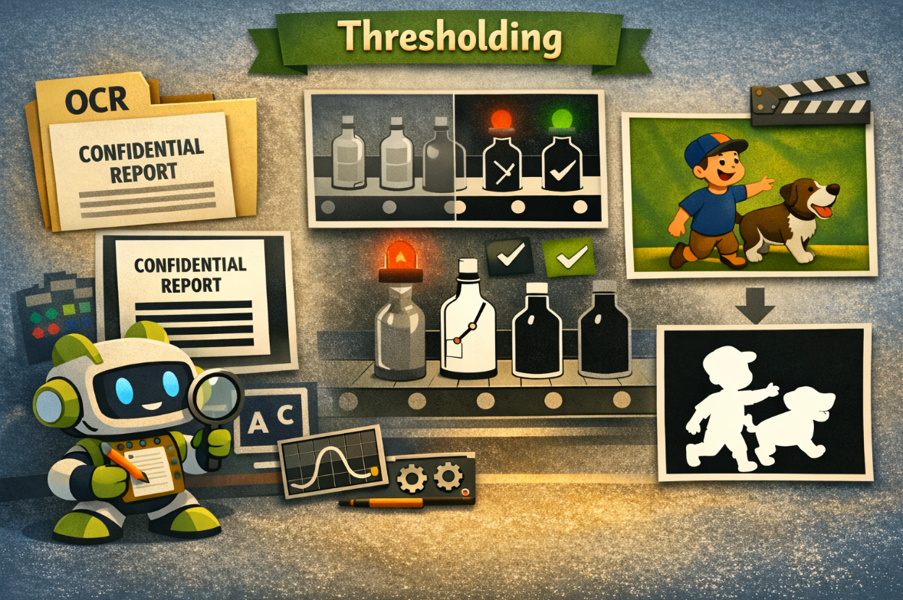

This is useful in:

- document processing
- simple industrial inspection
- foreground extraction in controlled scenes

**Have a try:**

```bash
cd 4.3-Classical-Computer-Vision/code
python thresholding.py
```

> 🚀 Try dragging the slider to modify different thresholds and observe the changes in the image.

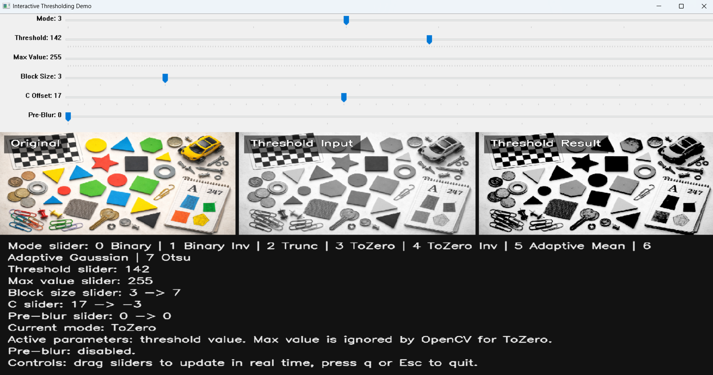

### Edge Detection

Edges often correspond to boundaries where intensity changes sharply.

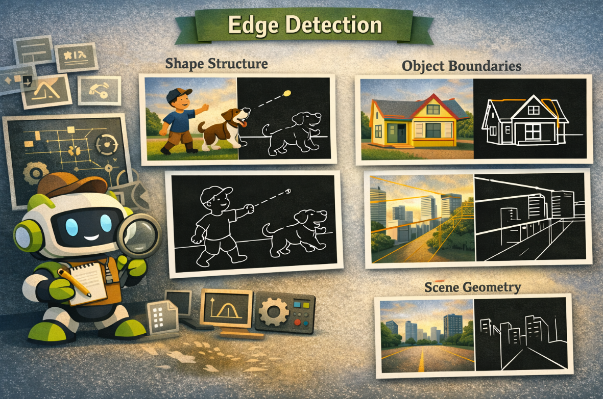

Edge detection is a way to find the **important boundaries** in an image. The basic idea is simple: the algorithm looks at how much the pixel brightness changes from one location to the next. If the change is very small, it is probably part of the same region. If the change is sudden and large, that location is likely to be an **edge**. In practice, many methods first smooth the image a little to reduce noise, then compute intensity changes in the horizontal and vertical directions, and finally keep the strongest changes as edges. This helps a computer highlight object outlines, shape structure, and scene layout more clearly. 

Edge detection helps reveal:

- shape structure
- object boundaries
- scene geometry

**Have a try:**

```bash
cd 4.3-Classical-Computer-Vision/code
python edge_detection.py
```

> 🚀 Dragging the slider to see different modes and modify different parameters to observe the changes in the image.

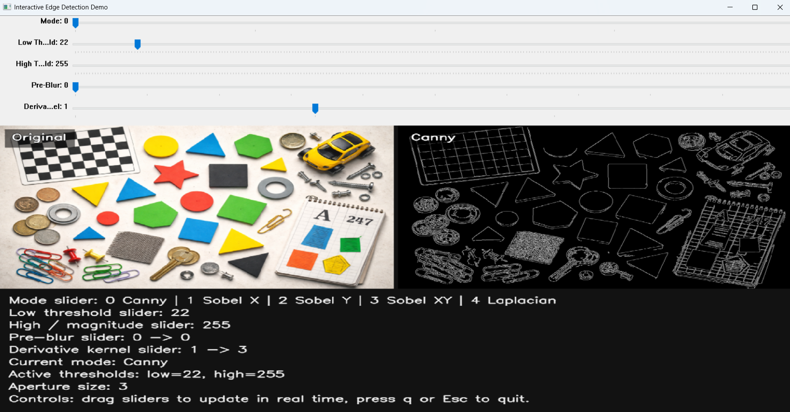

### Contours

Contours describe object outlines in a binary image.

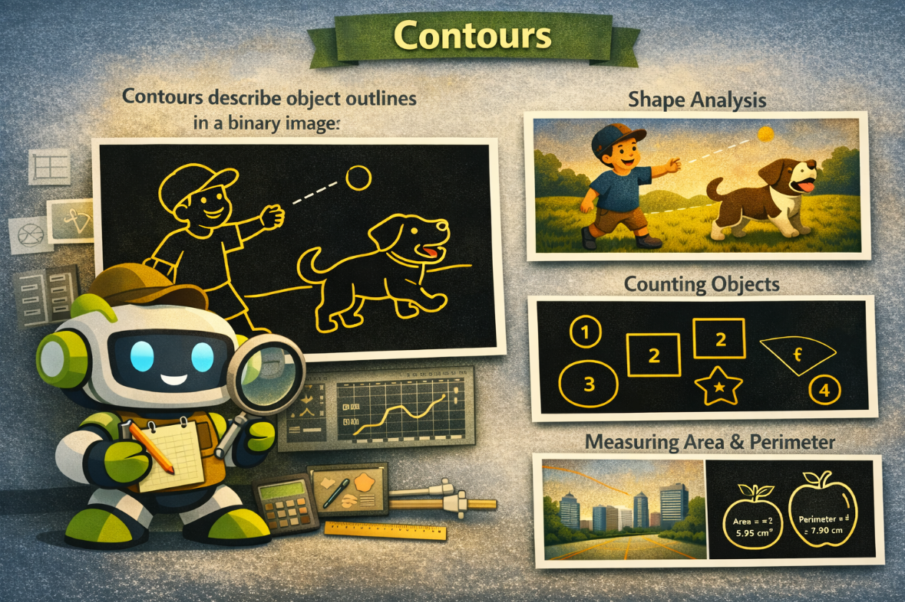

Contours are a way for a computer to **trace the outline of objects** in a **binary image**. The usual process is: first convert the image into black and white, then treat one part as the object and the other as the background. After that, the algorithm follows the boundary where they meet and records the outline as a set of connected points. In this way, a contour is basically the **shape border** of an object. Once the outline is found, the computer can use it to measure size, count objects, or analyze shape more easily.

They are useful for:

- shape analysis
- counting objects
- measuring area and perimeter

**Have a try:**

```bash
cd 4.3-Classical-Computer-Vision/code
python contours.py
```

> 🚀 Try dragging the slider to modify different thresholds and observe the changes in the image.

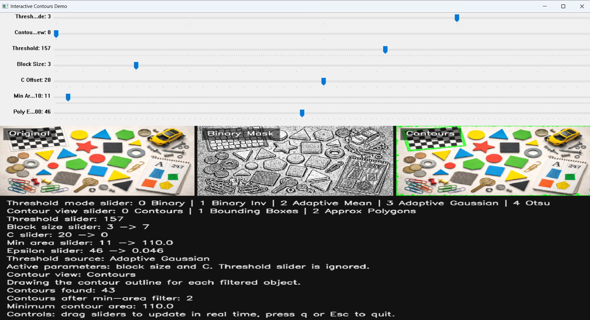

### Morphological Operations

Morphological operations are simple image-processing methods that **change the shape of white regions in a binary image**. They work by moving a small pattern, called a **kernel** or **structuring element**, across the image and checking how it fits the foreground. **Erosion** shrinks objects by removing boundary pixels, so small noise can disappear. **Dilation** grows objects by adding pixels around boundaries, which can fill small gaps. **Opening** is erosion followed by dilation, so it removes small noisy spots while keeping the main shape. **Closing** is dilation followed by erosion, so it fills small holes and connects broken parts. In short, morphology is useful for cleaning up noisy masks and making object shapes easier to analyze.

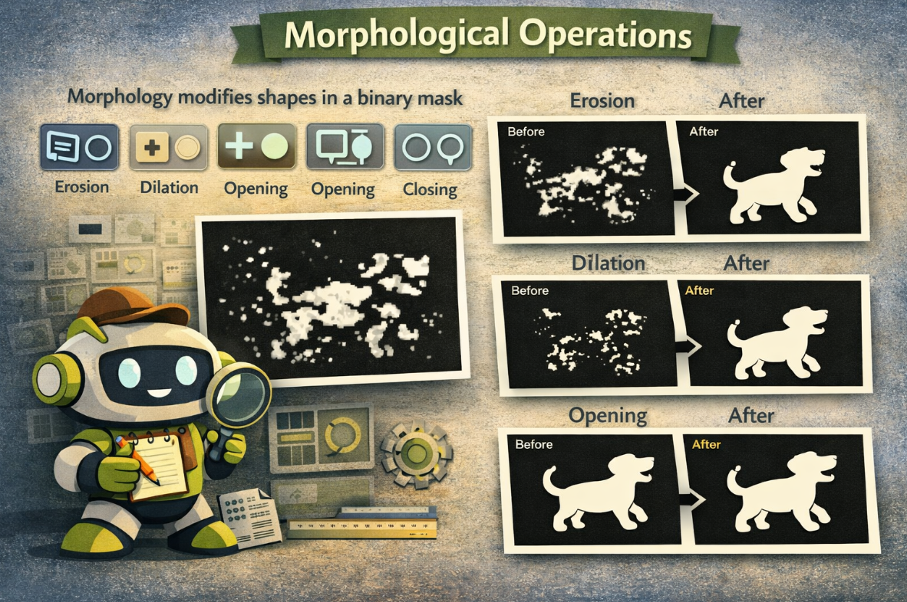

Common operations:

- erosion
- dilation
- opening
- closing

These are especially useful when masks are noisy or fragmented.

**Have a try:**

```bash
cd 4.3-Classical-Computer-Vision/code
python morphological_operate.py
```

> 🚀 Try dragging the slider to modify different thresholds and observe the changes in the image.

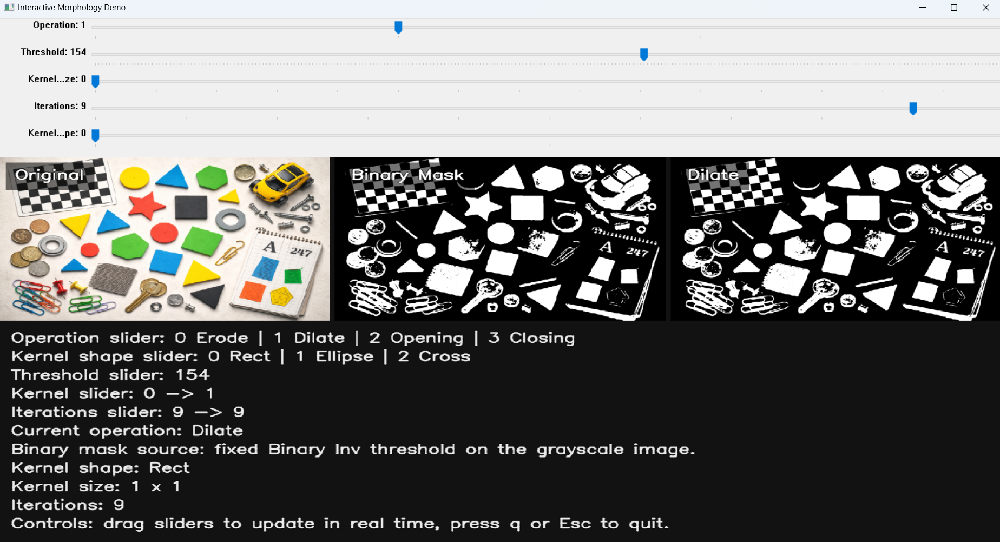

### Feature Detection and Matching

A feature is a visually distinctive point or pattern. Feature matching is used to compare images, align views, or estimate geometric relationships.

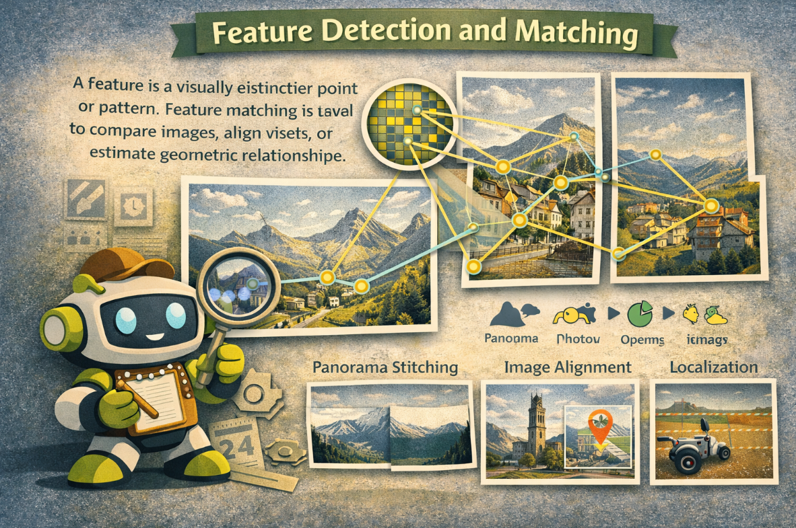

Feature detection means finding **special points or patterns** in an image that are easy to recognize again, such as corners, blobs, or textured patches. Feature matching means comparing these points between two images to find which ones correspond to the same real-world location. A common workflow is: first detect keypoints, then compute a **descriptor** for each one, which is a compact numeric summary of the local appearance, and finally compare descriptors to find the best matches. OpenCV describes matchers such as **Brute-Force**, which compares one descriptor against all others, and **FLANN**, which speeds up searching in large sets. This is useful because once good matches are found, the computer can align images, stitch panoramas, estimate motion, or locate an object from another view. 

This idea is important for:

- panorama stitching
- image alignment
- localization
- visual odometry

**Have a try:**

```bash
cd 4.3-Classical-Computer-Vision/code
python feature_detection_matching.py
```

> 🚀 Try dragging the slider to modify different matching modes and observe the changes in the image.

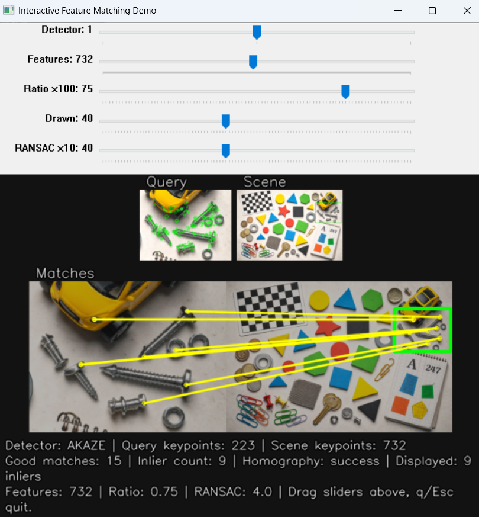

## Common Misunderstandings

- "Classical vision is obsolete."
  - It is older, but not obsolete. It is still useful for preprocessing, measurement, and rule-based logic.
- "Deep learning replaced all traditional image processing."
  - In practice, many modern systems still include classical operations.
- "If thresholding works on one image, it will work everywhere."
  - Classical methods can be sensitive to lighting and context.

## Exercises / Reflection

1. Apply thresholding to an image with a simple foreground and count the connected objects.
2. Compare edge maps before and after Gaussian blur. What changes?
3. Try erosion and dilation on the same binary mask. What happens to small regions?
4. Reflect on one situation where a simple classical method may be better than a deep model.

## Summary

Classical computer vision gives learners a transparent way to understand image transformations. It also remains useful in real systems for preprocessing, filtering, shape reasoning, and lightweight visual logic.

## Suggested Next Step

Continue to [4.4 Neural Networks and CNNs](../4.4-Neural-Networks-and-CNNs/README.md).

## References

- [OpenCV Documentation](https://docs.opencv.org/4.x/index.html)
- [OpenCV Image Processing Tutorials](https://docs.opencv.org/4.x/d7/dbd/tutorial_general_threshold.html)

