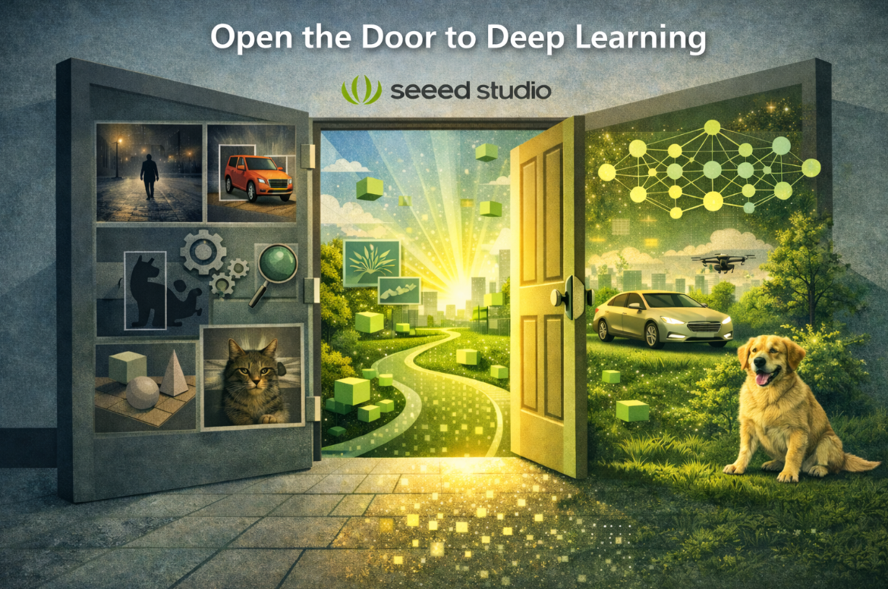
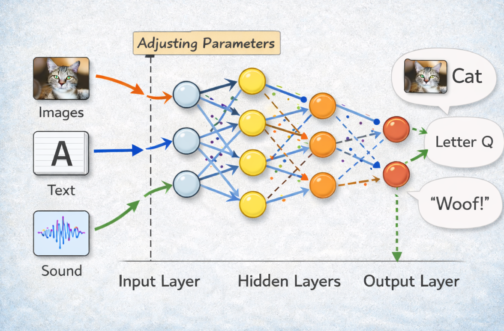
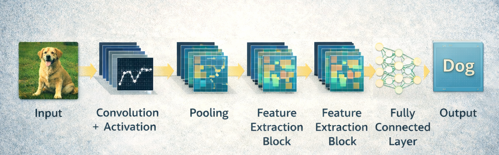
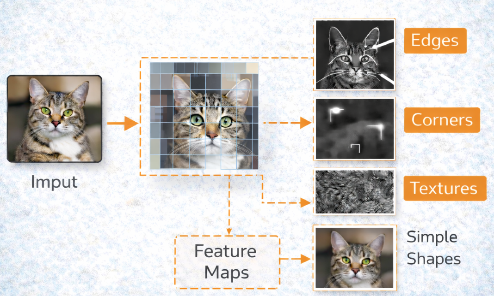
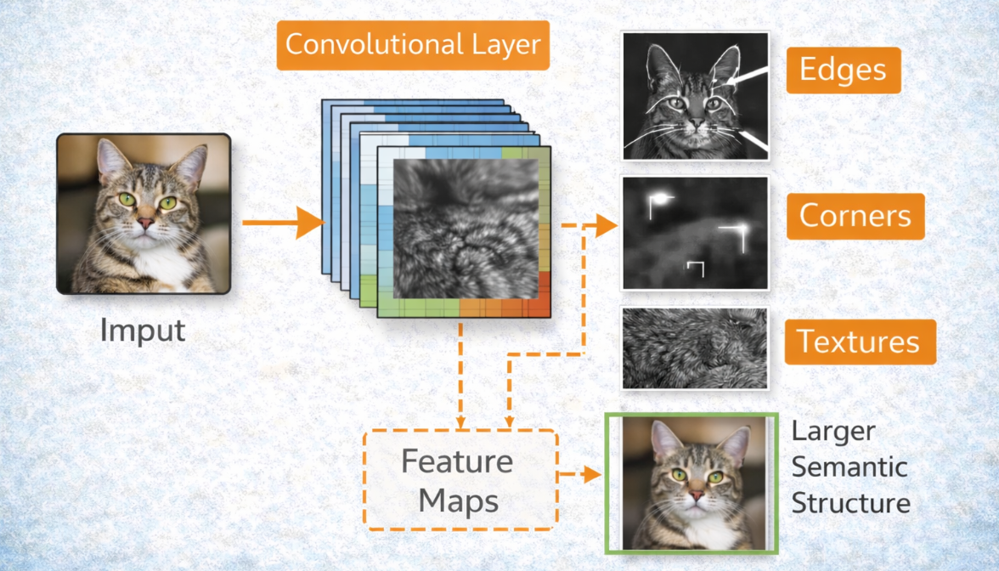
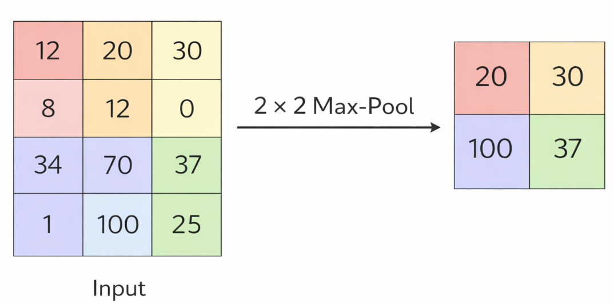
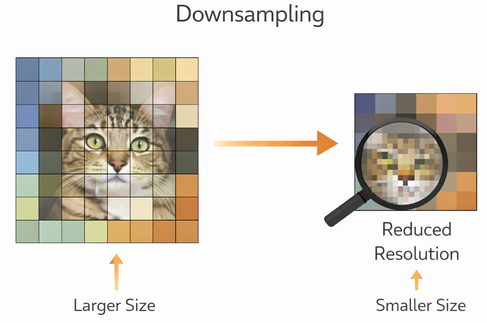
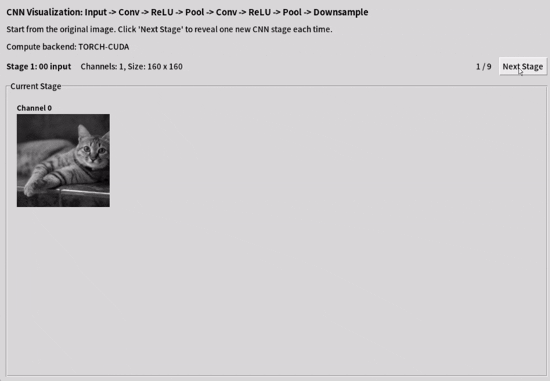

# 4.4 Neural Networks and CNNs

## Open the door to deep learning



In the previous chapters, we saw that traditional computer vision methods often fail in the real world. Their success usually depends on the scene matching a **specific pattern** or set of assumptions, such as stable lighting, clean backgrounds, fixed viewpoints, or predictable object shapes. Once these conditions change, their performance can quickly degrade. Deep learning, however, takes a very different approach. Instead of relying mainly on hand-crafted rules, it **learns useful visual patterns directly from large amounts of data**. This allows it to handle far more variation in appearance, background, scale, lighting, and pose. As a result, deep learning has made computer vision much more robust and practical for real-world applications.


### From Rules to Learned Representations

In classical vision, we write rules explicitly:

- blur the image
- find the edges
- extract the contour

In a neural network, we let the model learn useful patterns from examples.

This is the key conceptual shift: the system learns representations instead of relying only on manually designed features.

### What Is a Neural Network



A neural network is a function made of layers that transform input data step by step.

Each layer learns parameters. During training, those parameters are adjusted so the network's outputs become more useful for the task.

### What does NN look like in code?

```python
import torch
import torch.nn as nn
import torch.nn.functional as F

# 1. Define the Network Structure
class SimpleMLP(nn.Module):
    def __init__(self, input_size=784, hidden_size=128, num_classes=10):
        super(SimpleMLP, self).__init__()
        
        # --- Fully Connected Layers (Dense Layers) ---
        
        # First layer: Maps input features to the first hidden layer
        self.fc1 = nn.Linear(input_size, hidden_size)
        
        # Second layer: Maps first hidden layer to the second hidden layer
        self.fc2 = nn.Linear(hidden_size, 64)
        
        # Output layer: Maps second hidden layer to the number of classes
        self.fc3 = nn.Linear(64, num_classes)
        
        # Optional: Dropout layer to prevent overfitting (drops 20% of neurons)
        self.dropout = nn.Dropout(p=0.2)

    # 2. Define the Data Flow (Forward Pass)
    def forward(self, x):
        # Flatten the input tensor
        # Converts (batch_size, channels, height, width) to (batch_size, -1)
        # Example: 28x28 image becomes a 784-dimensional vector
        x = x.view(x.size(0), -1)  
        
        # First hidden layer: Linear transformation -> ReLU Activation -> Dropout
        x = F.relu(self.fc1(x))
        x = self.dropout(x)
        
        # Second hidden layer: Linear transformation -> ReLU Activation
        x = F.relu(self.fc2(x))
        
        # Output layer: Linear transformation (no activation here, usually handled by loss function)
        x = self.fc3(x)
        
        return x

# 3. Instantiate the Model
model = SimpleMLP()
print(model)
```

### Have a try

```bash
cd 4.4-Neural-Networks-and-CNNs/code
python powerful_neural_network.py
```

> 🚀  Train your own neural network to see how it performs!


### Why CNN Are Good for Images

**CNN（convolutional neural network）** work well for images because images are not just random numbers. In an image, nearby pixels usually belong to the same edge, shape, or texture, so local patterns matter a lot. CNN take advantage of this by using small **filters** that scan across the image and look for useful features such as edges, corners, and simple shapes. As the network goes deeper, it combines these small features into bigger ones, like parts of an object and finally the whole object itself. This is why CNNs are especially good at understanding images efficiently and accurately. 


%20-%20Output%20Shape%20:%20(1,%207,%207)%20-%20K%20:%20(3,%203)%20-%20P%20:%20(0,%200)%20-%20S%20:%20(1,%201)%20-%20D%20:%20(1,%201)%20-%20G%20:%201.gif?raw=true)

A CNN usually has a **layered structure** for turning an image into higher-level visual understanding. It starts with an **input image**, then passes it through several **convolution layers** that learn local patterns such as edges, textures, and shapes. These are often followed by **activation functions** like ReLU and **pooling layers** that reduce spatial size while keeping important information. After several such blocks, the feature maps are **flattened** or pooled into a compact representation, and then passed to one or more **fully connected layers** to produce the final prediction, such as a class label. In short, a common CNN looks like: 

> **input → convolution + activation → pooling → repeated feature extraction blocks → fully connected layer → output**



**Benefits of convolution:**

- **local pattern extraction**

Convolution helps the model find small useful patterns in an image, such as edges, corners, textures, or simple shapes. These small patterns are the basic building blocks for understanding bigger objects.



- **parameter sharing**

The same filter is used across different parts of the image. This means the model does not need to learn a new set of weights for every position, which makes it more efficient and reduces the number of parameters.

- **translation robustness**

If an object moves to a different place in the image, the convolution filter can still detect it. In other words, the model can recognize the same pattern even when its position changes.

### Feature Maps

When a convolutional layer processes an image, it produces feature maps. These maps respond to patterns such as:

- edges
- corners
- textures
- larger semantic structures in deeper layers



### Pooling and Downsampling

Pooling reduces spatial size while keeping important information.





This helps:

- reduce computation
- improve robustness
- build more compact representations

### Have a try

```bash
cd 4.4-Neural-Networks-and-CNNs/code
python cnn_process_visualization.py
```

> 🚀  Run the script to experience the processing process of the convolutional network on the image.



### Training vs Inference

- `Training`: the model learns by updating weights
- `Inference`: the trained model makes predictions without updating weights

This distinction is crucial because the later deployment chapters focus mainly on inference.

### What does a CNN look like in code?

```python
mport torch
import torch.nn as nn

class TinyCNN(nn.Module):
    def __init__(self):
        super().__init__()
        self.features = nn.Sequential(
            nn.Conv2d(3, 16, kernel_size=3, padding=1),
            nn.ReLU(),
            nn.MaxPool2d(2),
            nn.Conv2d(16, 32, kernel_size=3, padding=1),
            nn.ReLU(),
            nn.MaxPool2d(2)
        )
        self.classifier = nn.Sequential(
            nn.Flatten(),
            nn.Linear(32 * 56 * 56, 64),
            nn.ReLU(),
            nn.Linear(64, 10)
        )

    def forward(self, x):
        x = self.features(x)
        x = self.classifier(x)
        return x

model = TinyCNN()
dummy = torch.randn(1, 3, 224, 224)
output = model(dummy)
print(output.shape)
```

## Common Misunderstandings

- "A CNN literally sees like a human eye."
  - CNNs process numeric patterns. The analogy is helpful, but not literal.
- "More layers always mean better performance."
  - Deeper models can be more powerful, but also harder to train and deploy.
- "If I understand the code, I automatically understand training."
  - Training also depends on data, loss, optimization, and evaluation.

## Exercises / Reflection

1. In your own words, explain why convolution is more suitable for images than a plain fully connected layer.
2. Run the tiny CNN example and print the output shape.
3. Change the number of output channels in the first convolution and observe how the model structure changes.
4. Reflect on how CNNs differ from classical filters such as blur or edge detection.

## Summary

Neural networks learn representations from data, and CNNs are especially effective for images because they exploit local structure. Understanding convolution, feature maps, pooling, and the difference between training and inference prepares the learner for modern vision tasks.

## Suggested Next Step

Continue to [4.5 Deep Learning Computer Vision Tasks](../4.5-Deep-Learning-Computer-Vision-Tasks/README.md).

## References

- [PyTorch Tutorials](https://pytorch.org/tutorials/)
