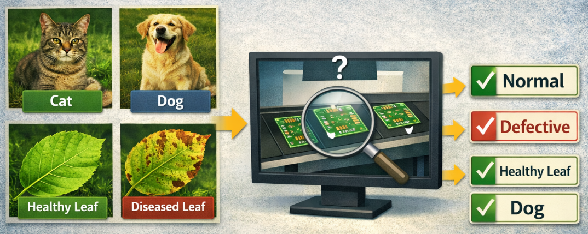
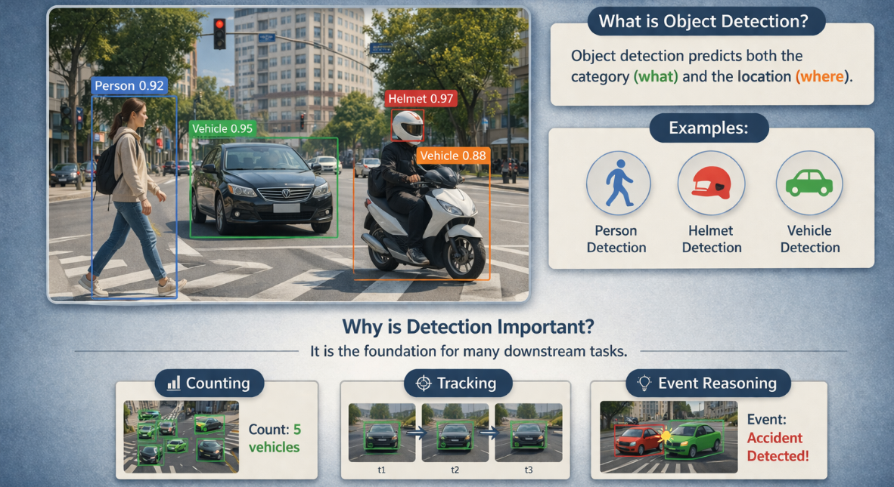
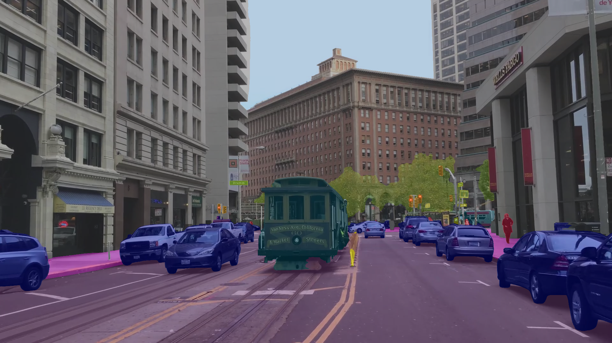
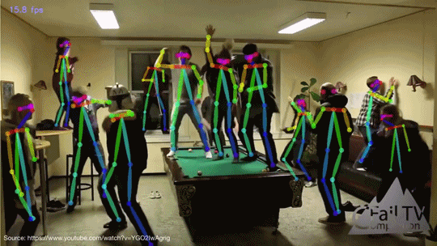
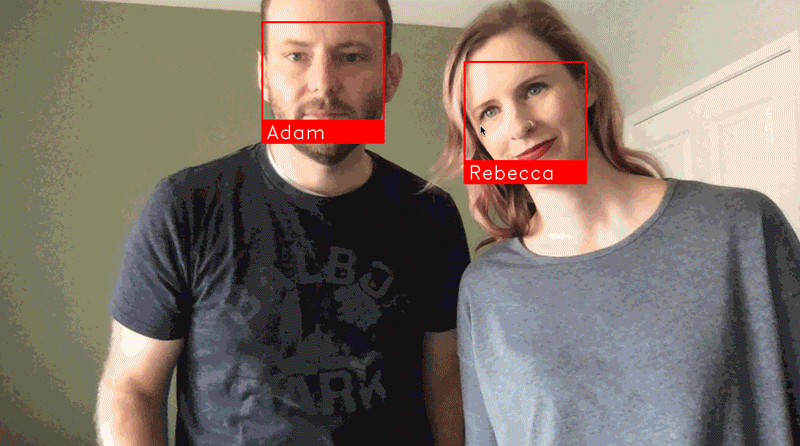
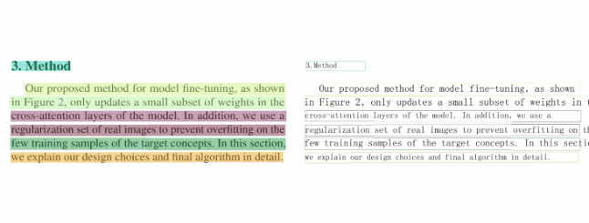

# 4.5 Deep Learning Computer Vision Tasks

## Main Task

Deep learning computer vision covers many tasks that help machines understand images and videos. Common tasks include **image classification** (deciding what the main object is), **object detection** (finding objects and drawing boxes around them), and **segmentation** (labeling each pixel or separating individual objects). It also includes **keypoint detection** for landmarks such as body joints, **optical flow** for estimating motion between frames, and **video classification** for understanding actions in videos. 

In simple terms, these tasks move from answering **“what is in the image?”** to **“where is it?”**, **“what shape is it?”**, and **“how is it moving?”** .

## 

### 1. Image Classification

Image classification predicts one or more labels for the whole image.

Examples:

- cat vs dog
- healthy leaf vs diseased leaf
- normal product vs defective product

This task is useful when global content matters more than object location.

### 2. Object Detection

Object detection predicts both category and location.

Examples:

- person detection
- helmet detection
- vehicle detection

Detection is very important because it becomes the basis for many downstream tasks such as counting, tracking, and event reasoning.

### 3. Segmentation

Segmentation works at pixel level.

Two common forms:

- semantic segmentation: classify each pixel by category
- instance segmentation: separate individual objects of the same category

Examples:

- road area segmentation
- product boundary extraction
- background removal

### 4. Object Tracking

Tracking connects detections over time.

It answers a different question from detection:

- not only what is here now
- but which object remains the same across frames

This is essential for:

- counting people
- monitoring movement
- behavior analysis

### 5. Pose Estimation

Pose estimation predicts structured keypoints such as joints or landmarks.

Examples:

- human skeleton estimation
- hand landmarks
- animal pose estimation

This is useful when shape and posture matter more than a simple box.

### 6. Face Recognition

Face recognition goes beyond detecting a face. It tries to identify or verify who the person is.

That usually involves:

- face detection
- face alignment
- feature extraction
- comparison or matching

This task introduces important concerns around privacy, bias, and security.

### 7. OCR and Scene Text Understanding

OCR extracts text from images or video.

Examples:

- receipts
- labels
- license plates
- forms

OCR is one of the clearest examples of vision interacting with language.

### 8. Event and Behavior Understanding

Some practical systems care less about static objects and more about events:

- line crossing
- intrusion
- fall detection
- loitering

These tasks often combine detection, tracking, and rule-based logic.

## Common Misunderstandings

- "Detection is always enough."
  - Some applications need segmentation, pose estimation, OCR, or temporal reasoning.
- "Tracking is just repeated detection."
  - Tracking also requires identity continuity across time.
- "Face recognition and face detection are the same."
  - Detection finds the face. Recognition identifies or verifies the person.

## Exercises / Reflection

1. Choose one application from each of the following areas and identify the most suitable vision task:
   - smart retail
   - factory inspection
   - traffic analysis
   - document processing
2. Explain when segmentation is better than detection.
3. Explain why tracking is important in video analytics but not necessary in every image task.

## Summary

Deep learning computer vision includes many task types, each with its own outputs, strengths, and applications. Understanding this task map helps the learner choose the right tool for a problem. In the next section, the course uses `YOLO26` as the main practical case for learning how to train and deploy a custom model.

## Suggested Next Step

Continue to [4.6 Train and Deploy Your Own Vision Model](../4.6-Train-and-Deploy-Your-Own-Vision-Model/README.md).

## Reference:

https://github.com/NVIDIA/semantic-segmentation

https://github.com/yehengchen/Object-Detection-and-Tracking

https://github.com/ZheC/Realtime_Multi-Person_Pose_Estimation

https://github.com/ageitgey/face_recognition

https://github.com/RapidAI/RapidOCR
