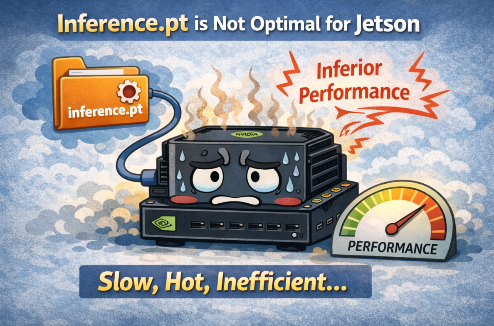
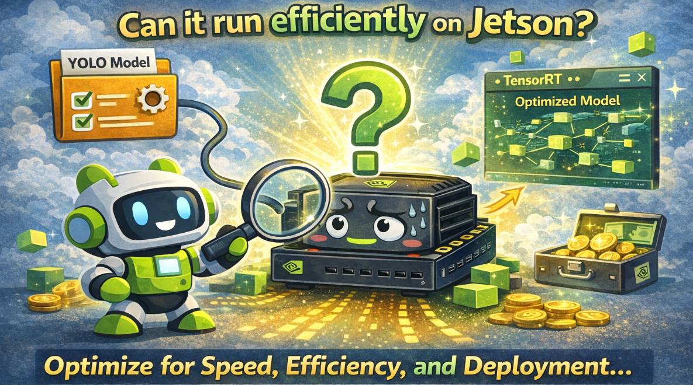
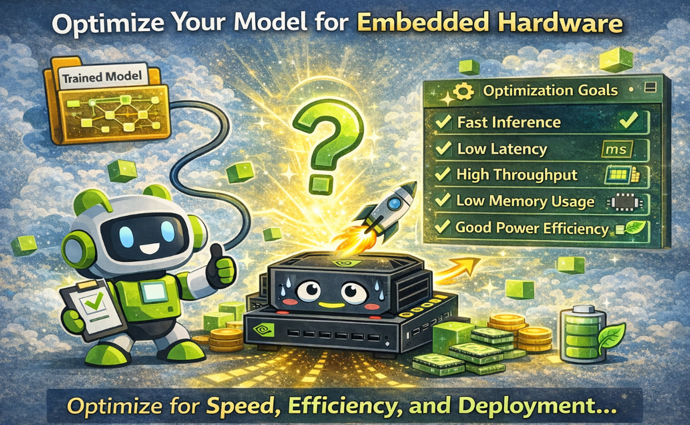
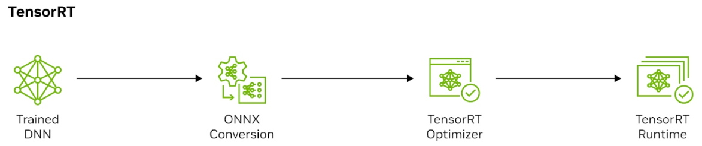
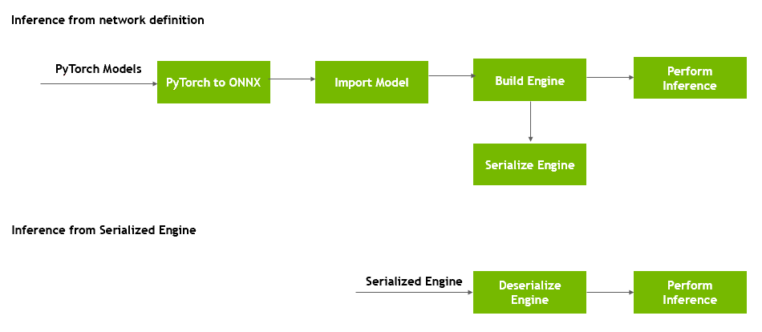
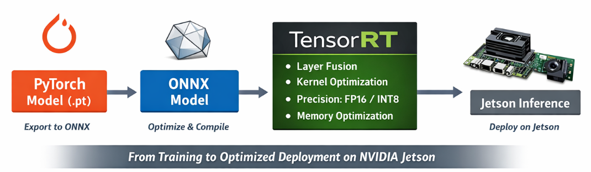

# 4.7 Model Export and Edge Deployment

## Why This Matters

In the previous chapter, we explained how to train a custom YOLO model and successfully run inference on Jetson. At that stage, the model was still stored in `.pt` format, which is the native format commonly used in the PyTorch ecosystem. This is a good starting point because it proves that the training results are correct and that the model can already perform object detection on the target device.

In the previous chapter, we explained how to train a custom YOLO model and successfully run inference on Jetson. At that stage, the model was still stored in **`.pt` format**, which is the native format commonly used in the PyTorch ecosystem. This is a good starting point because it proves that the training results are correct and that the model can already perform object detection on the target device.



However, being able to run a model on Jetson does not mean that the model is already in its best deployment form. The **`.pt` file is mainly designed for training, validation, and development**, where flexibility is more important than execution efficiency. For actual edge deployment, especially on embedded platforms like Jetson, we care about much more than whether the model can run. We also care about how fast it runs, how much memory it consumes, how stable its throughput is, and how well it fits within the device’s power and thermal limits.



In other words, a trained checkpoint is only part of the deployment pipeline. To make a YOLO model truly suitable for real-world Jetson applications, we usually need to convert it into a more deployment-friendly format and further optimize it for embedded inference. This is the key step that bridges the gap between **computer vision development** and **edge engineering**.


Therefore, after training a model, the next important question is not simply *“Can it run?”* but rather *“**Can it run efficiently on Jetson?**”* To answer that question, we need to understand why model optimization is necessary 

------

## Why Do We Need Model Optimization?

Model optimization is necessary because the original trained model is usually not designed for the constraints of embedded hardware. During training, the main goal is to achieve good accuracy and convergence. During deployment, however, the goal changes. We need the model to deliver **fast inference, low latency, high throughput, low memory usage, and good power efficiency**.



This is especially important for Jetson devices. Compared with desktop GPUs or cloud servers, Jetson platforms have more limited compute resources, memory bandwidth, and power budget. In many edge AI scenarios, such as robotics, smart cameras, industrial inspection, or autonomous systems, the model must process data in real time. If inference is too slow, the system may miss frames, respond too late, or fail to meet the requirements of the application.

Running a YOLO model directly in `.pt` format often introduces unnecessary overhead from the PyTorch runtime. Although this approach is convenient for testing and prototyping, it is not ideal for squeezing the maximum performance out of Jetson hardware. The model may work correctly, but it may not use the GPU as efficiently as possible. As a result, latency may remain high, throughput may be limited, and resource usage may be larger than necessary.

Model optimization helps solve these problems. By exporting the model and optimizing it for inference, we can improve the way the network is executed on the target hardware. This may include **reducing redundant operations, fusing layers, selecting more efficient kernels, lowering precision from FP32 to FP16 or INT8, and improving memory usage**. These optimizations can significantly improve deployment performance without changing the overall task of the model.

For Jetson deployment, optimization brings several practical benefits:

### 1. Lower Latency

A faster model means each input frame can be processed more quickly. This is critical for real-time tasks such as object detection and tracking.

### 2. Higher Throughput

Optimization allows the system to process more frames per second, which is important for video analytics and multi-stream applications.

### 3. Lower Memory Usage

Embedded devices have limited memory resources. An optimized model can reduce memory footprint and improve system stability.

### 4. Better Power Efficiency

Jetson devices are often used in edge environments where power consumption matters. A more efficient model can help the system run longer and more reliably.

### 5. Better Utilization of Hardware

Optimization enables the model to make better use of NVIDIA GPU acceleration instead of relying heavily on general framework execution.

For these reasons, model optimization is not just an optional improvement. It is a necessary step for transforming a trained YOLO model into a practical edge AI solution that can run efficiently under real deployment conditions.

------

## What Is TensorRT?



**TensorRT** is NVIDIA’s high-performance deep learning inference framework and runtime. It is specifically designed to optimize trained neural networks and execute them efficiently on NVIDIA hardware, including Jetson devices.

In simple terms, TensorRT is the tool that helps convert a trained model into a form that is better suited for deployment. Instead of running the model through a general-purpose deep learning framework, TensorRT builds an **optimized inference engine** that is tailored to the target NVIDIA GPU. This allows the model to run faster and more efficiently.



For Jetson, TensorRT plays a central role in deployment because it is designed to fully exploit the capabilities of NVIDIA embedded GPUs. It performs a variety of optimizations, such as:

- **layer fusion**, which combines multiple operations into a more efficient execution path
- **kernel auto-selection**, which chooses the best implementation for the hardware
- **precision optimization**, such as FP16 or INT8 acceleration
- **memory optimization**, which reduces unnecessary memory movement and improves runtime efficiency

As a result, TensorRT can significantly improve the inference performance of a YOLO model compared with running the original `.pt` model directly.



A common Jetson deployment workflow looks like this:

**PyTorch `.pt` model → ONNX model → TensorRT engine → Jetson inference**

In this workflow:

- the **`.pt` model** is the training result
- the **ONNX model** serves as an intermediate exchange format
- the **TensorRT engine** is the optimized deployment artifact used for inference on Jetson

This process shows that TensorRT is not just a converter, but a key optimization and execution layer for embedded AI deployment.

From an engineering perspective, TensorRT is important because it turns a model that is merely *trainable and testable* into one that is truly *deployable and efficient*. For Jetson users, TensorRT is often the most important step in achieving practical real-time performance.

In other words, a trained checkpoint is only part of the deployment pipeline. To make a YOLO model truly suitable for real-world Jetson applications, we usually need to convert it into a more deployment-friendly format and further optimize it for embedded inference. This is the key step that bridges the gap between **computer vision development** and **edge engineering**.

### Common Model Formats

| Format | Main Role |
| :-- | :-- |
| PyTorch checkpoint | flexible for training and experimentation |
| ONNX | portable intermediate format |
| TensorRT engine | optimized runtime format for NVIDIA hardware |

### Accuracy vs Speed vs Power

A more accurate model is often **bigger, slower, and uses more power**, while a faster model is often **lighter but less accurate**. So in real deployment, we must find a balance that fits the device and the task. Edge deployment is always about trade-offs.

You often balance:

- model accuracy
- inference speed
- memory usage
- thermal and power limits

### Precision Modes

Model precision means **how many bits are used to store numbers** inside the model, such as weights and activations. Higher precision, like **FP32**, keeps more numeric detail, while lower precision, like **FP16** or **INT8**, uses fewer bits. Lower precision can make inference **faster** and use **less memory**, which is very helpful on edge devices like Jetson. But if the precision is reduced too much, the model may lose some accuracy, so we need to balance speed and reliability.

##  Code Example

### Export to ONNX

```bash
yolo export model=yolo26s.pt format=onnx imgsz=640
```

### Export to TensorRT on Jetson

```bash
yolo export model=yolo26s.pt format=engine imgsz=640 half=True device=0
```

### Useful Jetson Runtime Commands

```bash
#turn on max mode
sudo nvpmodel -m 0
#turn on jetson clocks
sudo jetson_clocks
```

## Have a try

```bash
cd 4.7-Model-Export-and-Edge-Deployment/code
python compare_yolo26_pt_vs_engine.py --video ./cat.mp4
```

> 🚀 Observe the changes in the inference delay of the optimized model


## Common Misunderstandings

- "If the model exports successfully, deployment is solved."
  - Export is only one step. Runtime validation still matters.
- "The fastest model is always the best model."
  - A faster model is not useful if it misses important cases.
- "INT8 is always better than FP16."
  - `INT8` can be strong, but only if accuracy remains acceptable.

## Exercises / Reflection

1. Export one trained model to `ONNX` and record the command.
2. Compare in writing what each of these is best for: `checkpoint`, `ONNX`, `TensorRT engine`.
3. Imagine a model is accurate but too slow. List three ways to make deployment more practical.
4. Explain why power mode matters on an edge device.

## Summary

Model export and edge deployment are not afterthoughts. They are part of the full computer vision workflow. After a learner understands data, training, and evaluation, the next challenge is to convert that model into something practical for real hardware.

## Suggested Next Step

Continue to [4.8 Real-Time Vision Pipeline Frameworks](../4.8-Real-Time-Vision-Pipeline-Frameworks/README.md).

## References

- https://onnx.ai/onnx/intro/
- [Ultralytics Export Mode](https://docs.ultralytics.com/modes/export/)
- [Ultralytics TensorRT Integration](https://docs.ultralytics.com/integrations/tensorrt/)
- [TensorRT Developer Guide](https://docs.nvidia.com/deeplearning/tensorrt/developer-guide/index.html)
- https://developer.nvidia.com/blog/speeding-up-deep-learning-inference-using-tensorrt-updated/

