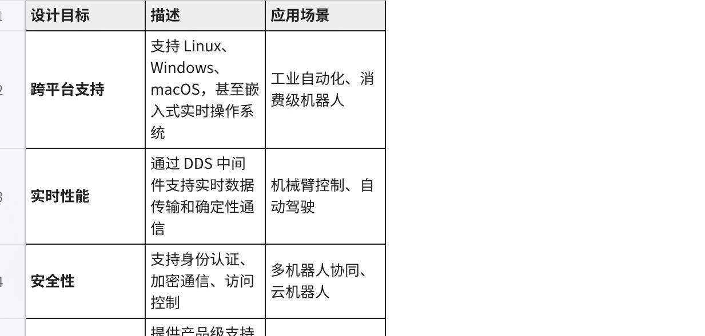
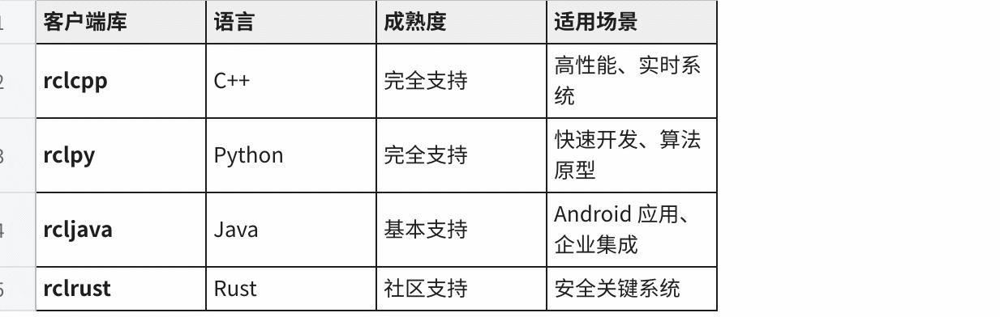
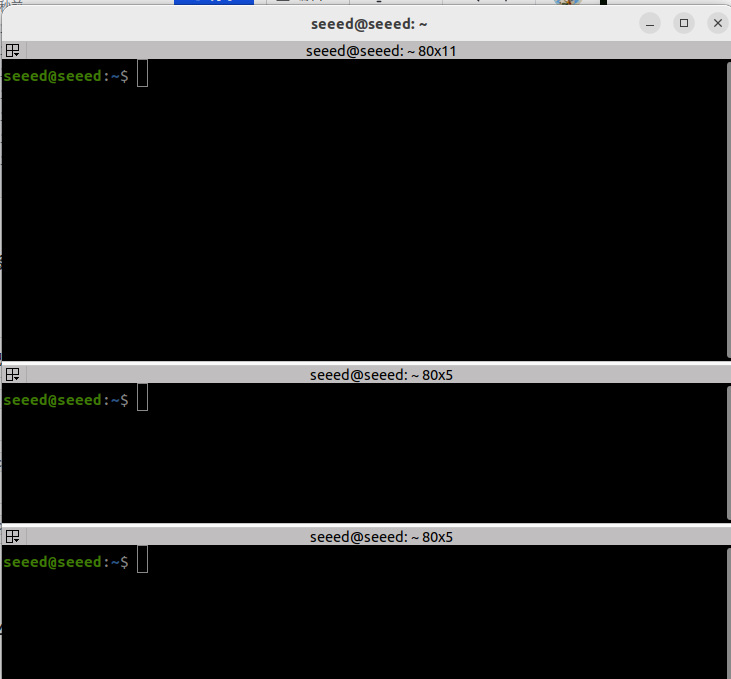
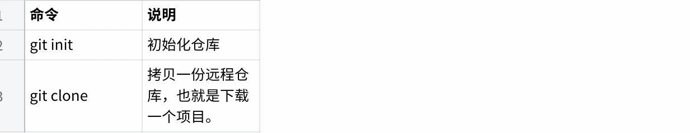
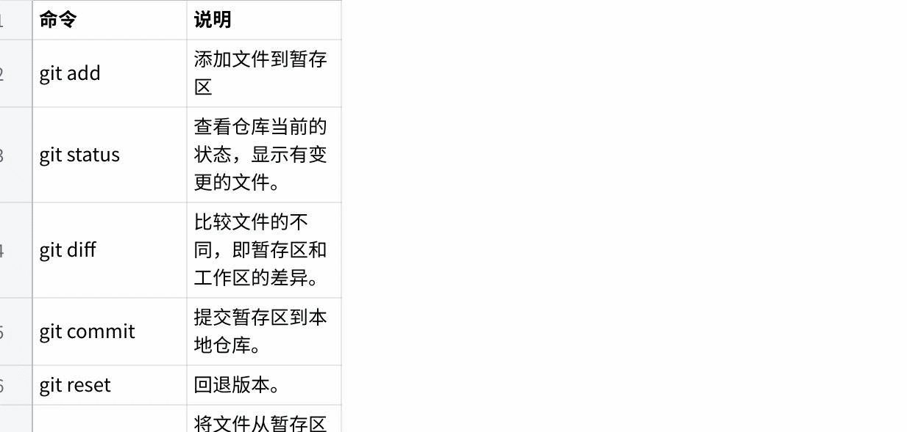
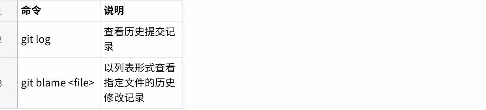
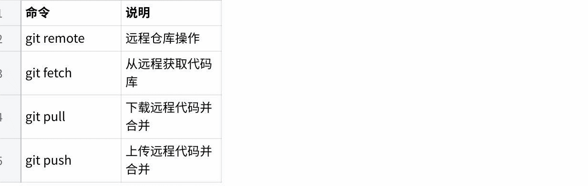

# ROS2 Foundations and Setup

## Chapter IX ROS2-Humble

| Name | Owner | Modified | Created |
| --- | --- | --- | --- |
| 01 ROS2 Introduction | Yujiang! | 2026-01-09 14:03 | 2026-01-09 14:03 |
| 02 Install Humble | Yujiang! | 2026-01-26:12 | 2026-01-09 14:03 |
| 03 Integrated Development Environment | Yujiang! | 2026-01-26:55 | 2026-01-09 14:24 |
| 04 Workspace | Yujiang! | 2026-01-12:22 | 2026-01-09 14:25 |
| 05 Package | Yujiang! | 2026-01-12:22 | 2026-01-09 14:26 |
| 06 Node | Yujiang! | 2026-02-13:28 | 2026-01-09 14:26 |
| 07 Topic Communication | Yujiang! | 2026-02-13:29 | 2026-01-09 14:27 |
| 08 Service communications | Yujiang! | 2026-02-06 13:57 | 2026-01-09 14:27 |
| 09 Action Communications | Yujiang! | 2026-01-27:48 | 2026-01-09 14:27 |
| 10 TF2 Coordinate Transformation | Yujiang! | 2026-01-27:55 | 2026-01-09 14:28 |
| Custom interface message | Yujiang! | 2026-02-06 14:45 | 2026-01-09 14:28 |
| 12 Parameter service cases | Yujiang! | 2026-02-06 15:05 | 2026-01-09 14:28 |
| 13 meta-pack | Yujiang! | 2026-02-06 15:16 | 2026-01-09 14:29 |
| 14 Distributed Communication | Yujiang! | 2026-02-06 15:25 | 2026-01-09 14:29 |
| 15 DDS | Yujiang! | 2026-02-06 16:00 | 2026-01-09 14:29 |
| Time-related API | Yujiang! | 2026-02-06 16:20 | 2026-01-09 14:29 |
| 17 Common command tool | Yujiang! | 2026-02-06 16:41 | 2026-01-09 14:30 |
| 18 RViz2 Use | Yujiang! | 2026-02-09:53 | 2026-01-09 14:30 |
| 19 Rqt Toolbox | Yujiang! | 2026-02-09 13:43 | 2026-01-09 14:38 |
| 20 Launch Configuration | Yujiang! | 2026-02-09 17:12 | 2026-01-09 14:41 |
| 21 Record and Playback | Yujiang! | 2026-02-09 17:32 | 2026-01-09 14:41 |
| 22 URDF Model | Yujiang! | 2026-02-10:39 | 2026-01-09 14:41 |
| 23 Gazebo Simulation | Yujiang! | 2026-02-10:01 | 2026-01-09 14:42 |
| 24 Camera Preview | Yujiang! | 2026-02-10:16 | 2026-01-09 14:42 |
| 25 Camera calibration | Yujiang! | 2026-02-10:21 | 2026-01-09 14:42 |
| 26 AR Visual | Yujiang! | 2026-02-10:32 | 2026-01-09 14:43 |

Content maintenance...

# 01 ROS2 Introduction

### 01 ROS2 Profile

## 1.1 What is ROS 2

ROS 2 (Robot Operation System 2) is an open-source intermediate framework for the development of robotic software. Although the name contains "operating systems", ROS 2 is not actually a traditional operating system, but a software repository and tools that help developers create robotic applications.

### 1.1.1 Definition of ROS 2

ROS 2 provides the service of the operating system, which usually transmits messages between processes and executes package management. It is a distributed framework that enables applications to control robotic hardware, process sensor data, execute algorithms and communicate with other applications or systems.



> Plain Text
>
> │ROS 2 Middle Frame
> I'm sorry.
> • Topical communications (Topics)
> • Service communications
> • Actions
> Parameters Services (Parameters)
> • Coordinate conversion (TF2)
> I'm sorry.
> Zenium
>
> I'm sorry.
>
> │ Hardware drive │ Algorithm module │ Application │
> │ (sensor/implementer) │ (navigational/visual) │ (user interface) │
>  -- -- -- -- -- -- -- -- -- -- -- -- -- -- -- -- -- -- -- -- -- -- -- -- -- -- -- -- -- -- -- -- -- -- -- -- -- -- -- -- -- -- -- -- -- -- -- -- -- -- -- -- -- -- -- -- -- -- -- -- -- -- -- -- -- -- -- -- -- -- -- -- -- -- -- -- -- -- -- -- -- -- -- -- -- -- -- -- -- -- -- -- -- -- -- -- -- -- -- -- -- -- -- -- -- -- -- -- -- -- -- -- -- -- -- -- -- -- -- -- -- -- -- -- -- -- -- -- -- -- -- -- -- -- -- -- -- -- -- -- -- -- -- -- -- -- -- -- -- -- -- -- -- -- -- -- -- -- -- -- -- -- -- -- -- -- -- -- -- -- -- -- -- -- -- -- -- -- -- -- -- -- -- -- -- -- -- -- -- -- -- -- -- -- -- -- -- -- -- -- -- -- -- -- -- -- -- -- -- -- -- -- -- -- -- -- -- -- -- -- -- -- -- -- -- -- -- -- -- -- -- -- -- -- -- -- -- -- -- -- -- -- -- -- -- -- -- -- -- -- -- -- -- --

### 1.1.2 Design objectives for ROS 2

The design of ROS 2 is based on the needs of modern robotic applications and has the following main objectives:

| Objective | Why it matters |
| --- | --- |
| Real-time friendliness | Better support for low-latency robotics workloads |
| Distributed deployment | Multiple nodes can run across many processes or machines |
| Reliability and maintainability | More suitable for production robotics than ROS 1 era assumptions |
| Security | Supports secure communication and access control |
| Cross-platform support | Runs on Linux, embedded targets, and other modern environments |

### 1.1.3 ROS 2 Core values

1. Modular design: code organized into separate packages that are easily maintained, reused and distributed

2. Distributed Communication: multi-processor, multi-machine distributed computing architecture

3. Rich ecosystems: containing a large number of open-source functional packages and development tools

4. Active communities: a sustained contribution by global developers and active support from business companies

## 1.2 ROS 2 Core concept

#### 1.2.1 Node (Nodes)

Node is the most basic calculation unit in ROS 2. One node is a process using ROS 2 API to communicate with other nodes.

> Plain Text
>
> │ ROS 2 System
> Zenium
>
> │ cam node │ data flow ►│ processing node │ control ►│ power node ►│
> I'm sorry.
>
> Zenium
> {\cHFFFFFF}{\cH00FFFF} {\cHFFFFFF}{\cH00FFFF} {\cHFFFFFF}{\cH00FFFF} {\cHFFFFFF}{\cH00FFFF} {\cHFFFFFF}{\cH00FFFF} {\cHFFFFFF}{\cH00FF00} {\cHFFFFFF}{\cH00FF00} {\cHFFFFFF}{\cH00FF00} {\cHFFFFFF} {\cHFFFFFF}{\cH00FF00} {\cHFFFFFF} {\cHFFFFFF} {\cHFFFFFF} {\cHFFFFFF} {\cHFFFFFF} {\cHFFFFFF} {\cHFFFFFF} } {\cHFFFFFF} {\cHFFFFFF} {\cHFFFFFF} {\cHFFFFFF} } {\cHFFFFFF} } {\bord0}
> │ laser radar │ data flow ►│ navigation node │
> ♪ Lidar Node ♪
>
> -  -  /

Node design principles:

- Single duties: each node focuses on specific functions

- Low coupling: communication between nodes through interface to reduce direct dependence

- Portable: multiple nodes can combine complex functions

Life cycle of nodes:

> Plain Text
> Create Node
> Zenium
> Zenium
> Configure Parameters--------
> Zenium
> Zenium
> Initialization of communications
> Loopable: reconfigured
> Zenium
> Execute recall
> Zenium
> I'm sorry.
> Close Node

#### 1.2.2 Topics (Topics)


The topic is the mechanism for insular communication between nodes, using the publishing/subscription (Pub/Sub).

> Plain Text
> Topic: /camera/image_raw
> Zenium
>
> I'm sorry.
> [publishing 1] [publishing 2] [subscriber 1]
> Camera Raw Camera L2P DisplayGUI
> I'm sorry.
>
> Zenium
> [subscriber 2]
> ImageRecorder

Topical communication features:

| Feature | Description |
| --- | --- |
| Asynchronous | Publishers and subscribers do not block each other |
| One-to-many | Multiple subscribers can consume the same topic |
| Loosely coupled | Nodes only agree on topic name and message type |
| Streaming friendly | Well suited for sensor data, telemetry, and continuous control |

Example of typical topic:

| Subject Name | Message Type | Purpose |
| --- | --- | --- |
| /cmd_vel | #Gometry msgs/msg/Twist | Speed Control Command |
| /odom | I'm sorry. | mileage data |
| /scan | Sensor msgs/msg/LaserScan | Laser radar data |
| /camera/image_raw | Sensor msgs/msg/Image | Original image data |

#### 1.2.3 Services (Services)


Services are the mechanism for synchronized communication between nodes, using the client/server (Clint/Server) model.

> Plain Text
> Client A Service Client B
> Clienta Server ClientB
> I'm sorry.
> ─ Request
> Please, please.
> I'm sorry.
> Response
> Zenium
> – Response –
> I'm sorry.

Service communications characteristics:

| Feature | Description |
| --- | --- |
| Request/response | Client sends a request and waits for a response |
| Synchronous pattern | Useful when a clear completion result is required |
| One-to-one interaction | Typically one client talks to one service endpoint |
| Best for short tasks | Not ideal for long-running jobs or continuous feedback |

Example of service type definition:

> Plain Text
> # Example: two integer services added
> # File: example interfaces/srv/AddTwoInts.srv
> Int64a
> Int64b
> In 64 sum

Example of typical service:

| Name of service | Type of service | Purpose |
| --- | --- | --- |
| /spawn | Tritlesim/srv/Spawn | Create new turtles. |
| /teleport_absolute | Tritlesim/srv/TeleportAbsolute | Move turtles to their assigned position. |
| /reset | Std srvs/srv/Empty | Reset Simulate Environment |

#### 1.2.4 Actions


Actions are communication mechanisms used to handle long-term assignments to support feedback and cancellation of assignments.

> Plain Text
> The movement sequence is -- -- -- -- -- -- -- -- -- -- -- -- -- -- -- -- -- -- -- -- -- -- -- -- -- -- -- -- -- -- -- -- -- -- -- -- -- -- -- -- -- -- -- -- -- -- -- -- -- -- -- -- -- -- -- -- -- -- -- -- -- -- -- -- -- -- -- -- -- -- -- -- -- -- -- -- -- -- -- -- -- -- -- -- -- -- -- -- -- -- -- -- -- -- -- -- -- -- -- -- -- -- -- -- -- -- -- -- -- -- -- -- -- -- -- -- -- -- -- -- -- -- -- -- -- -- -- -- -- -- -- -- -- -- -- -- -- -- -- -- -- -- -- -- -- -- -- -- -- -- -- -- -- -- -- -- -- -- -- -- -- -- -- -- -- -- -- -- -- -- -- -- -- -- -- -- -- -- -- -- -- -- -- -- -- -- -- -- -- -- -- -- -- -- -- -- -- -- -- -- -- -- -- -- -- -- -- -- -- -- -- -- -- -- -- -- -- -- -- -- -- -- -- -- -- -- -- -- -- -- -- -- -- -- -- -- -- -- -- -- -- -- -- -- -- -- -- -- -- -- -- --
> Zenium
> │ Target sent ─ │ │
> The service began to operate.
> ♪ Reception reception ♪
> I'm sorry.
> Cyclops, Cyclops, Cyclops, Cyclops.
> I'm sorry.
> I'm sorry.
> │ Cancel Operation ─ ┴ Interrupted Task
> Zenium
> And then it was accepted that -- -- -- -- -- -- -- -- -- -- -- -- -- -- -- -- -- -- -- -- -- -- -- -- -- -- -- -- -- -- -- -- -- -- -- -- -- -- -- -- -- -- -- -- -- -- -- -- -- -- -- -- -- -- -- -- -- -- -- -- -- -- -- -- -- -- -- -- -- -- -- -- -- -- -- -- -- -- -- -- -- -- -- -- -- -- -- -- -- -- -- -- -- -- -- -- -- -- -- -- -- -- -- -- -- -- -- -- -- -- -- -- -- -- -- -- -- -- -- -- -- -- -- -- -- -- -- -- -- -- -- -- -- -- -- -- -- -- -- -- -- -- -- -- -- -- -- -- -- -- -- -- -- -- -- -- -- -- -- -- -- -- -- -- -- -- -- -- -- -- -- -- -- -- -- -- -- -- -- -- -- -- -- -- -- -- -- -- -- -- -- -- -- -- -- -- -- -- -- -- -- -- -- -- -- -- -- -- -- -- -- -- -- -- -- -- -- -- -- -- -- -- -- -- -- -- -- -- -- -- -- -- -- -- -- -- -- -- -- -- -- -- -- -- -- -- -- -- -- --

Three streams of action communication:

| Stream | Purpose |
| --- | --- |
| Goal | Describes the task to execute |
| Feedback | Reports progress while the task is running |
| Result | Returns the final outcome when the task finishes |

Example of action type definition:

> Plain Text
> # Example: Rotating the action of the given angle
> # File: action interfaces/action/Rotate.action
> Float32 target angle
> Float32 development
> Float32 final angle
> I don't know.
> float32 calendar angle
> float32 remaining time

Typical action examples:

| Action Name | Action Type | Purpose |
| --- | --- | --- |
| /navigate_to_pose | Nov2 msgs/action/NavigateToPose | Navigate to target position. |
| /rotate | ros2 control/action/FollowJointTrajectory | Joint track tracking |
| /spin | Tritlesim/action/RotateAbsolute | Rotate Specified Angle |

#### 1.2.5 Parameters (Parameters)

Parameters are configuration values for nodes, which can be set at nodes startup or dynamically modified while running.

```
Plain Text
Node: camera_node
├── Parameter: frame_id = "camera_link"
├── Parameter: width = 640
├── Parameter: height = 480
├── Parameter: fps = 30
└── Parameter: exposure_mode = "auto"

Dynamic update example:
$ ros2 param set camera_node exposure_mode "manual"
```

Parameter type:

| Type | Annotations | Example value |
| --- | --- | --- |
| Bool | Boolean value | Oh, my God. |
| Int | Integer | Forty-two, ten. |
| Float / double | Float | 3.14, -0.001 |
| string | String | "Hello world" |
| Byte array | Bytes | [0x01, 0x02, 0x03] |
| Bool array | Boolean | [True, false, true] |
| Int array | Integer array | [1, 2, 3, 4, 5] |
| Float array | Floating Point Cluster | [1.0, 2.0, 3.0] |
| "string array" | String array | ["a", "b", "c"] |

## 1.3 ROS 2 Structure

### 1.3.1 Layer structure

ROS 2 Designed with a clear layered structure from the bottom operating system to the upper layer:



> Plain Text
> Zenium
> Application Layer
> {\cHFFFFFF}{\cH00FFFF} {\cHFFFFFF}{\cH00FFFF} {\cHFFFFFF}{\cH00FFFF} {\cHFFFFFF}{\cH00FFFF} {\cHFFFFFF}{\cH00FFFF} {\cHFFFFFF}{\cH00FF00} {\cH00FF00} {\cHFFFFFF}{\cH00FF00} {\cHFFFFFF} {\cHFFFFFF} {\cHFFFFFF}{\cH00FF00} {\cHFFFFFF} {\cH00FF00} {\cH00FF00} {\cHFFFF00} {\cHFFFFFF} {\cH00} {\cHFFFF00} {\cHFFFFFF} {\cHFFFF00} {\cH00}
> {\cHFFFFFF}{\cH00FFFF} {\cHFFFFFF}{\cH00FFFF} {\cHFFFFFF}{\cH00FFFF} {\cHFFFFFF}{\cH00FFFF} {\cHFFFFFF}{\cH00FFFF} {\cHFFFFFF}{\cH00FFFF} {\cHFFFFFF}{\cH00FF00} {\cHFFFFFF}{\cH00FF00} {\cHFFFFFF}{\cH00FF00} {\cHFFFFFF} {\cHFFFFFF}{\cH00FF00} {\cHFFFFFF}{\cH00FF00} {\cHFFFFFF} {\cHFFFFFF}{\cH000 {\cH3030} {\cH303030D3D3D} {\cH000 \cH303030}
> {\cHFFFFFF}{\cH00FF00} {\cHFFFFFF}{\cH00FFFF} {\cHFFFFFF}{\cH00FF00} {\cHFFFFFF}{\cH00FFFF} {\cHFFFFFF}{\cH00FF00} {\cHFFFFFF}{\cH00FF00} {\cHFFFFFF}{\cH00FF00} {\cHFFFFFF}{\cH00FF00} {\cHFFFFFF}{\cH00FF00} {\cHFFFFFF} {\cHFFFFFF}{\cH00FF00} {\cH00FF00} {\cHFFFF00} {\cHFFFF00} {\cHFFFFFF} {\cHFFFF00} {\cHFFFF00} {\cH00} {\cHFFFF00} {\cH00} {\cHFFFF00 } {\cH00}
> Zenium
> Clint Library Layer
> {\cHFFFFFF}{\cH00FFFF} {\cHFFFFFF}{\cH00FFFF} {\cHFFFFFF}{\cH00FFFF} {\cHFFFFFF}{\cH00FFFF} {\cHFFFFFF}{\cH00FFFF} {\cHFFFFFF}{\cH00FF00} {\cH00FF00} {\cHFFFFFF}{\cH00FF00}
> ║ rclcpp (C++) │ rclpy (Python) │
> ♪ Rcljava ♪
> {\cHFFFFFF}{\cH00FFFF} {\cHFFFFFF}{\cH00FFFF} {\cHFFFFFF}{\cH00FFFF} {\cHFFFFFF}{\cH00FF00} {\cHFFFFFF}{\cH00FFFF} {\cHFFFFFF}{\cH00FF00} {\cH00FF00} {\cHFFFFFF}{\cH00FF00} {\cH00FF00} {\cHFFFFFF}{\cH00FF00} {\cH00FF00} {\cH00FF00} {\cH00FF00} {\cHFFFF00} {\cHFFFFFF} {\cHFFFF00} {\cHFFFF00} {\cH00} {\cHFFFF00} {\cH00} {\cH303030} {\cH30}
> Zenium
> RMW Layer (ROS Middleware Interface)
> {\cHFFFFFF}{\cH00FFFF} {\cHFFFFFF}{\cH00FFFF} {\cHFFFFFF}{\cH00FFFF} {\cHFFFFFF}{\cH00FFFF} {\cHFFFFFF}{\cH00FFFF} {\cHFFFFFF}{\cH00FF00} {\cH00FFFF} {\cHFFFFFF}{\cH00FF00} {\cH00FF00} {\cH00FF00} {\cHFFFFFF} {\cH00FF00} {\cH00FF00} {\cHFFFFFF} {\cHFFFF00} {\cH00} {\cHFFFF00} {\cHFFFF00} {\cH00} {\cH00} {\cH00} {\cH00} {\cH00}
> RMW (ROS Middleware Interface)
> • Discovery/subscription
> {\cHFFFFFF}{\cH00FFFF} {\cHFFFFFF}{\cH00FFFF} {\cHFFFFFF}{\cH00FFFF} {\cHFFFFFF}{\cH00FFFF} {\cHFFFFFF}{\cH00FFFF} {\cHFFFFFF}{\cH00FF00} {\cHFFFFFF}{\cH00FF00} {\cHFFFFFF}{\cH00FF00} {\cH00FF00} {\cH00FF00} {\cH00FF00} {\cH00FF00} {\cH00FF00} {\cHFFFF00} {\cHFFFFFF} {\cH00} {\cHFFFF00} {\cH00} {\cH00} {\cH00} {\cH3030} {\cH00} } {\cH303030} {\cH30303030}
> Zenium
> WWDS Layer (DDS Integration)
> {\cHFFFFFF}{\cH00FFFF} {\cHFFFFFF}{\cH00FFFF} {\cHFFFFFF}{\cH00FFFF} {\cHFFFFFF}{\cH00FFFF} {\cHFFFFFF}{\cH00FF00} {\cHFFFFFF}{\cH00FF00} {\cH00FF00} {\cHFFFFFF}{\cH00FF00} {\cH00FF00} {\cHFFFFFF}{\cH00} {\cHFFFFFF} {\cHFFFFFF} {\cHFFFFFF} {\cHFFFFFF} {\cHFFFFFF} {\cHFFFF00} {\cH00} {\cHFFFF00} {\cHFFFF00} {\cHFFFFFF} {\cHFFFF00} {\cH00} {\cHFFFF00}
> ♪ CycloneDDS ♪
> ║ (default) │ (commercial) │
> {\cHFFFFFF}{\cH00FFFF} {\cHFFFFFF}{\cH00FFFF} {\cHFFFFFF}{\cH00FFFF} {\cHFFFFFF}{\cH00FFFF} {\cHFFFFFF}{\cH00FFFF} {\cHFFFFFF}{\cH00FF00} {\cHFFFFFF} {\cHFFFFFF}{\cH00FF00} {\cH00FF00} {\cHFFFFFF} {\cHFFFFFF}{\cH00FF00} {\cHFFFFFF} {\cH00FF00} {\cHFFFFFF} {\cHFFFFFF} {\cHFFFF00} {\cHFFFFFF} {\cH00} {\cHFFFFFF} {\cHFFFFFF} {\cHFFFFFF} {\cHFFFF00} {\cH00} {\cH00} } {\cH303030}
> Zenium
> Operation System
> {\cHFFFFFF}{\cH00FFFF} {\cHFFFFFF}{\cH00FFFF} {\cHFFFFFF}{\cH00FFFF} {\cHFFFFFF}{\cH00FFFF} {\cHFFFFFF}{\cH00FFFF} {\cHFFFFFF}{\cH00FF00} {\cH00FF00} {\cHFFFFFF}{\cH00FF00} {\cHFFFFFF} {\cHFFFFFF} {\cHFFFFFF}{\cH00FF00} {\cHFFFFFF} {\cH00FF00} {\cH00FF00} {\cHFFFF00} {\cHFFFFFF} {\cH00} {\cHFFFF00} {\cHFFFFFF} {\cHFFFF00} {\cH00}
> ♪ Linux and Windows ♪
> {\cHFFFFFF}{\cH00FF00} {\cHFFFFFF}{\cH00FFFF} {\cHFFFFFF}{\cH00FF00} {\cHFFFFFF}{\cH00FFFF} {\cHFFFFFF}{\cH00FF00} {\cHFFFFFF}{\cH00FF00} {\cHFFFFFF}{\cH00FF00} {\cHFFFFFF}{\cH00FF00} {\cHFFFFFF}{\cH00FF00} {\cHFFFFFF} {\cHFFFFFF}{\cH00FF00} {\cH00FF00} {\cHFFFF00} {\cHFFFF00} {\cHFFFFFF} {\cHFFFF00} {\cHFFFF00} {\cH00} {\cHFFFF00} {\cH00} {\cHFFFF00 } {\cH00}
> Zenium

#### 1.3.2 Client Library (Clint Librries)

ROS 2 provides a multilingual client library where developers can choose a familiar language to write nodes:

| Library | Language | Typical use |
| --- | --- | --- |
| `rclcpp` | C++ | High-performance production nodes |
| `rclpy` | Python | Fast prototyping and scripting |
| `rclc` | C | Micro-ROS and resource-constrained systems |
| `rcljava` | Java | JVM-based ROS 2 integrations |
| `rclnodejs` | JavaScript / Node.js | Web and tooling integrations |

rclcpp versus rclpy:

```cpp
// C++ publisher example (rclcpp)
#include "rclcpp/rclcpp.hpp"
#include "std_msgs/msg/string.hpp"

class Publisher : public rclcpp::Node {
public:
  Publisher() : Node("publisher") {
  publisher_ = this->create_publisher<std_msgs::msg::String>("topic", 10);
  timer_ = this->create_wall_timer(
  std::chrono::milliseconds(500),
  [this]() { this->timer_callback(); });
  }
private:
  void timer_callback() {
  auto msg = std_msgs::msg::String();
  msg.data = "Hello ROS 2";
  publisher_->publish(msg);
  }
  rclcpp::TimerBase::SharedPtr timer_;
  rclcpp::Publisher<std_msgs::msg::String>::SharedPtr publisher_;
};
```

```python
# Python publisher example (rclpy)
import rclpy
from rclpy.node import Node
from std_msgs.msg import String

class Publisher(Node):
  def __init__(self):
  super().__init__('publisher')
  self.publisher_ = self.create_publisher(String, 'topic', 10)
  self.timer = self.create_timer(0.5, self.timer_callback)

  def timer_callback(self):
  msg = String()
  msg.data = 'Hello ROS 2'
  self.publisher_.publish(msg)
```

#### 1.3.3 RRW and DDS

RMW (ROS Middleware Interface) is an abstract interface layer for the ROS 2 intermediate, allowing ROS 2 to use different DDSs to achieve:

> Plain Text
> That's -- -- -- -- -- -- -- -- -- -- -- -- -- -- -- -- -- -- -- -- -- -- -- -- -- -- -- -- -- -- -- -- -- -- -- -- -- -- -- -- -- -- -- -- -- -- -- -- -- -- -- -- -- -- -- -- -- -- -- -- -- -- -- -- -- -- -- -- -- -- -- -- -- -- -- -- -- -- -- -- -- -- -- -- -- -- -- -- -- -- -- -- -- -- -- -- -- -- -- -- -- -- -- -- -- -- -- -- -- -- -- -- -- -- -- -- -- -- -- -- -- -- -- -- -- -- -- -- -- -- -- -- -- -- -- -- -- -- -- -- -- -- -- -- -- -- -- -- -- -- -- -- -- -- -- -- -- -- -- -- -- -- -- -- -- -- -- -- -- -- -- -- -- -- -- -- -- -- -- -- -- -- -- -- -- -- -- -- -- -- -- -- -- -- -- -- -- -- -- -- -- -- -- -- -- -- -- -- -- -- -- -- -- -- -- -- -- -- -- -- -- -- -- -- -- -- -- -- -- -- -- -- -- -- -- -- -- -- -- -- -- -- -- -- -- -- -- -- -- -- -- -- --
> R ROS 2 User code
> (rclcpp/rclpy)
>
> Zenium
> Zenium
> That's -- -- -- -- -- -- -- -- -- -- -- -- -- -- -- -- -- -- -- -- -- -- -- -- -- -- -- -- -- -- -- -- -- -- -- -- -- -- -- -- -- -- -- -- -- -- -- -- -- -- -- -- -- -- -- -- -- -- -- -- -- -- -- -- -- -- -- -- -- -- -- -- -- -- -- -- -- -- -- -- -- -- -- -- -- -- -- -- -- -- -- -- -- -- -- -- -- -- -- -- -- -- -- -- -- -- -- -- -- -- -- -- -- -- -- -- -- -- -- -- -- -- -- -- -- -- -- -- -- -- -- -- -- -- -- -- -- -- -- -- -- -- -- -- -- -- -- -- -- -- -- -- -- -- -- -- -- -- -- -- -- -- -- -- -- -- -- -- -- -- -- -- -- -- -- -- -- -- -- -- -- -- -- -- -- -- -- -- -- -- -- -- -- -- -- -- -- -- -- -- -- -- -- -- -- -- -- -- -- -- -- -- -- -- -- -- -- -- -- -- -- -- -- -- -- -- -- -- -- -- -- -- -- -- -- -- -- -- -- -- -- -- -- -- -- -- -- -- -- -- -- -- --
> RMW interface layer
> │ (uniform ROS 2 intermediate interface) │
>
> Zenium
>
> I'm sorry.
>
> │rmw cycclonedds│rmw fastrtps│rmw connext│
> cpp  cpp  cpp  cpp  cpp
>  -- -- -- -- -- -- -- -- -- -- -- -- -- -- -- -- -- -- -- -- -- -- -- -- -- -- -- -- -- -- -- -- -- -- -- -- -- -- -- -- -- -- -- -- -- -- -- -- -- -- -- -- -- -- -- -- -- -- -- -- -- -- -- -- -- -- -- -- -- -- -- -- -- -- -- -- -- -- -- -- -- -- -- -- -- -- -- -- -- -- -- -- -- -- -- -- -- -- -- -- -- -- -- -- -- -- -- -- -- -- -- -- -- -- -- -- -- -- -- -- -- -- -- -- -- -- -- -- -- -- -- -- -- -- -- -- -- -- -- -- -- -- -- -- -- -- -- -- -- -- -- -- -- -- -- -- -- -- -- -- -- -- -- -- -- -- -- -- -- -- -- -- -- -- -- -- -- -- -- -- -- -- -- -- -- -- -- -- -- -- -- -- -- -- -- -- -- -- -- -- -- -- -- -- -- -- -- -- -- -- -- -- -- -- -- -- -- -- -- -- -- -- -- -- -- -- -- -- -- -- -- -- -- -- -- -- -- -- -- -- -- -- -- -- -- -- -- -- -- -- -- -- -- --
> I'm sorry.
> I'm sorry.
>
> CycloneDDS.
>  -- -- -- -- -- -- -- -- -- -- -- -- -- -- -- -- -- -- -- -- -- -- -- -- -- -- -- -- -- -- -- -- -- -- -- -- -- -- -- -- -- -- -- -- -- -- -- -- -- -- -- -- -- -- -- -- -- -- -- -- -- -- -- -- -- -- -- -- -- -- -- -- -- -- -- -- -- -- -- -- -- -- -- -- -- -- -- -- -- -- -- -- -- -- -- -- -- -- -- -- -- -- -- -- -- -- -- -- -- -- -- -- -- -- -- -- -- -- -- -- -- -- -- -- -- -- -- -- -- -- -- -- -- -- -- -- -- -- -- -- -- -- -- -- -- -- -- -- -- -- -- -- -- -- -- -- -- -- -- -- -- -- -- -- -- -- -- -- -- -- -- -- -- -- -- -- -- -- -- -- -- -- -- -- -- -- -- -- -- -- -- -- -- -- -- -- -- -- -- -- -- -- -- -- -- -- -- -- -- -- -- -- -- -- -- -- -- -- -- -- -- -- -- -- -- -- -- -- -- -- -- -- -- -- -- -- -- -- -- -- -- -- -- -- -- -- -- -- -- -- -- -- -- --

DDS achieves comparison:

| RMW Achieved | DDS Backend | Open source/commercial | Characteristics |
| --- | --- | --- | --- |
| cmw cycclonedds cpp | CycloneDDS | Open Source | Default selection, light efficiency |
| rmw fastrtps cpp | FastDS | Open Source | It's very functional and highly performing. |
| rmw connext cpp | RTI Connext | Commercial | Industrial level support, most comprehensive |

DDS provides core functions:

Discovery mechanism (Discovery): Node automatically discovers other ROS 2 nodes on the network

2. Zero copy transfer (Zero-copy): efficient data transfer to reduce memory reproduction

3. QoS policy (Quality of Service): Control of reliability, delay, persistence, etc. of communications

4. Type systems: definition and sequence of powerful type messages

### 1.4 Major differences between ROS 1 and ROS 2

### 1.4.1 Structure comparison

> Plain Text
> ROS 1 Architecture ROS 2 Architecture
>
>
> Node A, node A, node A.
> House, house, house, house.
> Zenium
> Zenium
>
> RUS │ DDS Discovery Mechanism
> │Master │ (uncentralized)│
> House, house, house, house, house.
> Zenium
> Zenium
>
> Node B -- -- -- -- -- -- -- -- -- -- -- -- node B --
>  -
> Zenium
> Zenium
>
> Node C, node C, node C

#### 1.4.2 Detailed comparative tables

| Relative dimensions | ROS 1 | ROS 2 |
| --- | --- | --- |
| Communications intermediate | TCP/UDP Customise protocol | DDS Standard Agreement |
| Discovery mechanisms | ROS Master (centralized) | Discovery of DDS (decentralization) |
| Build System | Catkin. | Colcon / Ament |
| Python Version | Python 2/3 | Python 3 Only |
| Supported operating systems | Main Linux | Linux / Windows / MacOS / RTOS |
| Real-time support | No real-time assurance | Support hard real time |
| Multiple robotic communications | Additional configuration required | Native support (ROS DOMAIN ID) |
| Security | No encryption or authentication | Support encryption, authentication, access control |
| Release | Noetic (final version) | Humble, Iron, Jazzy... |

### 1.4.3 Detailed information on key improvements

1. Decentralization

- ROS 1 problem: relying on ROS Master, Master failure caused the whole system to collapse

- ROS 2 Improvements: Discovery mechanism, direct communication between nodes, no single failure

2. Real-time performance

- ROS 1 problem: non-real-time inability to meet industrial robotic needs

- ROS 2 Improvements: support priority movement, certainty communications, for hard real time systems

3. Multiple robots working together

- ROS 1 problem: multiple robots on the same network can interfere with each other.

- ROS 2 Improvements: Separating the telecommunications domain of different robots through ROS DOMIN ID

Cross-platform support

- ROS 1: Main support Linux

-ROS 2: Native support Windows, MacOS, Linux, portable to RTOS

## 1.5 ROS 2 Release

### 1.5.1 Version history

ROS 2 issues an alphanumeric version, each with a code name:

> Plain Text
>
> │ ROS 2 Version Timeline
> Zenium
> Ardent Bouncy Crystal Dashing Eloquent
> I don't know.
> │ 2017.12 2018.06 2018.12 2019.05 2019.11 │
> Zenium
> Foxy Galactic Humble
> I don't know.
> │2020.06 2021.05 2022.05 2023.05 2024.05 │
> Zenium

| Version Designator | Release time | Support System | Support status | Deadline |
| --- | --- | --- | --- | --- |
| Ardent | 2017.12 | Ubuntu 16.04 | Terminated | 2019.04 |
| Bouncy. | 2018.06 | Ubuntu 16.04/18.04 | Terminated | 2019.09 |
| Crystal. | 2018.12 | Ubuntu 16.04/18.04 | Terminated | 2020.12 |
| Dashing | 2019.05 | Ubuntu 16.04/18.04 | Terminated | 2021.05 |
| Eloquent | 2019.11 | Ubuntu 18.04 | Terminated | 2021.11 |
| Foxy. | 2020.06 | Ubuntu 18.04/20.04 | Terminated | 2023.05 |
| Galactic | 2021.05 | Ubuntu 20.04 | Terminated | 2022.11 |
| Humble. | 2022.05 | Ubuntu 22.04 | LTS | 2027.05 |
| Iron. | 2023.05 | Ubuntu 22.04 | Terminated | 2024.11 |
| Jazzy. | 2024.05 | Ubuntu 24.04 | LTS | 2029.05 |

1.5.2 LTS (Long Term Support) Version

ROS 2 provides the LTS version with longer support and security updates:

Humble Hawksbil (first LTS version)

Release: May 2022

Support system: Ubuntu 22.04 (Jammy)

Duration of support: 5 years (to May 2027)

Suitable scenario: production environment, commercial deployment

Jazzy Jalisco (second LTS version)

Release: May 2024

Support system: Ubuntu 24.04 (Noble)

Duration of support: 5 years (to May 2029)

Feature: latest LTS version, functional update

#### 1.5.3 Proposal for the selection of a version

| Use scene | Recommended version | Reason |
| --- | --- | --- |
| Production environment | Humble. | Stable, long-term support |
| New project development | Jazzy. | Latest LTS, long-term support |
| Study/experiment | Recent Scroll | Recent Functions |
| Old system maintenance | Humble. | Compatibility is good. |

#### 1.6 ROS 2 Application Area

#### 1.6.1 Industrial robots

> Plain Text
>
> Industrial robotic applications
> I'm sorry.
> Zenium
> {\cHFFFFFF}{\cH00FFFF} {\cHFFFFFF}{\cH00FFFF} {\cHFFFFFF}{\cH00FF00} {\cHFFFFFF}{\cH00FFFF} {\cHFFFFFF}{\cH00FF00} {\cHFFFFFF}{\cH00FF00}
> I'm sorry, I'm sorry.
> │ Capture/assembly │ Material handling │
>
> Zenium
> {\cHFFFFFF}{\cH00FFFF} {\cHFFFFFF}{\cH00FFFF} {\cHFFFFFF}{\cH00FF00} {\cHFFFFFF}{\cH00FFFF} {\cHFFFFFF}{\cH00FF00} {\cHFFFFFF}{\cH00FF00}
> │ │ │ │ │ │
> │ Security collaboration │ visual detection │
>
> Zenium

- Mechanical arm control: Pick & Place, assembly, welding

- Mobile robot (AGV/AMR): Logistics handling, storage automation

- Collaborative robots: human collaboration, security interaction

- Quality testing: visual testing, size measurement

#### 1.6.2 Service robots

> Plain Text
>
> ♪ Service robot application scene ♪
> I'm sorry.
> Zenium
> ♪ Dining room distribution mall tour ♪
> I don't know.
> {\cHFFFFFF}{\cH00FFFF} {\cHFFFFFF}{\cH00FFFF} {\cHFFFFFF}{\cH00FFFF} {\cHFFFFFF}{\cH00FFFF} {\cHFFFFFF}{\cH00FFFF} {\cHFFFFFF}{\cH00FFFF} {\cHFFFFFF} {\cHFFFFFF}{\cH00FF00} {\cHFFFFFF}{\cH00FF00} {\cHFFFFFF}{\cH00} {\cHFFFFFF} {\cHFFFFFF} {\cHFFFFFF}{\cH00FF00} {\cHFFFFFF} {\cHFFFF00} {\cHFFFFFF} {\cHFFFFFF} {\cHFFFFFF} {\cHFFFFFF} {\cHFFFFFF} {\cHFFFFFF} {\cHFFFFFF}
> ♪ Ta-da-da-da-da-da ♪
> {\cHFFFFFF}{\cH00FF00} {\cHFFFFFF}{\cH00FF00} {\cHFFFFFF}{\cH00FF00} {\cHFFFFFF}{\cH00FF00} {\cHFFFFFF}{\cH00FF00} {\cHFFFFFF}{\cH00FF00} {\cHFFFFFF}{\cH00FF00} {\cHFFFFFF}{\cH00FF00} {\cH00FF00} {\cHFFFFFF}{\cH00FF00} {\cH00FF00} {\cHFFFFFF}{\cH00FF00} {\cHFFFF00} {\cHFFFFFF} {\cHFFFFFF} {\cHFFFFFF} {\cHFFFFFF} {\cHFFFFFF} {\cHFFFFFF}{\cH00}
> Zenium

- Food delivery robots: catering, hotel services

- Cleaning robots: ground cleaning, window cleaning

- Guided robots: mall guides, museum lectures

- Compassing robots: the elderly, children ' s education

#### 1.6.3 Automatic driving

> Plain Text
>
> Autopilot system architecture
> I'm sorry.
> Zenium
>
> Perception
> │ Laser radar │ Camera │ Radar │ IMU │ GPS │
>  /
> I'm sorry.
>
> Localization
> │ SLAM state estimate │ sensor integration │
>  /
> I'm sorry.
>
> Planning
> │ Path planning │ Behavioural decision-making │ Sports planning │
>  /
> I'm sorry.
>
> Control
> │ PID Control │ MPC │ Executor Control │
>  /
> Zenium

- Perceptions: laser radar, cameras, radar data processing

- Positioning: SLAM, state estimates, sensor integration

- Planning: path planning, behavioural decisions, sports planning

- Control: Vehicle control, enforcer drive

#### 1.6.4 UAVs

> Plain Text
> I'm sorry.
> ╱ ROS 2 UAV System
>
> I'm sorry.
> ╱
> ╱
> Zenium
> (mavros)
> Zenium
> Visual treatment
> (Image recognition, shielding)

- Flight control: attitude control, height control, path tracking

- Visual barriers: real-time barrier detection and circumvention

- Mission execution: autonomous flight, flight point navigation

- Telegraph processing: video transmission and image processing

### 1.6.5 Education for scientific research

> Plain Text
>
> • Science and education
> I'm sorry.
> Zenium
> {\cHFFFFFF}{\cH00FFFF} {\cHFFFFFF}{\cH00FFFF} {\cHFFFFFF}{\cH00FF00} {\cHFFFFFF}{\cH00FFFF} {\cHFFFFFF}{\cH00FF00} {\cHFFFFFF}{\cH00FF00}
> │ Algorithmic validation │ Teaching demonstration │
> │ SLAM Research │ Experimental │
>
> Zenium
> {\cHFFFFFF}{\cH00FFFF} {\cHFFFFFF}{\cH00FFFF} {\cHFFFFFF}{\cH00FF00} {\cHFFFFFF}{\cH00FFFF} {\cHFFFFFF}{\cH00FF00} {\cHFFFFFF}{\cH00FF00}
> │ Competition platform │ Prototype development │
> │ RoboCup
>
> Zenium

- Algorithmology: SLAM, Path Planning, Enhanced Learning

- Teaching and training: robotic courses, experimental demonstrations

- Professional competitions: RoboCup, RoboMaster

- Prototype development: quick validation of new ideas

## 1.7 Learning path proposal

### 1.7.1 Basic knowledge readiness

> Plain Text
>
> Get ready for the entrance.
> I'm sorry.
> • Linux Basic Operations
> • Python or C++ programming base
> • Use of terminal commands
> • Basic software engineering concepts
>
> Zenium
>
> ROS 2 Core conceptual learning
> I'm sorry.
> • Installation and environmental configuration
> • Nodes, topics, services
> • Workspace and package management
> • Basic command line tools

List of knowledge required:

| Knowledge area | Specific content | Importance |
| --- | --- | --- |
| Linux Operations | File system, terminal command, privileges management | Required |
| Programming languages | Python or C++ | Required |
| Version Control | Git Basic Operations | Recommendations |
| Network Foundation | TCP/UDP, port, IP address | Recommendations |
| Math Basis | Linear algebra, probability statistics | Progress |

### 1.7.2 Phased learning plan

Phase I: Basic Introduction (1 - 2 months)

> Plain Text
> Learning content
>
> Week 1 ROS 2 Installation and Environmental Configuration Installation Humble
> Week 2 Workspace and functionality package Create the first package
> Week 3 Node and topic communication Pub/Sub Example
> Week 4 Services and Parameters Server/Client Example
> Week 5 Launch File Start Multinodes
> Week 6 RVIZ2 and Rqt visualized data
> Week 7 Record and Playback (Rosbag2) Data Record
> Week 8 Integrated Project Small Robot Simulation

Phase II: Progressive learning (2-3 months)

> Plain Text
> Learning content
>
> Week 9 Custom message/service/action define interface
> Week 10 TF2 Coordinate Transformation Multi-Coordinate System Management
> Week 11, action communications, long mission processing.
> Week 12 QoS Policy Communication Quality Configuration
> Week 13 Parameter Server Dynamic Parameter Configuration
> WEEK 14 Distributive Communications Multi-machine Communications
> Week 15 DDS Configuration Toggle DDS Achieved
> Week 16 Time API Time and Rate Control

Phase III: Advanced applications (3-4 months)

> Plain Text
> Learning content
>
> Week 17, URDF robot modeling.
> Week 18, Gazebo Simulation Physical Simulation Environment
> Week 19, navigation kit, autonomous navigation.
> Week 20 Visual processing OpenCV integration
> WEEK 21 Sensor Drive Camera/laser radar
> Week 22, robot control ros2 control
> Week 23 Optimization of performance debugging and performance analysis
> Week 24, Comprehensive Project, full robotic system.

### 1.7.3 Recommended learning resources

Official resources:

| Resource Name | URL | Description |
| --- | --- | --- |
| ROS 2 Official Document | https://docs.ros.org/en/humble/ | Full authoritative document |
| ROS 2 Academy | https://docs.ros.org/en/humble/Tutorials.html | Official course collection |
| ROS 2 Design Document | https://design.ros2.org/ | Architecture design note |
| ROS 2 Source | https://github.com/ros2 | GitHub Repository |

Community resources:

| Resource Name | Description |
| --- | --- |
| ROS Answers | Official question and answer community |
| Discourse Forum | ROS 2 Discussion Forum |
| ROS 2 YouTube official channel | Video tutorial |
| Various ROS 2 Blogs and Courses | Community contribution |

Book recommendations:

ROS 2 Development Guide

Technical ROS 2 Programme

Programing Robots with ROS 2

#### 1.8 Summary of reference resources

### 1.8.1 Indexes to official documents

> Plain Text
> I don't know, docs.ros.org.
> Zenium
> Ideas - https://download.docker.com/linux/ubuntu/dists/
> # Core concept #
> ♪ I miss ♪
> │ - /How-To-Guides/ # Operating Guide
> │ - /Installation/ # Installation guide
> │ - /Releases/ # Info
> │--XIOBAITOKEN6 #API Document
> Zenium
> └ - /en/rolling/ # Scroll document

#### 1.8.2 Key document chapters

| Chapter Name | Path | Overview |
| --- | --- | --- |
| Core concepts | Concepts/Basic | ROS 2 Detailed basic concepts |
| The tutorials. | Tutorias/ | Progressive curriculum |
| Installation Guide | Establishment/ | Installation of platforms |
| Migration guide | How-To-Guides/Migrating-from-ROS1 | ROS 1 to ROS 2 migration |

#### 1.8.3 Community support channels

> Plain Text
>
> │ ROS 2 Community support
> I'm sorry.
> Zenium
> • ROS Answers: answers.ros.org
> Discourse: Discourse.ros.org
> • GitHub: github.comXIABAITOKEN0
> • Slack: ROS Devroom Slack
> • Stack Overflow: label ros2
> • Reddit: rXIOBAITOKEN1
> Zenium

#### 03 Integrated Development Environment

## 03 Integrated Development Environment (IDE Setup)

### 3.1 General

A good development environment configuration can significantly improve the efficiency of ROS 2 development. This chapter will provide detailed information on how to configure Visual Studio Code (VS Code) as the main development environment for ROS 2, including plugin installation, smart code completion, debug configuration, etc.

### 3.1.1 Development of environmental options

| IDE | Strengths | Disadvantages | Recommended |
| --- | --- | --- | --- |
| VS Code | Light, rich plugs, free | Additional configuration for C++ support | Zenium |
| CLion | Strong C++ Support, Internal Debug | Payment, heavy | Zenium |
| Qt Creator | Cross Platform, CMake Support | ROS 2 support needs manual configuration | Zenium |
| Vim/Neovim | Light, highly customable | Learning curve steep | Zenium |

### 3.1.2 Recommended configuration

This document recommends a combination of VS Code+ROS extensions:

Cross Platform Support (Linux/Windows/macOS)

Rich Plugin Ecology

Perfect ROS 2 support

Free.

## 3.2 Visa Studio Code installation

#### 3.2.1 Installation of VS Code

Ubuntu 22.04 Install through APT:

```bash
# Download and install VS Code
wget -qO- https://packages.microsoft.com/keys/microsoft.asc | gpg --dearmor > packages.microsoft.gpg
sudo install -o root -g root -m 644 packages.microsoft.gpg /etc/apt/trusted.gpg.d/
sudo sh -c 'echo "deb [arch=amd64,arm64,armhf signed-by=/etc/apt/trusted.gpg.d/packages.microsoft.gpg] https://packages.microsoft.com/repos/code stable main" > /etc/apt/sources.list.d/vscode.list'
sudo apt update
sudo apt install -y code
```

Install through Snap:

```bash
sudo snap install --classic code
```

Validation installation:

```bash
code --version
```

### 3.2.2 VS Code Basic Configuration

Start VS Code:

```bash
code
# Or open a specific directory
code ~/ros2_ws
```

## 3.3 Required plugins

#### 3.3.1 ROS 2 Core Plugin

| Plugin Name | Publisher | Purpose | Install Command |
| --- | --- | --- | --- |
| ROS | Microsoft | ROS Support | I don't know what to do with it. |
| C/C+ | Microsoft | C++ Language Support | I don't know. |
| Python. | Microsoft | Python Language Support | I'm sorry, I'm sorry. |
| CMake Tools | Microsoft | CMake Support | I don't know what you're talking about. |

### 3.3.2 Recommended plugins

| Plugin Name | Publisher | Purpose |
| --- | --- | --- |
| YAML | Red Hat | YamL file support |
| XML | Red Hat | XML file support |
| Better comments | Aaron Petheram. | Better Comment Display |
| GitLens. | Git Kraken | Git Enhancement Tool |
| TODO Highlight | Wayou Liu | Highlight TODO Comment |
| Blacket Pair Colorizer | CoenraadS | parenthesis to colour |
| Thunder! | Ranga Vadhinini | REST API Test (replaces Postman) |

### 3.3.3 Method of installing plugins

Method 1: Installation by command panel

> Plain Text
> 1. Open command panel by Ctrl+Shift+P
> 2. Input "Extensions: Install Extensions"
> 3. Search plugin name
> Click on the Install button

Method 2: Installation by command line

```bash
# Install the ROS extension
code --install-extension ms-iot.vscode-ros

# Install the C/C++ extension
code --install-extension ms-vscode.cpptools

# Install the Python extension
code --install-extension ms-python.python

# Install CMake Tools
code --install-extension ms-vscode.cmake-tools
```

Method 3: Installation through interface

> Plain Text
> 1. Click left extension icon (or Ctrl+Shift+X)
> 2. Name of the search plugin
> 3. Click Install

### 3.4 ROS 2 Workspace Configuration

#### 3.4.1 Open ROS 2 workspace

```bash
# Open the workspace
code ~/ros2_ws
```

#### 3.4.2 Configure C/C+ smart tips

VS Code needs to know the lead file path for ROS 2 to provide an accurate code completion.

Create .vscode/c_cpp_properties.json:

```json
{
  "configurations": [
  {
  "name": "Linux",
  "includePath": [
  "${workspaceFolder}/**",
  "/opt/ros/humble/include/**",
  "/usr/include/**"
  ],
  "defines": [],
  "compilerPath": "/usr/bin/gcc",
  "cStandard": "c17",
  "cppStandard": "c++17",
  "intelliSenseMode": "linux-gcc-x64",
  "compileCommands": "${workspaceFolder}/build/compile_commands.json"
  }
  ],
  "version": 4
}
```

Key profile description:

| Configure Item | Annotations |
| --- | --- |
| IncludePath | Head file search path, must contain ROS 2 path |
| I'm sorry. | Compile command database for precise code analysis |
| cppStandard | C++ standard, ROS 2 uses C++17 |

### 4.4.3 Generate compile_commands.json

Configure colcon to generate compilation command databases:

```bash
# From the workspace root directory
cd ~/ros2_ws

# Generate compile_commands.json during the build
colcon build --cmake-args -DCMAKE_EXPORT_COMPILE_COMMANDS=ON

# Create a symbolic link to the src directory (optional, useful for some tools)
ln -s build/compile_commands.json
```

Authentication generation:

```bash
cat build/compile_commands.json | jq '.[] | .directory' | head -5
```

### 3.4.4 Configure the Python environment

Create .vscode/settings.json:

```json
{
  "python.autoComplete.extraPaths": [
  "${workspaceFolder}/install/*/lib/python3.10/site-packages",
  "/opt/ros/humble/lib/python3.10/site-packages"
  ],
  "python.analysis.extraPaths": [
  "${workspaceFolder}/install/*/lib/python3.10/site-packages",
  "/opt/ros/humble/lib/python3.10/site-packages"
  ],
  "python.formatting.provider": "black",
  "python.linting.enabled": true,
  "python.linting.pylintEnabled": true,
  "python.linting.pylintArgs": [
  "--rcfile=${workspaceFolder}/.pylintrc"
  ]
}
```

### 3.5 VS Code Job Configuration

### 3.5.1 Configure construction tasks

Create .vscode/tasks.json:

```json
{
  "version": "2.0.0",
  "tasks": [
  {
  "label": "colcon build",
  "type": "shell",
  "command": "colcon build --symlink-install",
  "group": {
  "kind": "build",
  "isDefault": true
  },
  "problemMatcher": [],
  "presentation": {
  "reveal": "always",
  "panel": "new"
  }
  },
  {
  "label": "colcon build (selected package)",
  "type": "shell",
  "command": "colcon build --symlink-install --packages-select ${input:packageName}",
  "group": "build",
  "problemMatcher": []
  },
  {
  "label": "source workspace",
  "type": "shell",
  "command": "source install/setup.bash && echo 'Workspace sourced'",
  "problemMatcher": []
  },
  {
  "label": "clean build",
  "type": "shell",
  "command": "rm -rf build install log && colcon build --symlink-install",
  "group": "build",
  "problemMatcher": []
  }
  ],
  "inputs": [
  {
  "id": "packageName",
  "type": "promptString",
  "description": "Enter package name to build"
  }
  ]
}
```

Other Organiser

> Plain Text
> Ctrl+Shift+B# Run the default builder task
> Ctrl+Shift+P->Tasks: Run Task # Choose Other Tasks

### 3.5.2 Configure testing tasks

Add in tasks.json:

```json
{
  "label": "colcon test",
  "type": "shell",
  "command": "colcon test --packages-select ${input:testPackage}",
  "group": "test",
  "problemMatcher": []
},
{
  "label": "colcon test --event-handlers",
  "type": "shell",
  "command": "colcon test --packages-select ${input:testPackage} --event-handlers console_direct+",
  "group": "test",
  "problemMatcher": []
},
{
  "label": "show test results",
  "type": "shell",
  "command": "colcon test-result --all --verbose",
  "group": "test",
  "problemMatcher": []
}
```

## 3.6 Debug configuration

### 3.6.1 C++ Debugging Nodes

Create .vscode/launch.json:

```json
{
  "version": "0.2.0",
  "configurations": [
  {
  "name": "ROS2: C++ Node",
  "type": "cppdbg",
  "request": "launch",
  "program": "${workspaceFolder}/install/${input:packageName}/lib/${input:packageName}/${input:executableName}",
  "args": [],
  "stopAtEntry": false,
  "cwd": "${workspaceFolder}",
  "environment": [
  {
  "name": "ROS_DOMAIN_ID",
  "value": "0"
  },
  {
  "name": "RMW_IMPLEMENTATION",
  "value": "rmw_cyclonedds_cpp"
  }
  ],
  "externalConsole": false,
  "MIMode": "gdb",
  "setupCommands": [
  {
  "description": "Enable pretty-printing",
  "text": "-enable-pretty-printing",
  "ignoreFailures": true
  }
  ]
  }
  ],
  "inputs": [
  {
  "id": "packageName",
  "type": "promptString",
  "description": "Package name"
  },
  {
  "id": "executableName",
  "type": "promptString",
  "description": "Executable name"
  }
  ]
}
```

### 3.6.2 Python debugging

```json
{
  "name": "ROS2: Python Node",
  "type": "python",
  "request": "launch",
  "module": "rclpy.executors",
  "args": [
  "${workspaceFolder}/install/${input:packageName}/lib/${input:packageName}/${input:moduleName}"
  ],
  "console": "integratedTerminal",
  "env": {
  "ROS_DOMAIN_ID": "0",
  "PYTHONPATH": "${workspaceFolder}/install/${input:packageName}/lib/python3.10/site-packages:${env:PYTHONPATH}"
  }
}
```

### 3.6.3 Debugging

Debug shortcuts:

| Shortcuts | Functions |
| --- | --- |
| F5 | Start debugging |
| Ctrl+Shift+F5 | Restart debugging |
| Shift+F5 | Stop debugging |
| F9 | Set/Close Breakpoint |
| F10 | Step Over |
| F11 | Step into |
| Shift+F11 | Step Out |

#### 3.7 ROS 2 Special feature configuration

### 3.7.1 ROS Extension

Create .vscode/settings.json (ROS-related):

```json
{
  "ros.distro": "humble",
  "ros.pythonPath": "/usr/bin/python3",
  "ros.defaultWorkspace": "${workspaceFolder}",
  "ros.rosSetupScript": "/opt/ros/humble/setup.bash",
  "ros.rosWorkspace": "${workspaceFolder}",
  "files.associations": {
  "*.world": "xml",
  "*.urdf": "xml",
  "*.xacro": "xml",
  "*.rviz": "yaml",
  "*.launch.py": "python"
  }
}
```

#### 3.7.2 Snippets

Create .vscode/ros2.code-snippets:

```json
{
  "ROS2 C++ Node Minimal": {
  "prefix": "ros2_cpp_node",
  "description": "Minimal ROS2 C++ node template",
  "body": [
  "#include \"rclcpp/rclcpp.hpp\"",
  "",
  "class ${1:NodeName} : public rclcpp::Node {",
  "public:",
  "  ${1:NodeName}() : Node(\"${1:NodeName}\") {",
  "  RCLCPP_INFO(this->get_logger(), \"${1:NodeName} has been started.\");",
  "  }",
  "};",
  "",
  "int main(int argc, char** argv) {",
  "  rclcpp::init(argc, argv);",
  "  auto node = std::make_shared<${1:NodeName}>();",
  "  rclcpp::spin(node);",
  "  rclcpp::shutdown();",
  "  return 0;",
  "}"
  ]
  },
  "ROS2 Python Node Minimal": {
  "prefix": "ros2_py_node",
  "description": "Minimal ROS2 Python node template",
  "body": [
  "import rclpy",
  "from rclpy.node import Node",
  "",
  "",
  "class ${1:NodeName}(Node):",
  "  def __init__(self):",
  "  super().__init__('${1:NodeName}')",
  "  self.get_logger().info('${1:NodeName} has been started.')",
  "",
  "",
  "def main(args=None):",
  "  rclpy.init(args=args)",
  "  node = ${1:NodeName}()",
  "  rclpy.spin(node)",
  "  node.destroy_node()",
  "  rclpy.shutdown()",
  "",
  "",
  "if __name__ == '__main__':",
  "  main()"
  ]
  },
  "ROS2 Publisher C++": {
  "prefix": "ros2_cpp_pub",
  "description": "ROS2 C++ publisher template",
  "body": [
  "auto publisher_ = this->create_publisher<${1:std_msgs::msg::String}>(\"${2:topic_name}\", 10);",
  "auto timer_ = this->create_wall_timer(",
  "  std::chrono::milliseconds(500),",
  "  [this]() {",
  "  auto message = ${1:std_msgs::msg::String}();",
  "  message.data = \"Hello, ROS 2!\";",
  "  publisher_->publish(message);",
  "  });"
  ]
  },
  "ROS2 Subscriber C++": {
  "prefix": "ros2_cpp_sub",
  "description": "ROS2 C++ subscriber template",
  "body": [
  "auto subscription_ = this->create_subscription<${1:std_msgs::msg::String}>(",
  "  \"${2:topic_name}\", 10,",
  "  [this](const ${1:std_msgs::msg::String}::SharedPtr msg) {",
  "  RCLCPP_INFO(this->get_logger(), \"Received: '%s'\", msg->data.c_str());",
  "  });"
  ]
  }
}
```

### 3.7.3 Predefined variables

Predefined variables available in VS Code:

| Variables | Annotations |
| --- | --- |
| WorkspaceFolder | Workspace Root Directory |
| $workspaceFolderBasename} | Workspace folder name |
| That's right. | Current open file |
| $ {fileBasename} | Current filename |
| $FileDirname} | Directory of current file |
| {env: ENV VAR} | Environmental variables |

## 3.8 Recommended workflow

### 3.8.1 Standard development process

> Plain Text
> 1. Open working space
> #Code #https://download.docker.com/linux/ubuntu/dists/
>
> 2. Source ROS 2 Environment (in integrated terminals)
> I'm sorry.
>
> 3. Construction of workspace
> Ctrl+Shift+B
>
> 4. Development codes
> - Quick preparation of templates using code clips
> - Use smart tips and auto-completion
> - Autoformat after saving
>
> Operational nodes tested
> Ctrl+Shift+`Open New Terminal
> Ros2 run pack name node name
>
> 6. Debugging if required
> Set Breakpoint - > F5 Start debugging

#### 3.8.2 Common shortcut keys

| Shortcuts | Functions |
| --- | --- |
| Ctrl+Shift+P | Command Panel |
| Ctrl+P | Quick Open File |
| `Ctrl+\ | Toggle Integrated Terminal |
| Ctrl+B | Toggle Sidebar |
| Ctrl+Shift+E | Show Resource Manager |
| Ctrl+Shift+F | Global Search |
| Alt+↑/↓ | Move Rows |
| Ctrl+/ | Comment/Undo Comment |
| F2 | Rename Symbols |
| Ctrl+Space | Trigger Recommendations |

### 3.9 Common problems

### 3.9.1 C++ Smart tip not to work

Question: Could not find ROS 2 header file

Solutions:

Ensure that c_cpp_properties.json contains the correct path

Regeneration compile_commands.json

Restart VS Code

```bash
# Regenerate compile_commands.json
cd ~/ros2_ws
colcon build --cmake-args -DCMAKE_EXPORT_COMPILE_COMMANDS=ON
```

### 3.9.2 Python Import Error



Problem: Python Node cannot import ROS 2 module

Solutions:

Check the Python path configuration for .vscode/settings.json:

```json
{
  "python.autoComplete.extraPaths": [
  "/opt/ros/humble/lib/python3.10/site-packages",
  "${workspaceFolder}/install/*/lib/python3.10/site-packages"
  ]
}
```

### 3.9.3 Nodes found during debugging

Problem: Could not find executable when debugging started

Solutions:

Ensure that the package has been constructed and that the executionable file has the correct path:

```bash
# Build the package
colcon build --packages-select <package_name>

# View the executable location
find install -name <executable_name> -type f
```

### 3.9.4 ROS Extension Unrecognized Workspace


Question: ROS Extension does not recognize workspace

Solutions:

Ensure that the working space path is configured in .vscode/settings.json

Restart VS Code

Manually run source /opt/ros/humble/setup.bash



#### 3.10 Full configuration examples

### 3.10.1 .vscode/settings.json (full version)

```json
{
  // C/C++ configuration
  "C_Cpp.default.configurationProvider": "ms-vscode.cmake-tools",
  "C_Cpp.default.cppStandard": "c++17",
  "C_Cpp.default.cStandard": "c11",

  // Python configuration
  "python.defaultInterpreterPath": "/usr/bin/python3",
  "python.autoComplete.extraPaths": [
  "${workspaceFolder}/install/*/lib/python3.10/site-packages",
  "/opt/ros/humble/lib/python3.10/site-packages"
  ],

  // ROS configuration
  "ros.distro": "humble",
  "ros.rosSetupScript": "/opt/ros/humble/setup.bash",

  // File associations
  "files.associations": {
  "*.urdf": "xml",
  "*.xacro": "xml",
  "*.rviz": "yaml",
  "*.world": "xml",
  "*.launch.py": "python",
  "*.action": "yaml"
  },

  // Editor configuration
  "editor.formatOnSave": true,
  "editor.tabSize": 4,
  "editor.insertSpaces": true,

  // CMake Tools configuration
  "cmake.sourceDirectory": "${workspaceFolder}/src",
  "cmake.buildDirectory": "${workspaceFolder}/build",
  "cmake.configureArgs": [
  "-DCMAKE_EXPORT_COMPILE_COMMANDS=ON"
  ]
}
```

### 3.10.2 .vscode/tasks.json (full version)



```json
{
  "version": "2.0.0",
  "tasks": [
  {
  "label": "colcon build",
  "type": "shell",
  "command": "colcon build --symlink-install --cmake-args -DCMAKE_EXPORT_COMPILE_COMMANDS=ON",
  "group": {
  "kind": "build",
  "isDefault": true
  },
  "problemMatcher": []
  },
  {
  "label": "colcon build --packages-select",
  "type": "shell",
  "command": "colcon build --symlink-install --packages-select ${input:packageName}",
  "group": "build",
  "problemMatcher": []
  },
  {
  "label": "colcon test",
  "type": "shell",
  "command": "colcon test --packages-select ${input:testPackage} --event-handlers console_direct+",
  "group": "test",
  "problemMatcher": []
  }
  ],
  "inputs": [
  {
  "id": "packageName",
  "type": "promptString",
  "description": "Package name to build"
  },
  {
  "id": "testPackage",
  "type": "promptString",
  "description": "Package name to test"
  }
  ]
}
```

#### 3.11 Installation of Terminator



```bash
sudo apt install terminator
```

### 3.11.1 Commencement



Shortcut Ctrl+Alt+T

### 3.11.2 Terminator Common Shortcut Keys

```bash
Operations within the same tab:
Alt+Up  // Move to the terminal above
Alt+Down  // Move to the terminal below
Alt+Left  // Move to the terminal on the left
Alt+Right  // Move to the terminal on the right
Ctrl+Shift+O  // Split the terminal horizontally
Ctrl+Shift+E  // Split the terminal vertically
Ctrl+Shift+Right  // Move the divider right in a vertically split terminal
Ctrl+Shift+Left  // Move the divider left in a vertically split terminal
Ctrl+Shift+Up  // Move the divider up in a horizontally split terminal
Ctrl+Shift+Down  // Move the divider down in a horizontally split terminal
Ctrl+Shift+S  // Hide/show the scrollbar
Ctrl+Shift+F  // Search
Ctrl+Shift+C  // Copy the selected content to the clipboard
Ctrl+Shift+V  // Paste the clipboard content here
Ctrl+Shift+W  // Close the current terminal
Ctrl+Shift+Q  // Quit the current window and close all terminals in it
Ctrl+Shift+X  // Maximize the current terminal
Ctrl+Shift+Z  // Maximize the current terminal and enlarge the font
Ctrl+Shift+N or Ctrl+Tab  // Move to the next terminal
Ctrl+Shift+P or Ctrl+Shift+Tab  // Move to the previous terminal
Operations across different tabs:
F11  // Toggle full screen
Ctrl+Shift+T  // Open a new tab
Ctrl+PageDown  // Move to the next tab
Ctrl+PageUp  // Move to the previous tab
Ctrl+Shift+PageDown  // Swap the current tab with the next tab
Ctrl+Shift+PageUp  // Swap the current tab with the previous tab
Ctrl+Plus (+)  // Increase the font size
Ctrl+Minus (-)  // Decrease the font size
Ctrl+Zero (0)  // Reset the font size to the default
Ctrl+Shift+R  // Reset the terminal state
Ctrl+Shift+G  // Reset the terminal state and clear the screen
Super+g  // Bind all terminals so input in one terminal is sent to all terminals
Super+Shift+G  // Unbind all terminals
Super+t  // Bind all terminals in the current tab so input is mirrored to the others
Super+Shift+T  // Unbind the current tab terminals
Ctrl+Shift+I  // Open a new window that uses the same process as the current one
Super+i  // Open a new window that uses a different process from the current one
```

## 3.12 Use of Git

## 3.12.1 Installation

In day-to-day work, git is a skill that cannot be bypassed because it is a team effort and involves version management. guit is a free and open source distributed version control system that installs git under Ubuntu:

Sodo apt install give

### 3.12.2 Git Basic operations

Git's job is to create and keep a snapshot of your project and compare it with the one that follows.

This chapter will describe the orders concerning the creation and submission of project snapshots.

Git commonly uses the following six commands: Git line, Git Push, Git add, Git part, Git checkout, Git pull, which we will describe in detail later.

Note:

Workspace: Workspace

Stagging area: temporary/cacheline

Local repository: Version library or local repository

Remote repository: remote repository

A simple operational step:

```bash
git init
git add .
git commit
```

Let init - Initialize the repository.

gint add. - Add files to temporary storage.

gint part - Adds the contents of the temporary storage area to the repository.

### 3.15.3 Creation of warehouse orders

The following table shows the orders of the guit to create a repository:

| Command | Purpose |
| --- | --- |
| `git init` | Create a new local repository |
| `git status` | Check the current repository state |
| `git add <file>` | Stage a file for the next commit |
| `git add .` | Stage all current changes |

### 3.12.4 Submission and modification

Git's job is to create and preserve a snapshot of your project and to compare it with later.

The following table shows the orders to create snapshots of the projects submitted to you:

| Command | Purpose |
| --- | --- |
| `git commit -m "message"` | Create a new snapshot with a message |
| `git diff` | Show unstaged changes |
| `git diff --staged` | Show staged changes |
| `git restore <file>` | Discard local edits to a file |

#### 3.12.5 Submission of logs

| Command | Purpose |
| --- | --- |
| `git log` | Show commit history |
| `git log --oneline` | Show a compact commit history |
| `git show <commit>` | Inspect one commit in detail |
| `git reflog` | Show branch and HEAD movement history |

### 3.12.6 Remote operation

| Command | Purpose |
| --- | --- |
| `git remote -v` | List configured remotes |
| `git branch -M main` | Rename the current branch |
| `git push -u origin main` | Push and set the upstream branch |
| `git pull` | Fetch and merge remote updates |

Use of more Git tools can be entered below terminal: Git-help view the help document

#### 3.13 Next steps

When the development configuration is completed, you can:

04 Workspace - Learning workspace management

05 Functional Package - Create Functional Package

06 Node - Write Node Code

# 04 Workspace

#### 04 Workspace (Workspace)

## 4.1 Overview of the workspace

### 4.1.1 What is a workspace?

Workspace is the directory structure for organizing and managing functional packages in ROS 2. It is a root directory containing source code, compilation products and installation documents and is the basic environment for the ROS 2 development.

> Plain Text
> Workspace concept map:
>
>
> ROS 2 Workspace
> Zenium
>
> Package. Package. Package.
> I'm sorry.
>
> I don't know.
>
> I'm sorry.
> Colcon Compiler System
> I'm sorry.
>
> I don't know.
> {\cHFFFFFF}{\cH00FFFF} {\cHFFFFFF}{\cH00FFFF} {\cHFFFFFF}{\cH00FFFF} {\cHFFFFFF}{\cH00FFFF} {\cHFFFFFF}{\cH00FFFF} {\cHFFFFFF}{\cH00FF00} {\cHFFFFFF}{\cH00FF00} {\cHFFFFFF}{\cH00FF00} {\cH00FF00} {\cHFFFFFF}{\cH00FF00} {\cH00FF00} {\cHFFFFFF} {\cHFFFFFF} {\cHFFFFFF} {\cHFFFFFF} {\cHFFFFFF} {\cHFFFFFF} {\cHFFFFFF} {\cHFFFFFF} {\cHFFFFFF} } {\cHFFFFFF} } {\cHFFFFFF}
> I'm sorry.

### 4.1.2 Workspace catalogue structure

A standard ROS 2 workspace contains the following directories:

> Plain Text
> ~/ros2_ws/
> ├-build/ # Compile a directory of intermediate files
> │  package 1/
> package 2/
> I'm sorry.
> Ideas - install/ # File Directory (executable, library, script)
> │  package 1/
> package 2/
> │-setup.bash # Environment settings script (important)
> I'm sorry.
> Local setup.bash
> Log/ # Compile and Test Log
> │
> I'm sorry.
> I'm sorry.
> └ - src/ # Source Directory (functional package here)
> Page 1/
> -Package 2/
> What?

Contents:

| Contents | Purpose | Whether Version Control |
| --- | --- | --- |
| Src/ | Store functional package source | Yes. |
| I'm sorry. | Compile intermediate products | Yes |
| Install/ | Final Install File | Yes |
| I'm not sure. | Compile and test logs | Yes |

### 4.1.3 Type of work area

| Type | Example path | Purpose |
| --- | --- | --- |
| System Workspace | /opt/ros/humble/ | Installed ROS 2 software |
| User Workspace | ~/ros2_ws/ | Personal development of workspace |
| Cover Workspace | ~/overlay_ws/ | Expand or Overwrite Existing Packages |

### 4.2 Creation of workspaces

#### 4.2.1 Creation of basic workspaces

```bash
# Createworkspacedirectory
mkdir -p ~/ros2_ws/src
cd ~/ros2_ws

# Viewdirectory structure
tree -L 2
```

Expected output:

> Plain Text
> ~/ros2_ws/
> Src/

#### 4.2.2 Initializing workspace

Workspaces need not be visibly initialized. Colcon automatically recognizes and constructs the workspace when you add a package and compile it in the src/ directory.

```bash
# Add an example package to the `src/` directory
cd ~/ros2_ws/src
# You can clone or create a package here

# Return to the workspace root directory
cd ~/ros2_ws
```

## 4.3 Colcon Compiler System

### 4.3.1 Colcon Introduction

Colcon (Command Line Compiler for CONstituents) is a recommended construction tool for ROS 2, replacing Catkin for ROS 1.

Colcon characteristics:

| Feature | Description |
| --- | --- |
| Parallel Build | Support multiple packages for simultaneous compilation |
| Incremental compilation | Recompile modified packages only |
| Extension | Expand function by plugin |
| No Centre Build | Individual packages built independently to reduce dependency |

#### 4.3.2 Installation of Colcon

```bash
# Install `colcon` and common extensions
sudo apt install -y python3-colcon-common-extensions

# VerifyInstall
colcon --help
```

### 4.3.3 Colcon Basic usage

Compile the entire workspace:

```bash
cd ~/ros2_ws
colcon build
```

Other Organiser

```bash
colcon build --packages-select <package_name>
```

Compile multiple packages:

```bash
colcon build --packages-select <pkg1> <pkg2> <pkg3>
```

Skip some packages while compiling:

```bash
colcon build --packages-skip <package_name>
```

### 4.3.4 Common compilation options

| Options | Annotations | Example: |
| --- | --- | --- |
| --symlink-install | Use symbolic links to develop debugging | I'm sorry, I'm sorry. |
| --andake-args | Pass CMake Parameters | ♪ and make-args-DCMAKE ♪ |
| --parallel-workers | Set the number of parallel jobs | --parallel-workers 4 |
| --event-handlers | Organisation | --event-handlers Console direct+ |
| Could not close temporary folder: %s | Force Reconfiguration | Rerun CMake every time |

Common combination command:

```bash
# Development and debugging configuration (recommended)
colcon build --symlink-install --cmake-args -DCMAKE_BUILD_TYPE=Debug

# Release configuration
colcon build --cmake-args -DCMAKE_BUILD_TYPE=Release

# Generate the compile command database (for VS Code)
colcon build --symlink-install --cmake-args -DCMAKE_EXPORT_COMPILE_COMMANDS=ON

# Detailed output (for debugging build issues)
colcon build --event-handlers console_direct+
```

### 4.3.5 View compilation results

```bash
# View the build summary
cat log/latest_build/build_summary.csv

# View the detailed log
cat log/latest_build/<package_name>/build_stdout.log
```

### 4.4 Workspace cover (Overlaying)

### 4.4.1 Coverage mechanisms

ROS 2 workspace support layer coverage, with upper working space covering the same name package in lower working space.

> Plain Text
>
> • Mapping of coverage mechanisms
> I'm sorry.
> Zenium
> . . . . . . . . . . . . . . . . . . . . . . . .
> │ (System Layer)
> {\cHFFFFFF}{\cH00FFFF} {\cHFFFFFF}{\cH00FFFF}
> I'm sorry.
> ♪ Bang, bang, bang ♪
> :
> I'm sorry.
> You've got to get to work.
> . . . . . . . . . . . . . . . . . . . . . . . .
> ~XIOBAITOKEN1 (basic workspace)
> {\cHFFFFFF}{\cH00FFFF} {\cHFFFFFF}{\cH00FFFF} {\cHFFFFFF}{\cH00FFFF} {\cHFFFFFF}{\cH00FFFF}{\cH00FFFF}
> ♪ Bang, bang, bang ♪
> :
> I'm sorry.
> I'm sorry.
> . . . . . . . . . . . . . . . . . . . . . . . .
> ~XIOBAITOKEN2 (covered workspace)
> │ └ - nav2 bringup (modified) │
> :
> Zenium
> Results: nav2 bringup of overlay ws will overwrite system version
> Zenium

### 4.4.2 Settings to cover workspace

Other Organiser

```bash
# Createmain workspace
mkdir -p ~/ros2_ws/src
cd ~/ros2_ws
# ... add packages and build ...

# Create an overlay workspace
mkdir -p ~/overlay_ws/src
cd ~/overlay_ws/src
# ... clone the packages you want to modify ...
```

Setting the environment variable order is important:

```bash
# Correct source order (from bottom to top)
source /opt/ros/humble/setup.bash
source ~/ros2_ws/install/setup.bash
source ~/overlay_ws/install/setup.bash
```

Add to ~/.bashrc:

```bash
# Edit `.bashrc`
nano ~/.bashrc

# Add the following content (pay attention to the order)
source /opt/ros/humble/setup.bash
source ~/ros2_ws/install/setup.bash
source ~/overlay_ws/install/setup.bash
```

### 4.4.3 View workspace priorities

```bash
# View the current workspace stack
ros2 pkg prefix --all

# Or use `ros2 doctor` to inspect the setup
ros2 doctor --report
```

### 4.5 Detailed Environmental Settings

### 4.5.1 setup.bash script

After the compilation has been completed, the new compiled package must be set by the source environment:

```bash
# Source the workspace environment
source install/setup.bash

# Verify the environment variables
echo $ROS_DOMAIN_ID
echo $AMENT_PREFIX_PATH
echo $LD_LIBRARY_PATH
```

What did you do?

Set AMENT PROFIX PATH (package search path)

Set up LD LIBRARY PATH (Key Search Path)

Set up PATH (executable file search path)

Setup PYTHONPATH (Python module search path)

Provide automatic completion of commands

### 4.5.2 setup.bash vs local setup.bash

| Script | Purpose |
| --- | --- |
| Come on, setup. | Set the current environment and expand upstream workspace |
| I'm sorry, local setup.bash | Set only the current workspace without extending upstream |

Use scene:

```bash
# Use during development (recommended)
source install/setup.bash

# Test only local packages (avoid interference)
source install/local_setup.bash
```

### 4.5.3 Permanent environment setting

Method 1: Modify ~https://download.docker.com/linux/ubuntu/dists/

```bash
echo "source ~/ros2_ws/install/setup.bash" >> ~/.bashrc
source ~/.bashrc
```

Method 2: Create independent start-up script

```bash
# Create `~/ros2_env.sh`
cat > ~/ros2_env.sh << 'EOF'
#!/bin/bash
# ROS 2 environment setup script

# Source the base ROS 2 environment
source /opt/ros/humble/setup.bash

# Source the main workspace
source ~/ros2_ws/install/setup.bash

# Source the overlay workspace (if present)
# source ~/overlay_ws/install/setup.bash

# Show the current configuration
echo "ROS 2 Environment Loaded"
echo "ROS_DISTRO: $ROS_DISTRO"
echo "RMW: $RMW_IMPLEMENTATION"
EOF

chmod +x ~/ros2_env.sh
```

## 4.6 Package management

### 4.6.1 Listing of packages in workspace

```bash
# List all available packages
ros2 pkg list

# List the path of a specific package
ros2 pkg prefix <package_name>

# List packages in the workspace `src` directory
find src -maxdepth 2 -name package.xml -exec dirname {} \;
```

#### 4.6.2 View package information

```bash
# View package metadata
ros2 pkg xml <package_name>

# View package dependencies
ros2 pkg dependencies <package_name>

# Export the package list
ros2 pkg list > packages_list.txt
```

### 4.6.3 Package dependency

> Plain Text
> Example of dependency:
>
> My robot package
> Depend
> Rclcpp
> Ideas - std msgs
> │ ─ sensor msgs
> Ideas - Build Dependence
> I miss you.
> │-geometry msgs
> Test Dependence (test depend)
> – ament lint auto

#### 4.7 Incremental translation

### 4.7.1 Understanding incremental compilation

Colcon will test which packages have been modified and only recompile the necessary packages:

```bash
# Run a full build for the first time
colcon build

# After modifying the code of a package
# Rebuild only that package and its dependents
colcon build --packages-select <modified_package>
```

### 4.7.2 Compulsory redacting

```bash
# Clean and rebuild a single package
colcon build --packages-select <package_name> --cmake-force-configure

# Clean and rebuild the entire workspace
rm -rf build install log
colcon build
```

## 4.7.3 Computation acceleration techniques

```bash
# Use more parallel jobs
colcon build --parallel-workers 8

# Build only modified packages (default behavior)
colcon build

# Use `symlink-install` to reduce copying
colcon build --symlink-install

# Use `ccache` to speed up C++ builds
sudo apt install ccache
export CC="ccache gcc"
export CXX="ccache g++"
```

### 4.8 Test and Certification

### 4.8.1 Operational module testing

```bash
# Build and run all tests
colcon test

# Run tests for a specific package
colcon test --packages-select <package_name>

# Show detailed test output
colcon test --packages-select <package_name> --event-handlers console_direct+

# View test results
colcon test-result --all
colcon test-result --verbose
```

### 4.8.2 Validation workspace

```bash
# Verify that the package is installed correctly
ros2 pkg list | grep <package_name>

# Verify that the executable is available
ros2 run <package_name> <executable_name> --ros-args --remap __node:=test_node

# Use `ros2 doctor` to inspect the environment
ros2 doctor --report
```

#### 4.9 Common workspace operations

### 4.9.1 Clean-up of working space

```bash
# Clean build artifacts
rm -rf build/ install/ log/

# Or use colcon cleanup features
colcon clean --all

# Clean a specific package
colcon clean --packages-select <package_name>
```

### 4.9.2 Cloning packages to work space

```bash
cd ~/ros2_ws/src

# Clone a package from GitHub
git clone https://github.com/username/package.git

# Copy a package from another workspace
cp -r ~/other_ws/src/package .

# Return to the root directory and build
cd ..
colcon build --packages-select <package_name>
```

### 4.9.3 View workspace status

```bash
# View build history
colcon build-summary --all

# View package build information
colcon list

# View the package dependency graph
colcon graph --all
```

## 4.10 Best practices

#### 4.10.1 Workspace Organization

> Plain Text
> Recommended directory structure:
>
> ~/
> # Main development workspace
> Ideas - src/
> Ideas - built/
> Install/
> log-- log/
> Zenium
> ├-overlay ws/ # Overwrite Workspace (for modifying third-party packages)
> Src/
> Zenium
> # Test/experiment workspace
> Src/
> Zenium
> └ - projects/ # Project dedicated workspace
> Ideas -project a ws/
> project b ws/

### 4.10.2 Development of workflows

> Plain Text
> Standard development process:
>
> 1. Creation/opening of workspace
> cd ~/ros2_ws
>
> 2. Source ROS 2 Environment
> I'm sorry.
>
> 3. Compiled modified packages
> Colcon built-packages-symlink-install
>
> 4. Workspace environment
> Now, if you'll excuse me, we're going to have to ask you a question.
>
> 5. Operational testing
> Ros2 run <pkg > <node >
>
> 6. Operational module testing, if required
> Colcon test-packages-select <pkg>

### 4.10.3.colcon hidden directory

Creates the .colcon hidden directory in the workspace root directory to store the colcon configuration:

```bash
# Create the `.colcon` directory
mkdir -p ~/.colcon

# Create the default configuration file
cat > ~/.colcon/default.yaml << 'EOF'
# Default colcon configuration
build:
  symlink-install: true
  cmake-args:
  - -DCMAKE_BUILD_TYPE=Debug
  - -DCMAKE_EXPORT_COMPILE_COMMANDS=ON
EOF
```

#### 4.11 Common issues

### 4.11.1 Package not found

Question: `ros2 run ' or `ros2 lanch ' could not find the package

Solutions:

```bash
# 1. Make sure the environment has been sourced
source install/setup.bash

# 2. Check whether the package exists
ros2 pkg list | grep <package_name>

# 3. Rebuild
colcon build --packages-select <package_name>

# 4. Check whether the package name in `package.xml` is correct
cat src/<package_name>/package.xml | grep "<name>"
```

### 4.11.2 Library not found

Question: Unable to find shared library when running nodes

Solutions:

```bash
# Check `LD_LIBRARY_PATH`
echo $LD_LIBRARY_PATH | tr ':' '\n' | grep install

# Re-source the environment
source install/setup.bash

# Clean and rebuild
rm -rf build install
colcon build
```

#### 4.11.3 Python module import error

Question: Python Node cannot import custom modules

Solutions:

```bash
# Check `PYTHONPATH`
echo $PYTHONPATH | tr ':' '\n' | grep install

# Make sure the package was built with `symlink-install`
colcon build --symlink-install

# Manually add it to `PYTHONPATH` (temporary)
export PYTHONPATH=$PYTHONPATH:~/ros2_ws/install/<pkg>/lib/python3.10/site-packages
```

### 4.12 Next steps

You can:

1.05 Package - Learning to create and manage functional kit

2.06 Node - Preparation of the first Node

# 05 Package

### 05 Functional Packages (Packages)

## 5.1 Summary of functional packages

### 5.1.1 What is a functional package?

The Package is the basic unit of the organizational code in ROS 2. It contains source codes, configuration files, data files, construction scripts and documents for specific functions. Functional packages can be relied upon, used and shared with other packages.

> Plain Text
> Functional package concept map:
>
>
> Package
> Zenium
>
> │https://download.docker.com/linux/ubuntu/dists/ │ meta-information
> │ (package description document, dependency statement) │
>  /
> Zenium
>
> │CakeLists│XIOBAITOKEN1│source code│
> I'm sorry. I'm sorry.
> │ (C++ configuration) │ (Python configuration) │
>
> Zenium
>
> │ Profile Profile │ Launch File │ Resources │
> It's not like you're going to be able to use the urdf.
> I'm sorry.
>
> Zenium

### 5.1.2 Naming rules for functional packages

Only lowercase letters, numbers and underlined

It must start with letters.

Recommended descriptive name

Avoid using ROS 2 to keep name

Example of valid name:

| Name | Status | Annotations |
| --- | --- | --- |
| My robot controller | Valid. | Recommended format |
| Camera driver | Valid. | Brief descriptive |
| 2d navigation | Invalid | You can't start with numbers. |
| My-package | Invalid | Unable to use hyphen |
| MyPackage | Invalid | No uppercase letters |

### 5.1.3 Type of functional package

| Type | Build System | Main languages | Purpose |
| --- | --- | --- | --- |
| Ament cake | CMake | C++ | C++ Nodes, mixed items |
| ament python | Setuptools | Python. | Pure Python Project |
| ament cake python | CMake +Python | Mixed | C++ and Python mixed items |

### 5.2 Create functional packages

### 5.2.1 Create C++ functional package

Create a C++ feature package using the ros2 pkg profile command:

```bash
cd ~/ros2_ws/src

# Create a basic C++ package
ros2 pkg create --build-type ament_cmake my_cpp_pkg

# Create a C++ package with dependencies
ros2 pkg create --build-type ament_cmake \
  --dependencies rclcpp std_msgs \
  my_robot_controller

# Create a complete C++ package structure
ros2 pkg create --build-type ament_cmake \
  --dependencies rclcpp std_msgs geometry_msgs \
  --node-name my_node \
  --library-name my_library \
  my_cpp_pkg
```

Common parameters:

| Parameters | Annotations |
| --- | --- |
| --bild-type | Build type (ament cake/ament_python) |
| I'm sorry. | Package Dependence List |
| Can not open message | Create Example Node |
| --library-name | Create Library Target |
| --description | Package description information |

### 5.2.2 Create Python functionality

```bash
cd ~/ros2_ws/src

# Create a basic Python package
ros2 pkg create --build-type ament_python my_py_pkg

# Create a Python package with dependencies
ros2 pkg create --build-type ament_python \
  --dependencies rclpy std_msgs \
  my_python_package

# Create a Python package that includes nodes
ros2 pkg create --build-type ament_python \
  --dependencies rclpy \
  --node-name my_node \
  my_py_pkg
```

### 5.2.3 Functional package catalogue structure

C++ package structure:

> Plain Text
> My cpp pkg/
> Ideas - CMakeLists.txt #CMake Build Configuration
> # Package
> src/ #C++ Source
> – my node.cpp
> Include/ # Headers
> │ - my cpp pkg/
> – my header.hpp
> Launch/ #Launch File
> XIOBAITOKEN2
> Config/ # Profile
> │-XIOBAITOKEN3
> Resource/ # Resource Files
> └-test/ # test code

Python package structure:

> Plain Text
> My py pkg/
> Ideas --https://download.docker.com/linux/ubuntu/dists/ #Python Build Configuration
> setup.cfg #Python Configuration
> # Package
> My py pkg/ #Python Package Directory
> I'm sorry.
> │-XIOBAITOKEN3
> Launch/ #Launch File
> XIOBAITOKEN4
> Config/ # Profile
> │-XIOBAITOKEN5
> Resource/ # Resource Files
> └-test/ # test code
> XIOBAITOKEN6
> XIOBAITOKEN7
> XIOBAITOKEN8

## 5.3 package.xml Configuration

### 5.3.1 package.xml Basic structure

package.xml is a metadata file for the functional package that defines the basic information of the package and its dependency:

```xml
<?xml version="1.0"?>
<?xml-model href="http://download.ros.org/schema/package_format3.xsd" schematypens="http://www.w3.org/2001/XMLSchema"?>
<package format="3">
  <!-- Basic information -->
  <name>my_package</name>
  <version>1.0.0</version>
  <description>My ROS 2 package description</description>
  <maintainer email="user@example.com">Your Name</maintainer>
  <license>Apache-2.0</license>

  <!-- Build tools -->
  <buildtool_depend>ament_cmake</buildtool_depend>

  <!-- Dependencies -->
  <depend>rclcpp</depend>
  <depend>std_msgs</depend>

  <!-- Test dependencies -->
  <test_depend>ament_lint_auto</test_depend>
  <test_depend>ament_lint_common</test_depend>

  <!-- Export information -->
  <export>
  <build_type>ament_cmake</build_type>
  </export>
</package>
```

### 5.3.2 Detailed type of dependence

| Type of dependency | Annotations | Example: |
| --- | --- | --- |
| ♪ Depend ♪ | Compiled, run, tested. | {\cHFFFFFF}{\cH00FF00} {\cHFFFFFF}{\cH00FF00} {\cHFFFFFF}{\cH00FFFF} {\cHFFFFFF}{\cH00FFFF} |
| <build depend> | Only rely on compilation | I'm sorry. |
| <build export depend> | Compile and Export Dependencies | <build export depend>some msg pkg<https://download.docker.com/linux/ubuntu/dists/> |
| <exec depend> | Run-only | <exec depend>python3-numpy<XIAITOKEN0> |
| test depend | Dependency on testing only | {\cHFFFFFF}{\cH00FFFF}{\cH00FFFF} |
| <buildtool depend> | Build Tool Dependence | I'm sorry, I'm sorry. |

### 5.3.3 Common dependency items

Core dependence:

```xml
<!-- C++ support -->
<depend>rclcpp</depend>

<!-- Python support -->
<depend>rclpy</depend>

<!-- Standard messages -->
<depend>std_msgs</depend>

<!-- Geometry messages -->
<depend>geometry_msgs</depend>

<!-- Sensor messages -->
<depend>sensor_msgs</depend>

<!-- Navigation messages -->
<depend>nav_msgs</depend>

<!-- TF2 transforms -->
<depend>tf2</depend>
<depend>tf2_ros</depend>
<depend>tf2_geometry_msgs</depend>
```

### 5.3.4 Complete package.xml Example

```xml
<?xml version="1.0"?>
<?xml-model href="http://download.ros.org/schema/package_format3.xsd" schematypens="http://www.w3.org/2001/XMLSchema"?>
<package format="3">
  <name>my_robot_package</name>
  <version>1.0.0</version>
  <description>My robot control package with advanced features</description>
  <maintainer email="developer@example.com">Developer Name</maintainer>
  <license>Apache-2.0</license>

  <url type="website">https://github.com/username/my_robot_package</url>
  <url type="bugtracker">https://github.com/username/my_robot_package/issues</url>
  <url type="repository">https://github.com/username/my_robot_package</url>

  <author email="contributor@example.com">Contributor Name</author>

  <!-- Build tool -->
  <buildtool_depend>ament_cmake</buildtool_depend>

  <!-- Core dependencies -->
  <depend>rclcpp</depend>
  <depend>rclpy</depend>
  <depend>std_msgs</depend>
  <depend>geometry_msgs</depend>
  <depend>sensor_msgs</depend>

  <!-- Additional dependencies -->
  <exec_depend>tf2_ros</exec_depend>
  <exec_depend>tf2_geometry_msgs</exec_depend>

  <!-- Test dependencies -->
  <test_depend>ament_lint_auto</test_depend>
  <test_depend>ament_lint_common</test_depend>
  <test_depend>ament_cmake_gtest</test_depend>

  <export>
  <build_type>ament_cmake</build_type>
  </export>
</package>
```

### 5.4 CMakeLists.txt Configuration (C++)

### 5.4.1 Basic structure

> CMake
> And make minum required (VERSION 3.8)
> Project(my cpp pkg)
>
> # Default to C++17
> If (NOT CMAKE CXX STANDARD)
> set (CMAKE CXX STANDARD 17)
> Set (CMAKE CXX STANDARD REQUIRED ON)
> Endif()
>
> # Find dependency
> Find package
> Find package (clcpp REQUIRED)
> Find package (std msgsREQUIRD)
>
> # Include directory
> Include directors
>
> # Executable
> edd executeable (my node src/my_node.cpp)
>
> # Dependencies
> ament target dependincies(my node)
> rclcpp
> Std msgs
> I'm not sure.
>
> # Installation target
> Install
> Oh, my node.
> DESTINATION lib/${PROJECT NAME}
> I'm not sure.
>
> # Install Python module
> ament package()

### 5.4.2 Add enforceable documents

> CMake
> # Create Executable
> (talker src/talker.cpp)
> edd executeable (lister src/listener.cpp)
>
> # Link dependent
> ament target dependincies(talker)
> rclcpp
> Std msgs
> I'm not sure.
>
> ament target dependincies(lister)
> rclcpp
> Std msgs
> I'm not sure.
>
> # Install Executable Files
> Install
> Talker
> I don't know, listner.
> DESTINATION lib/${PROJECT NAME}
> I'm not sure.

### 5.4.3 Add Library

> CMake
> # Create Library
> library
> Src/my_library.cpp
> I'm not sure.
>
> # Library Visibility
> I'm sorry, I'm sorry.
> <BUILD INTERFACE: $ {CMAKE CURRENT SOURCE DIR}XIOBAITOKEN1>
> <INSTALL INTERFACE:include>)
>
> ament target dependincies(my library)
> rclcpp
> I'm not sure.
>
> # Installation library
> Install
> ARCHIVE DESTINATION lib
> LIBRARY DESTINATION lib
> RUNTIME DESTINATION bin
> I'm not sure.
>
> # Install header files
> Install
> DESTINATION include/
> I'm not sure.

### 5.4.4 Installation of additional documents

> CMake
> # Install Launch files
> Install
> DESTINATION share/${PROJECT NAME}https://download.docker.com/linux/ubuntu/dists/
> I'm not sure.
>
> # Install Profile
> Install
> DESTINATION share/${PROJECT NAME}XIOBAITOKEN1
> I'm not sure.
>
> # Install URL/Mesh files
> Install
> DESTINATION share/${PROJECT NAME}/
> I'm not sure.

### 5.4.5 Test configuration

> CMake
> # Enable testing
> (BUILD TESTING)
> Find package
> Find package
>
> # Gtest Test
> Ament add gtest (test my library test/test_my_library.cpp)
> Target link librries (test my library my library)
>
> # Lint Check
> ament lint auto find test dependincies()
> Endif()

## 5.5 setup.py Configuration (Python)

### 5.5.1 Basic structure

```python
from setuptools import setup

package_name = 'my_py_pkg'

setup(
  name=package_name,
  version='1.0.0',
  packages=[package_name],
  data_files=[
  ('share/ament_index/resource_index/packages',
  ['resource/' + package_name]),
  ('share/' + package_name, ['package.xml']),
  ('share/' + package_name + '/launch', ['launch/my_launch.py']),
  ('share/' + package_name + '/config', ['config/params.yaml']),
  ],
  install_requires=['setuptools'],
  zip_safe=True,
  maintainer='Your Name',
  maintainer_email='user@example.com',
  description='My ROS 2 Python package',
  license='Apache-2.0',
  tests_require=['pytest'],
  entry_points={
  'console_scripts': [
  'my_node = my_py_pkg.my_node:main',
  ],
  },
)
```

### 5.5.2 setup.cfg configuration

```
TOML
[develop]
script-dir=$base/lib/my_py_pkg
[install]
install-scripts=$base/lib/my_py_pkg
```

### 5.5.3 Add enforceable nodes

Use entry points:

```python
entry_points={
  'console_scripts': [
  # Node name = module path:function name
  'talker = my_py_pkg.talker:main',
  'listener = my_py_pkg.listener:main',
  'camera_node = my_py_pkg.camera:main',
  ],
}
```

#### 5.6 Compilation and installation of packages

### 5.6.1 Compile individual packages

```bash
cd ~/ros2_ws

# Build a specified package
colcon build --packages-select my_cpp_pkg

# Build and show detailed output
colcon build --packages-select my_cpp_pkg --event-handlers console_direct+
```

#### 5.6.2 Compile multiple packages

```bash
# Build multiple specified packages
colcon build --packages-select pkg1 pkg2 pkg3

# Build all packages except the specified ones
colcon build --packages-skip pkg_to_skip
```

### 5.6.3 Common compilation options

```bash
# Use symbolic-link install (recommended during development)
colcon build --symlink-install

# Build in Debug mode
colcon build --cmake-args -DCMAKE_BUILD_TYPE=Debug

# Build in Release mode
colcon build --cmake-args -DCMAKE_BUILD_TYPE=Release

# Generate the compile command database
colcon build --cmake-args -DCMAKE_EXPORT_COMPILE_COMMANDS=ON
```

## 5.7 Reliance on management

### 5.7.1 View package dependence

```bash
# View the package direct dependencies
ros2 pkg dependencies my_package

# View all dependent packages (recursive)
ros2 pkg dependencies my_package --all

# View which packages depend on this package
ros2 pkg dependents my_package

# View package metadata
ros2 pkg xml my_package
```
