# ROS2 Core Communication

## 06 Node

### 06 Nodes

### 6.1 Summary of nodes

### 6.1.1 What is node

Node is the most basic calculation unit in ROS 2. One node is a process using ROS 2 API to communicate with other nodes. Each node is normally responsible for specific functions, such as reading sensor data, processing data, controlling implementers, etc.

> Plain Text
> ROS 2 node structure:
>
> That's -- -- -- -- -- -- -- -- -- -- -- -- -- -- -- -- -- -- -- -- -- -- -- -- -- -- -- -- -- -- -- -- -- -- -- -- -- -- -- -- -- -- -- -- -- -- -- -- -- -- -- -- -- -- -- -- -- -- -- -- -- -- -- -- -- -- -- -- -- -- -- -- -- -- -- -- -- -- -- -- -- -- -- -- -- -- -- -- -- -- -- -- -- -- -- -- -- -- -- -- -- -- -- -- -- -- -- -- -- -- -- -- -- -- -- -- -- -- -- -- -- -- -- -- -- -- -- -- -- -- -- -- -- -- -- -- -- -- -- -- -- -- -- -- -- -- -- -- -- -- -- -- -- -- -- -- -- -- -- -- -- -- -- -- -- -- -- -- -- -- -- -- -- -- -- -- -- -- -- -- -- -- -- -- -- -- -- -- -- -- -- -- -- -- -- -- -- -- -- -- -- -- -- -- -- -- -- -- -- -- -- -- -- -- -- -- -- -- -- -- -- -- -- -- -- -- -- -- -- -- -- -- -- -- -- -- -- -- -- -- -- -- -- -- -- -- -- -- -- -- -- -- --
> │ ROS 2 System
> Zenium
>
> │ Sensor │ Processor │ Executor │
> I'm sorry.
> I'm sorry.
> • Read data, data, analysis, control, execution, data
> • Decision-making
>
> Zenium
> {\cHFFFFFF}{\cH00FFFF} {\cHFFFFFF}{\cH00FFFF} {\cHFFFFFF}{\cH00FFFF} {\cHFFFFFF}{\cH00FFFF} {\cHFFFFFF}{\cH00FFFF} {\cHFFFFFF}{\cH00FF00} {\cHFFFFFF}{\cH00FF00} {\cHFFFFFF}{\cH00FF00} {\cHFFFFFF} {\cHFFFFFF}{\cH00FF00} {\cHFFFFFF} {\cHFFFFFF} {\cHFFFFFF} {\cHFFFFFF} {\cHFFFFFF} {\cHFFFFFF} {\cHFFFFFF} } {\cHFFFFFF} {\cHFFFFFF} {\cHFFFFFF} {\cHFFFFFF} } {\cHFFFFFF} } {\bord0}
> │ Log, │ visual │
> I'm sorry.
>
> Zenium

### 6.1.2 Characteristics of nodes

| Characteristics | Annotations |
| --- | --- |
| Lightweight | An executable can contain multiple nodes |
| Distribution | Node can run on different machines. |
| Disarm | Communications between nodes via interface, not directly dependent |
| Groupable | Multiple nodes to perform complex functions |
| Independent life cycle | Start and close each node independently |

### 6.1.3 Node naming rules

Nodal name must be unique (in the same namespace)

Only letters, numbers and underlineds can be included

Case sensitive

Recommended use of descriptive name

Example of name:

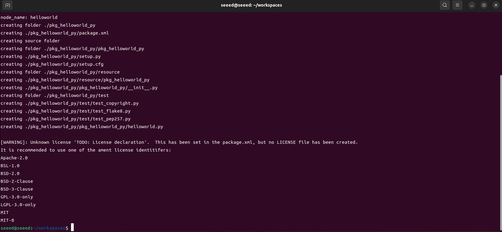

| Node Name | Evaluation |
| --- | --- |
| Camera driver | Excellent. |
| path planner | Excellent. |
| Node1 | Not recommended (no descriptive) |
| Oh, my-node. | Invalid (with hyphenation) |

## 6.2 Hello World Node case


### 6.2.1 Create python kit

Workspace replaces the actual workspace path

```bash
cd workspace/src
ros2 pkg create pkg_helloworld_py --build-type ament_python --dependencies rclpy --node-name helloworld
```

### 6.2.2 Preparation of codes

The above command will be followed by the creation of pkg helloword py, and the creation of a Helloword.py file to write nodes:

Delete the original helloworld.py code and write the following code:

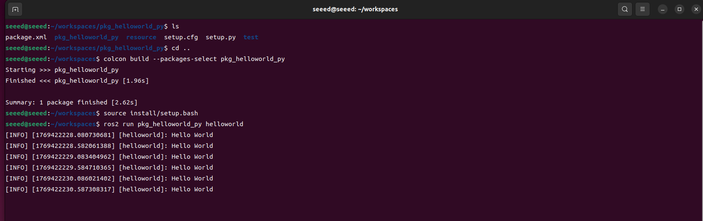

```bash
import rclpy  # ROS 2 Python client library
from rclpy.node import Node  # ROS 2 node class
import time

"""
Create a HelloWorld node. It prints the "hello world" log during initialization.
"""
class HelloWorldNode(Node):
  def __init__(self, name):
  super().__init__(name)  # initialize the ROS 2 node base class
  while rclpy.ok():  # Check whether ROS 2 is running normally
  self.get_logger().info("Hello World")  # ROS 2 log output
  time.sleep(0.5)  # Sleep to control the loop interval

def main(args=None):  # main entry function of the ROS 2 node
  rclpy.init(args=args)  # initialize the ROS 2 Python interface
  node = HelloWorldNode("helloworld")  # create and initialize the ROS 2 node object
  rclpy.spin(node)  # keep spinning until ROS 2 exits
  node.destroy_node()  # destroy the node object
  rclpy.shutdown()  # Shut down the ROS 2 Python client library
```

Back to Task Cataloguing Node

```bash
colcon build --packages-select pkg_helloworld_py
# Refresh the environment variables in the workspace
source install/setup.bash
```

Run Node

```bash
ros2 run pkg_helloworld_py helloworld
```

### 6.3 Next steps

After learning, you can:

1.07 Topic Communications - In-depth learning topic communications

2.08 Service communications - learning service communications

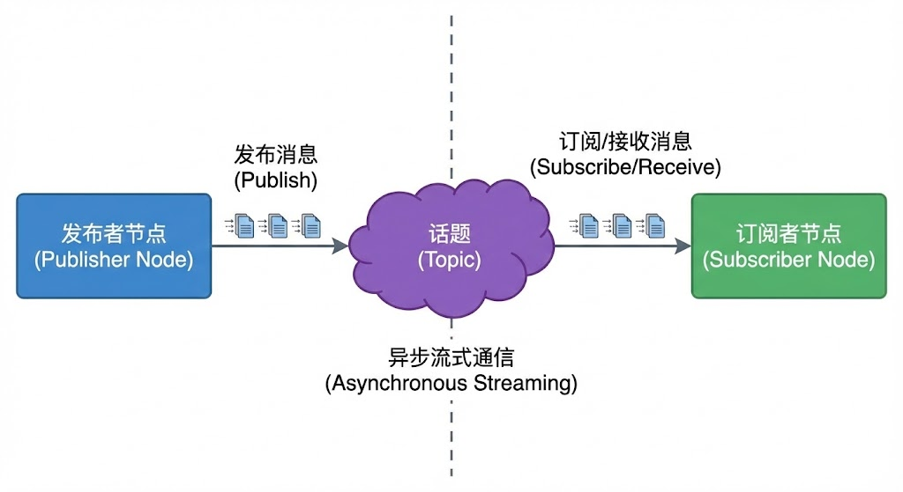

### 07 Topic Communication

## 07 Topical Newsletter (Topics)

### 7.1 Summary of Topical Communications

### 7.1.1 What's a topic communication?

Topic (Topic) is the mechanism for insular communication between ROS 2 nodes, using the publishing/subscription (Pub/Sub) mode. The issuer node issues news to the topic, and the subscriber node receives information from the topic, and neither needs to know the other.

### 7.1.2 Topical communications characteristics

| Characteristics | Description | Apply scene |
| --- | --- | --- |
| Fabulous communications | Sender does not wait for the subscriber to respond | Sensor data stream |
| Multiple pairs. | Multiple publishers and subscribers | Data broadcasting |
| Weak Concord | Organisation | Modular design |
| Stream Transfer | Ongoing data flows | Continuous monitoring |

### 7.1.3 Topical naming rules

| Rule | Annotations |
| --- | --- |
| Must start (global namespace) or relative name |  |
| Use lowercase letters, numbers and underlineds |  |
| Use / Separating Namespace Levels |  |
| Avoid retaining names |  |

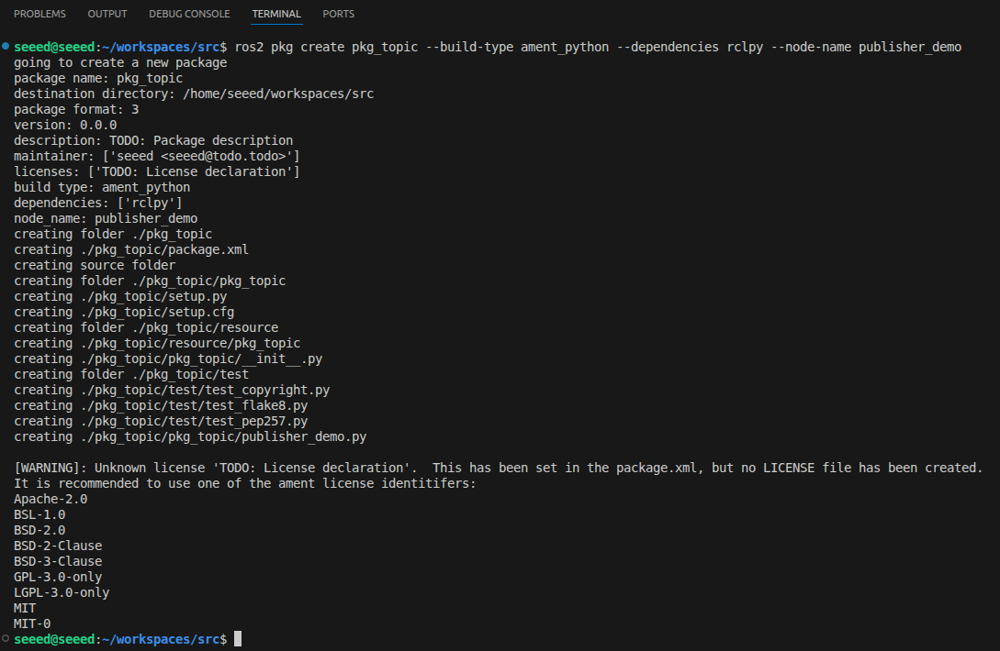

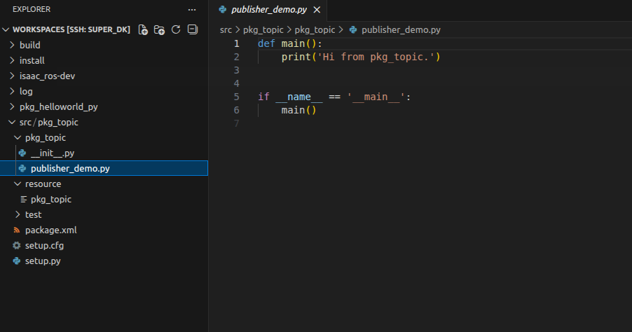

Example of name:

| Subject Name | Evaluation |
| --- | --- |
| /cmd_vel | Standards, recommended |
| /camera/image_raw | Level clear. Recommended. |
| /sensor/front_camera/image | Namespace, recommend. |
| /MyTopic | Not recommended (capable) |
| andd vel | Relative name (node naming space added) |

## 7.2 Communication Cases

### 7.2.1 New functionality package

```bash
cd ~/workspaces/src
ros2 pkg create pkg_topic --build-type ament_python --dependencies rclpy --node-name publisher_demo
```

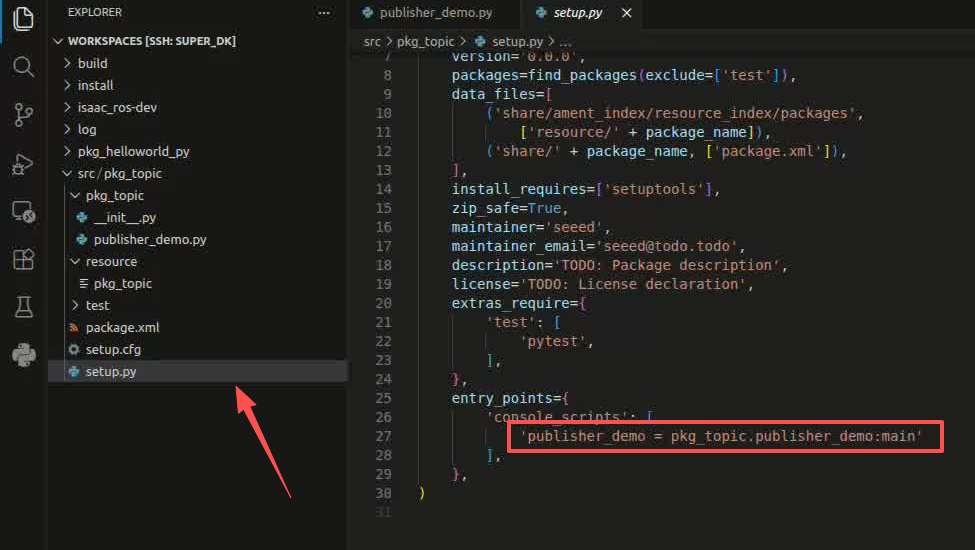

Upon completion of the above command, a pkg topic kit will be created, and a publisher demo node will be created and the relevant profile will be configured

### 7.2.2 The author achieves

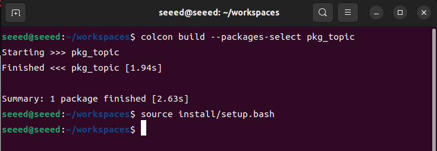

Remove the code from the publicsher demo.py and copy it as follows:

```bash
# Import the `rclpy` library
import rclpy
from rclpy.node import Node
# Import the `String` message type
from std_msgs.msg import String
# Create a `Topic_Pub` subclass of `Node` and pass the node name as an argument
class Topic_Pub(Node):
  def __init__(self,name):
  super().__init__(name)
  # Create a publisher with `create_publisher()`. The arguments are:
  # Topic data type, topic name, and message queue depth
  self.pub = self.create_publisher(String,"/topic_demo",1)
  # Create a timer that triggers the callback every 1 second. The arguments are:
  # Callback interval and callback function
  self.timer = self.create_timer(1,self.pub_msg)
  # Define the callback function
  def pub_msg(self):
  msg = String()  #Create a `String` message variable named `msg`
  msg.data = "Hi,I send a message." #Assign a value to `msg.data`
  self.pub.publish(msg) #Publish the topic data

# Main function
def main():
  rclpy.init() #Initialize
  pub_demo = Topic_Pub("publisher_node") #Create a `Topic_Pub` object and pass in the node name
  rclpy.spin(pub_demo)  #Call `rclpy.spin()` and pass the `Topic_Pub` object created above
  pub_demo.destroy_node()  #destroy the node object
  rclpy.shutdown()  #Shut down the ROS 2 Python client library
```

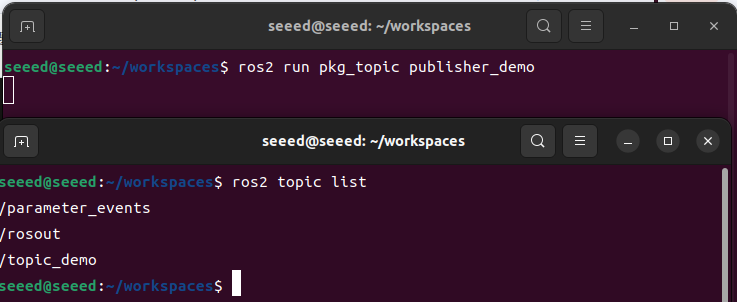

### 7.2.3 Edit Profiles

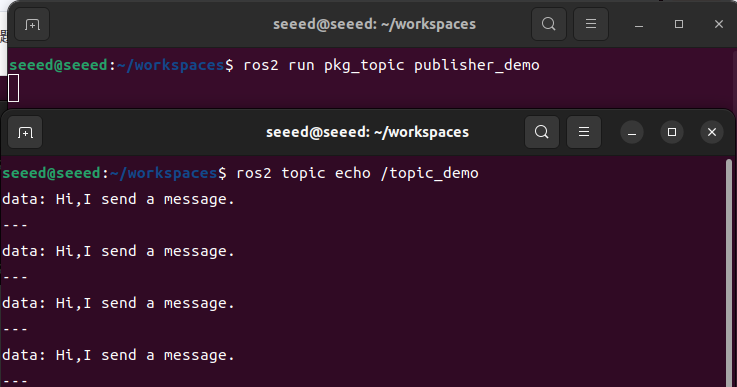

### 7.2.4 Compiler functional kit

```bash
cd ~/workspace
# Build
colcon build --packages-select pkg_topic
# Refresh environment variables
source install/setup.bash
```

### 7.2.5 Run release nodes

```bash
ros2 run pkg_topic publisher_demo
# Open another terminal and use the `ros2 topic` tool to inspect the data
ros2 topic list
```

```bash
# Use `ros2 topic echo` to print the data
ros2 topic echo /topic_demo
```

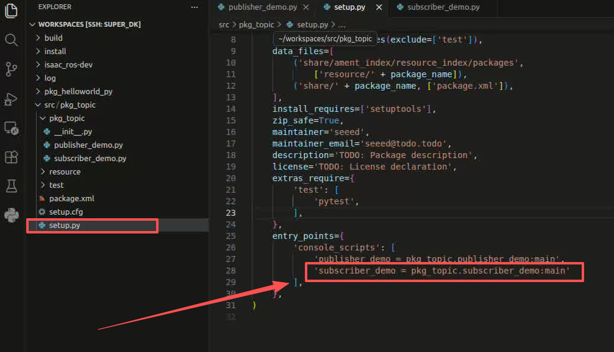

The "Hi, I send a message."

### 7.2.6 Create a subscriber

New file subscriber demo.py in the publicsher demo.py directory. Paste the following codes to subscriber demo.py files:

```bash
#Import related libraries
import rclpy
from rclpy.node import Node
from std_msgs.msg import String

class Topic_Sub(Node):
  def __init__(self,name):
  super().__init__(name)
  #Create a subscriber with `create_subscription()`. The arguments are the topic data type, topic name, callback function, and queue depth
  self.sub = self.create_subscription(String,"/topic_demo",self.sub_callback,1)
  #Callback function: print the received message
  def sub_callback(self,msg):
  # print(msg.data,flush=True)
  self.get_logger().info(msg.data)


def main():
  rclpy.init() #initialize the ROS 2 Python interface
  sub_demo = Topic_Sub("subscriber_node") # Create and initialize the object
  rclpy.spin(sub_demo)
  sub_demo.destroy_node()  #destroy the node object
  rclpy.shutdown()  #Shut down the ROS 2 Python client library
```

### 7.2.7 Edit Profiles

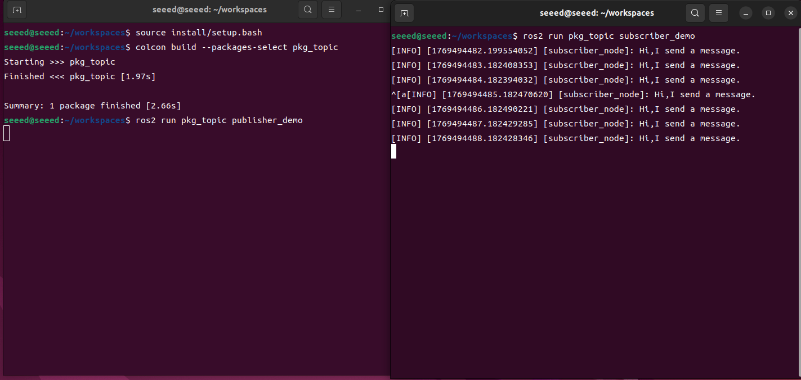

### 7.2.8 Compiler functional kit

```bash
cd ~/workspace
colcon build --packages-select pkg_topic
# Refresh environment variables
source install/setup.bash
```

### 7.2.9 Operating nodes

Open two terminals to run two nodes each:

```bash
# Start the publisher node
ros2 run pkg_topic publisher_demo
# Start the subscriber node
ros2 run pkg_topic subscriber_demo
```

As shown in the figure above, the terminal where the subscriber is run will print the information of /topic_demo issued by the publisher.

### 7.3 Next steps

After learning how to communicate, you can:

1.08 Service Communications - Learning Services Communications

2.09 Action Communications - Learning Action Communications

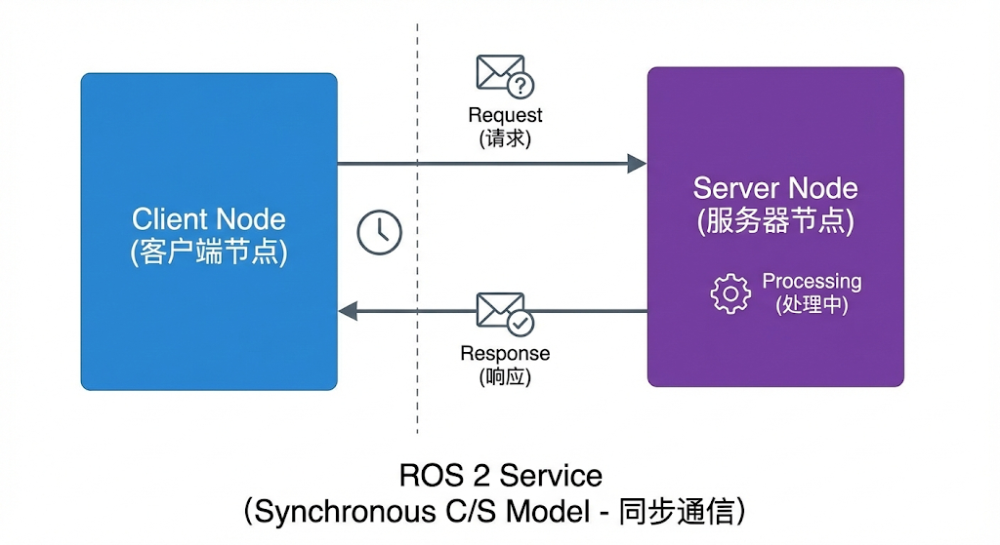

### 08 Service communications

## 08 Service Communications (Services)

### 8.1 Overview of service communications

### 8.1.1 What is service communications

Service (Service) is the mechanism for synchronized communication between nodes in ROS 2, using the client/server (Clint/Server) model. Client sends the request, the service handles and returns the response.

### 8.1.2 Services vs topics

| Feature | Services | Topics |
| --- | --- | --- |
| Communication mode | Sync (request-response) | Step (pull-subscription) |
| Connection | One on one. | Multiple pairs. |
| Apply scene | Short Operations Query | Ongoing data flows |
| Block | Client blocking waiting. | No blocking. |
| Return value | We must return the response. | No response |

### 8.1.3 Definition of service type

Service type is defined using .srv files, which contain both requests and responses:

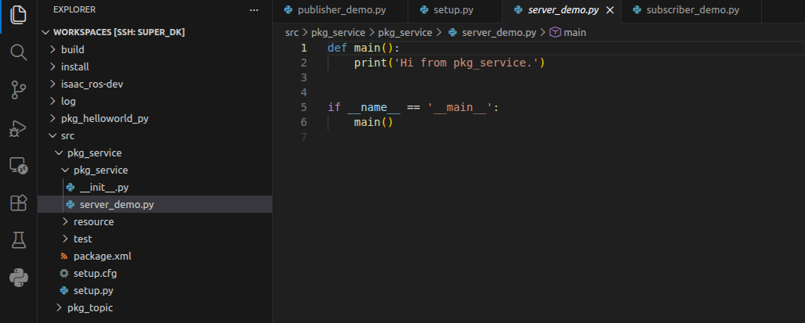

> Plain Text
> # Data type definition
> # File: example interfaces/srv/AddTwoInts.srv
>
> # Request part ( -- above)
> Int64a
> Int64b
>
> # Response part ( -- below)
> In 64 sum

## 8.2 Examples of service communications

### 8.2.1 New functionality package

Under ~/workspace/src directory

```bash
ros2 pkg create pkg_service --build-type ament_python --dependencies rclpy --node-name server_demo
```

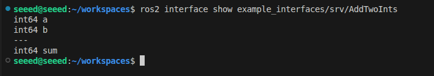

### 8.2.2 Create a service end

Amend the server demo.py code to read as follows:

```bash
# Import related library files
import rclpy
from rclpy.node import Node
from example_interfaces.srv import AddTwoInts

class Service_Server(Node):
  def __init__(self,name):
  super().__init__(name)
  # Create a service server with `create_service()`. The arguments are:
  # Service data type, service name, and service callback function
  self.srv = self.create_service(AddTwoInts, '/add_two_ints', self.Add2Ints_callback)
  # This service callback adds two integers and returns the result
  def Add2Ints_callback(self,request,response):
  response.sum = request.a + request.b
  print("response.sum = ",response.sum)
  return response
def main():
  rclpy.init()
  server_demo = Service_Server("publisher_node")
  rclpy.spin(server_demo)
  server_demo.destroy_node()  # destroy the node object
  rclpy.shutdown()  # Shut down the ROS 2 Python client library
```

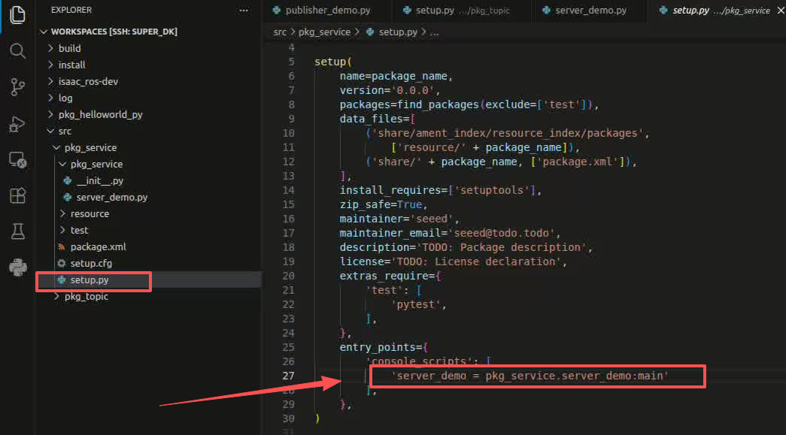

Focus on the service callback function, Add2Ints callback, where the parameters that need to be carried in addition to self are requests and response, requests are parameters of service need, and resonese is the feedback of service. Request.a and request.b are part of the request, and respone.sum is part of the response.

You can view with the following commands:

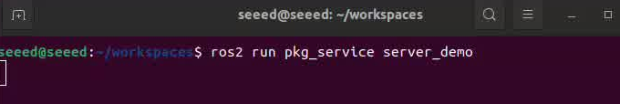

```bash
ros2 interface show example_interfaces/srv/AddTwoInts
```

- Split this type of data into two parts, with the top representing request and the bottom representing response. And then the variables in their respective fields, such as int64 a, int64 b, are all re-transmitted parameters that specify the value of a, b. Similarly, the results of the feedback would need to specify the value of sum.

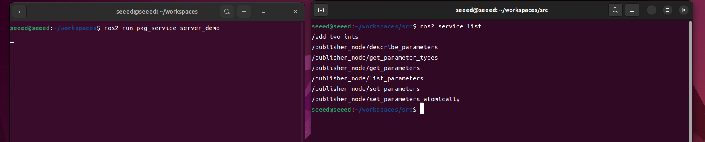

### 8.2.3 Edit Profiles

Open setup.py, add in the list of console scripts

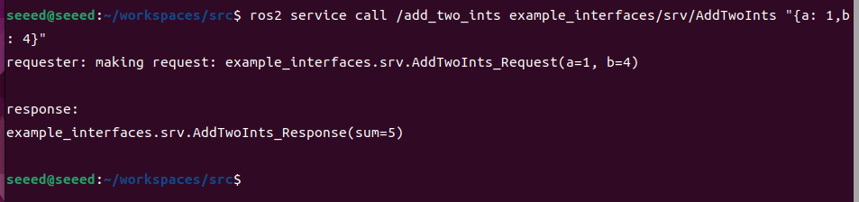

```bash
'server_demo = pkg_service.server_demo:main',
```

### 8.2.4 Compiler functional kit

```bash
colcon build --packages-select pkg_service
# Refresh environment variables
source install/setup.bash
# Run the node
ros2 run pkg_service server_demo
```

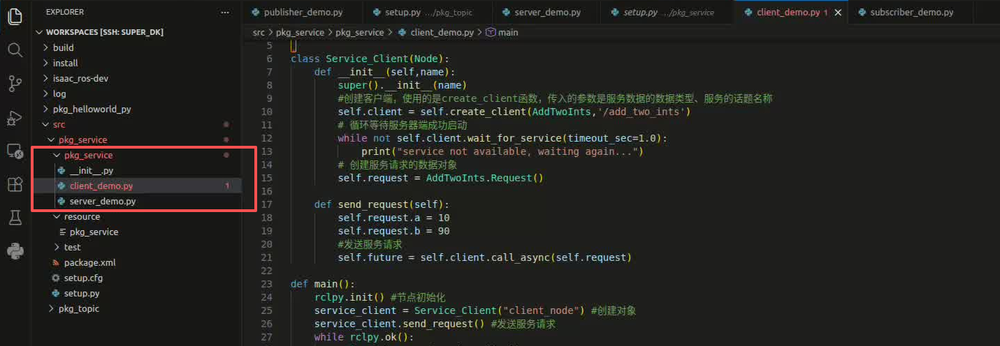

After running, there is no feedback data because the service is not called, and the service can be called by command line, first asking for current services and then another terminal input:

```bash
ros2 service list
```

/add_two_ints is the service that we need to call by the following command, terminal input:

```bash
ros2 service call /add_two_ints example_interfaces/srv/AddTwoInts "{a: 1,b: 4}"
```

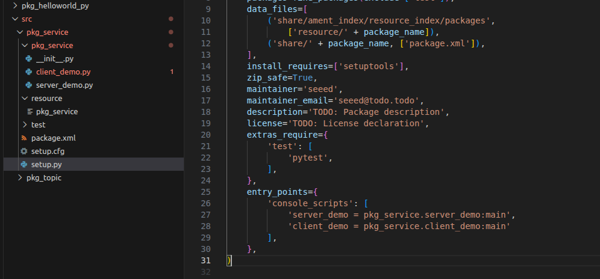

Here we give the value of a value to one, and the value of a value to four, that is, call services to calculate the sum of one and four. As can be seen from the figure above, following the transfer of the service, the result of the feedback was 5. The end of the running service also printed the value of the feedback.

### 8.2.5 Create Client

Create a new file under server demo.py

Write the following code to the client demo.py:

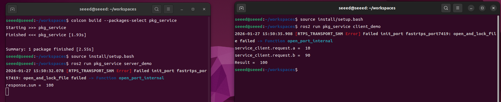

```bash
#Import related libraries
import rclpy
from rclpy.node import Node
from example_interfaces.srv import AddTwoInts

class Service_Client(Node):
  def __init__(self,name):
  super().__init__(name)
  # Create a client with `create_client()`. The arguments are the service data type and service topic name
  self.client = self.create_client(AddTwoInts,'/add_two_ints')
  # Wait in a loop until the service server starts successfully
  while not self.client.wait_for_service(timeout_sec=1.0):
  print("service not available, waiting again...")
  # Create the service request data object
  self.request = AddTwoInts.Request()

  def send_request(self):
  self.request.a = 10
  self.request.b = 90
  #send the service request
  self.future = self.client.call_async(self.request)

def main():
  rclpy.init() # Initialize the node
  service_client = Service_Client("client_node") #Create the object
  service_client.send_request() #send the service request
  while rclpy.ok():
  rclpy.spin_once(service_client)
  #Check whether the data processing is complete
  if service_client.future.done():
  try:
  #Get the service response and print it
  response = service_client.future.result()
  print("service_client.request.a = ",service_client.request.a)
  print("service_client.request.b = ",service_client.request.b)
  print("Result = ",response.sum)
  except Exception as e:
  service_client.get_logger().info('Service call failed %r' % (e,))
  break
  service_client.destroy_node()
  rclpy.shutdown()
```

### 8.2.6 Edit Profiles

Open setup.py, add in the list of console scripts

```bash
'client_demo = pkg_service.client_demo:main'
```

### 8.2.7 Compiler functional kit

```bash
cd ~/workspace
colcon build --packages-select pkg_service
# Refresh environment variables
source install/setup.bash
# Start the service server node
ros2 run pkg_service server_demo
```

Open another terminal running:

```bash
# Refresh environment variables
source install/setup.bash
# Start the client node
ros2 run pkg_service client_demo
```

Client supply a = 10, b = 90, service-end reconciliation, result 100, end of both.

## 8.3 Next steps

You can:

1.09 Action Communications - Learning Action Communications (long mission)

2. 10 TF2 Coordinate Transformation - Create Custom Service Type

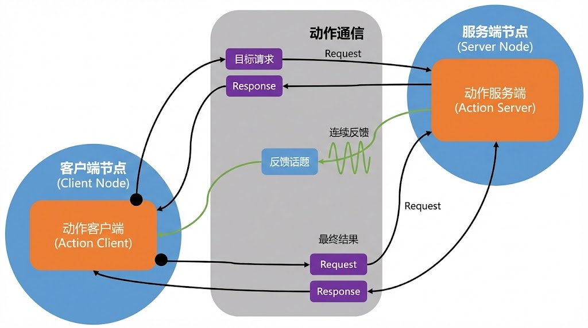

### 09 Action Communications

## 09 Action Communications (Actions)

### 9.1 Summary of action communications

### 9.1.1 What is motion communication?

Action is the communication mechanism used in ROS 2 to handle long assignments. Similar to services, actions are a client-server mode, but support:

- Real-time feedback during mandate implementation

- Client can cancel an active assignment.

- Fits to handle operations that can take seconds to minutes.

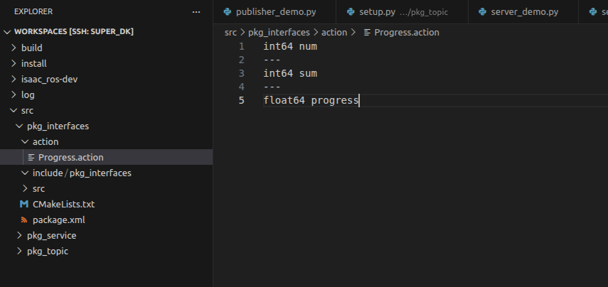

### 9.1.2 Action vs services

| Feature | Service | Action |
| --- | --- | --- |
| Length of application | Short operation (ms-s) | Long missions (seconds-minutes) |
| Feedback | No real time feedback | Send feedback on an ongoing basis |
| Cancel | Not supported | But cancel. |
| Block | Client Block | Disable |
| Apply scene | Query, Simple Operations | Navigation, Capture |

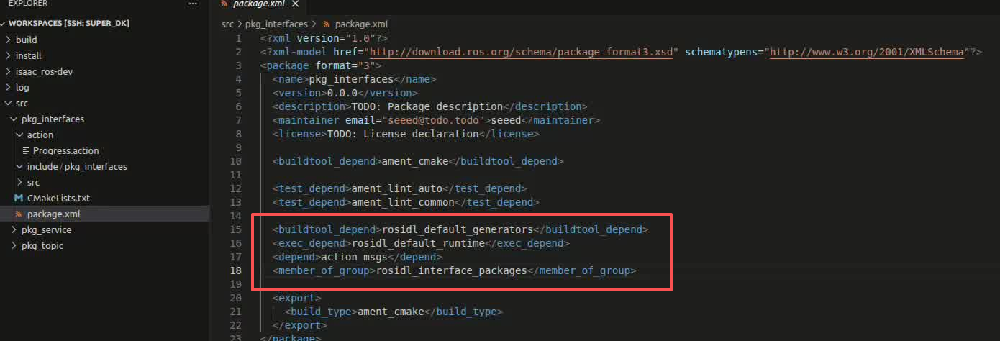

## 9.2 Action communications cases

The action client submits one integer data N, the action service receives the requested data and adds all integers between one and one N, returns the final result to the action client, and calculates the current calculation progress and feeds back to the action client each time you add.

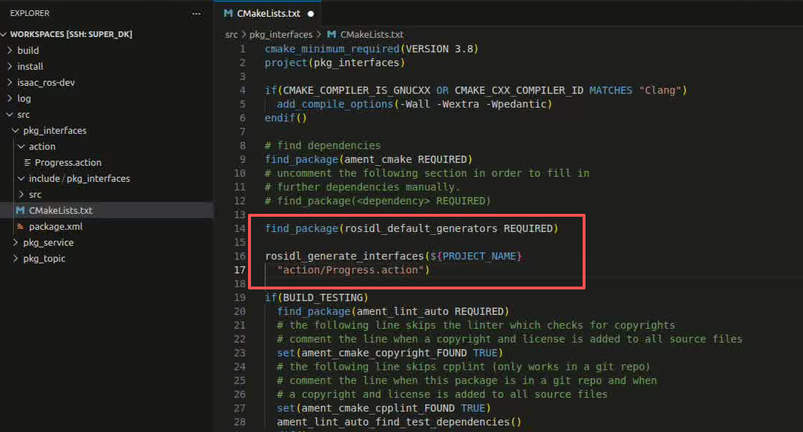

### 9.2.1 New functional kit

New pkg interfaces in ~/workspace/src directory

```bash
ros2 pkg create --build-type ament_cmake pkg_interfaces
```

Then create an action folder under the pkg interfaces kit and create a new Progress.action file in the action folder, which reads as follows:

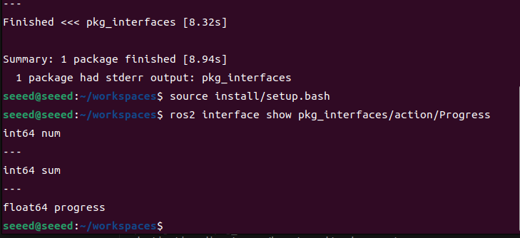

```bash
int64 num
---
int64 sum
---
float64 progress
```

A number of dependent packages need to be added to the package.xml as follows:

```bash
<buildtool_depend>rosidl_default_generators</buildtool_depend>
<exec_depend>rosidl_default_runtime</exec_depend>
<depend>action_msgs</depend>
<member_of_group>rosidl_interface_packages</member_of_group>
```

4. Add the following configuration to CMakeLists.txt:

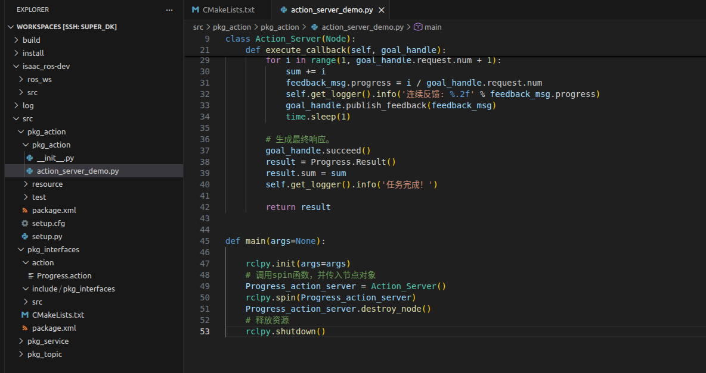

```bash
find_package(rosidl_default_generators REQUIRED)

rosidl_generate_interfaces(${PROJECT_NAME}
  "action/Progress.action")
```

5. Compile functional packages:

```bash
cd ~/workspace
colcon build --packages-select pkg_interfaces
```

6. Upon completion of the compilation, the C++ and Python files corresponding to the Progress.action files will be generated under the install directory under the workspace. We can also enter the workspace below the terminal to check the definition of the document and whether the translation is normal by means of the following command:

```bash
# source install/setup.bash
ros2 interface show pkg_interfaces/action/Progress
```

Normally, the terminal will output content consistent with the Progress.action file

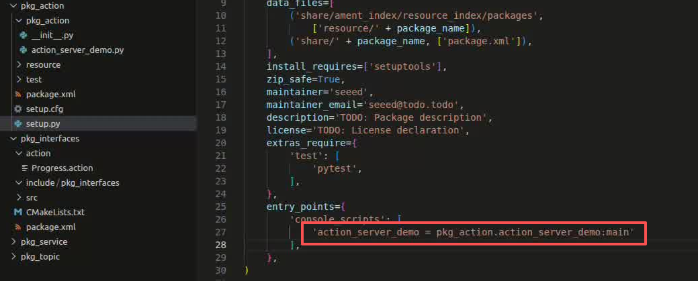

3.2 Creation of action communication functional kit

New pkg action kit in ~/workspace/src directory

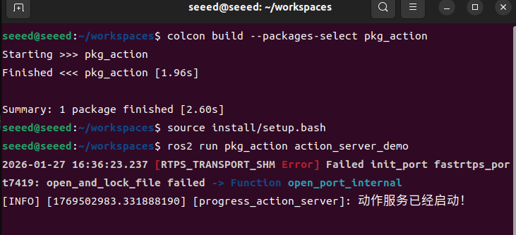

```bash
ros2 pkg create pkg_action --build-type ament_python --dependencies rclpy pkg_interfaces --node-name action_server_demo
```

Following the above command, a pkg action kit will be created, and an action server demo node will be created and the relevant profile will be configured

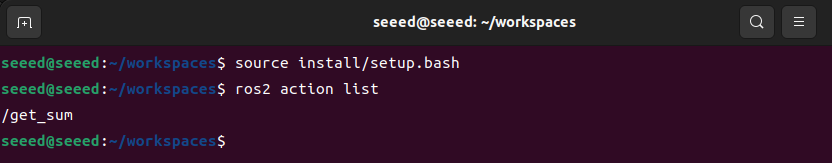

## 4. Service-end realization

### 4.1 Create a service provider

Edit action server demo.py to perform service-end functionality by adding the following code:

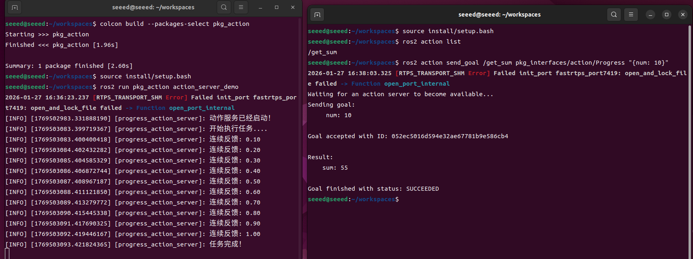

```bash
import time
import rclpy
from rclpy.action import ActionServer
from rclpy.node import Node

from pkg_interfaces.action import Progress

class Action_Server(Node):
  def __init__(self):
  super().__init__('progress_action_server')
  # Create the action server
  self._action_server = ActionServer(
  self,
  Progress,
  'get_sum',
  self.execute_callback)
  self.get_logger().info('The action server has started!')

  def execute_callback(self, goal_handle):
  self.get_logger().info('Starting task execution...')

  # Generate continuous feedback.
  feedback_msg = Progress.Feedback()

  total = 0
  for i in range(1, goal_handle.request.num + 1):
  total += i
  feedback_msg.progress = i / goal_handle.request.num
  self.get_logger().info('Continuous feedback: %.2f' % feedback_msg.progress)
  goal_handle.publish_feedback(feedback_msg)
  time.sleep(1)

  # Generate the final response.
  goal_handle.succeed()
  result = Progress.Result()
  result.sum = total
  self.get_logger().info('Task completed!')

  return result

def main(args=None):

  rclpy.init(args=args)
  # Call `spin()` and pass in the node object
  Progress_action_server = Action_Server()
  rclpy.spin(Progress_action_server)
  Progress_action_server.destroy_node()
  # Release resources
  rclpy.shutdown()
```

### 4.2 Edit Profiles

Open setup.py, add in the list of console scripts

```bash
'action_server_demo = pkg_action.action_server_demo:main',
```

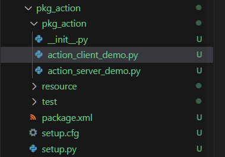

### 4.3 Compiler functional kit

```bash
cd ~/workspace
colcon build --packages-select pkg_action
# Refresh environment variables
source install/setup.bash
# Run the action server node
ros2 run pkg_action action_server_demo
```

Another terminal input:

```bash
ros2 action list
```

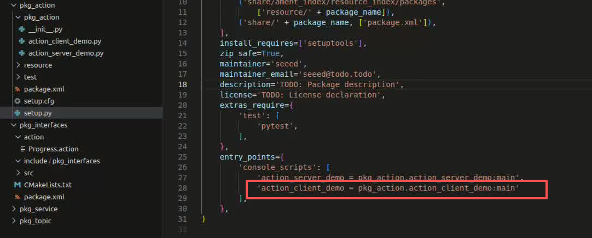

/get_sum is the action that we need to call through the following commands, terminal input:

```bash
ros2 action send_goal /get_sum pkg_interfaces/action/Progress "{num: 10}"
```

Here we ask for the sum of 1 to 10:

The above figure shows the service end and the client below. You can see how the service side has been giving feedback on the progress of the 1 to 10 and the calculation process, and finally shows that the task is completed, that the client has received feedback and that the client has received feedback for 55

## 5. Client achieved

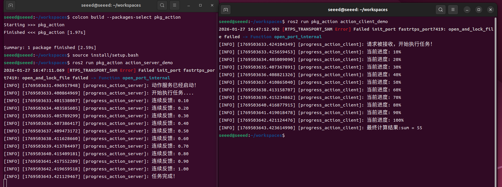

### 5.1 Create Client
