# ROS2 Advanced Interfaces and Middleware

## 10 TF2 Coordinate Transformation

### 10 TF2 Coordinate Transformation (TF2 Transform)

### 10.1 TF2 Overview

### 10.1.1 What is TF2

TF2 (Transform 2) is the library used in ROS 2 to manage coordinate changes. It tracks relationships between multiple coordinate systems and allows developers to convert data (e.g. point, vector, attitude) between different coordinate systems.

> Plain Text
> Example of TF2 coordinates tree:
>
> Map (World Coordinate System)
> Zenium
> | (2D floor transformation)
> Zenium
> odom (mileometer coordinates)
> Zenium
> | (Z-axis horizontal shift)
> Zenium
> Base link
> Zenium
> {\cHFFFFFF}{\cH00FFFF} {\cHFFFFFF}{\cH00FFFF} {\cHFFFFFF}{\cH00FFFF} {\cHFFFFFF}{\cH00FFFF} {\cHFFFFFF}{\cH00FFFF} {\cHFFFFFF}{\cH00FFFF} {\cHFFFFFF}{\cH00FF00} {\cHFFFFFF}{\cH00FF00}
> I'm sorry.
> Camera laser base footprint
> ( camera) (laser) ( chassis)

### 10.1.2 Use of TF2

| Apply | Annotations |
| --- | --- |
| Sensor Integration | Convert data from different sensors to the unified coordinate system |
| Navigation | Convert the map coordinates system to robotic coordinates. |
| Mechanical arm | Calculates the attitude of the terminal implementer over the base |
| Visualise | Show the robot state correctly in RViz2 |

### 10.1.3 Designation of coordinates

| Name | Purpose |
| --- | --- |
| Map | Global/world coordinates, fixed and unchanged |
| I don't know. | The mileage coordinate system for positioning. |
| base link | The robot base coordinates. |
| base footprint | The robot's chassis project to the ground. |
| Camera link | Camera Coordinate System |
| Laser link | Laser Radar Coordinate System |

### 23, ROS2 TF2 coordinates converted.

### Introduction to TF2

Coordinated systems are a very familiar concept and an important foundation in robotics, and there will be many coordination systems in a complete robotic system, and how should the location of these coordinates be managed? ROS provided us with a co-ordinated decorator: TF2

TF System References: tf: The transport library

### 2. Coordinate systems in robots

Coordinates are equally important in mobile robotic systems, such as the central point of a mobile robot is Base Link, the position of the radar is called radar coordinate islaser link, where the robot moves, and the cubic meter accumulates, which is called odom, which in turn has cumulative error and drift, and the absolute location is called map coordinates Map Map.

The relationship between one layer of coordinates is complex and some are relatively fixed and some are constantly changing, and seemingly simple coordinates become complex within space, and a good system of coordinate system is particularly important.

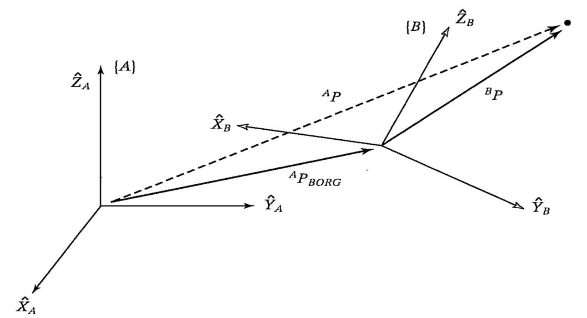

With regard to the basic theory of the shift in the coordinate system, there is an explanation in each of the robotics teaching materials, which can be broken down into a smoothing and rotational part, described through a four-by-four matrix, drawing the coordinate system in space, and the alternation between the two, which is in fact a mathematical description of the vector.

The bottom principle of the TF function in ROS is that these mathematical variations are encapsulated, and detailed theoretical knowledge is available to all of you in the curriculum of robotics, and we mainly explain how TF coordinate management systems are used.

### 3 TF command line operations

Let's start with the example of two little turtles and learn about a calculus of robots based on coordinates. In order to facilitate the demonstration, this section of the course would be better suited to operate on a virtual machine.

### 3.1. Installation of tools

This example requires that we first install functional packages, tf turtle simulators, tf tree visualization tools.

```bash
sudo apt install ros-${ROS_DISTRO}-turtle-tf2-py ros-humble-tf2-tools
sudo pip3 install transforms3d
sudo apt install ros-${ROS_DISTRO}-rqt-tf-tree
```

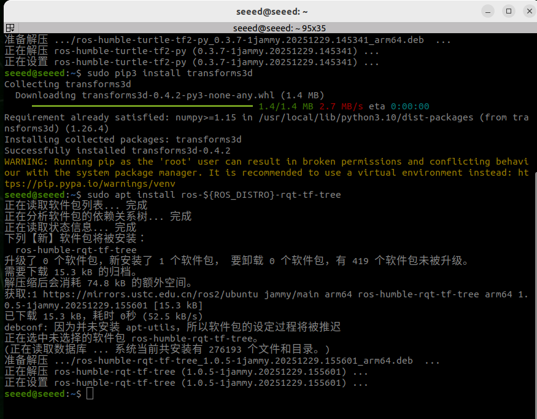

### 3.2. Start

Then we can start with a lanch file, and then we can control one of the little turtles, and the other will follow the movement automatically. Open two terminals to run the following commands:

```bash
# ros2 launch turtle_tf2_py turtle_tf2_demo.launch.py
ros2 run turtlesim turtle_teleop_key
```

When we control a turtle movement, another turtle follows it.

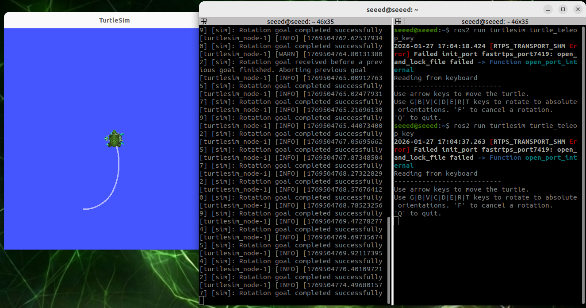

### 3.3. View the TF tree

```bash
ros2 run rqt_tf_tree rqt_tf_tree
```

TF transform tree can be seen in rqt window

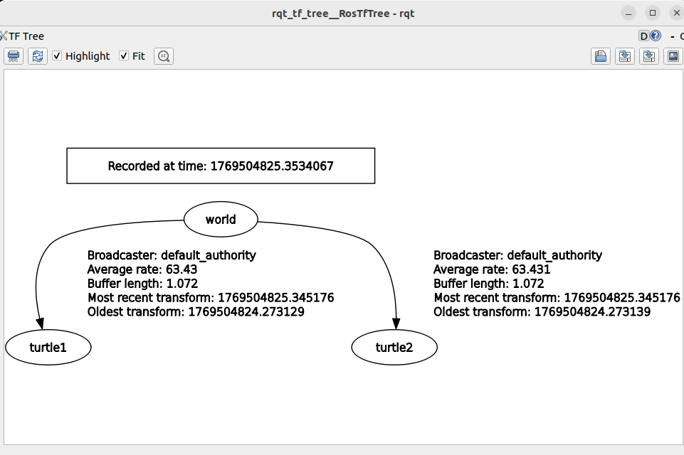

### 3.4. Query coordinates to change information

If we want to know the specific relationship between one or two coordinates, we can see it through this tool tf2 echo:

```bash
ros2 run tf2_ros tf2_echo turtle2 turtle1
```

Once it's running successfully, the end will circulate the transformation of the coordinates system.

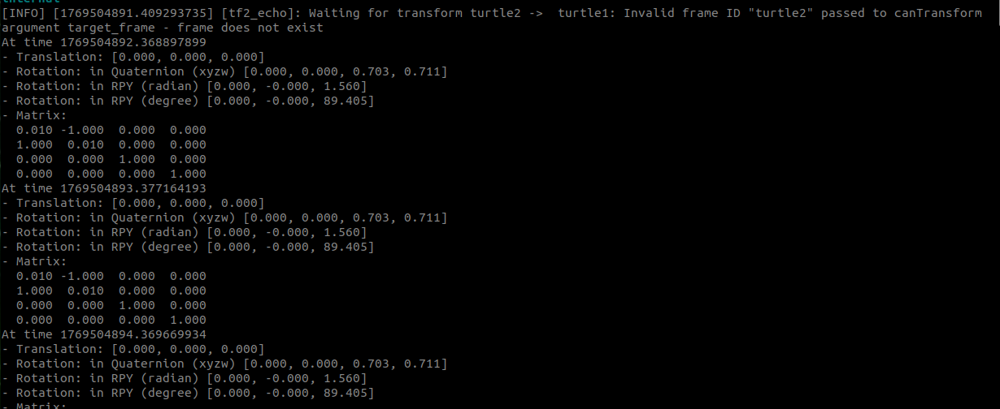

### 3.5. Visualization of coordinates

Run rviz2, then add TF display plugin

```bash
rviz2
```

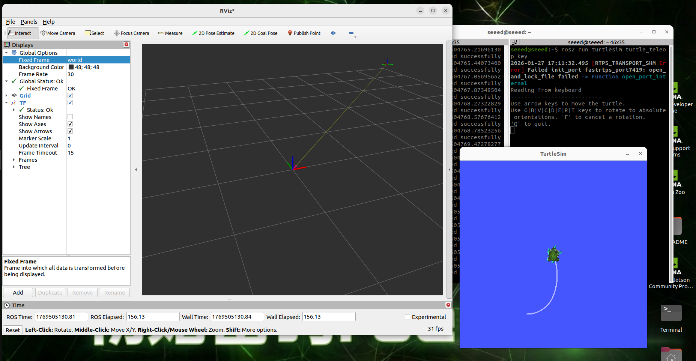

The reference coordinates in rivz2 are: world, add TF displays, and if the turtle moves, the axis in Rviz will start to move, so is it more intuitive?

## 4. Static coordinates conversion

The so-called static coordinate conversion means that the relative position between the two coordinates is fixed. For example, the position between radar and base link is fixed.

Example: For demonstration purposes, this section of the course is better suited to operate on a virtual machine

### 4.1. Distribution of A to B positions

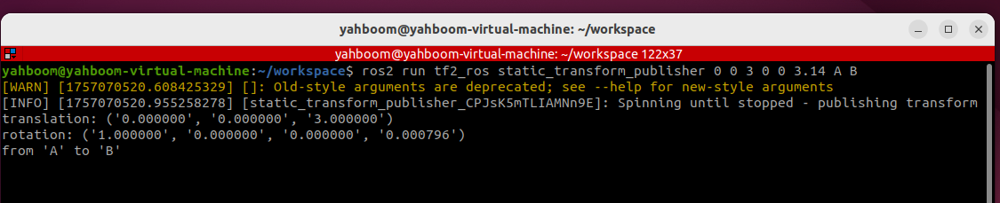

```bash
ros2 run tf2_ros static_transform_publisher 0 0 3 0 0 3.14 A B
```

### 4.2. Interception/access TF relations

```bash
ros2 run tf2_ros tf2_echo A B
```

### 4.3, rivz visualization

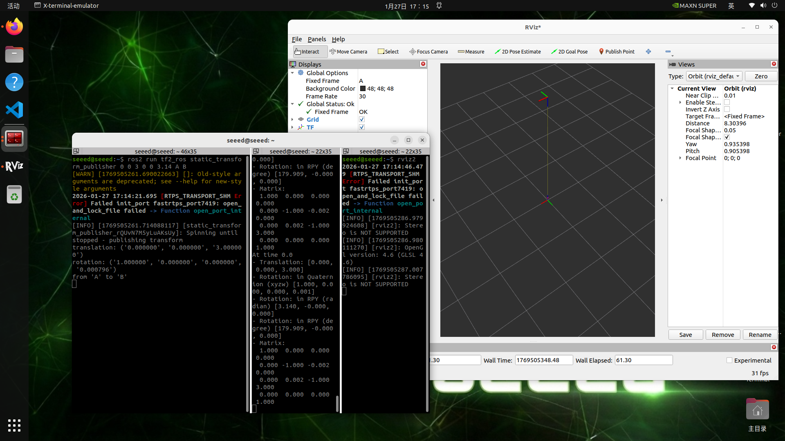

Run rviz2, then add TF display plugin

```bash
rviz2
```

## 5. Presentation of cases

The TF relationship that the system provides to turtles was explained in the last session, and we're doing it ourselves.

Course content:

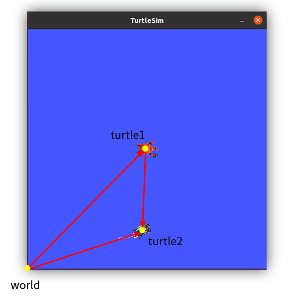

Programmation of small turtles to follow cases

Mastery of programming for dynamic broadcasters

Control the programming of the transfer of coordinates between the listening coordinates

Controlled conversion of physical volume (range, angle) to speed control through PID control

Progress:

Understand the TF system's inter-temporal dimension transformation coordinates function

## Analysis of the principle of realization of sea turtles following cases

Among the two turtle emulators, we can define three coordinates, such as the global reference systems for the emulator, known as the world, the turtle 1 and the turtle 2 coordinates, at the centre of the two turtles, so that the relative position of the turtle 1 and the world coordinates represents the position of the turtle 1 and the turtle 2 is the same.

In order to move turtle two to turtle one, we'll make a connection between the two, add an arrow. How about that? We say the coordinates are transposed by vector, so in this follow-up routine, it's a good solution with TF.

The length of the vector means distance, direction means angle, distance and angle, so that we can calculate speed by setting a single time, and then the cover and release of the speed topic, and turtles can move.

So the core of this routine is the calculation of the vector through the coordinate system, and the two turtles will continue to move, and this vector will have to be calculated on a given cycle, which will require the use of TF's live broadcast and listening.

## 7. New functionality package

Create a new functionality to store our files in ~/workspace/src directory

```bash
ros2 pkg create pkg_tf --build-type ament_python --dependencies rclpy --node-name turtle_tf_broadcaster
```

Upon completion of the above-mentioned command, the pkg tf kit will be created, and a node will be created for the turtle tf broadcaster, and the relevant configuration files have been configured to add the following code to the turtle tf broadcaster.py file:

```bash
import math
import rclpy  # ROS 2 Python client library
from rclpy.node import Node  # ROS 2 node class
from geometry_msgs.msg import TransformStamped  # transform message
from tf2_ros import TransformBroadcaster  # TF transform broadcaster
from turtlesim.msg import Pose  # turtlesim pose message

def quaternion_from_euler(roll, pitch, yaw):
  """Return quaternion from Euler angles (roll, pitch, yaw)."""
  cy = math.cos(yaw * 0.5)
  sy = math.sin(yaw * 0.5)
  cp = math.cos(pitch * 0.5)
  sp = math.sin(pitch * 0.5)
  cr = math.cos(roll * 0.5)
  sr = math.sin(roll * 0.5)

  w = cr * cp * cy + sr * sp * sy
  x = sr * cp * cy - cr * sp * sy
  y = cr * sp * cy + sr * cp * sy
  z = cr * cp * sy - sr * sp * cy

  return (x, y, z, w)

class TurtleTFBroadcaster(Node):
  def __init__(self, name):
  super().__init__(name)  # initialize the ROS 2 node base class

  # create a turtle-name parameter (default to 'turtle' if not provided externally)
  self.turtlename = self.declare_parameter('turtlename', 'turtle').value

  self.tf_broadcaster = TransformBroadcaster(self)  # create and initialize a TF transform broadcaster

  self.subscription = self.create_subscription(  # create a subscriber for the turtle pose message
  Pose,
  f'/{self.turtlename}/pose',  # use the turtle name obtained from the parameter
  self.turtle_pose_callback, 1)

  def turtle_pose_callback(self, msg):  # create a callback that converts turtle pose messages into transforms
  transform = TransformStamped()  # create a transform message object

  transform.header.stamp = self.get_clock().now().to_msg()  # set the transform message timestamp
  transform.header.frame_id = 'world'  # set the source frame of the transform
  transform.child_frame_id = self.turtlename  # set the target frame of the transform
  transform.transform.translation.x = msg.x  # set the X, Y, and Z translations of the transform
  transform.transform.translation.y = msg.y
  transform.transform.translation.z = 0.0
  q = quaternion_from_euler(0, 0, msg.theta) # convert Euler angles to a quaternion (roll, pitch, yaw)
  transform.transform.rotation.x = q[0]  # set the X, Y, and Z rotations of the transform (quaternion)
  transform.transform.rotation.y = q[1]
  transform.transform.rotation.z = q[2]
  transform.transform.rotation.w = q[3]

  # Send the transformation
  self.tf_broadcaster.sendTransform(transform)  # broadcast the transform so it updates whenever the turtle pose changes

def main(args=None):
  rclpy.init(args=args)  # initialize the ROS 2 Python interface
  node = TurtleTFBroadcaster("turtle_tf_broadcaster")  # create and initialize the ROS 2 node object
  rclpy.spin(node)  # keep spinning until ROS 2 exits
  node.destroy_node()  # destroy the node object
  rclpy.shutdown()  # Shut down the ROS 2 Python client library
```

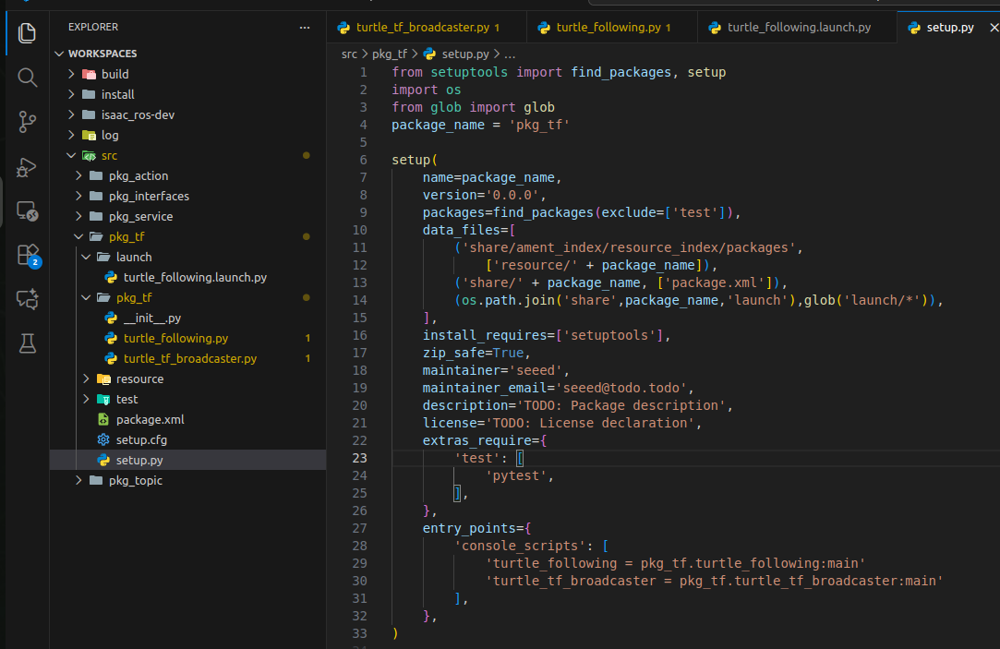

2. Add the following code to the next turtle tf broadcaster.py directory:

```python
import math
import rclpy  # ROS 2 Python client library
from rclpy.node import Node  # ROS 2 node class
import tf_transformations  # TF transform library
from tf2_ros import TransformException  # exception class for TF transform lookup
from tf2_ros.buffer import Buffer  # buffer for storing transform information
from tf2_ros.transform_listener import TransformListener  # listener class for transforms
from geometry_msgs.msg import Twist  # ROS 2 velocity-control message
from turtlesim.srv import Spawn  # service interface for spawning turtles
class TurtleFollowing(Node):

  def init(self, name):
  super().init(name)  # initialize the ROS 2 node base class

  self.declare_parameter('source_frame', 'turtle1')  # create a source-frame parameter
  self.source_frame = self.get_parameter(  # use the externally provided parameter value when available, otherwise use the default
  'source_frame').get_parameter_value().string_value

  self.tf_buffer = Buffer()  # create a buffer that stores transform information
  self.tf_listener = TransformListener(self.tf_buffer, self)  # create a transform listener

  self.spawner = self.create_client(Spawn, 'spawn')  # create a client that requests turtle spawning
  self.turtle_spawning_service_ready = False  # flag indicating whether the turtle-spawn request has been sent
  self.turtle_spawned = False  # flag indicating whether the turtle was spawned successfully

  self.publisher = self.create_publisher(Twist, 'turtle2/cmd_vel', 1) # create the velocity topic for the follower turtle

  self.timer = self.create_timer(1.0, self.on_timer)  # create a periodic timer to control the follower turtle motion

  def on_timer(self):
  from_frame_rel = self.source_frame  # source frame
  to_frame_rel  = 'turtle2'  # target frame

  if self.turtle_spawning_service_ready:  # if the turtle-spawn service has already been requested
  if self.turtle_spawned:  # if the follower turtle has already been spawned
  try:
  now = rclpy.time.Time()  # get the current ROS time
  trans = self.tf_buffer.lookup_transform(  # look up the transform from the source frame to the target frame at the current time
  to_frame_rel,
  from_frame_rel,
  now)
  except TransformException as ex:  # if the transform lookup fails, handle the exception
  self.get_logger().info(
  f'Could not transform {to_frame_rel} to {from_frame_rel}: {ex}')
  return

  msg = Twist()  # create a velocity-control message
  scale_rotation_rate = 1.0  # calculate angular velocity from the turtle angle
  msg.angular.z = scale_rotation_rate * math.atan2(
  trans.transform.translation.y,
  trans.transform.translation.x)

  scale_forward_speed = 0.5  # calculate linear velocity from the turtle distance
  msg.linear.x = scale_forward_speed * math.sqrt(
  trans.transform.translation.x ** 2 +
  trans.transform.translation.y ** 2)

  self.publisher.publish(msg)  # publish velocity commands so the turtle follows
  else:  # if the follower turtle has not been spawned yet
  if self.result.done():  # check whether the turtle has been spawned
  self.get_logger().info(
  f'Successfully spawned {self.result.result().name}')
  self.turtle_spawned = True
  else:  # the follower turtle still has not been spawned
  self.get_logger().info('Spawn is not finished')
  else:  # if the turtle-spawn service has not been requested
  if self.spawner.service_is_ready():  # if the turtle-spawn server is ready
  request = Spawn.Request()  # create the request data object
  request.name = 'turtle2'  # set the request data, including turtle name, xy position, and pose
  request.x = float(4)
  request.y = float(2)
  request.theta = float(0)

  self.result = self.spawner.call_async(request)  # send the service request
  self.turtle_spawning_service_ready = True  # set the flag to show the request has been sent
  else:
  self.get_logger().info('Service is not ready')  # message indicating that the turtle-spawn server is not ready yet

def main(args=None):
  rclpy.init(args=args)  # initialize the ROS 2 Python interface
  node = TurtleFollowing("turtle_following")  # create and initialize the ROS 2 node object
  rclpy.spin(node)  # keep spinning until ROS 2 exits
  node.destroy_node()  # destroy the node object
  rclpy.shutdown()  # Shut down the ROS 2 Python client library
```

Create new lanch folders under the pkg tf kit and create new turtle following.launch.py files in the lanch folder, adding the following:

```python
from launch import LaunchDescription
from launch.actions import DeclareLaunchArgument
from launch.substitutions import LaunchConfiguration
from launch_ros.actions import Node

def generate_launch_description():

  return LaunchDescription([
  DeclareLaunchArgument('source_frame', default_value='turtle1', description='Target frame name.'),
  Node(
  package='turtlesim',
  executable='turtlesim_node',
  ),
  Node(
  package='pkg_tf',
  executable='turtle_tf_broadcaster',
  name='broadcaster1',
  parameters=[
  {'turtlename': 'turtle1'}
  ]
  ),
  Node(
  package='pkg_tf',
  executable='turtle_tf_broadcaster',
  name='broadcaster2',
  parameters=[
  {'turtlename': 'turtle2'}
  ]
  ),
  Node(
  package='pkg_tf',
  executable='turtle_following',
  name='listener',
  parameters=[
  {'source_frame': LaunchConfiguration('source_frame')}
  ]
  ),
  ])
```

## 8. Edit Profiles

### 8.1, setup.py configuration

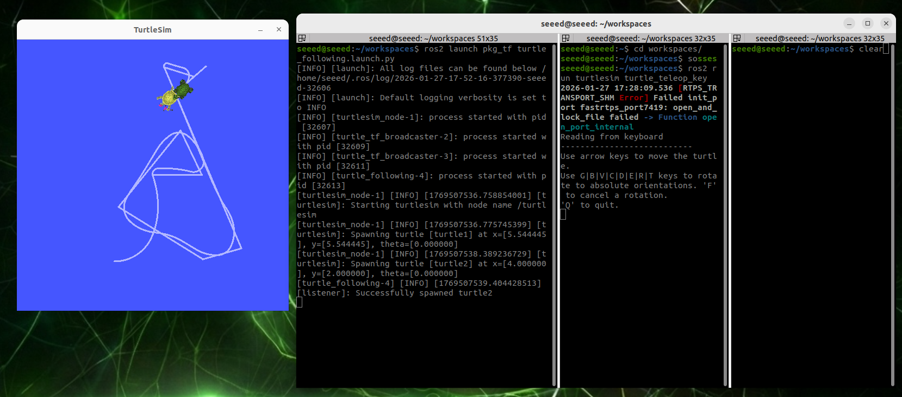

Import Related Library

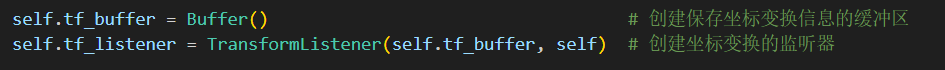

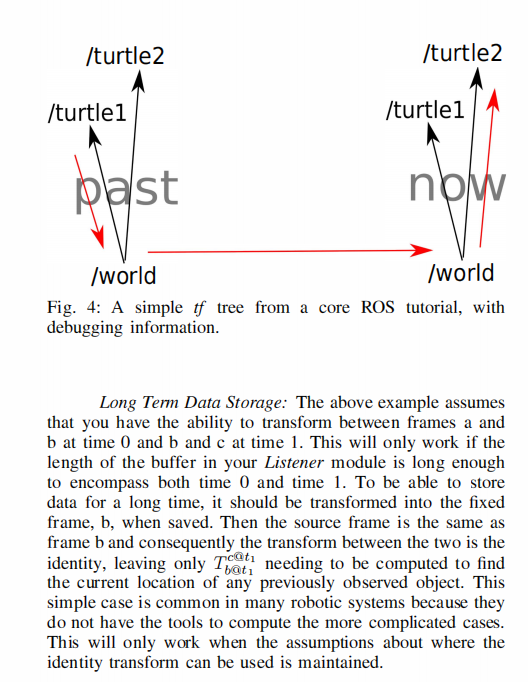

```bash
import os
from glob import glob
```

Add turtle following node information and add a command to copy launch files into install 's shared directory

```bash
(os.path.join('share',package_name,'launch'),glob('launch/*')),
```

## 9. Compiler functional package

```bash
colcon build --packages-select pkg_tf
```

## Operational procedures

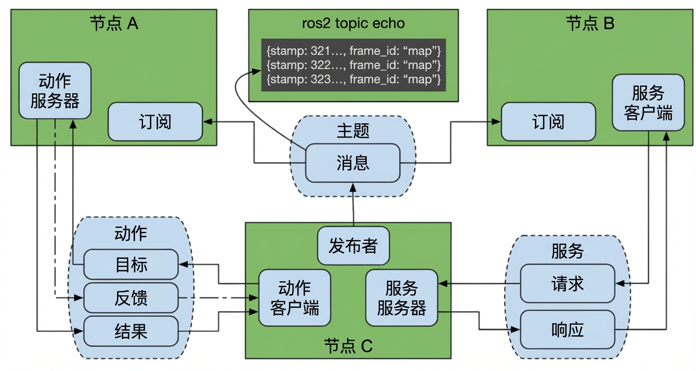

Refresh terminal environment variables, then run

```bash
# source install/setup.bash
ros2 launch pkg_tf turtle_following.launch.py
```

Activate the turtle keyboard control node, control the first little turtle movement, and the second will follow automatically.

```bash
ros2 run turtlesim turtle_teleop_key
```

Up and down of the keyboard in this terminal can control one of the little turtles' movements, and the other will follow them until they overlap.

### 11. Progress

Understand the TF 's trans-temporal variation

Buffer was able to automatically cache all TF conversions in the TF system in the past 10s through the buffer zone (which can be set up by Buffer for its own arbitrary duration), and all changes in the buffer zone are time-stamped in time, all of which are continuously traceable, and even if the two coordinates are at different points in time, the coordinates can be traced to one another. This can be done by reference to the literature that designed the TF system, with detailed rationale (the literature is linked under this section of the course folder or at the beginning of this section).

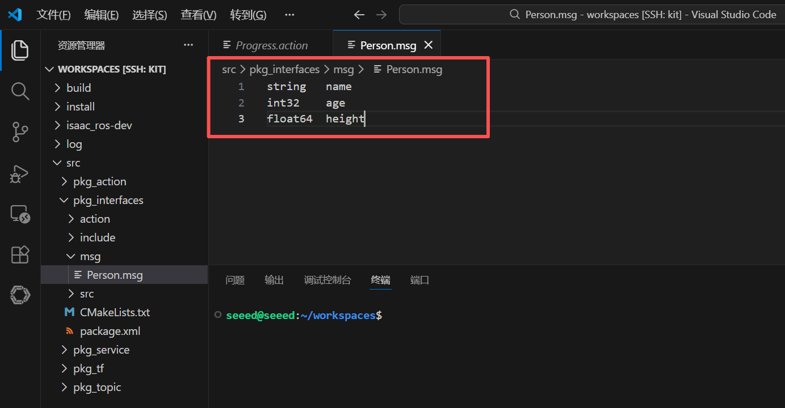

The following is an addition to our case of the turtle following us, where the red arrow indicates that it is possible to search over time for changes between the two coordinates at different points in time.

# Custom interface message

## 11 Custom Interface Messages

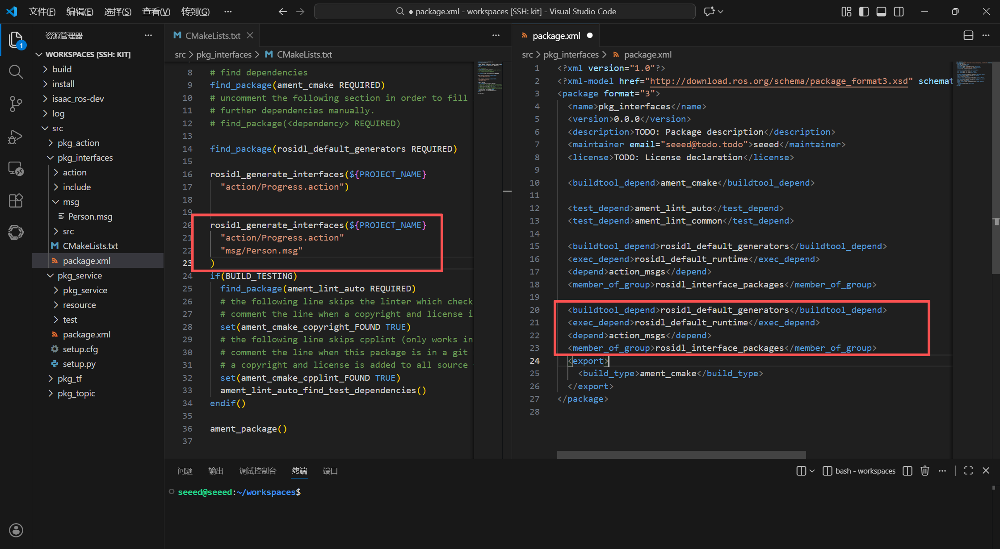

In the ROS system, the three types of communication mechanisms, Topic, Service and Action, all rely on a core concept — communication interface.

The essence of communications is the exchange of information between multiple parties, not one-way self-expression. In order to achieve efficient and reliable interaction, the nodes involved in communications must have a common understanding of the format and semantics of the data. To this end, ROS has introduced standardized communication interfaces that define clear and harmonized data structures for all types of messages, ensuring that information transmitted between different nodes is accurately understood.

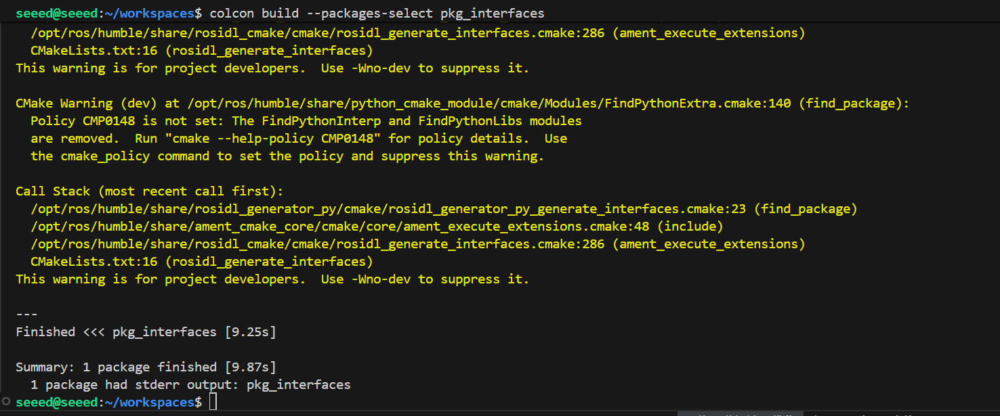

This interface design not only regulates the way in which data are exchanged, but also decorates programme modules at the structural level: developers need not be aware of each other ' s internal realization, but simply follow the interface agreement to achieve seamless collaboration between modules. This allows for the integration of functional components developed by others and the re-use of their own codes, thereby significantly increasing the development efficiency.

In the final analysis, the communication interface is the technological building block of the ROS concept of "duplication of wheeling" - the promotion of modularization, reuse and ecological development of robotic software through standardization and decoupling.

ROS has three common communication mechanisms: topics, services, actions, and through each defined interface, the various nodes are organically linked.

## 11.1 Create a custom interface process

The main steps are as follows:

Create interface functional package

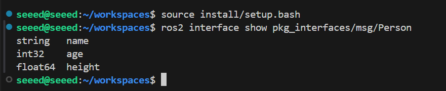

Create and edit .msg files, .srv files,.action files

Edit Profile

Compile

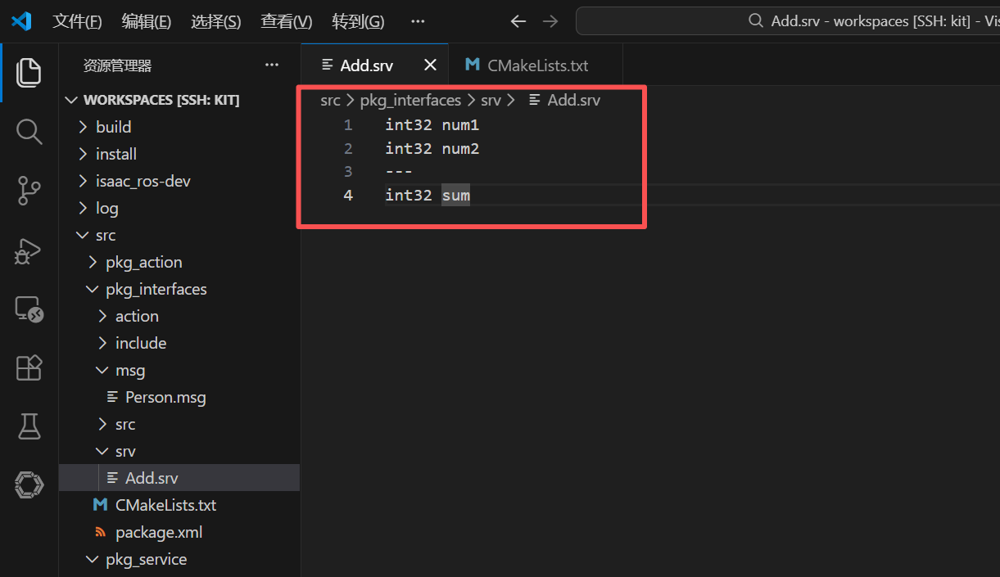

Test

## 11.2 Create a custom interface for action communications

In the case of action communication 09, we have demonstrated that if you create a complete process for action communication interfaces, you can go back and review them, and we will not repeat them here.

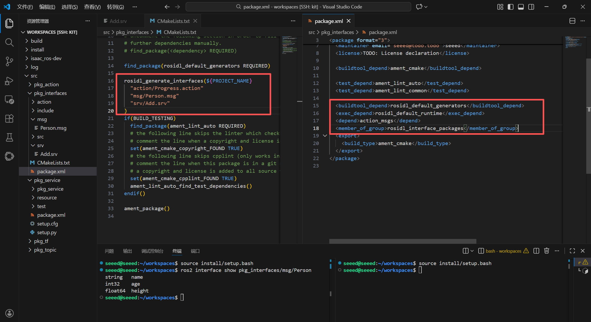

## 11.3 Create a custom interface for topic communications

We have created a custom interface kit in the 09 action newsletter, and now we are creating a new msg folder under the functional package pkg interfaces, and a new Person.msg file under the msg folder, with the following input:

```bash
string  name
int32  age
float64  height
```

Add the following configuration to package.xml and CMakeLists.txt:

```bash
# CMakeLists.txt
rosidl_generate_interfaces(${PROJECT_NAME}
  "action/Progress.action"
  "msg/Person.msg"
)
```

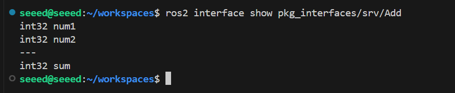

package.xml

```bash
# package.xml
<buildtool_depend>rosidl_default_generators</buildtool_depend>
<exec_depend>rosidl_default_runtime</exec_depend>
<depend>action_msgs</depend>
<member_of_group>rosidl_interface_packages</member_of_group>
```

Terminal enters the current workspace, compiles functional packages:

```bash
cd ~/workspace
colcon build --packages-select pkg_interfaces
```

Test interface normal

Refresh environment variables first

```bash
# source install/setup.bash
```

View interface type

```bash
ros2 interface show pkg_interfaces/msg/Person
```

Under normal circumstances, the terminal will export content consistent with the Person.msg file.

## 11.4 Create a custom interface for service communications

In the course of [ROS2 Action Communication Service Achievement], we have created a custom interface functional kit, a new srv folder under the package pkg interfaces, and a new Add.srv file under the srv folder, where the following contents are entered:

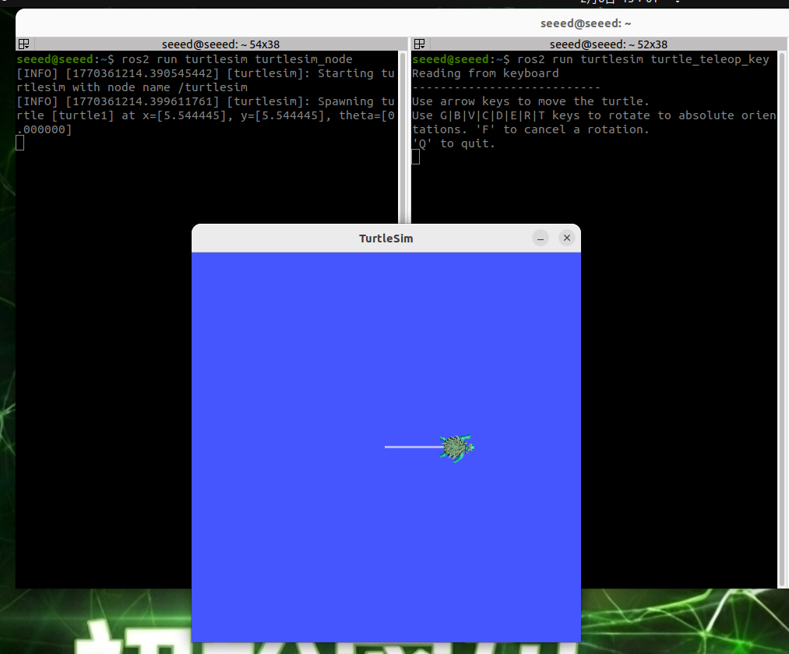

```bash
int32 num1
int32 num2
---
int32 sum
```

Add the following configuration to package.xml and CMakeLists.txt:

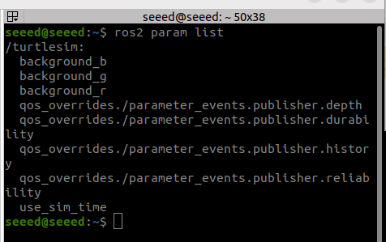

CMakeLists.txt

```bash
rosidl_generate_interfaces(${PROJECT_NAME}
  "action/Progress.action"
  "msg/Person.msg"
  "srv/Add.srv"
)
```

package.xml

```bash
<buildtool_depend>rosidl_default_generators</buildtool_depend>
<exec_depend>rosidl_default_runtime</exec_depend>
<depend>action_msgs</depend>
<member_of_group>rosidl_interface_packages</member_of_group>
```

Terminal enters the current workspace, compiles functional packages:

```bash
cd ~/workspace
colcon build --packages-select pkg_interfaces
source install/setup.bash
```

Test

```bash
ros2 interface show pkg_interfaces/srv/Add
```

Under normal circumstances, the terminal will export content consistent with the Person.msg file.

## 11.5 Next steps

1.12 Parameter Service Cases - Learning Parameter Service

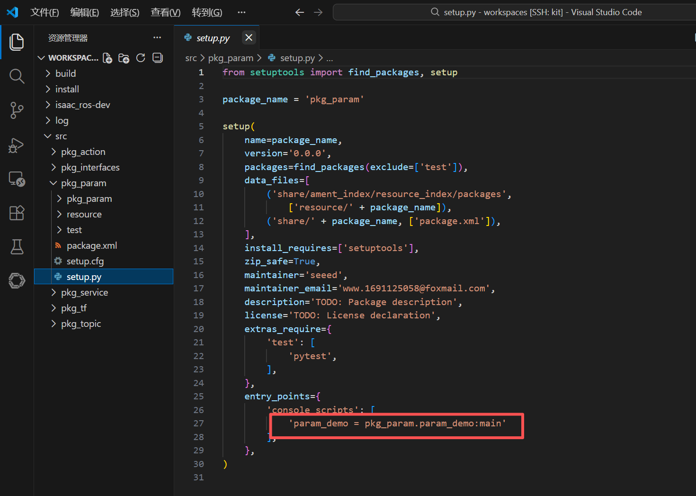

2.13 meta-functional packages - learning kits

# 12 Parameter service cases

## 12 Parameter Services (Parameters)

### 12.1 Overview of parameters

In ROS robotic systems, parameters act as C++ global variables and provide easy data-sharing mechanisms for multiple nodes. These parameters are stored in the system in the form of a global dictionary — the so-called dictionaries, i.e. map relationships consisting of "key" (parameter name) and "value" (parameter data), similar to variable endowments in programming languages (parameter name = parameter value) and can be accessed only by name.

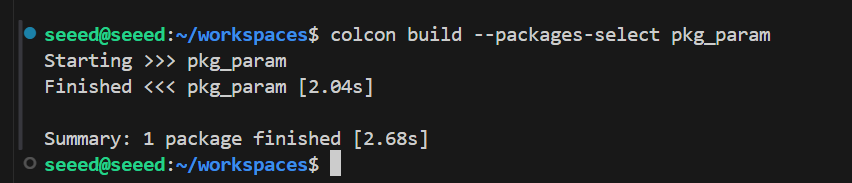

The parameter system has strong distributed characteristics: once the parameter has been declared or updated, the other nodes not only have real-time access to the data, but also ensure that the entire system is kept up to date through the monitoring mechanism. Such a design achieves seamless data collaboration across nodes and maintains global consistency without complex point-to-point communications.

## 12.2 Parameters in the small turtle routine

Simulators also provide many parameters in the small turtle routine, through which they are familiar with the meaning of the parameters and how command lines are used.

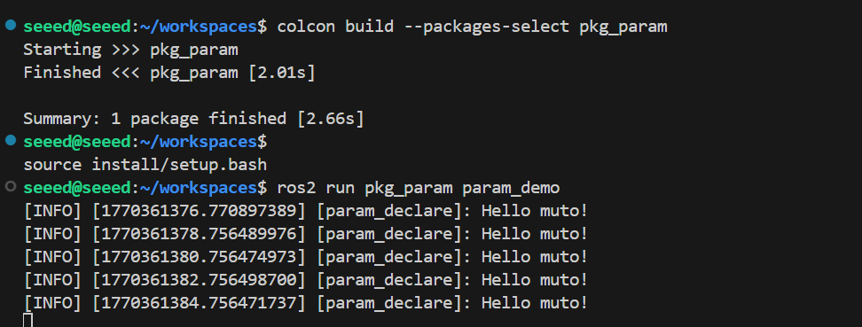

Start two terminals on Jetson to run the turtle simulation and keyboard control nodes:

```bash
ros2 run turtlesim turtlesim_node
# Second terminal
ros2 run turtlesim turtle_teleop_key
```

Start another terminal and view the list of parameters with the following command

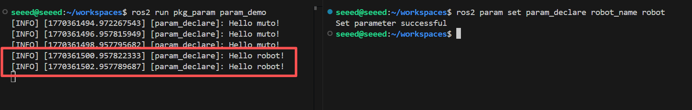

```bash
ros2 param list
```

Parameter queries and modifications

If you want to query or modify the value of a parameter, you can follow the Get or Set sub-command behind the Param command:

```bash
ros2 param describe turtlesim background_b  # view the description of a parameter
ros2 param get turtlesim background_b  # query the value of a parameter
ros2 param set turtlesim background_b 10  # modify the value of a parameter
```

Parameter File Save and Load

A query/modification of parameters is too much of a problem to try a parameter file. The ROS parameter file is in Yaml format and can be followed by the dump sub-command behind the param command, save all the parameters of a node to the file, or load all the contents of a parameter file once and for all by the load command:

```bash
ros2 param dump turtlesim >> turtlesim.yaml  # save a node parameter set to a parameter file
ros2 param load turtlesim turtlesim.yaml  # load all parameters from a file at once
```

## 12.3 Parameter cases

### 12.3.1 New functionality package

New functionality package under src directory in workspace

```bash
ros2 pkg create pkg_param --build-type ament_python --dependencies rclpy --node-name param_demo
```

Following the above-mentioned command, a pkg param kit will be created, and a param demo node will be created, and the relevant profile will be configured

### 12.3.2 Code realization

The editor then edits Param demo.py to perform the functions of the publisher by adding the following code:

```bash
import rclpy  # ROS 2 Python client library
from rclpy.node import Node  # ROS 2 node class

class ParameterNode(Node):
  def __init__(self, name):
  super().__init__(name)  # initialize the ROS 2 node base class
  self.timer = self.create_timer(2.0, self.timer_callback)  # create a timer (period in seconds) that runs the callback regularly
  self.declare_parameter('robot_name', 'muto')  # create a parameter and set its default value

  def timer_callback(self):  # create the timer callback function
  robot_name_param = self.get_parameter('robot_name').get_parameter_value().string_value  # read the parameter value from ROS 2
  self.get_logger().info('Hello %s!' % robot_name_param)  # log the parameter value that was read

def main(args=None):  # main entry function of the ROS 2 node
  rclpy.init(args=args)  # initialize the ROS 2 Python interface
  node = ParameterNode("param_declare")  # create and initialize the ROS 2 node object
  rclpy.spin(node)  # keep spinning until ROS 2 exits
  node.destroy_node()  # destroy the node object
  rclpy.shutdown()  # Shut down the ROS 2 Python client library
```

### 12.3.3 Compiler functional kit

```bash
colcon build --packages-select pkg_param
```

### 12.3.4 Operational procedures

Refresh environmental variables first, then run nodes

```bash
# source install/setup.bash
ros2 run pkg_param param_demo
```

Open another terminal and set robot name to robot:

```bash
ros2 param set param_declare robot_name robot
```

The log information can be found in the terminal, where muto is a parameter value that we set by default. The parameter name is robot name. Once you change this parameter by command line, the terminal changes.

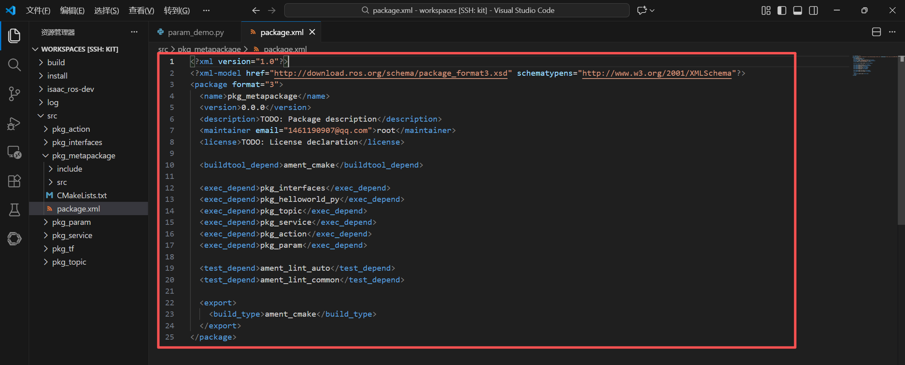

## 12.4 Next steps

1.13 meta-function packages - learning meta-function packages

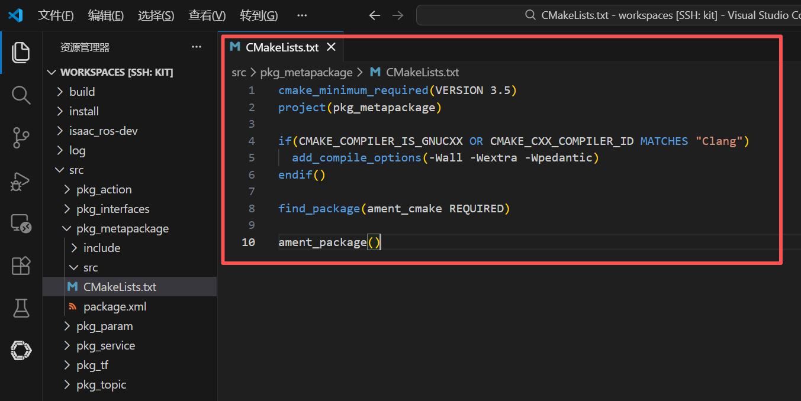

2.14 Distributed Communication - learning distributed communications

# 13 meta-pack

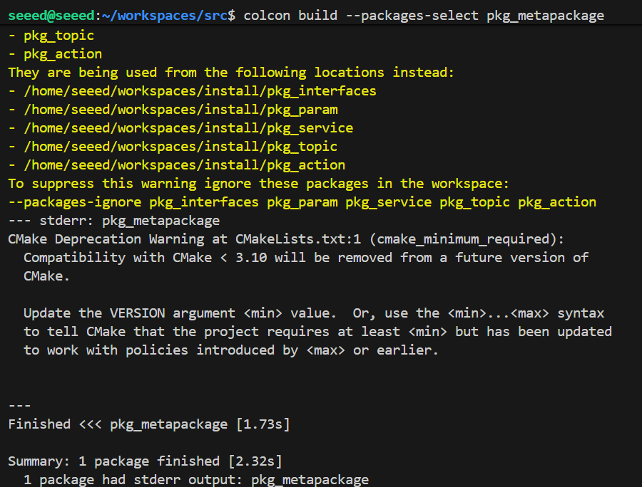

### 13 Metapackages

## 13.1 Summary of meta-function packages

### 13.1.1 What is a meta-functional kit

In ROS2, a complete functional module is often composed of multiple functional packages. In the case of robotic navigation, this module usually contains several sub-function packages such as map services, positioning algorithms, path planning, movement control, etc. If users need to install these decentralized packages manually, it is not only inefficient, but also prone to the failure of the system to function as a result of missing reliance.

To address this problem, ROS2 introduced the Metapackage mechanism. The concept is derived from Linux's document management system and is essentially a "fake bag" — it does not contain any substantive code or node per se, but organically integrates a set of related functional packages by declaring dependency. It can be understood as a "catalogue index" for functional clusters: it clearly indicates which subpackages the module contains and guides the package management tool to automatically complete batch installation.

The typical application scenario is the installation order for ROS2:

```bash
sudo apt install ros-humble-desktop
```

The ros-humble-desktop here is a meta-function kit that relies on dozens of packages such as the ROS2 core tool, the common-use library and simulation components, and the implementation of this order will allow the full system to be deployed once and for all.

In the field of robotics, Navigation 2 is the classic practice of meta-function packages. Through the package structure, the warehouse covers more than a dozen independent navigation components, such as AMCL positioning, cost maps, planners, controllers, etc., into uniform modules. The complete navigational capacity warehouse will be automatically acquired by the developers with the installation of the nav2 bringup package, greatly simplifying the deployment process for complex systems.

The meta-function packages do not provide software directly, but rely on other related packages to provide an easy installation mechanism for the complete package.

> Plain Text
> Concept of the meta-functional kit:
>
> That's right. That's right.
> │navigation2 (metafunctional package)│
> Zenium
>
> │nav2 costmap2nav2 planner│nav2 controller│
>
> Zenium
>
> │ n  │ │
>
>
>
> Installation process:
> I don't know what you're talking about.
> Zenium
> Automatically install all dependent subpackages

### 13.1.2 Role of meta-function packages

For user-friendly installation, we need only this package to organize other related packages together.

| Purpose | Annotations |
| --- | --- |
| Organizations | Group related functional packages |
| Simplified installation | Installation of multiple packages at a time |
| Dependence on management | Unified management dependency |
| Documentation | Clear project structure |
| Version Control | Harmonized publication and management of versions |

## 13.2 Implementation cases

New Function Package

```bash
ros2 pkg create pkg_metapackage
```

Modify package.xml file to add the package on which execution depends

```bash
<?xml version="1.0"?>
<?xml-model href="http://download.ros.org/schema/package_format3.xsd" schematypens="http://www.w3.org/2001/XMLSchema"?>
<package format="3">
  <name>pkg_metapackage</name>
  <version>0.0.0</version>
  <description>TODO: Package description</description>
  <maintainer email="1461190907@qq.com">root</maintainer>
  <license>TODO: License declaration</license>

  <buildtool_depend>ament_cmake</buildtool_depend>

  <exec_depend>pkg_interfaces</exec_depend>
  <exec_depend>pkg_helloworld_py</exec_depend>
  <exec_depend>pkg_topic</exec_depend>
  <exec_depend>pkg_service</exec_depend>
  <exec_depend>pkg_action</exec_depend>
  <exec_depend>pkg_param</exec_depend>

  <test_depend>ament_lint_auto</test_depend>
  <test_depend>ament_lint_common</test_depend>

  <export>
  <build_type>ament_cmake</build_type>
  </export>
</package>
```

Document CMakeLists.txt reads as follows:

```bash
cmake_minimum_required(VERSION 3.5)
project(pkg_metapackage)

if(CMAKE_COMPILER_IS_GNUCXX OR CMAKE_CXX_COMPILER_ID MATCHES "Clang")
  add_compile_options(-Wall -Wextra -Wpedantic)
endif()

find_package(ament_cmake REQUIRED)

ament_package()
```

Compiler functionality package

There will be no actual implementable documents.

```bash
colcon build --packages-select pkg_metapackage
```

## 13.3 Next steps

You can:

1.14 Distributed Communication - learning distributed communications

DDS - Learning DDS intermediate

Review series:

| Chapter | Contents |
| --- | --- |
| 04 Workspace | Workspace management |
| 05 Package | Functional package base |
| 12 Parameter service cases | Parameter Configuration |


### 14 Distributed Communication

## 14 Distributed Communications

## 14.1 Summary of distributed communications

ROS2 is a powerful distributed communications framework that allows easy inter-host network data interaction. The bottom is based on the DDS (Data Distribution Service) intermediate, which manages communications through the ROS DOMAIN ID: when the nodes on different devices set the same domain ID and are in the same network, they automatically detect and communicate freely; On the contrary, the IDs are separate from each other. In order to simplify the operation, ROS2 defaults that the domain ID of all nodes is 0, which means that you do not need any additional configuration, so long as the device is in the same network, you can get a distributed message to open the box. This feature has extensive and critical applications in scenarios requiring multi-equipment data interaction, such as drone formations, drone clusters and remote control.

### 14.1.1 What is distributed communications

ROS 2 distributed communications allows multiple computer nodes to communicate with each other without central servers. This is achieved through DDS (Data Distribution Service).

> Plain Text
> Distributed Communication architecture:
>
> Network switches/routers
> Zenium
> {\cHFFFFFF}{\cH00FFFF} {\cHFFFFFF}{\cH00FFFF} {\cHFFFFFF}{\cH00FFFF} {\cHFFFFFF}{\cH00FF00} {\cHFFFFFF}{\cH00FF00} {\cHFFFFFF}{\cH00FF00} {\cHFFFFFF}{\cH00FF00}
> I'm sorry.
> {\cHFFFFFF}{\cH00FF00} {\cHFFFFFF}{\cH00FFFF} {\cHFFFFFF}{\cH00FFFF} {\cHFFFFFF}{\cH00FFFF} {\cHFFFFFF}{\cH00FFFF} {\cHFFFFFF}{\cH00FF00} {\cHFFFFFF} {\cHFFFFFF}{\cH00FF00} {\cHFFFFFF}{\cH00FF00} {\cH00FF00} {\cHFFFFFF} {\cHFFFFFF}{\cH00FF00} {\cHFFFF00} {\cH00FF00} {\cHFFFFFF} {\bord0\shad0\alphaH3D}
> PC1 & P2 & P3
> I'm sorry.
> │ │ │ │ │ │
> Node, node, node, node.
> – Peter – – – – – Peter – – Peter –

### 14.1.2 Characteristics of distributed communications

| Characteristics | Annotations |
| --- | --- |
| Uncentralized | No need, ROS Master. |
| Autodiscover | Node automatically finds other nodes on the network |
| Cross Platform | Communications between different operating systems |
| Reliable transmission | Support multiple QoS policies |

## 14.2 ROS DOMAIN ID

### 14.2.1 Domain ID concept

ROS DOMIN ID is used to isolate different ROS2 networks. The node of the same domain ID can communicate with each other, and the node of the different domain IDs is isolated from each other.

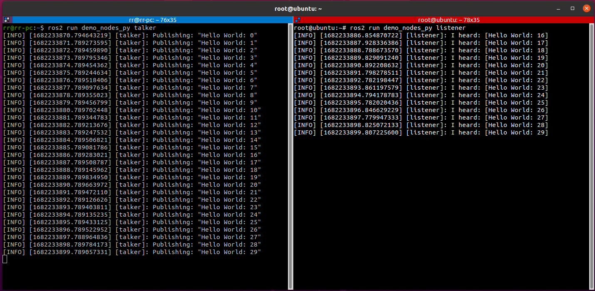

> Plain Text
> Domain ID separation diagram:
>
> ROS DOMIN ID=0 ROS DOMIN ID=1
>
> A robot, B robot, B robot.
> I don't know.
> │ Sensor node
> Node, node, node, node, node.
> -
>
> No interference. Run independently.

## 14.3 Achieved

### 14.3.1 Default Achievement

Distributional communication has been achieved by simply placing the host and the operator [more than one] in the same network. For example, the mainframe connects to the same WiFi or the same router.

The virtual network in Windows is in the same network as the host.

Test:

It's assumed that we have two hosts A and B, which can be in any form connected to the network, e.g. virtual machines, berry pies, jetson, x86XIAOBAITOKENOX, card master board, with only the same version of the ros2 environment.

1. A. Host execution:

The demonstration here is that the car is in the docker, the docker model is the host model, which simply shares the network with the car, so it's no different from the car implementation.

```bash
ros2 run demo_nodes_py talker
```

2. B. Host execution:

```bash
ros2 run demo_nodes_py listener
```

If shown as follows: Host-end topics are promptly subscribed to, indicating that multiple machine communications have been achieved

### 14.3.2 Distributional network subgroups

Assuming you're in a network with other robots, you can set up a group for your robots to avoid interference from other robots.

ROS2 provides a DOMAIN mechanism, which, like a subgroup, is able to communicate with a computer in the same DOMAIN, and we can add a sentence to the host [car] and from the machine [virtual machine].

```bash
$ export ROS_DOMAIN_ID=<your_domain_id>
```

If the host [van] is different from the ID assigned from the machine [virtual machine], the two cannot communicate for group purposes.

### 14.3.3 Case 1

1. Host [car] execution:

Here is a demonstration that the car is in a docker, and the docker model is a host model, which simply shares a network with a car, so it's no different from a car.

```bash
echo "export ROS_DOMAIN_ID=6" >> ~/.bashrc  # Here `6` is the `ROS_DOMAIN_ID`; it does not have to be `6` as long as it follows the `ROS_DOMAIN_ID` rules
source ~/.bashrc
ros2 run demo_nodes_py talker
```

2 At the same time, from [virtual machine]:

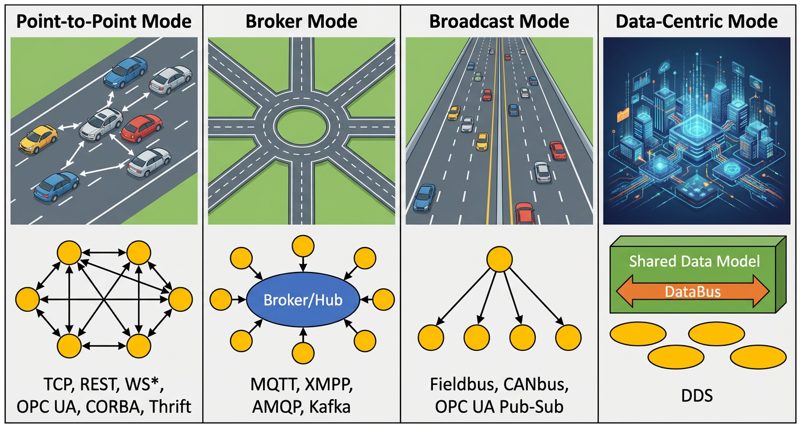

```bash
echo "export ROS_DOMAIN_ID=6" >> ~/.bashrc  # Keep this value the same as the host side
source ~/.bashrc
ros2 run demo_nodes_py listener
```

If shown as follows: Subjects posted by the host are promptly subscribed to from the computer, indicating that the grouping multi-computer communication has been achieved

### Case 2

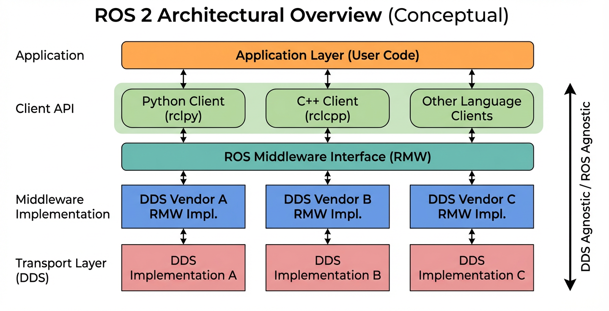

Controlling the small turtle movement through distributed communication

Host A running command

```bash
ros2 run turtlesim turtlesim_node
```

Host B running command

```bash
ros2 run turtlesim turtle_teleop_key
```

## 14.4 Attention

When setting the value of ROS DOMIN ID, it is not random, but it is also binding:

RECOMMENDED ROS DOMIN ID values between [0,101] containing 0 and 101.

The total number of nodes within each domain ID is limited and needs to be less than or equal to 120;

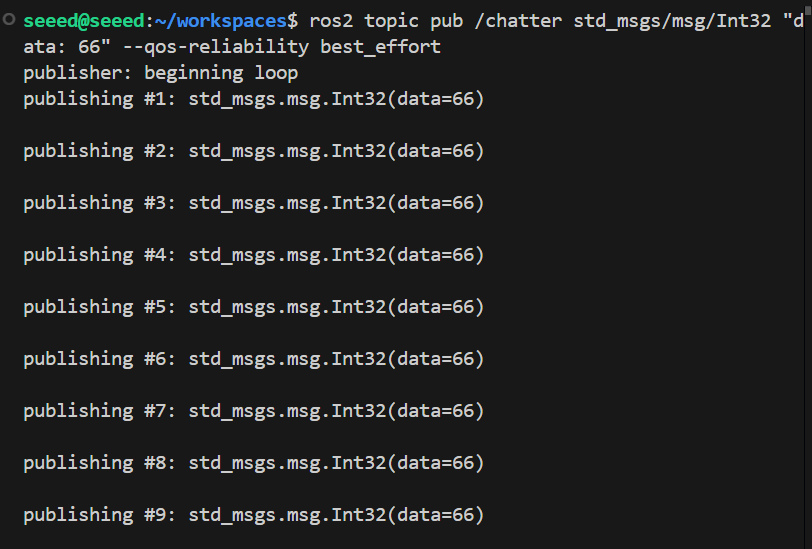

If the field ID is 101, the total number of nodes in this domain needs to be less than or equal to 54.

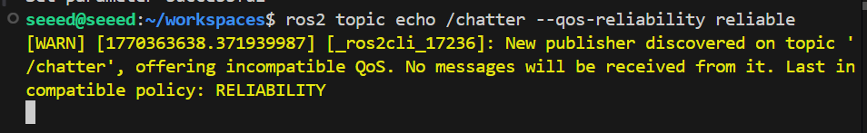

## 14.5 Rules for calculating DDS domain ID values (level knowledge)

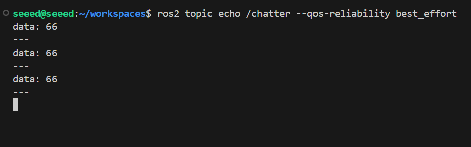

The relevant calculation rules for domain ID values are as follows:

If DDS is based on TCP/IP or UDP/IP network communication protocols, the port number is specified for network communications, and the port number is expressed in two bytes integer, unsigned integer, with a value range between [0,65535];

The distribution of port numbers is also subject to its rules, not to be used arbitrarily, with 7,400 as the starting port under the DDS agreement, i.e. the port available is [7400,65535], and it is known that, by default under the DDS agreement, each domain ID occupies 250 ports, and the number of domain IDs is: (65535-7400) /250 = 232) and the corresponding range of values is [0,231];

The operating system will also set up a number of pre-encumbrance ports, which will also need to be avoided when they are used in DDS to avoid conflicts in use and differences in the pre-encumbrance of different operating systems, with the end result that under Linux, the available domain IDs are [0,101] and [215-231] and the available domain IDs in Windows and Mac are [0,166]. In summary, for the purpose of compatibility with multi-platforms, domain IDs are recommended to be taken within [0,101] ranges.

Each domain ID by default occupies 250 ports and two ports are required for each ROS2 node. In addition, the 1st and 2nd ports are the ports of Discovery Multicast and User Multicast, beginning with the 11th and 12th ports, and the ports of Discovery Unicast and User Unicast, the port occupied at the subsequent node, are sequentially extended, and the maximum number of nodes in a domain ID is: (250-10) /2 = 120 (one);

Special circumstances: When the domain ID value is 101, the subsequent half of the port is the pre-encumbrance port of the operating system, with a maximum of 54 nodes.

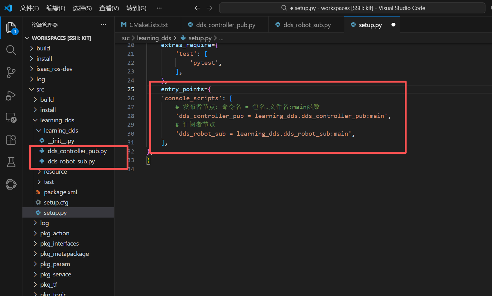

The above calculation rules are sufficient.

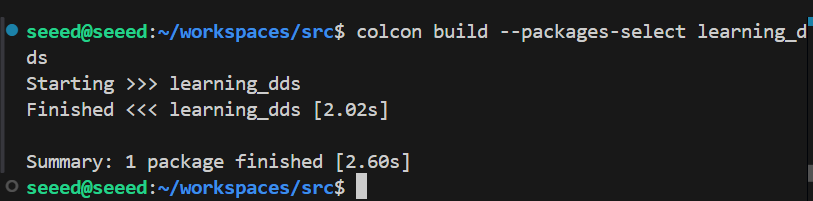

## 14.6 Next steps

DDS - In-depth learning DDS intermediate

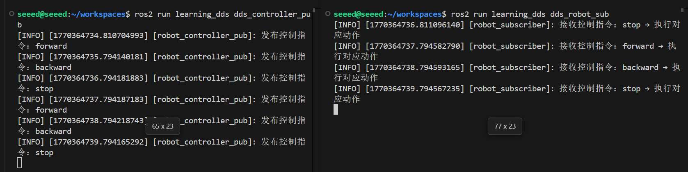

Time-related API - Learning Time API

https://fast-dds.docs.eprosima.com/en/latest/

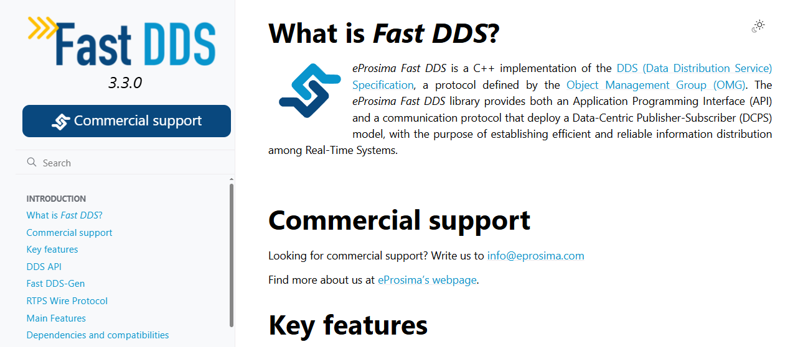

### 15 DDS

## 15 DDS (Data Distribution Service)

## 15.1 Overview of DDS

## 15.1.1 What's DDS?

DDS (Data Distribution Service) is a data-centred publication-subscription intermediate standard, and ROS 2 uses DDS to achieve lower level communications.

> Plain Text
> ROS 2 relation to DDS:
>
> That's right. That's right.
> │ ROS 2 Application Layer
> (node, topic, service, action)
>
> Zenium
> Zenium
> That's right. That's right.
> RMW (ROS Middleware)
> Integrated interface layer
>
> Zenium
> Zenium
>
> I'm sorry.
>
> CycloneDDS
> I'm sorry.
>  -- -- -- -- -- -- -- -- -- -- -- -- -- -- -- -- -- -- -- -- -- -- -- -- -- -- -- -- -- -- -- -- -- -- -- -- -- -- -- -- -- -- -- -- -- -- -- -- -- -- -- -- -- -- -- -- -- -- -- -- -- -- -- -- -- -- -- -- -- -- -- -- -- -- -- -- -- -- -- -- -- -- -- -- -- -- -- -- -- -- -- -- -- -- -- -- -- -- -- -- -- -- -- -- -- -- -- -- -- -- -- -- -- -- -- -- -- -- -- -- -- -- -- -- -- -- -- -- -- -- -- -- -- -- -- -- -- -- -- -- -- -- -- -- -- -- -- -- -- -- -- -- -- -- -- -- -- -- -- -- -- -- -- -- -- -- -- -- -- -- -- -- -- -- -- -- -- -- -- -- -- -- -- -- -- -- -- -- -- -- -- -- -- -- -- -- -- -- -- -- -- -- -- -- -- -- -- -- -- -- -- -- -- -- -- -- -- -- -- -- -- -- -- -- -- -- -- -- -- -- -- -- -- -- -- -- -- -- -- -- -- -- -- -- -- -- -- -- -- -- -- -- -- --

### 15.1.2 DDS Core Functions

| Functions | Annotations |
| --- | --- |
| Discovery mechanisms | Automatically find DDS participants on the network |
| Launch/subscription | Solved data transfer mode |
| QoS policy | Quality of services available |
| Type System | Strong-type data definition |
| Zero copies | Efficient data transfer |

### 15.2 Communications models

The topics, services, actions that we're learning in the front course, and the practical realization of their lower-level communication, are all done by the DDS, which is equivalent to the neural network of the ROS robotic system.

The core of DDS is communication, with a very large number of models and software frameworks that can achieve communication, and here we list four models that are commonly used.

First, the point-to-point model: multiple clients connect directly to the same service. For each communication, both sides need to establish a link; As the number of nodes increases, so does the number of connections. At the same time, each client must clearly know the exact address of the service end and the services it provides. Once the service-end address changes, all clients will be forced to modify it, with considerable impact.

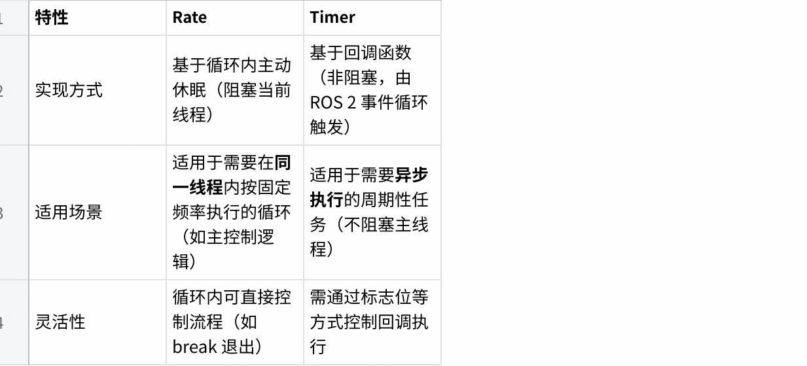

Second, the Broker model: it is an improvement based on the point-to-point model. All requests are uniformly assigned to Broker, who is responsible for forwarding and identifying nodes that can truly provide services. As a result, the client no longer needs to care about the server's address. However, its problems are also prominent: Broker is at the centre of the system, and processing capacity has a direct impact on overall efficiency and can easily become a performance bottleneck when the system is scaled up. Worse still, if Broker fails, the entire system may collapse. A similar structure was adopted by ROS1.

Third, broadcast models: all nodes can send broadcast messages on the same channel and all nodes can receive them. This approach avoids the problem of relying on server addresses and does not require a separate connection between the communication parties. But the disadvantage is also clear: the amount of information on the route is very high, and all nodes have to deal with every message, the vast majority of which is not really about themselves.

Fourth, a data-centred DDS model: this approach is somewhat similar to the broadcast model, and nodes can either publish or subscribe to data on DataBus. But it is more advanced in that there are multiple parallel data access routes in communications, each node simply focusing on data of interest to itself, which can be ignored directly. It's like a turn-over pan, all the dishes are passing on to DataBus, and we just have to take what we want, and the rest is completely ignored.

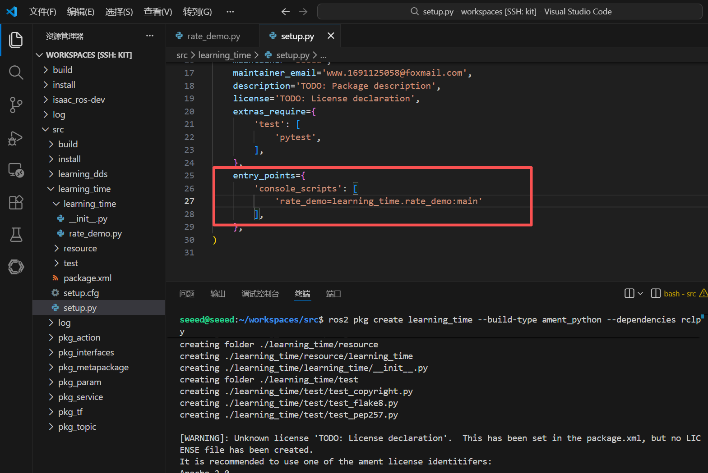

It can be seen that in these communication models the advantages of DDS are more pronounced.

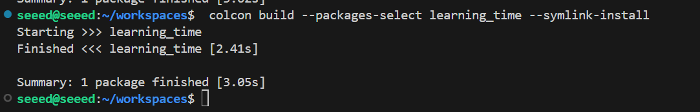

## 15.3 Applications of DDS in ROS2

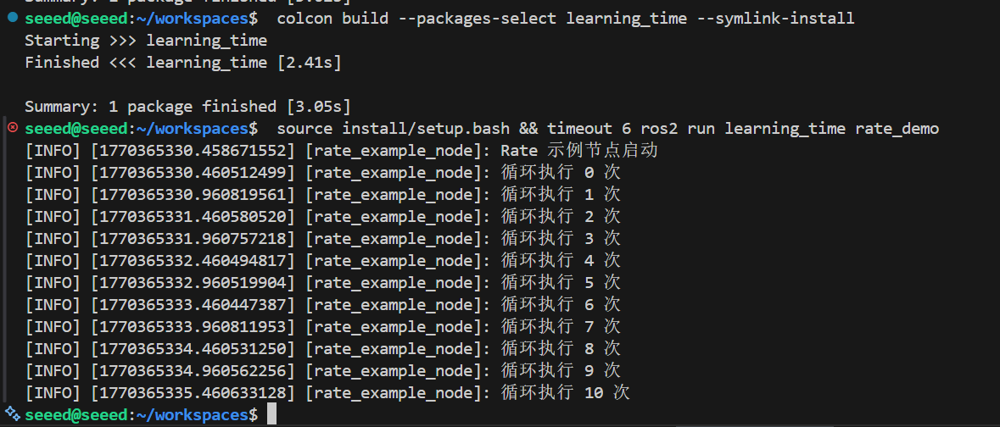

The location of DDS in ROS2 is critical, and all upper layers are built on DDS. In this ROS2, the blue and red parts are DDS.

Of the four components of ROS, the integration of distributed communication systems has been significantly enhanced by the inclusion of DDS, so that we do not have to deal with communication in the development of robots and can devote more time to the development of applications in other parts.

## 15.4 Quality Services Strategy

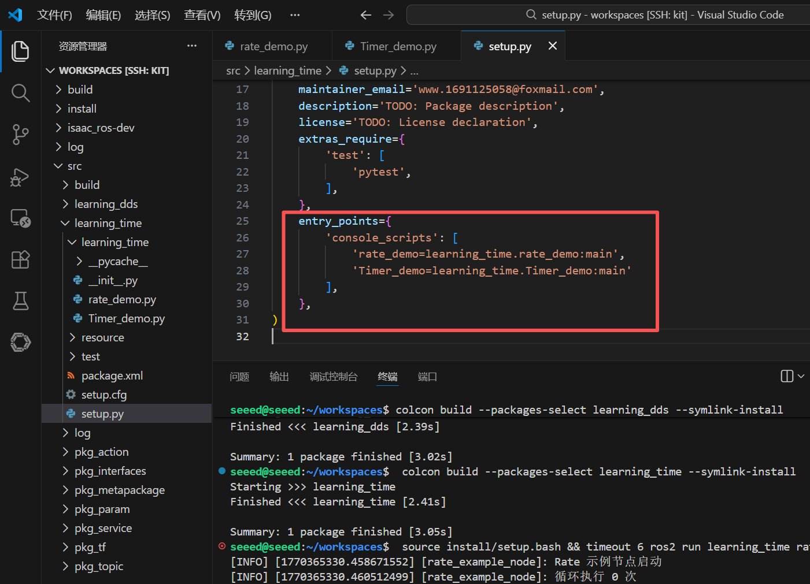

The infrastructure in DDS is Domain. Domain is used to organize applications to complete communications. In retrospect, the DOMAIN ID that we used to configure while the treeberry pie and the computer were interoperating is essentially a grouping of the global data spaces: only at the nodes of the same DOMAIN group can we discover and communicate with each other. In this way, unconnected data could be effectively avoided.

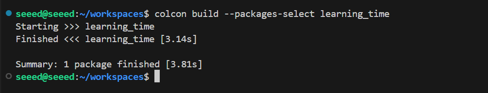

Another core feature of DDS is the quality-of-service strategy: Qos.

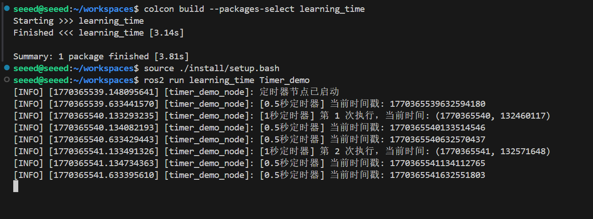

QoS can be understood as a web-based transmission rule: the application will declare its desired transmission quality behaviour, while the QoS mechanism is responsible for meeting these requirements as far as possible. It's like a "communication contract" between the data publisher and the subscriber.

The strategy is as follows:

DEADLINE strategy: indicates that each data communication must be completed at least once within the prescribed deadline;

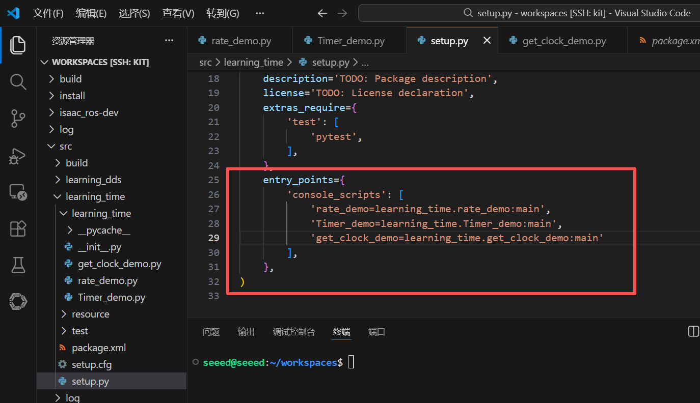

HISTORY policy: indicates size limits on historical data caches;

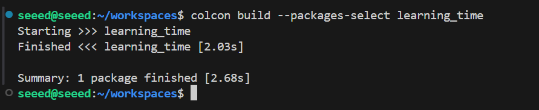

RELIABILITY policy: represents a reliable pattern of data transmission. If configured as BEST EFFORT (as far as possible), even if the network is in poor condition, the data flow is as good as possible, but the data may be lost; If configured as RELIABLE (reliable transmission), the integrity of the data is ensured as much as possible during the communication, such as image transmission, which is less likely to be missing. We can choose the right model based on the actual application scene.

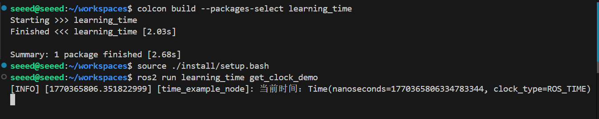

DURABILITY policy: can be configured to provide historical data for late-to-end nodes, allowing new nodes to enter the system more quickly.

## 15.5. Test cases

### Case 1 - Configure DDS by Order Line

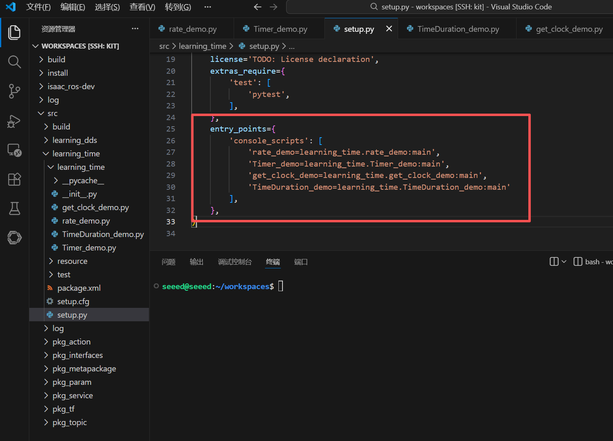

Open the first terminal and use the following command to publish the topic:

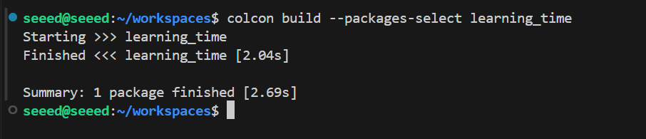

```bash
ros2 topic pub /chatter std_msgs/msg/Int32 "data: 66" --qos-reliability best_effort
```

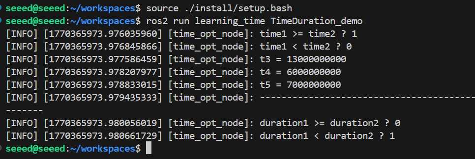

Once again, a terminal is opened to print the topic using different Qos, and if the Qos policy is different from the publisher, there will be warnings that the subject data will not be received properly:

```bash
ros2 topic echo /chatter --qos-reliability reliable
```

We use the same Qos strategy as the topic publisher to receive subject data.
