# ROS2 Tools, Launch, and Visualization

## 17 Common command tool

### 17 Common Command Tool (CLI Tools)

### 17.1 Package management tool ros2 pkg

### 17.1.1 rose2 pkg create

Function: Create a functional package, which requires the name of the package, the way it is compiled, the dependencies, etc.

Format:

```bash
ros2 pkg create <package_name> --build-type <build-type> --dependencies <dependencies>
```

In the ros2 command:

pkg: indicates functions associated with the functional kit;

create: indicates the creation of a functional package;

Package name: must: name of the new functional package;

bild-type: must be: indicates whether the newly created feature kit is C++ or Python, if C++ or C is used, then this is ament cmake, and if Python is used, ament python;

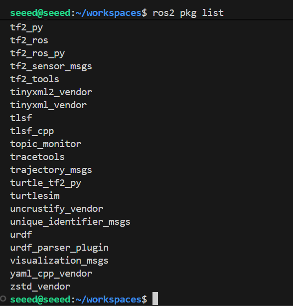

Options: the C++ feature package needs to contain rclcpp, the Python feature package needs to contain rclpy, and other dependents;

### 17.1.2 ros2 pkg list

Function: View the list of functional packages in the system

Format:

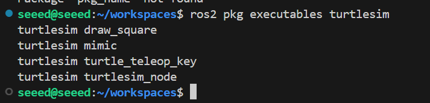

```bash
ros2 pkg list
```

### 17.1.3 ros2 pkg executes

Function: View all executables in a package

Format:

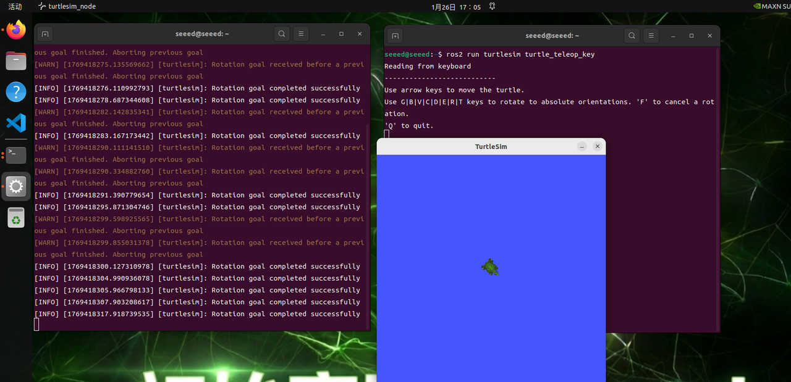

```bash
ros2 pkg executables <pkg_name>
```

### 17.2 Node Runs ros2 run

Function: Run the functional package node program

Format:

```bash
ros2 run <pkg_name> <node_name>
```

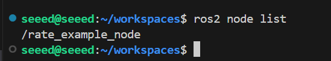

pkg name: Functional package name

Node name: Name of executable

## 17.3 Node-related tools

### 17.3.1 rose2 node list

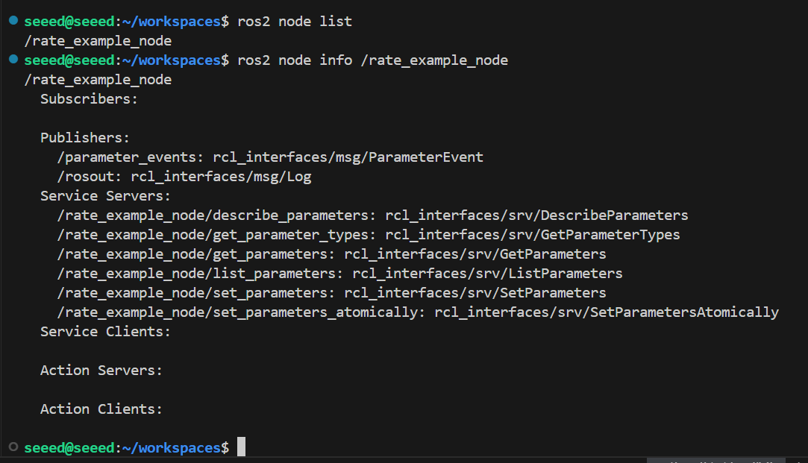

Function: List all nodes in the current domain

Format:

```bash
ros2 node list
```

### 17.3.2 rose2 nodeinfo

Function: View node details, including subscriptions, published messages, services and actions, etc.

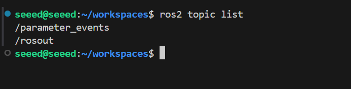

Format:

```bash
ros2 node info <node_name>
```

Node name: Node name to see

## 17.4 Topic-related tools

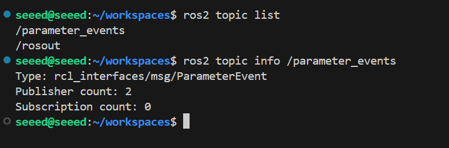

### 17.4.1 rose2 topic list

Function: List all topics in the current domain

Format:

```bash
ros2 topic list
```

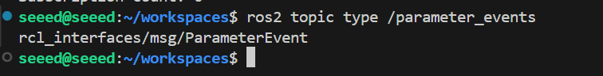

### 17.4.2 rose2 topicinfo

Function: Display the subject message type, number of subscribers/issuers

Format:

```bash
ros2 topic info <topic_name>
```

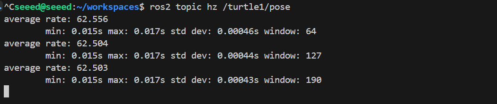

Topic name: name of topic to search for

### 17.4.3 rose2 topic type

Function: Type of message to view the topic

Format:

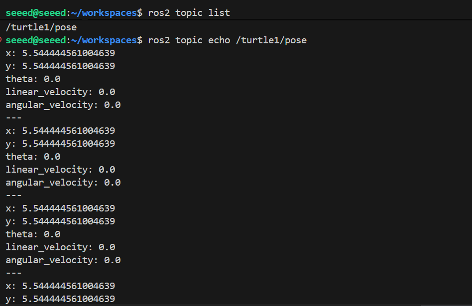

```bash
ros2 topic type <topic_name>
```

Topic name: Name of subject type to search for

### 17.4.4 ros2 topic hz

Function: Show the average frequency of topic release

Format:

```bash
ros2 topic hz <topic_name>
```

Topic name: Name of subject frequency to query

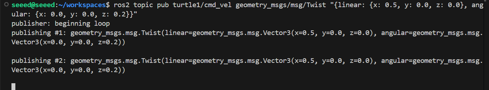

### 17.4.5 ros2 topic epho

Function: Print topic messages at terminal, similar to a subscriber

Format:

```bash
ros2 topic echo <topic_name>
```

Topic name: The name of the subject for which you need to print the message

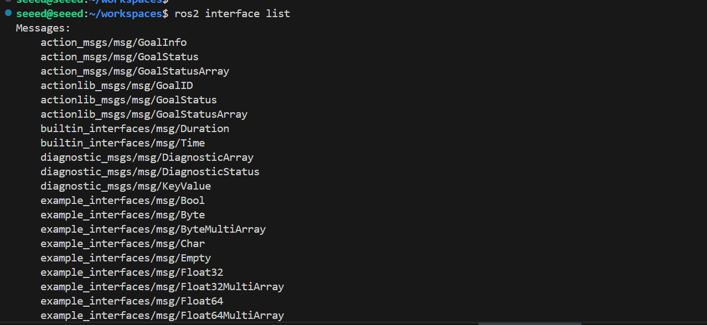

### 17.4.6 rose2 topic pub

Function: Send specified topic messages at terminal

Format:

```bash
ros2 topic pub <topic_name> <message_type> <message_content>
```

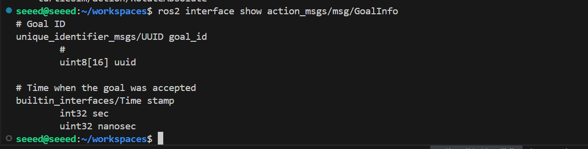

Topic name: The name of the subject that needs to be published

message type: data type of topic

message content: message content

The default is published at a frequency of 1 Hz, setting the following parameters:

Parameter 1 is published once, ros2 topic pub-1 topic name message  type message content

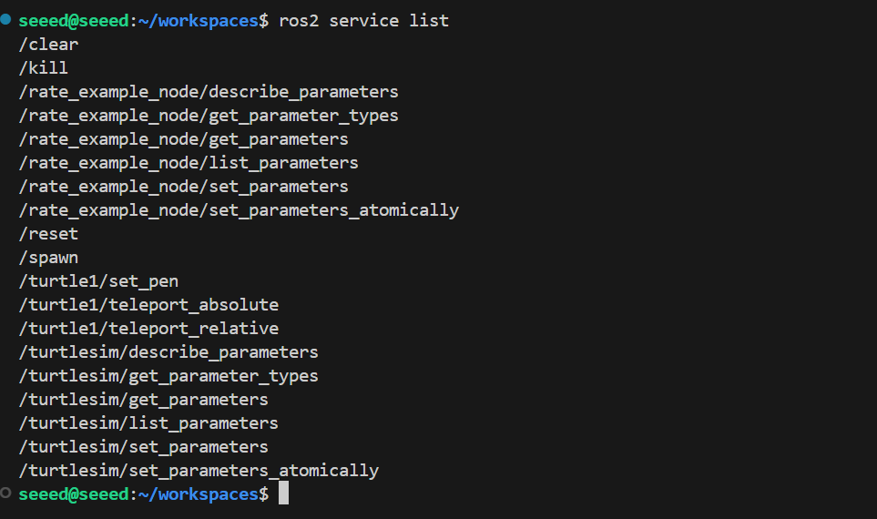

Parameter-t count loop release count end, ros2 topic pub-t count topic name message type message content

Arguments-r count published at the frequency of the count Hz, ros2 topic pub-r count topic name message  type message content

Example:

Issue speed commands by command line

What needs to be noted here is that there's a space behind each colon, or else there's an error in format.

```bash
ros2 topic pub turtle1/cmd_vel geometry_msgs/msg/Twist "{linear: {x: 0.5, y: 0.0, z: 0.0}, angular: {x: 0.0, y: 0.0, z: 0.2}}"
```

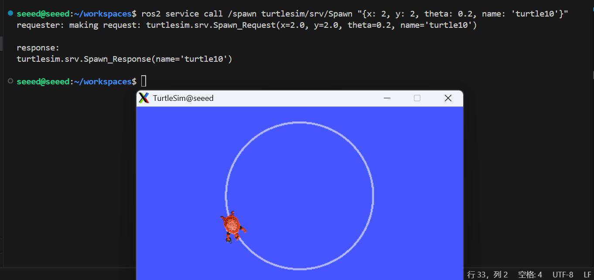

### 17.5 Ros2 interface-related tools

### 17.5.1 rose2 interface list

Function: Lists all interfaces of the current system, including topics, services, actions.

Format:

```bash
ros2 interface list
```

### 17.5.2 rose2 interface show

Function: Show details of the specified interface

Format:

```bash
ros2 interface show <interface_name>
```

Interface name: name of interface content to display

## 17.6 Services-related tools

### 17.6.1 rose2 service list

Function: List all services in the current domain

Format:

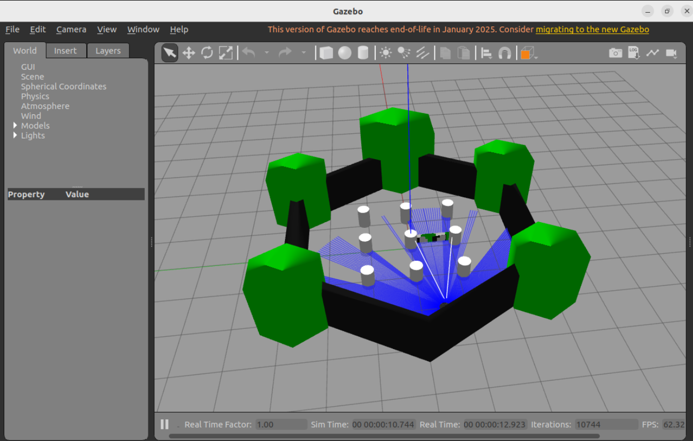

```bash
ros2 service list
```

### 17.6.2 rose2 service call

Function: Call specified service

Format:

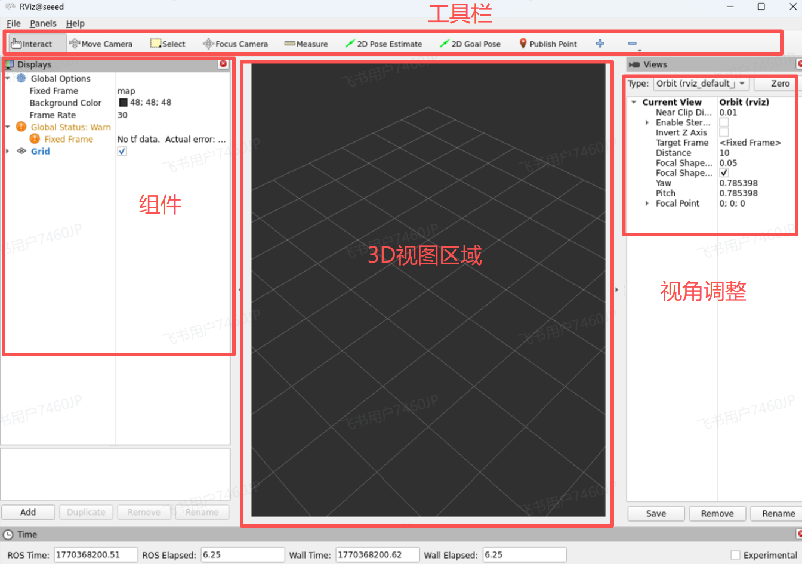

```bash
ros2 interface call <service_name> <service_Type> <arguments>
```

Service name: service to be called

Service Type: service data type

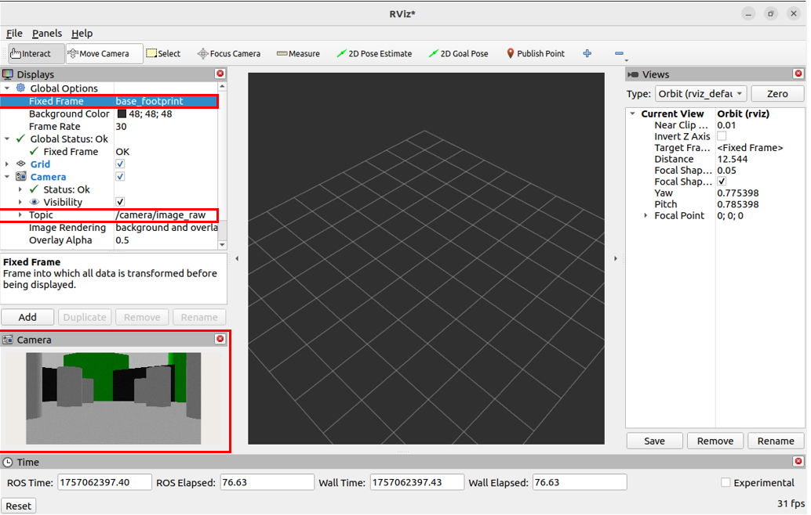

Arguments: parameters for service delivery

For example, calling to generate turtle services

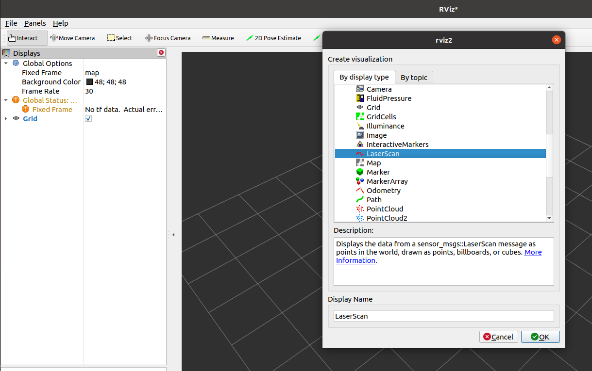

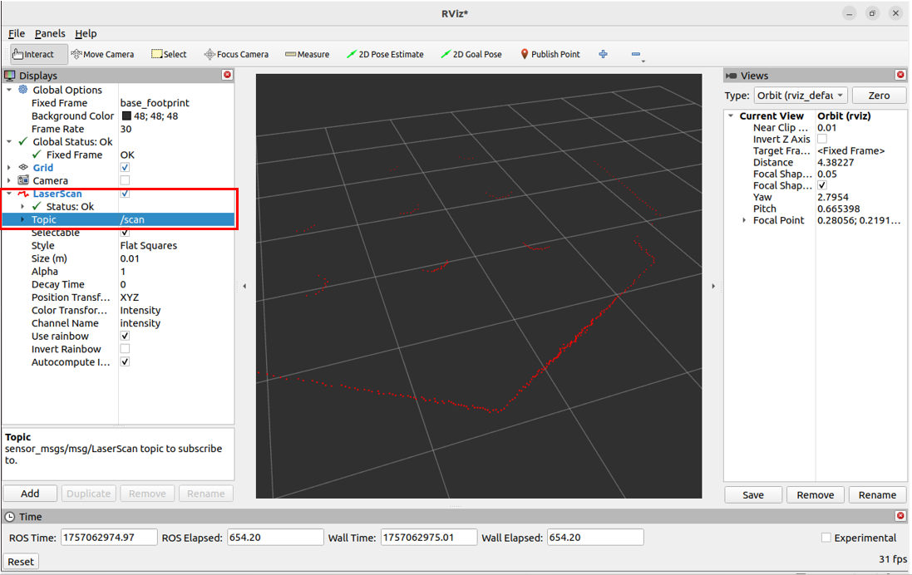

```bash
ros2 service call /spawn turtlesim/srv/Spawn "{x: 2, y: 2, theta: 0.2, name: 'turtle10'}"
```

## 17.7 Next steps

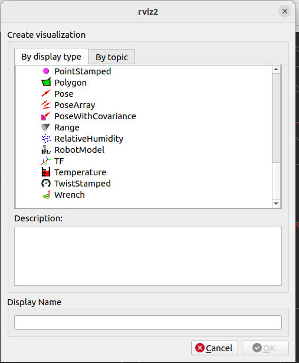

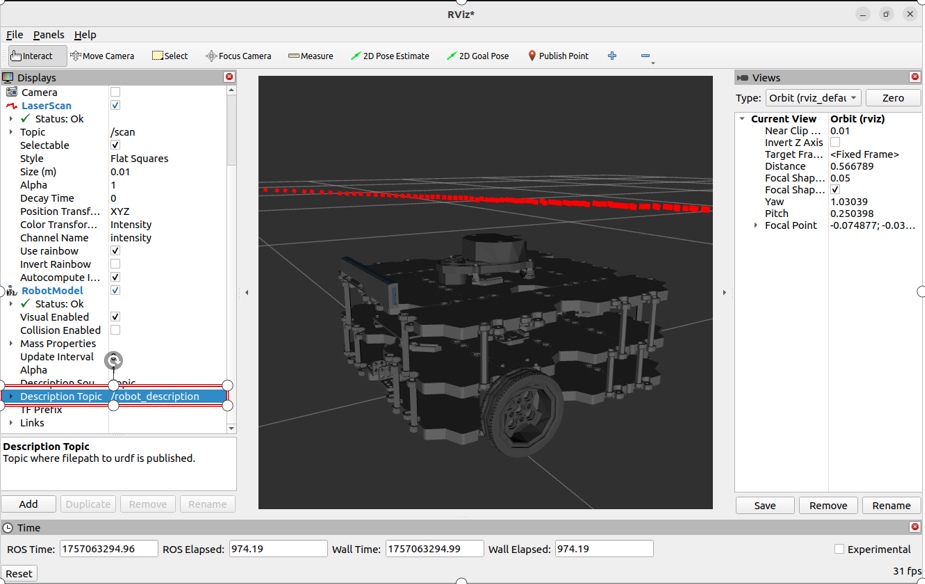

18 RViz2 Use - Learning RViz2 Visualization

2. 19 Rqt Toolbox - Learning Rqt Tool

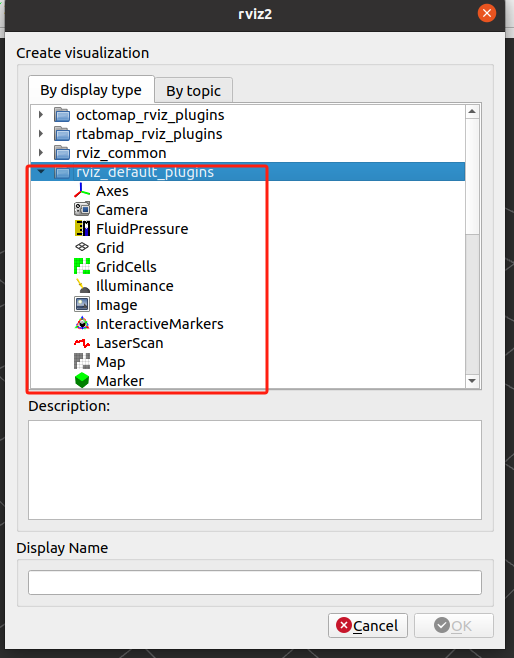

### 18 RViz2 Use

## 18 RViz2 Usage (RViz2 Vision)

## 18.1 RViz2 Overview

Rviz2 is the most commonly used three-dimensional visualization tool in ROS 2 to visualize the operational status of robotic systems. It can subscribe to and display a variety of ROS 2 subject data, such as laser radar cloud, maps, robotic model (URDF), TF coordinate conversion, path-planning trajectory and camera images, and help developers quickly verify whether sensor, positioning, navigation, etc. are working. Through Rviz2, users can observe the relationship between robots and the environment in real time in the same interface, significantly increasing the efficiency of commissioning and development.

### 18.2 Preparatory work

If there's a real robot that can start the rviz exercise at the robot master control end, if there's no real robot, we can start the turtlebot3 in a real way by gazebo, imitating laser radar, camera, etc., so that the next data can be visualized.

Note that the following installation steps are not necessary, and if there are physical robots in their hands, with a large number of machine communications that allow direct use of real machine radar information, they can use real radar or virtual simulation robots of their choice; The following are suitable for users who do not have a live machine.

This section of the curriculum uses simulation robots as an example, teaching rviz2 visualization, real or mimic robots, and rviz2 processes are the same.

Install Tutlebot3 emulator kit

```bash
sudo apt install ros-${ROS_DISTRO}-turtlebot3*
```

Installation of ros and gazebo bridges

```bash
sudo apt install ros-humble-ros-gz -y
```

Set the turtlebot3 environment variable

```bash
export TURTLEBOT3_MODEL=waffle
```

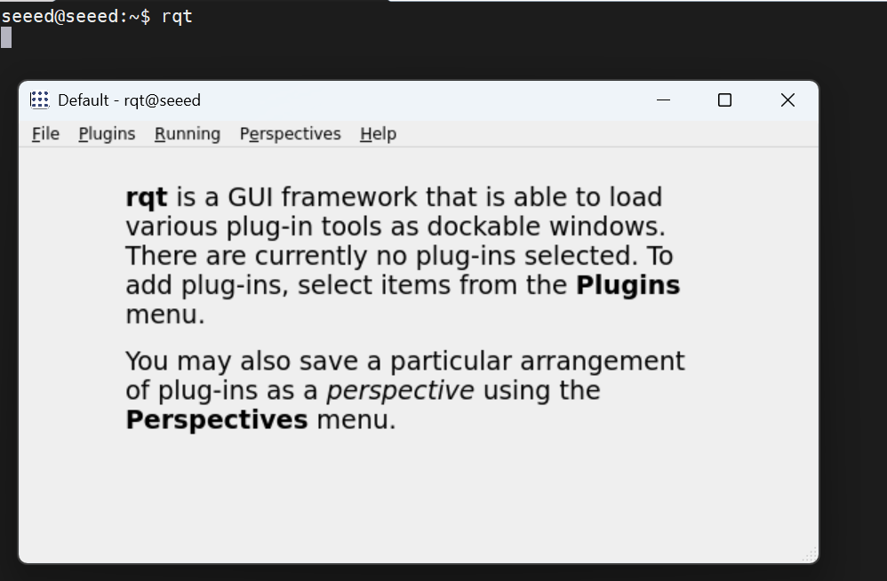

Start gazebo simulation environment

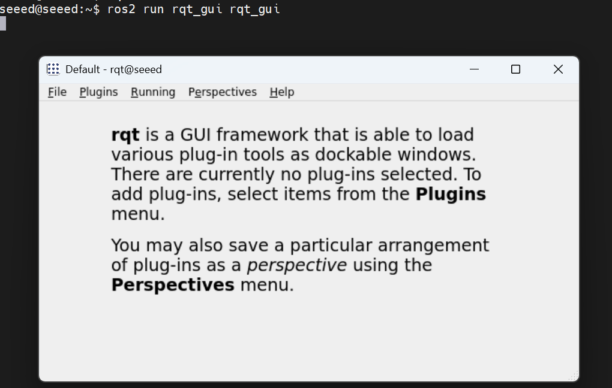

```bash
# source /opt/ros/humble/setup.bash
ros2 launch turtlebot3_gazebo turtlebot3_world.launch.py
```

> Note: Jetson may not be able to start, this operation is running on X86 PC

## 18.3 Rviz2 start

Starts a terminal and can be activated with the following command:

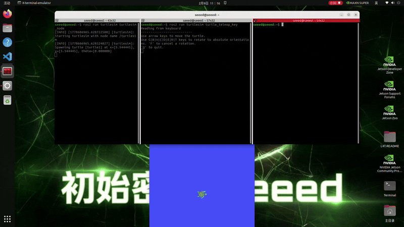

```bash
rviz2
```

> Note: If started in docker, make sure that the GUI display has been opened.

## 18.4 Visualization of image data

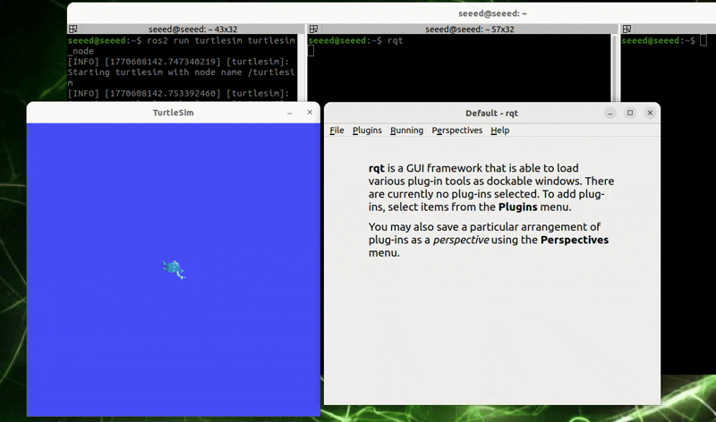

Click on Add in the left Displays window to find the Image display item, OK to add the display list after confirmation, and then configure the image topic for the display item, so that you can see the robot's camera image.

[ Picture download failed]

Select Fixed Frame to base footprint coordinates

Select Camera Color Topic

Now, we can see the vision of the current simulation robot in the Camera window.

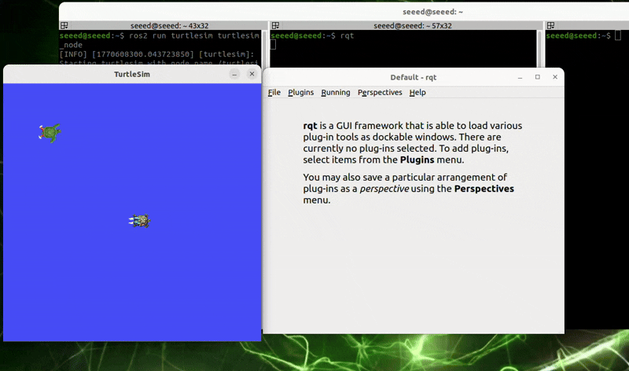

### 18.5 Radar data visualization

Click on Add in the Displays window to the left, select Laserscan, and configure the subject name for the subscription.

Topic selection for LaserScan

At this point, we can see the contours of the laser radar.

### 18.6 Visualization of robotic models

Click Add in the left Displays window, select RobotModel

Select the topic for robotDescriptionTopic

We can see the visualization of robots in Rviz2.

### 18.7 Visualization of other data

The rivz default plugins list many commonly used data visualization plugins that you can use at one time or another.

### 18.8 Next steps

1. 19 Rqt Toolbox - Learning Rqt Tool

2. 20 Launch Configuration - Learn Launch Configuration

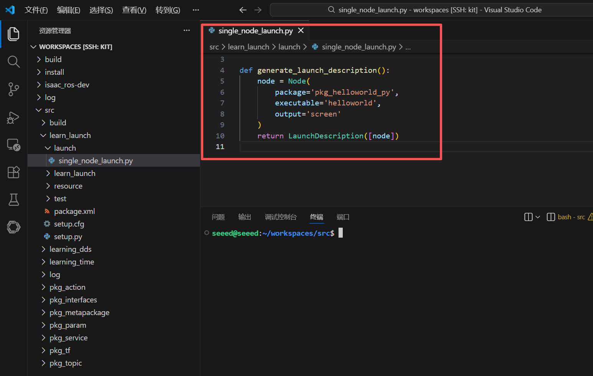

### 19 Rqt Toolbox

## 19 Rqt Toolbox (Rqt Tools)

## 19.1 Rqt Overview

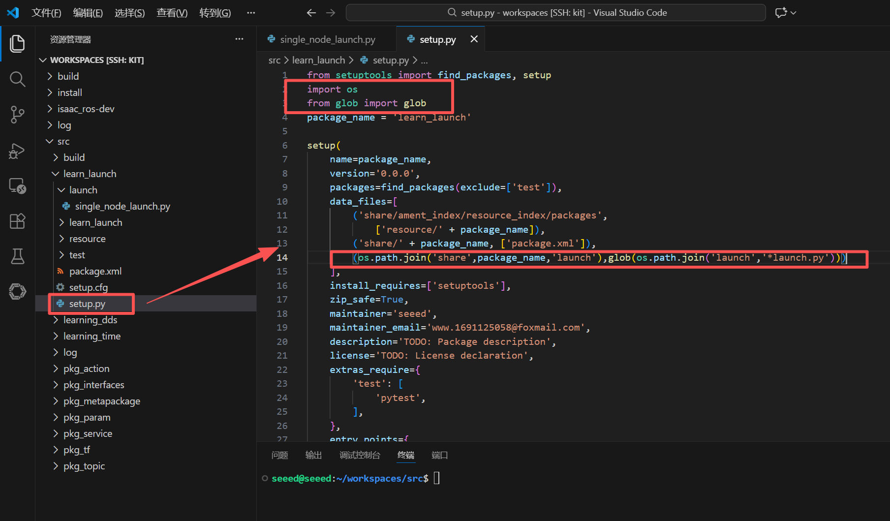

| rqt is a graphical Qt-based tool frame in ROS that integrates many common functions into a visual interface by plugining. The developers can visualize and debug the system by viewing rqt, e.g. the distribution/subscription of Topic, monitoring nodes and communications (rqt graph), real-time viewing of logs (rqt console), dynamic referencing (rqt reconfigure) and drawing analysis data (rqt plot). Simply put, rqt, like ROS's Multifunctional Visualized Debug Sheet, can significantly increase the efficiency of development, miscalculation and system understanding. |  |
| --- | --- |

> Plain Text
> Rqt plugin ecology:
>
> That's right. That's right.
> Rqt frame
> I'm sorry.
> Zenium
>
> │rqt graph│rqt plot│rqt console│
> │ (nodes) │ (data drawing) │ (log view) │
>
> Zenium
>
> │rqt reconfigure
> │ (parameter configuration) T (TF tree) T (data package) │
>
> Zenium

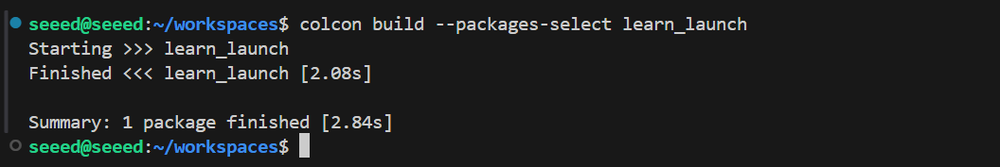

### 19.2 Installation

The rqt toolbox is usually installed by default as long as the desktop version is installed; If the installation of ros2 is not a complete version of the installation, it may be installed as follows:

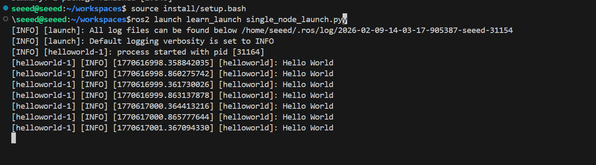

```bash
sudo apt install ros-${ROS_DISTRO}-rqt*
```

## 19.3 Commencement

Common rqt start-up orders are:

```bash
# Method 1: run `rqt` in the terminal
rqt
```

```bash
# Method 2
ros2 run rqt_gui rqt_gui
```

## 19.4 Use of plugins

After starting rqt, you can add the required plugins through plugins:

Open a small turtle example to see subscriptions to nodes:

```bash
# Terminal 1:
ros2 run turtlesim turtlesim_node
# Terminal 2:
ros2 run turtlesim turtle_teleop_key
# Terminal 3:
rqt
```

The plugins contain topics, services, actions, parameters, logs, etc., which can be adapted to facilitate the ROS2 debugging. The following examples are used.

### 19.4.1 topic plugins

Add topic plugins and send speed commands to control turtle movement.

### 19.4.2 service plugin

Adds a service plugin and sends a request to create a turtle at a given location.

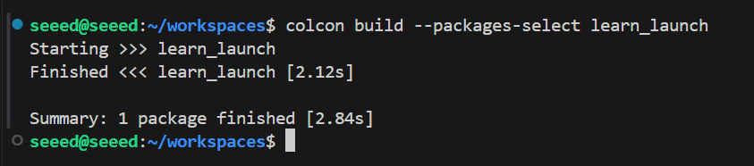

[ Picture download failed]

### 19.4.3 Parameter plugins

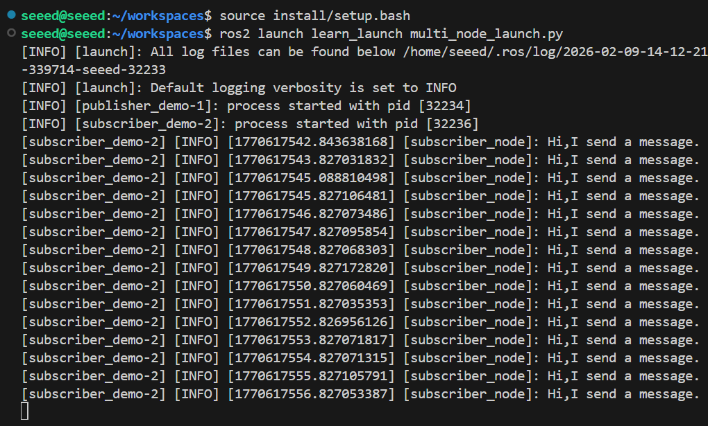

Changes the background colour of the turtle form through the parameter plugin dynamically.

## 19.5 Next steps

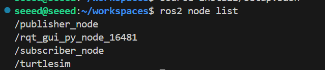

1. 20 Launch Configuration - Learn Launch Configuration

Record and Playback - learning package recording

### 20 Launch Configuration

### 20 Launch Configuration (Launch Files)

## 20.1 Launch Overview

The Launch startup file in ROS is used for the integrated management and activation of multiple nodes/components and is essentially a system-level startup script. It can be prepared by Python (most commonly), XML or YAML, supporting the simultaneous activation of multiple nodes, setting parameters, remapping topics, loading namespaces, configuration of environment variables, and making more advanced logical controls, such as conditional start-up, delayed start-up, trigger-by-incident, etc. In short, the Launch file is the core tool of the ROS 2 project to package and configure "start in one key" a set of nodes, especially for the deployment and commissioning of complex robotic systems.

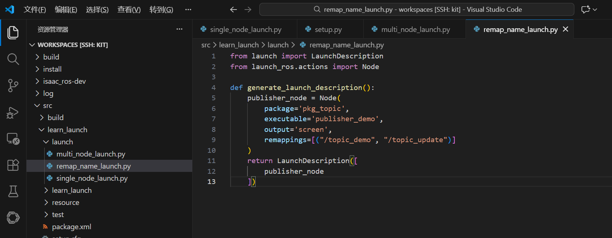

### 20.2 Launch of a single Node node

### 20.2.1 Preparatory kits

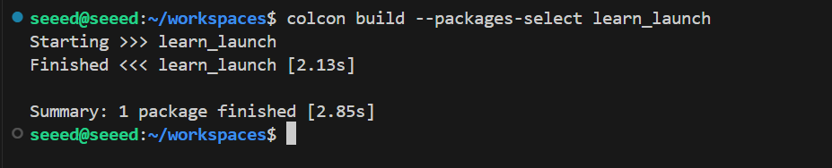

```bash
cd ~/workspaces/src
ros2 pkg create learn_launch --build-type ament_python
```

### 20.2.2 New launch file

Creates a new lanch folder under the functional package, then creates a new single node launch.py file in the launch folder to copy the following:

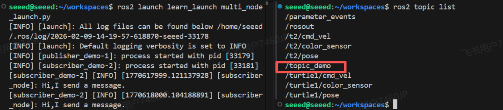

```bash
from launch import LaunchDescription
from launch_ros.actions import Node

def generate_launch_description():
  node = Node(
  package='pkg_helloworld_py',
  executable='helloworld',
  output='screen'
  )
  return LaunchDescription([node])
```

### 20.2.3 Configuration setup.py files

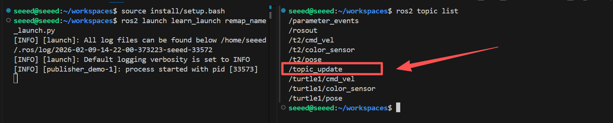

The launch file is often named after LaunchName launch.py, where LaunchName is customised and  launch.py is often considered fixed. You need to modify the setup.py file under the functional package to add the document under the launch path so that you can compile the .py file for execution

```bash
# 1. Import the required header files
import os
from glob import glob

# 2. Add the `launch` path and its `launch.py` file to the `data_files` list
(os.path.join('share',package_name,'launch'),glob(os.path.join('launch','*launch.py')))
```

### 20.2.4 Compiler functional kit

```bash
cd ~/workspaces
colcon build --packages-select learn_launch
```

### 20.2.5 Operational procedures

```bash
# Refresh environment variables
source install/setup.bash
ros2 launch learn_launch single_node_launch.py
```

### 20.2.6 Source analysis

Import Related Library

```bash
from launch import LaunchDescription
from launch_ros.actions import Node
```

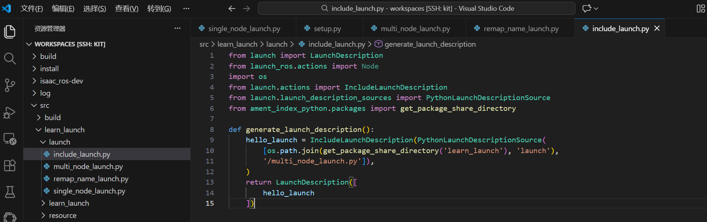

Defines a function generate launch description and returns a launch description

```bash
def generate_launch_description():
  node = Node(
  package='pkg_helloworld_py',
  executable='helloworld',
  )
  return LaunchDescription([node])
```

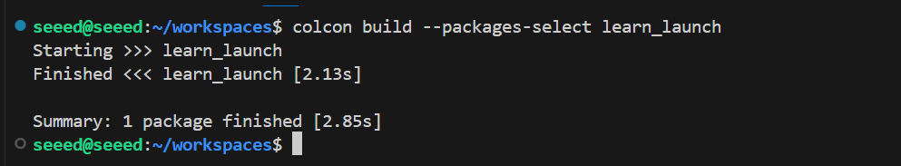

Defines the return value that a variable Node starts as a node, calls the Node function and starts two important parameters, type and exitable.

Package: indicates the functional package, representing the name of the functional package.

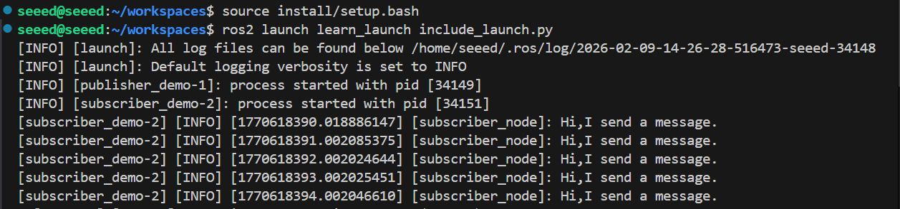

Executable: indicates the procedure performed, the name of the enforceable procedure.

The last call to the LaunchDescription function is to enter the node parameter to execute the return.

```bash
return LaunchDescription([node])
```

### 20.3 lanch of multiple Node nodes

### 20.3.1 New lanch file

New multi node launch.py file, add the following:

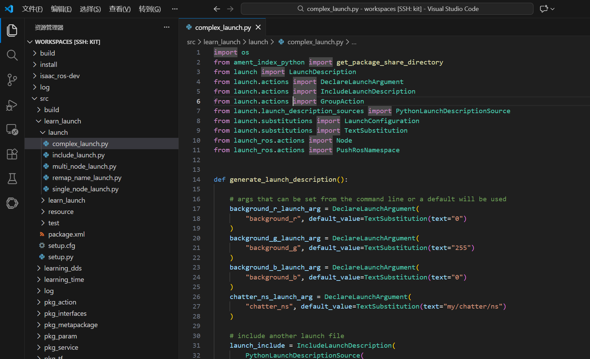

```bash
from launch import LaunchDescription
from launch_ros.actions import Node

def generate_launch_description():
  publisher_node = Node(
  package='pkg_topic',
  executable='publisher_demo',
  output='screen'
  )
  subscriber_node = Node(
  package='pkg_topic',
  executable='subscriber_demo',
  output='screen'
  )
  return LaunchDescription([
  publisher_node,
  subscriber_node
  ])
```

### 20.3.2 Compiler functional kit

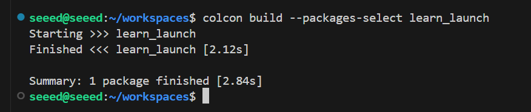

```bash
colcon build --packages-select learn_launch
```

### 20.3.3 Operational procedures

```bash
# Refresh environment variables
source install/setup.bash
ros2 launch learn_launch multi_node_launch.py
```

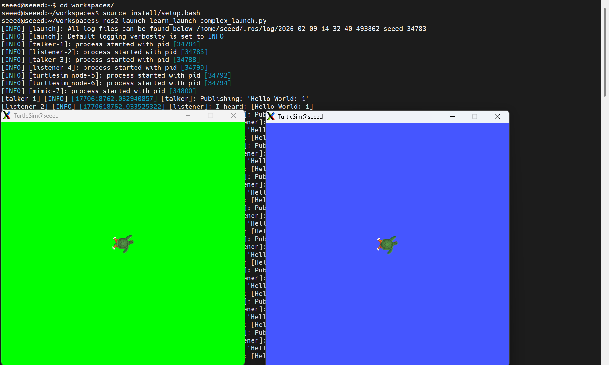

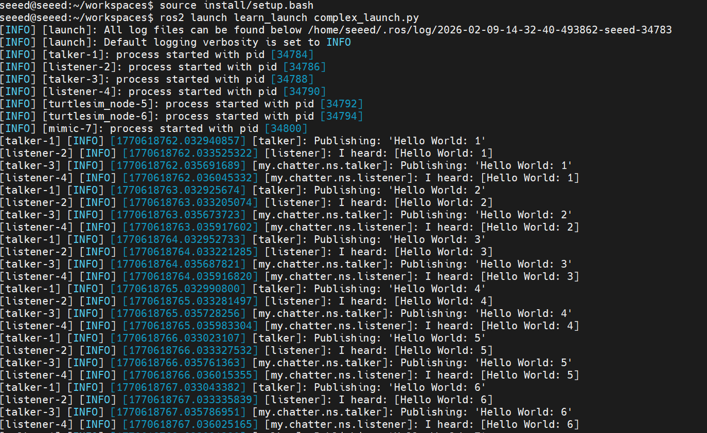

If the terminal does not print the contents, you can see which nodes are activated to verify whether the startup has been successful.


```bash
ros2 node list
```

### 20.3.4 Source resolution

It's like simple node launch.py, just another node!

## 20.4 Topical re-mapping cases

### 20.4.1 New launch file

Create a new remap name launch.py file under the multi node launch.py directory, adding the following:

```bash
from launch import LaunchDescription
from launch_ros.actions import Node

def generate_launch_description():
  publisher_node = Node(
  package='pkg_topic',
  executable='publisher_demo',
  output='screen',
  remappings=[("/topic_demo", "/topic_update")]
  )
  return LaunchDescription([
  publisher_node
  ])
```

### 20.4.2 Compiler functional kit

```bash
colcon build --packages-select learn_launch
```

### 20.4.3 Operational procedures

Let's see what the publicsher demo nodes are saying before they re-map the topic:

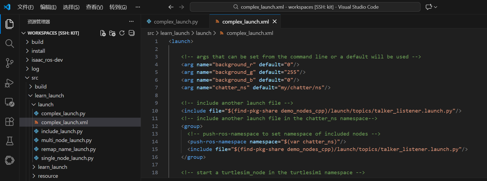

```bash
# ros2 launch learn_launch multi_node_launch.py
ros2 topic list
```

Here's the topic: /topic_demo.

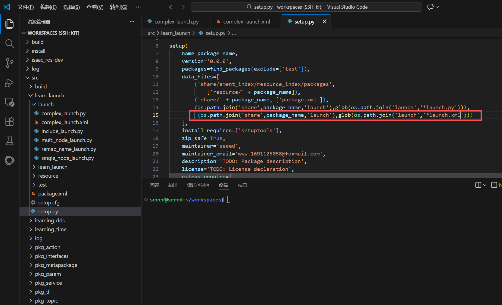

```bash
# Refresh the environment variables and run the remapped-topic program to observe the changes:
source install/setup.bash
ros2 launch learn_launch remap_name_launch.py
ros2 topic list
```

Re-map the subject name /topic_update

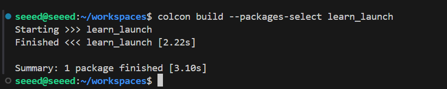

### 20.4.4 Source analysis

In particular, the following sections have been added:

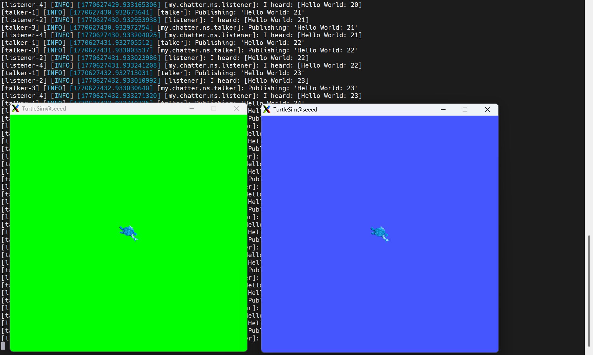

```bash
remappings=[("/topic_demo", "/topic_update")]
```

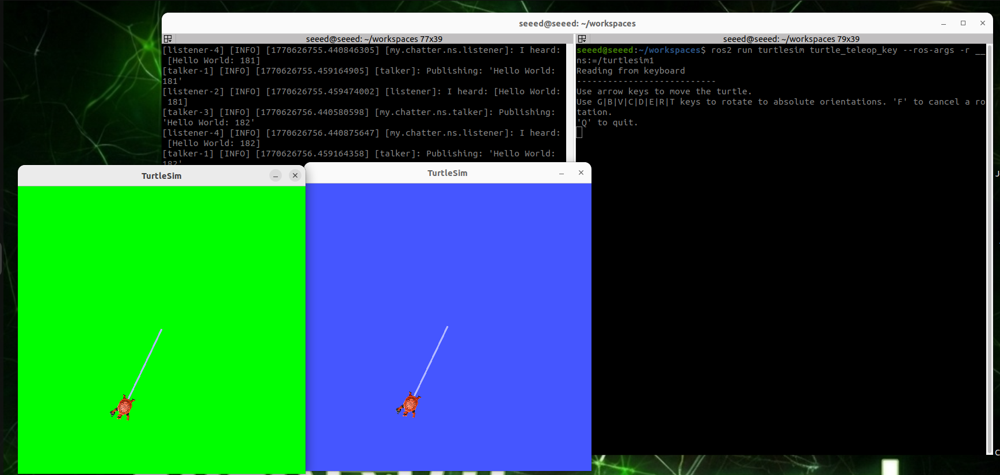

Here's to remix the original XIAITOKEN0 topic into /topic_update.

### 20.5 Launch File Embedding Starts another launch file

### 20.5.1 New launch file

New include launch.py under multi-de launch.py directory, add the following:

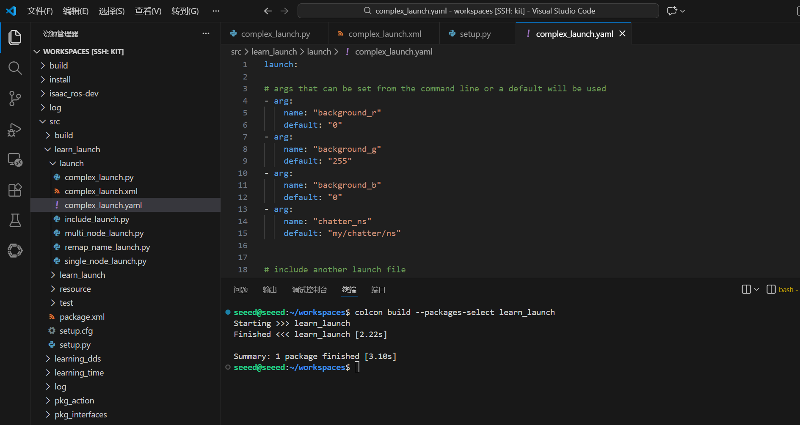

```bash
from launch import LaunchDescription
from launch_ros.actions import Node
import os
from launch.actions import IncludeLaunchDescription
from launch.launch_description_sources import PythonLaunchDescriptionSource
from ament_index_python.packages import get_package_share_directory

def generate_launch_description():
  hello_launch = IncludeLaunchDescription(PythonLaunchDescriptionSource(
  [os.path.join(get_package_share_directory('learn_launch'), 'launch'),
  '/multi_node_launch.py']),
  )
  return LaunchDescription([
  hello_launch
  ])
```

### 20.5.2 Compiler functional kit

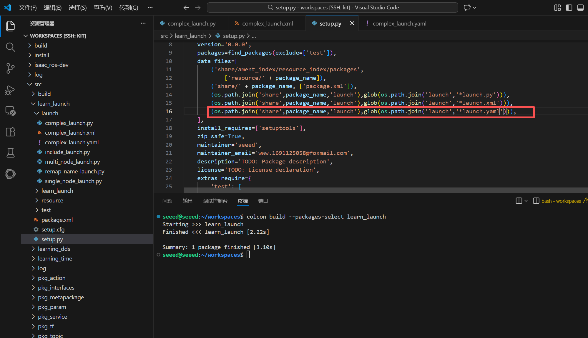

```bash
colcon build --packages-select learn_launch
```

### 20.5.3 Operational procedures

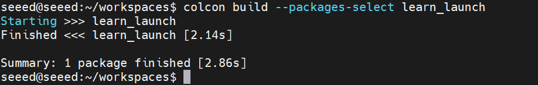

```bash
# Refresh environment variables
source install/setup.bash
ros2 launch learn_launch include_launch.py
```

### 20.5.4 Source analysis

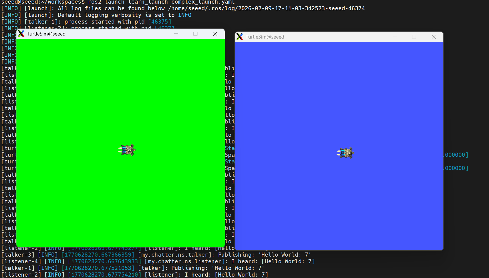

Embedding the launch file requires the use of the lunch system's IncludeLaunchDescription and PythonLaunchDescriptionsource categories

os.path.join (get package share directory('learn launch'): take the position of the functional package, where the name of the functional package is Learn launch;

(a) launch': means a folder containing launch files under a functional kit;

/multi_node_launch.py': denotes a /multi_node_launch.py file under the launch folder.

## 20.6 Examples of composite launch documents

This demo mainly shows how complex lanch files are prepared, and the functionality of the program is negligible.

### 20.6.1 New launch file

Create a new complex launch.py file under the multi node launch.py directory, adding the following:

```bash
# complex_launch.py
import os
from ament_index_python import get_package_share_directory
from launch import LaunchDescription
from launch.actions import DeclareLaunchArgument
from launch.actions import IncludeLaunchDescription
from launch.actions import GroupAction
from launch.launch_description_sources import PythonLaunchDescriptionSource
from launch.substitutions import LaunchConfiguration
from launch.substitutions import TextSubstitution
from launch_ros.actions import Node
from launch_ros.actions import PushRosNamespace


def generate_launch_description():

  # args that can be set from the command line or a default will be used
  background_r_launch_arg = DeclareLaunchArgument(
  "background_r", default_value=TextSubstitution(text="0")
  )
  background_g_launch_arg = DeclareLaunchArgument(
  "background_g", default_value=TextSubstitution(text="255")
  )
  background_b_launch_arg = DeclareLaunchArgument(
  "background_b", default_value=TextSubstitution(text="0")
  )
  chatter_ns_launch_arg = DeclareLaunchArgument(
  "chatter_ns", default_value=TextSubstitution(text="my/chatter/ns")
  )

  # include another launch file
  launch_include = IncludeLaunchDescription(
  PythonLaunchDescriptionSource(
  os.path.join(
  get_package_share_directory('demo_nodes_cpp'),
  'launch/topics/talker_listener.launch.py'))
  )
  # include another launch file in the chatter_ns namespace
  launch_include_with_namespace = GroupAction(
  actions=[
  # push-ros-namespace to set namespace of included nodes
  PushRosNamespace(LaunchConfiguration('chatter_ns')),
  IncludeLaunchDescription(
  PythonLaunchDescriptionSource(
  os.path.join(
  get_package_share_directory('demo_nodes_cpp'),
  'launch/topics/talker_listener.launch.py'))
  ),
  ]
  )

  # start a turtlesim_node in the turtlesim1 namespace
  turtlesim_node = Node(
  package='turtlesim',
  namespace='turtlesim1',
  executable='turtlesim_node',
  name='sim'
  )

  # start another turtlesim_node in the turtlesim2 namespace
  # and use args to set parameters
  turtlesim_node_with_parameters = Node(
  package='turtlesim',
  namespace='turtlesim2',
  executable='turtlesim_node',
  name='sim',
  parameters=[{
  "background_r": LaunchConfiguration('background_r'),
  "background_g": LaunchConfiguration('background_g'),
  "background_b": LaunchConfiguration('background_b'),
  }]
  )

  # perform remap so both turtles listen to the same command topic
  forward_turtlesim_commands_to_second_turtlesim_node = Node(
  package='turtlesim',
  executable='mimic',
  name='mimic',
  remappings=[
  ('/input/pose', '/turtlesim1/turtle1/pose'),
  ('/output/cmd_vel', '/turtlesim2/turtle1/cmd_vel'),
  ]
  )

  return LaunchDescription([
  background_r_launch_arg,
  background_g_launch_arg,
  background_b_launch_arg,
  chatter_ns_launch_arg,
  launch_include,
  launch_include_with_namespace,
  turtlesim_node,
  turtlesim_node_with_parameters,
  forward_turtlesim_commands_to_second_turtlesim_node,
  ])
```

### 20.6.2 Compilation workspace

```bash
colcon build --packages-select learn_launch
```

### 20.6.3 Operational procedures

```bash
# source install/setup.bash
ros2 launch learn_launch complex_launch.py
```

Two turtles will be shown on Jetson.

Start keyboard control node and add naming space (because we added naming space when starting node in launch files)

```bash
ros2 run turtlesim turtle_teleop_key --ros-args -r __ns:=/turtlesim1
```

Use the right and left buttons to control turtle 1 movement. Sea turtle 2 is a perfect copy of turtle 1.

### 20.6.4 Description of the procedure

The process consisted mainly of initiation:

One, demo nodes cpp talker lister,

2. Talker lister node with namespace

Three, turtlesim1 is a little turtle in a named space.

4 and Turtlesim2 are named spaces for turtles2

Five, remagnify so that both turtles can hear the same command theme.

## 20.7 xml achieved

### 20.7.1 New launch file

New Complex Launch.py file under the directory of complex launch.xml, add the following:

```bash
<launch>

  <!-- args that can be set from the command line or a default will be used -->
  <arg name="background_r" default="0"/>
  <arg name="background_g" default="255"/>
  <arg name="background_b" default="0"/>
  <arg name="chatter_ns" default="my/chatter/ns"/>

  <!-- include another launch file -->
  <include file="$(find-pkg-share demo_nodes_cpp)/launch/topics/talker_listener.launch.py"/>
  <!-- include another launch file in the chatter_ns namespace-->
  <group>
  <!-- push-ros-namespace to set namespace of included nodes -->
  <push-ros-namespace namespace="$(var chatter_ns)"/>
  <include file="$(find-pkg-share demo_nodes_cpp)/launch/topics/talker_listener.launch.py"/>
  </group>

  <!-- start a turtlesim_node in the turtlesim1 namespace -->
  <node pkg="turtlesim" exec="turtlesim_node" name="sim" namespace="turtlesim1"/>
  <!-- start another turtlesim_node in the turtlesim2 namespace
  and use args to set parameters -->
  <node pkg="turtlesim" exec="turtlesim_node" name="sim" namespace="turtlesim2">
  <param name="background_r" value="$(var background_r)"/>
  <param name="background_g" value="$(var background_g)"/>
  <param name="background_b" value="$(var background_b)"/>
  </node>
  <!-- perform remap so both turtles listen to the same command topic -->
  <node pkg="turtlesim" exec="mimic" name="mimic">
  <remap from="/input/pose" to="/turtlesim1/turtle1/pose"/>
  <remap from="/output/cmd_vel" to="/turtlesim2/turtle1/cmd_vel"/>
  </node>
</launch>
```

### 20.7.2 setup.py file configuration

The system needs to configure the compiled file and copy our .xml lanch files to the install installation directory to find our files

```bash
(os.path.join('share',package_name,'launch'),glob(os.path.join('launch','*launch.xml'))),
```

### 20.7.3 Compiler functional kit

```bash
cd ~/workspaces
colcon build --packages-select learn_launch
```

### 20.7.4 Operational procedures

```bash
# ros2 launch learn_launch complex_launch.xml
```

Two little turtles are expected, and the terminal prints log information.

Start keyboard control node and add namespace

```bash
ros2 run turtlesim turtle_teleop_key --ros-args -r __ns:=/turtlesim1
```

## 20.8 Yaml achieved

### 20.8.1 New launch file

New Complex Launch.pyaml file under the directory of complex launch.py, add the following:

```bash
launch:

# args that can be set from the command line or a default will be used
- arg:
  name: "background_r"
  default: "0"
- arg:
  name: "background_g"
  default: "255"
- arg:
  name: "background_b"
  default: "0"
- arg:
  name: "chatter_ns"
  default: "my/chatter/ns"


# include another launch file
- include:
  file: "$(find-pkg-share demo_nodes_cpp)/launch/topics/talker_listener.launch.py"

# include another launch file in the chatter_ns namespace
- group:
  - push-ros-namespace:
  namespace: "$(var chatter_ns)"
  - include:
  file: "$(find-pkg-share demo_nodes_cpp)/launch/topics/talker_listener.launch.py"

# start a turtlesim_node in the turtlesim1 namespace
- node:
  pkg: "turtlesim"
  exec: "turtlesim_node"
  name: "sim"
  namespace: "turtlesim1"

# start another turtlesim_node in the turtlesim2 namespace and use args to set parameters
- node:
  pkg: "turtlesim"
  exec: "turtlesim_node"
  name: "sim"
  namespace: "turtlesim2"
  param:
  -
  name: "background_r"
  value: "$(var background_r)"
  -
  name: "background_g"
  value: "$(var background_g)"
  -
  name: "background_b"
  value: "$(var background_b)"

# perform remap so both turtles listen to the same command topic
- node:
  pkg: "turtlesim"
  exec: "mimic"
  name: "mimic"
  remap:
  -
  from: "/input/pose"
  to: "/turtlesim1/turtle1/pose"
  -
  from: "/output/cmd_vel"
  to: "/turtlesim2/turtle1/cmd_vel"
```

### 20.8.2 Configuration

You need to configure the compiled file to copy our .yaml-format launch files to the Install installation directory before the ros system can find our files

```bash
(os.path.join('share',package_name,'launch'),glob(os.path.join('launch','*launch.yaml'))),
```

### 20.8.3 Compiler functional kit

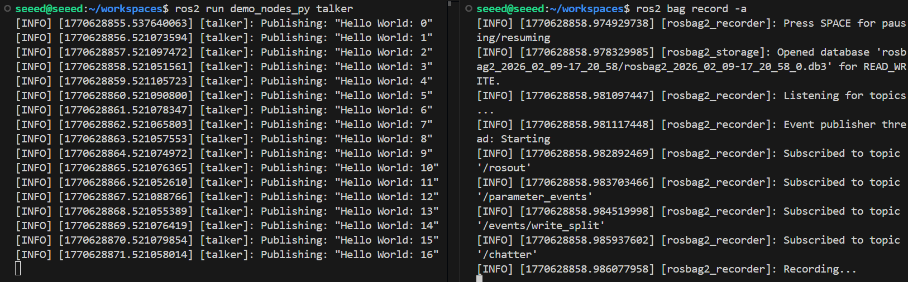

```bash
colcon build --packages-select learn_launch
```

### 20.8.4 Operational procedures

```bash
# Refresh environment variables
source install/setup.bash
ros2 launch learn_launch complex_launch.yaml
```

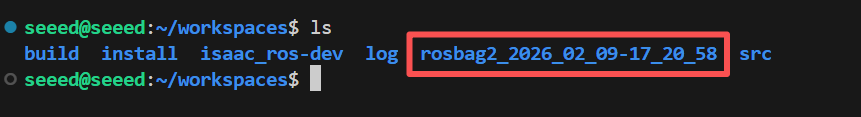

Start keyboard control node and add namespace

```bash
ros2 run turtlesim turtle_teleop_key --ros-args -r __ns:=/turtlesim1
```

Using keyboard control to activate turtle one, turtle two is a perfect imitation of turtle one.

## 20.9 Next steps

1.21 Record and Playback - learning package recording

2. 22 URL models - learning robotic modelling

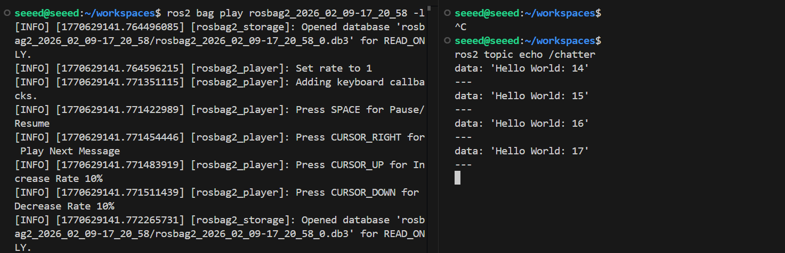

### 21 Record and Playback

## 21 Record Back

## 21.1 Rosbag2 Overview
