# ROS2 Simulation and Vision

## 22 URDF Model

### 22 URDF Model (URDF Modeling)

### 22.1 URDF Overview

The URL in ROS 2 is a robotic model description document prepared using XML to define robotic poles (link), joints (joint), geometric shapes, mass inertia, coordinates, and information such as collision and visualization models. It is the basis for robotic TF coordinates in ROS 2, Gazebo/Ignition simulation, RViz visualization, motion planning, etc. In short, the URL is the standard model file that ROS 2 uses to "show the system robots what they look like, how the components connect."

### 22.1.1 What is a URL

The URL (Unified Robot Description Format) is a robotic description file in XML format that defines the geometry, joints, inertia, etc. of robots.

> Plain Text
> URL file structure:
>
> I don't know, robot.urdf.
> # Root elements #
> {\cHFFFFFF}{\cH00FFFF} {\cHFFFFFF}{\cH00FFFF}
> # Visible
> # Collision
> # Inertity
> │-- <joint> # joint definition
> ♪ Father's pole ♪
> ♪ Sub-strike ♪
> # Change #

### 22.2 Composition of robots

In modelling robots, we need to first be familiar with their overall composition and key parameters. In general, robots consist mainly of four components of hardware structures, drive systems, sensor systems and control systems. The types of robots that are common on the market, whether mobile robots or robotic arms, can be dismantled and analysed according to these four constituent modules, thus laying the groundwork for subsequent modelling.

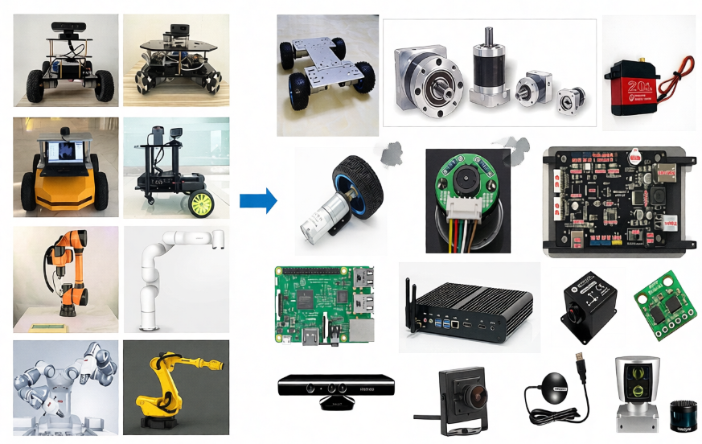

The hardware structure is a solidly visible device such as a chassis, shell, electric press etc.;

The drive system is a device that can drive the equipment to normal use, such as an electrical drive, a power management system, etc.;

Sensation systems, including encoders on electrics, paneled IMUs, installed cameras, radars, etc., allow robots to sense their own state and external environment;

The control system is the main vehicle in our development process, typically the strawberry pie, computer, etc. computing platform, and the operating systems and applications inside.

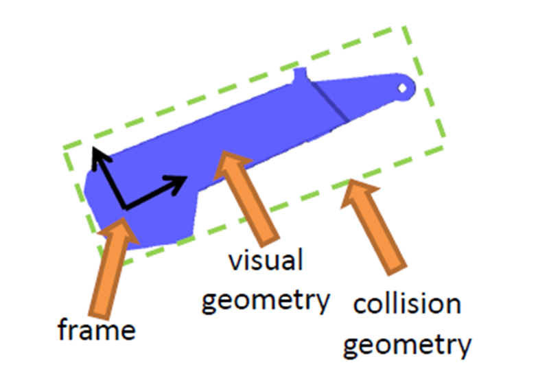

The process of robotic modelling is, in a similar way, the process of describing each part of the robot in terms of the language of modelling, and combining it.

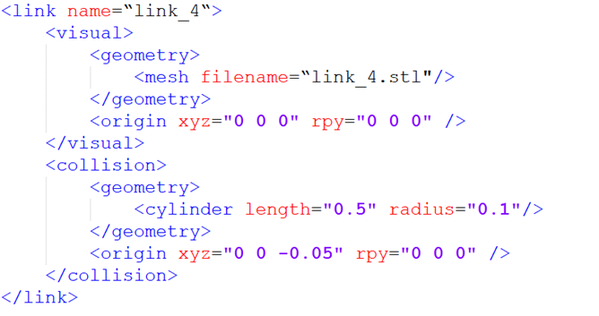

## 22.3 URL syntax

### 22.3.1 Description of the link

The labels are used to describe the appearance and physical properties of a part of the carcass of a robot, including size, colour, shape, physical properties including mass, inertial matrix, collision parameters, etc.

For example, this mechanical arm pole is described as follows:

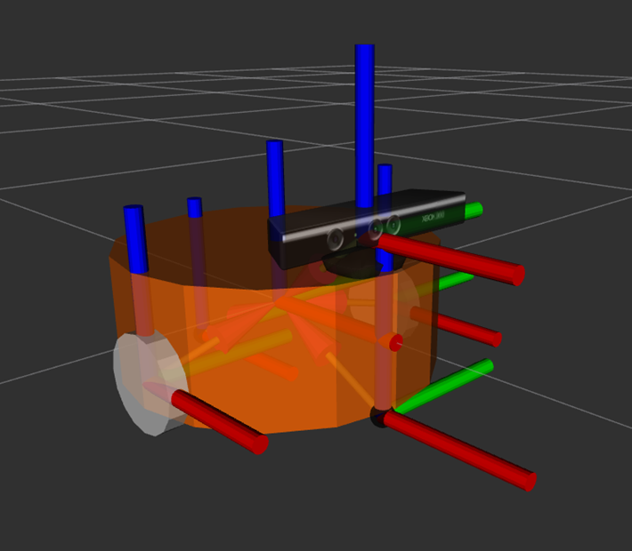

The name in the link label is the name of the pole, and we can customize it to be used in the future when the link is connected.

The section inside the link describes the appearance of robots, such as:

This is the stl file, which looks like the real robot.

This represents the deviation of the coordinates relative to the initial position, with a horizontal shift of x, y, z, and roll, pitch, raw rotation, all of which are 0 if no deviation is required.

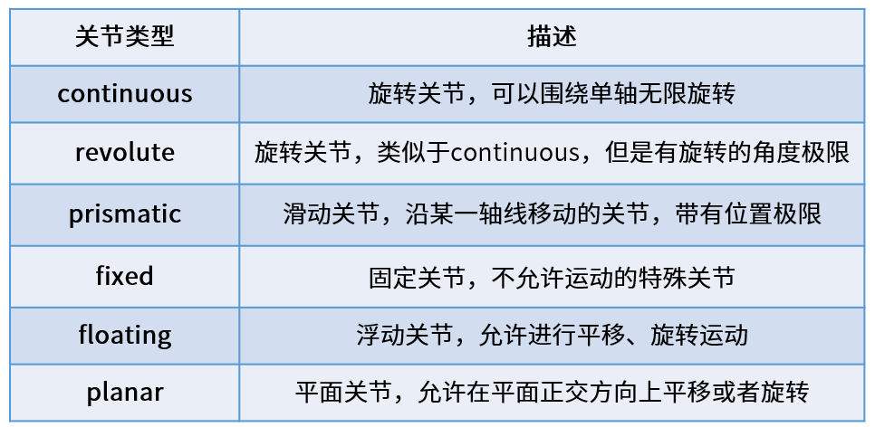

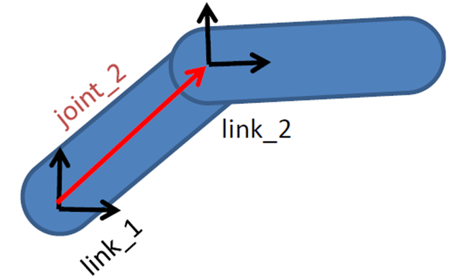

The second, describing the collision parameters, appears to be the same as, and also the same as, the same as, the larger difference.

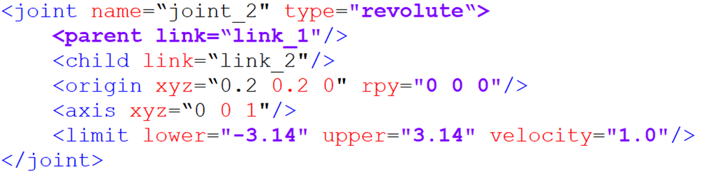

Part of the focus is on describing what robots look like, which is the visual effect;

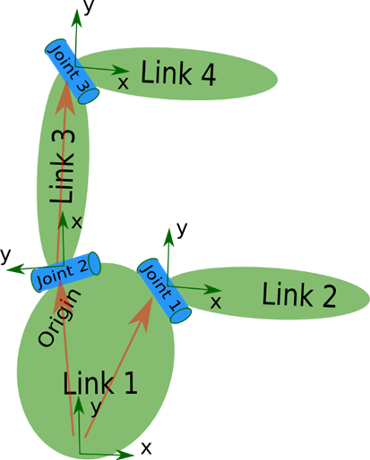

In part, it describes the state of robotic motion, such as how robotic contact with the outside world counts as collision.

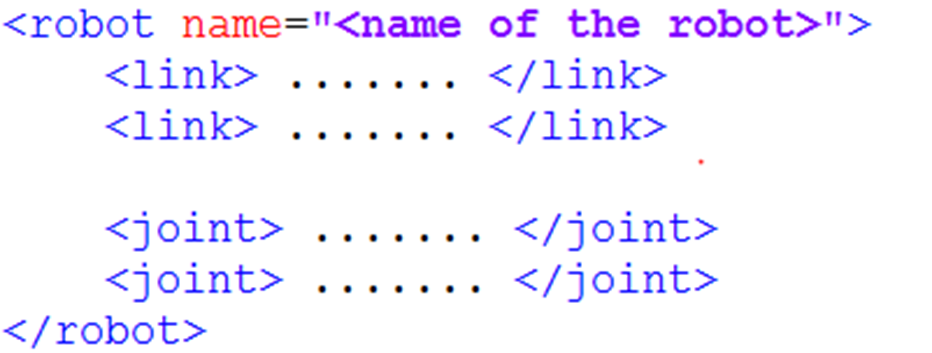

In this robotic model, the blue part is described, and in the process of physical control, this complex appearance is more demanding when calculating collision detection, and in order to simplify the calculation, we have simplified the model used for collision detection for the cylindrical form of the green box, which is the shape described in it. The same is true for the deviation of the coordinate system, which can describe the deviation of the rigid heart.

In the case of mobile robots, the link can also be used to describe the car body, wheels, etc.

### 22.3.2 Joint description of joints

It's only when the shoals in the robotic model are finally connected through the joints before they can generate relative motion.

There are six motor types of joints in the URL.

Continuous, describing rotational motion, can rotate indefinitely around an axis, such as a wheel in a car, which is this type.

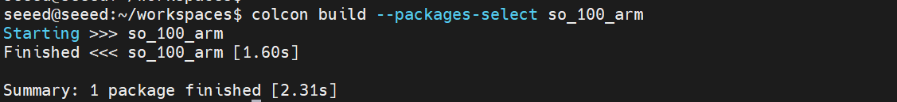

The difference between revolute, which is also a spin joint, and continous type is that it cannot rotate indefinitely, but rather has angle limitations, such as two poles in a mechanical arm, which belong to this type of movement.

Prismatic, which is a slide joint, can be smoothed along a particular axis and has the limit of its location, as is the case with a general line power.

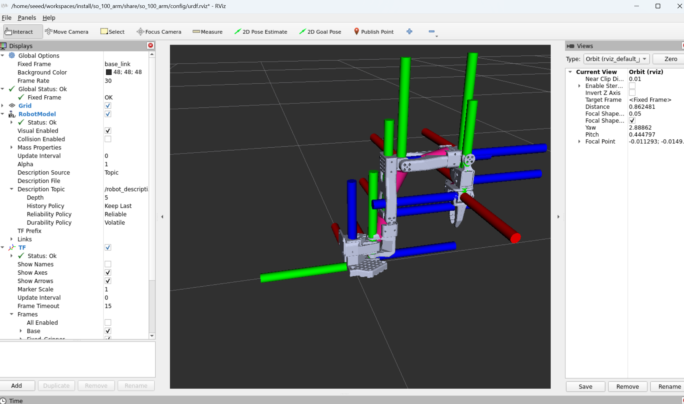

Fixed, fixed joint, is the only joint that does not allow movement, although it is still used more frequently, such as the camera, which is installed on robots and its relative position is not changed, and the connection used at this time is Fixed.

Floating is floating joints, and the sixth Planar is flat joints, which are relatively few in use.

In the URL model, each link uses a description of the xml content, such as the name of the joint, which type of exercise.

Parent label: describe the parent pole;

(a) Child label: a description of a subbar, which moves relative to the parent pole;

(a) Origin: the relationship between the two co-coordinates, the red vector in the picture, can be understood as how the two co-ordinates should be installed together;

(axis) means the unit vector of the joint axis, such as z equals 1, which means that the rotational movement is carried out in the right direction around the z axis;

The limit represents some of the limitations of the movement, such as minimum location, maximum location and maximum speed.

## 22.4 Complete robotic model

Eventually, all the link and joint labels complete the description and combination of each part of the robot, all in a robot label, and form a complete robotic model.

So when you look at a particular URL model, you look at the details of each piece of code, and you look for the link and the joint, and you look at what the robot is made of, and you know the whole picture, and you look at the details.

## 22.5 Import of SO-ARM mechanical arm

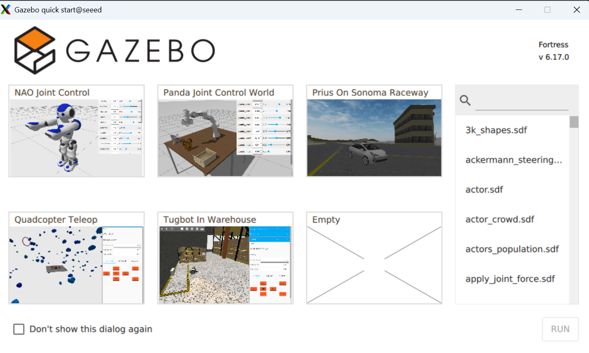

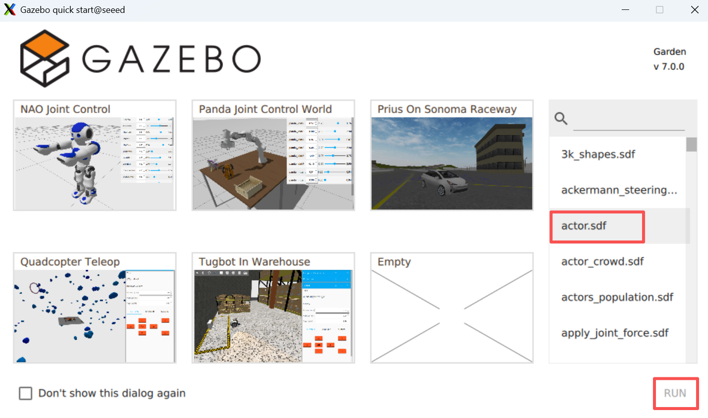

### 22.5.1 Cloning warehouses:

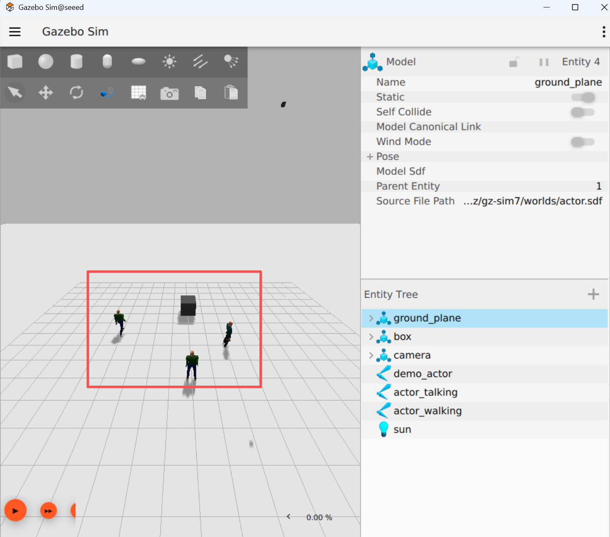

```bash
cd ~/workspaces/src
git clone https://github.com/brukg/SO-100-arm.git
```

### 22.5.2 Compilation projects

```bash
# Install dependencies
cd ..
rosdep install --from-paths src --ignore-src -r -y
# Build the package
colcon build --packages-select so_100_arm
```

## 22.5.3 View mechanical arm in Gazebo

```bash
# Refresh environment variables
source install/setup.bash
ros2 launch so_100_arm rviz.launch.py
```

### 22.6 Next steps

Gazebo Simulation - Learning Physical Simulation

2.24 Camera Preview - Learning Camera Configuration

# 23 Gazebo Simulation

## 23 Gazebo Simulation

## 23.1 Gazebo Overview

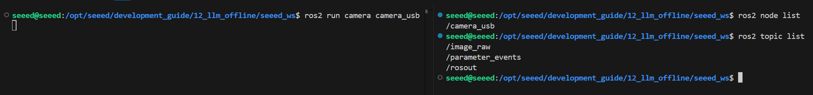

Gazebo is a commonly used robotic simulation platform where virtual environments can be built to simulate robotic motion, sensor data and physical interactions in the real world (e.g. gravity, collision, friction, etc.). It supports the import of robotic models (URDF/SDF) and can simulate a variety of sensors, such as cameras, laser radars and IMU, and is therefore frequently used in robotic algorithm development, debugging and testing, especially in the ROS/ROS2 ecology. Through Gazebo, developers can quickly validate such functions as control, navigation, and SLAM without relying on real hardware, significantly reducing development costs and risks.

### 23.1.1 What's Gazebo?

> Plain Text
> Gazebo simulation structure:
>
> That's right. That's right.
> Gazebo Server
>
> │ │ Physics engine
> │ (ODE/Bullet) │ (OGRE) │ plugin │
>
> I'm sorry.
> ROS 2 interface
>
> │/cmd_vel │/odom │/scan │

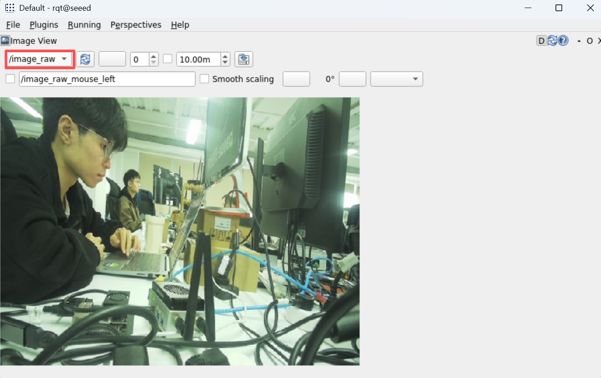

### 23.2 Installation operations

Install gazebo by command apt

```bash
sudo apt install ros-${ROS_DISTRO}-ros-gz
```

Start gazebo by the following command

```bash
# ros2 launch ros_gz_sim gz_sim.launch.py
```

The model is as follows:

### 23.3 Next steps

1.24 Camera Preview - Learning Camera Configuration

2.25 Camera calibration - learning camera calibration

# 24 Camera Preview

## 24 Camera Preview

## 24.1 Compiler functional kit

```bash
cd /opt/seeed/development_guide/12_llm_offline/seeed_ws
colcon build
source install/setup.bash
```

## 24.2 Launch camera.

> Start the camera.

```bash
ros2 run camera camera_usb
```

> View Nodes and Topics

## 24.3 Preview image

View the image of the camera using rqt: rqt →Plugins →Visualization →Image View

```bash
rqt
```

## 24.4 Key codes

```bash
import rclpy
from rclpy.node import Node
from sensor_msgs.msg import Image
from cv_bridge import CvBridge
import cv2

class CameraNode(Node):
  def __init__(self):
  super().__init__('camera_usb')
  self.publisher = self.create_publisher(Image, 'image_raw', 10)
  self.bridge = CvBridge()

  self.cap = cv2.VideoCapture(0)
  if not self.cap.isOpened():
  self.get_logger().error('Unable to open camera')
  return

  self.timer = self.create_timer(0.05, self.timer_callback)

  def timer_callback(self):
  ret, frame = self.cap.read()
  if ret:
  image_msg = self.bridge.cv2_to_imgmsg(frame, encoding="bgr8")
  self.publisher.publish(image_msg)
  else:
  self.get_logger().warn('Failed to capture image')

def main(args=None):
  rclpy.init(args=args)
  node = CameraNode()
  rclpy.spin(node)

  node.cap.release()
  rclpy.shutdown()

if __name__ == '__main__':
  main()
```

### 24.5 Next steps

1.25 Camera calibration - Learning camera calibration

2. 26 AR Visual - Learning AR Visual

### 25 Camera calibration

## Camera calibration

## 25.1 Summary of camera calibration

### 25.1.1 What is camera calibration

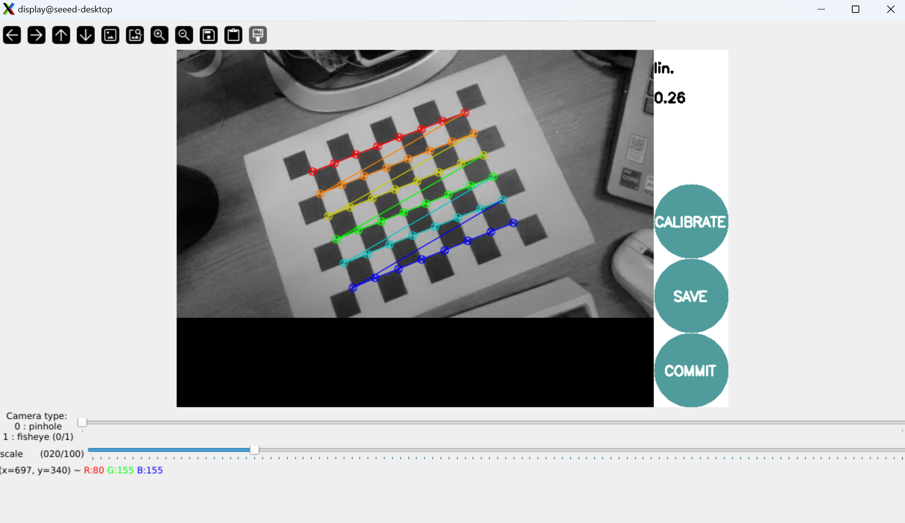

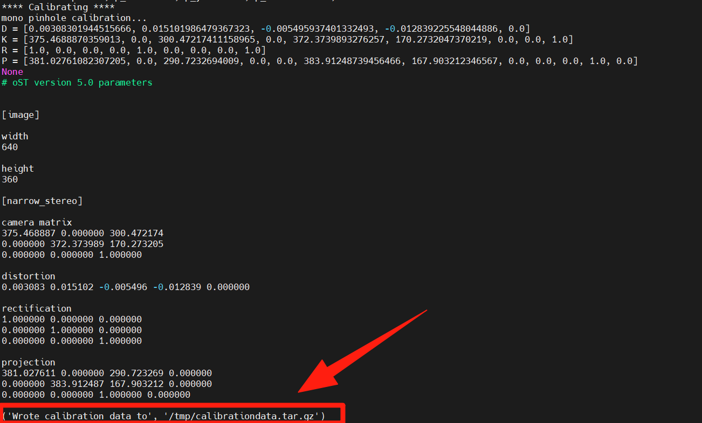

Camera calibration is the process of determining the camera internal (focal length, main point, aberration factor) and external (position, attitude) nuclei.

Cameras are devices that use lens imaging, and geometric aberrations are introduced because of the physical properties of lenses. The calibration is to describe and compensate for these anomalies through mathematical models.

> Plain Text
> Camera parameter details:
>
> Introsync - Optical properties inherent in cameras:
> Ideas - focal length
> │ └ - lens focal length in pixel units, determine the size of the field of view
> Ideas - main point
> │ - the intersection of the axis to the image plane, usually near the image center
> Distortion coefficients
> │-Range malformation (k1, k2, k3) - barrel/ pillow malformation
> (p1, p2)
>
> Extrinsic - Camera position in the world coordinates:
> Rotation Matrix
> │ - Description of the rotation of the camera coordinates relative to the coordinates of the world
> └ - Altitude (translation vector: 3x1)
> └ - Description of the shift of the camera coordinates from the point of origin to the world coordinates
>
> Camera inner nuclei (Camera Matrix):
> [fx 0 cx]
> K = [0 fy c] (3x3 matrix)
> [0 0 1]

### 25.1.2 Why calibration

| Purpose | Annotations | Precision requirements |
| --- | --- | --- |
| Visual range | Convert pixel distance to actual distance | High Precision |
| 3D Reconstruction | Accurate 3D Information Restored, Processure from Motion | High Precision |
| Camera Collapse | Multi-cam image fusion, panoramic camera | Medium high precision |
| Robot Navigator | Accurate environmental perception, visual mileage. | High Precision |
| Object detection | Correct the edge of the object and increase the detection accuracy | Medium precision |
| AR/VR | Virtual content aligns precisely with the real world. | High Precision |

## 25.1.3 Camera malformation type

> Plain Text
> teratotype:
>
> 1. Radial Diversion
>
> Zenium
> Barrel Disturbation
> – –
> Quick, quick, quick.
> --------------------------------------------------------------------------------------------------------------------------------------------------------------------------------------- ---------------- -- -- -- -- -- -- -- -- -- -- -- -- -- -- -- -- -- -- -- -- -- -- -- -- -- -- -- -- -- -- -- -- -- -- -- -- -- -- -- -- -- -- -- -- -- -- -- -- -- -- -- -- -- -- -- --
> I'm sorry.
> ♪ Bang, bang, bang, bang ♪
> Zenium
> Pincushion Disturbation
> {\cHFFFFFF}{\cH00FFFF} {\cHFFFFFF}{\cH00FFFF} {\cHFFFFFF}{\cH00FFFF} {\cHFFFFFF}{\cH00FFFF} {\cHFFFFFF}{\cH00FFFF} {\cHFFFFFF}{\cH00FF00} {\cHFFFFFF}{\cH00FF00}
> Queenie--
> I'm sorry.
> I'm sorry.
> ♪ Twirl in line ♪
> I'm sorry.
>
> 2. Cut-off malformations (Tangential Distinction)
> Image plane is not entirely parallel to lens plane resulting

### 25.1.4 Calibration rationale

Camera calibration is based on a pinhole camera model, which solves the camera parameters by the known relationship between the coordinates of the world (an angle on the calibration plate) and the coordinates of the image (detected pixel positions).

> Plain Text
> Calibration process:
>
> world coordinates (3D) → external → camera coordinates (3D) → inner → projection 2D
> [X,Y,Z,1] [x,y,z] K [u,v,1]
>
> Reprojecting error:
> Calibration of quality indicators, calculation of error gaps at re-projecting points
> The smaller the value, the better the calibration.

## 25.2 Installation of calibration tools

Install camera package

```bash
sudo apt install ros-humble-camera-calibration
```

### 25.3 Downloading Board Grid

Download Chess pane from the following address

Chess Board Grid and print it out.

## 25.4 Run camera marking


```bash
# For 8x6 checkerboard with 25mm squares
ros2 run camera_calibration cameracalibrator --size 8x6 --square 0.025 \
  --ros-args --remap image:=/camera/color/image_raw --remap camera:=/camera/color
```

> Note:
> --size 8x6 refers to the number of inner angles (8x6 = 48 angles, corresponding to 9x7 grids)
> --square 0.025 means square size in millimetres (25 mm)
> Mobile camera captures images from different angles

Collects images from different angles, automatically calculates the camera parameters and keeps the tagging data in tooltips.

#### 25.5 Next steps

Upon completion of the camera calibration study:

1. 26 AR Visual - Learn AR Visual and ARUco Markers
