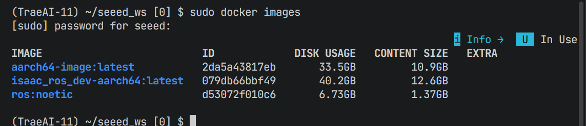
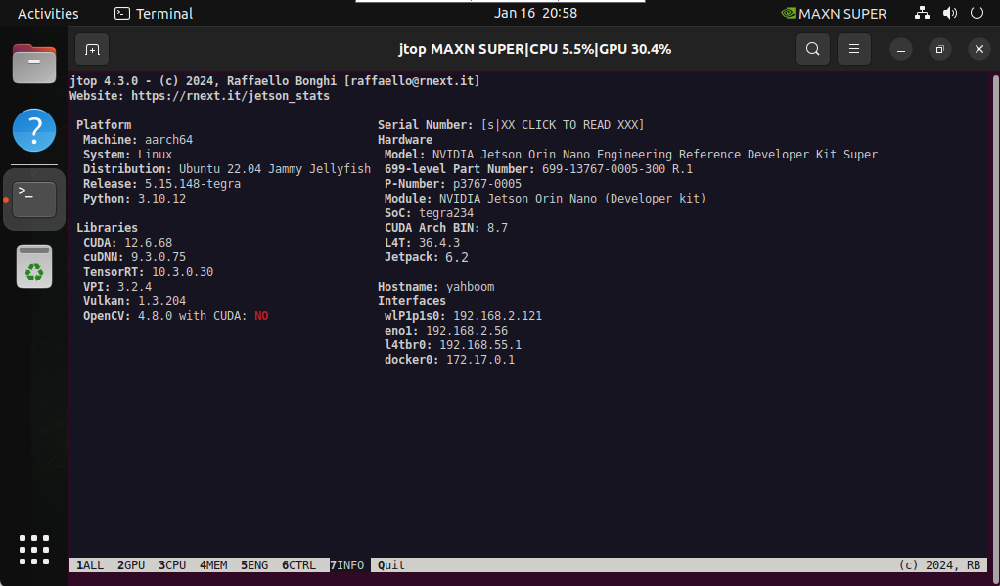

# 9.1 Isaac ROS Environment and Setup

## Isaac ROS Environment

> Note: Some Seeed Jetson images may already include a prepared Isaac ROS environment, so you may not need to rebuild everything from scratch.

Run the following command on the Jetson device to confirm whether Isaac ROS is already available:



```bash

sudo docker images
```

## Isaac ROS Overview

Isaac ROS is NVIDIA's ROS 2 software stack for accelerated robotics on Jetson. It packages GPU-accelerated perception, stereo depth, segmentation, pose estimation, SLAM, and related workflows behind standard ROS interfaces so the stack can be integrated into familiar robotic pipelines.

#### System requirements

| Item | Requirement |
| --- | --- |
| Jetson software stack | JetPack 6.2 on Jetson |
| ROS distribution | ROS 2 Humble |
| Container runtime | Docker with the `buildx` plugin |
| Storage | Enough free space for development images, models, and rosbag assets; SSD/NVMe is recommended |
| NVIDIA services | An NGC account and API key for authenticated container and asset downloads |
| Power mode | `MAXN SUPER` recommended during setup and benchmarking |

## ROS Compatibility

Isaac ROS Release 3.2 is designed around ROS 2 Humble on Jetson.

If your wider project still includes ROS 1 Noetic components, you can bridge selected workflows with Isaac ROS NITROS Bridge, but the setup in this chapter focuses on ROS 2.

> Note: Some Isaac ROS images and assets require authenticated access through NVIDIA NGC.

## Quick Install



1. Confirm that the device is running JetPack 6.2 and that the power mode is set to `MAXN SUPER`.

2. Install Docker

> Docker setup reference: Module 3.7 Docker

Add Docker's official GPG key:

```bash

sudo apt-get update
sudo apt-get install ca-certificates curl gnupg
sudo install -m 0755 -d /etc/apt/keyrings
curl -fsSL https://download.docker.com/linux/ubuntu/gpg | sudo gpg --dearmor -o /etc/apt/keyrings/docker.gpg
sudo chmod a+r /etc/apt/keyrings/docker.gpg
```

Add the Docker repository to APT sources:

```bash

echo \
"deb [arch="$(dpkg --print-architecture)" signed-by=/etc/apt/keyrings/docker.gpg] https://download.docker.com/linux/ubuntu \
"$(. /etc/os-release && echo "$VERSION_CODENAME")" stable" | \
sudo tee /etc/apt/sources.list.d/docker.list > /dev/null
sudo apt-get update

sudo apt install docker-buildx-plugin
```

3. Add docker user group

```bash

sudo usermod -aG docker $USER
newgrp docker
```

4. Add the public NVIDIA Jetson APT repository

```bash
sudo apt-get update
sudo apt-get install software-properties-common
sudo apt-key adv --fetch-key https://repo.download.nvidia.com/jetson/jetson-ota-public.asc
sudo add-apt-repository 'deb https://repo.download.nvidia.com/jetson/common r36.4 main'
sudo apt-get update
sudo apt-get install -y pva-allow-2
```

5. Prepare the workspace and clone `isaac_ros_common`.

```bash

cd ${ISAAC_ROS_WS}/src && \
  git clone -b release-3.2 https://github.com/NVIDIA-ISAAC-ROS/isaac_ros_common.git isaac_ros_common
```

6. Start the Isaac ROS development container with `run_dev.sh`:

```bash

cd ${ISAAC_ROS_WS}/src/isaac_ros_common && ./scripts/run_dev.sh
```

Wait for the container image to finish downloading and for the development environment to start.

> Isaac ROS development images often require NVIDIA NGC authentication.

Use your NGC API key, not a GitHub token:

```bash
docker login nvcr.io
```

- Username: `$oauthtoken`
- Password: your NGC API key
