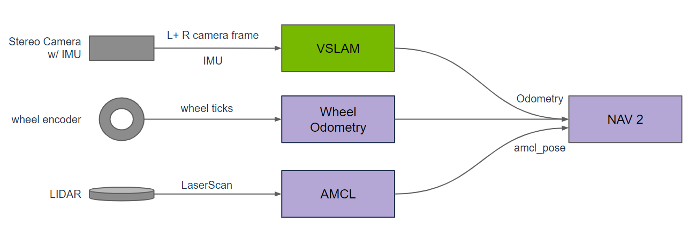
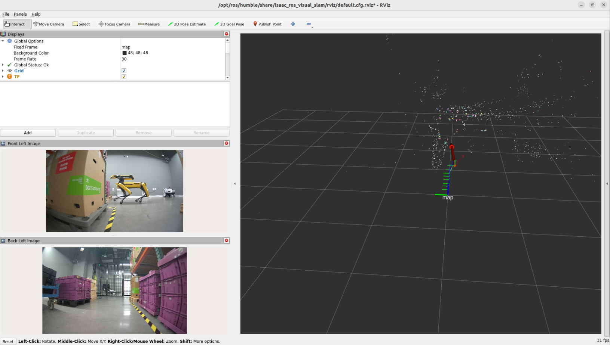

# 9.10 Visual SLAM

> Docker usage reference:
> Module 3.7 Docker

Isaac ROS Visual SLAM official link: https://nvidia-isaac-ros.github.io/repositories_and_packages/isaac_ros_visual_slam/index.html

## Overview



Isaac ROS Vision SLAM provides a high-performance, first-class ROS 2 software package for VSLAM. The package uses one or more stereo cameras and optional IMUs to estimate the mileage and uses it as a navigation input. It uses GPU acceleration to provide real-time, low-delayed results in robotic applications. VSLAM provides an additional mileage source for mobile robots (ground) and can serve as the main mileage source for drones.

## Quick Start

In order to simplify development, we mainly use Isaac ROS Dev Docker images and perform impact demonstrations on them. The demonstration does not require the installation of any camera device to simulate data streams from the camera by playing the rosbag file.

If you plan to run the workflow on real hardware or with a connected camera, refer to the official Isaac ROS documentation for supported camera setups.

Open a terminal, move into the workspace, and enter the Isaac ROS development container.

```bash

cd ${ISAAC_ROS_WS}/src

cd ${ISAAC_ROS_WS}/src/isaac_ros_common && \
./scripts/run_dev.sh
```

Run the following launch command:

```bash

rviz2 -d $(ros2 pkg prefix isaac_ros_visual_slam --share)/rviz/default.cfg.rviz
```

Open a second terminal and enter the container.

```bash

cd ${ISAAC_ROS_WS}/src/isaac_ros_common && \
./scripts/run_dev.sh
```

Run the following command:

```bash

ros2 launch isaac_ros_examples isaac_ros_examples.launch.py launch_fragments:=visual_slam \
interface_specs_file:=${ISAAC_ROS_WS}/isaac_ros_assets/isaac_ros_visual_slam/quickstart_interface_specs.json \
rectified_images:=false
```

## View the Result

Open the third terminal and enter the container.

```bash

cd ${ISAAC_ROS_WS}/src/isaac_ros_common && \
./scripts/run_dev.sh
```

Runs the following command, as shown in rviz2. If no image appears, you can run this command again.



```bash

ros2 bag play ${ISAAC_ROS_WS}/isaac_ros_assets/isaac_ros_visual_slam/quickstart_bag --remap  \
/front_stereo_camera/left/image_raw:=/left/image_rect \
/front_stereo_camera/left/camera_info:=/left/camera_info_rect \
/front_stereo_camera/right/image_raw:=/right/image_rect \
/front_stereo_camera/right/camera_info:=/right/camera_info_rect \
/back_stereo_camera/left/image_raw:=/rear_left/image_rect \
/back_stereo_camera/left/camera_info:=/rear_left/camera_info_rect \
/back_stereo_camera/right/image_raw:=/rear_right/image_rect \
/back_stereo_camera/right/camera_info:=/rear_right/camera_info_rect
```
