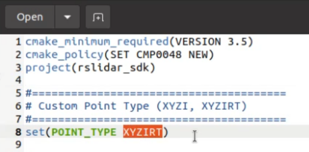
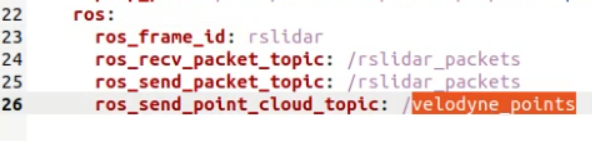
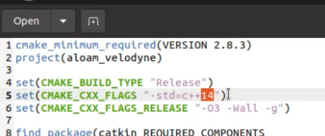
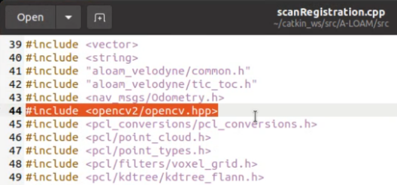
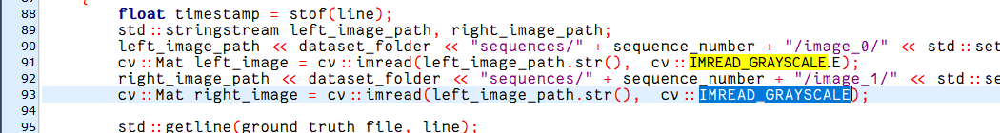
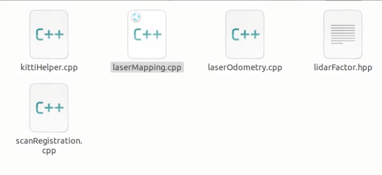
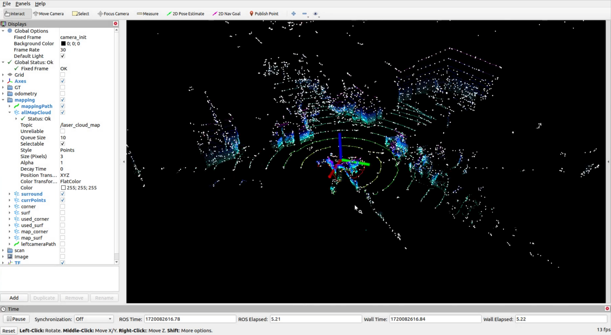

# 9.11 A-LOAM 3D SLAM on Jetson

## A-LOAM Profile

A-LOAM is advanced by the original LOAM algorithms proposed by J. Zhang and S. Singh. The main features of A-LOAM include:

Real-time laser radar mileage and construction maps.


Simplify the code structure using Eigen and Céres Solver.

High performance and robustness in many environments.

A-LOAM can be used for various applications such as autopilot, robotics and 3D construction maps.

This document provides detailed steps to set and run the A-LOAM (Advanced LOAM) algorithm using the RoboSense RS32 LiDAR sensor on the reComputer Jetson series. A-LOAM is an advanced achievement for LOAM, using Eigen and Céres Solver to achieve efficient real-time mapping and positioning.

### Precondition

Nvidia Jetson Orin Nano Super Kit

RoboSense RS32 Lidar

> The following is only tested on Ubuntu 20.04 and ROS Noetic. Please refer to 8.01.01 ROS1 Profile to complete the ROS environment settings.

> Please refer to the SDK where RoboSense RS32 Lidar is installed.

## Start Use

### Environment Settings







Implement the following steps in the Jetson terminal.

Step 1: Install gflags, google-glog, suitesparse and cxsparse3.







```bash
sudo apt-get install libgflags-dev libgoogle-glog-dev
sudo apt-get install libsuitesparse-dev libcxsparse3 libcxsparse-dev
```

Step 2: Install PCL.

```bash
sudo apt install libpcl-dev
```

Step 3: Install Ceres.

```bash
wget ceres-solver.org/ceres-solver-1.14.0.tar.gz
tar xvf ceres-solver-1.14.0.tar.gz
cd ceres-solver-1.14.0
mkdir build
cd build
cmake ..
make -j4
sudo make install
```


