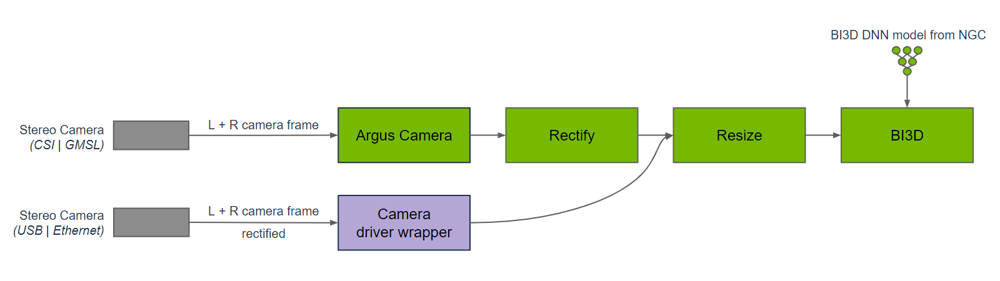
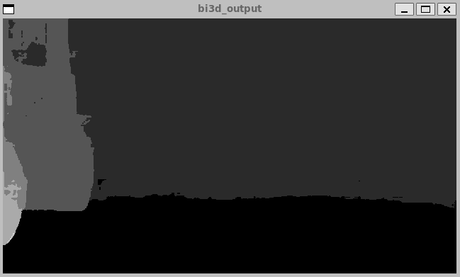
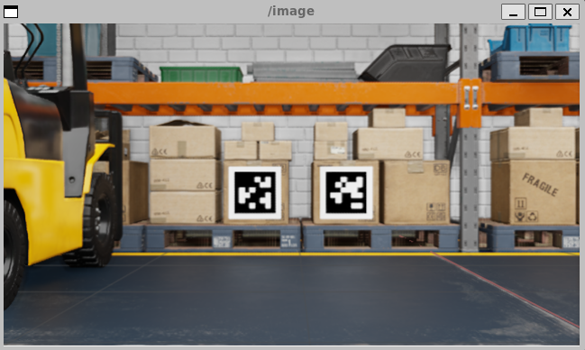

# 9.2 Depth Segmentation

> Docker usage reference:
> Module 3.7 Docker

Isaac ROS Depth Segmentation official link: https://nvidia-isaac-ros.github.io/repositories_and_packages/isaac_ros_depth_segmentation/index.html

## Overview



Isaac ROS Depth Segmentation provides an accelerated NVIDIA deep partition package. The isaac ros bi3d package uses an optimised Bi3D DNN model to provide a stereo Depth estimate by binaryisation and is used for depth separation. Depth partitions can be used to determine whether the barrier is located in an adjacent area and to avoid collisions with the barrier during navigation.

Bi3D is used for nodal diagrams that are deep-separated from the time synchronized input of right-and-right stereo images. Bi3D images need to be corrected and resized to fit the appropriate input resolution. The width ratio of the image needs to be maintained; Therefore, it may be necessary to trim and resize to maintain the input width ratio. The DNN code, DNN reasoning and DNN decodes are part of the Bi3D node. The reasoning is executed using TensorRT because the Bi3D DNN model is designed to optimize using TensorRT support.

Compared to other stereo visual functions, the depth segmenting predicts whether the barrier is located in an adjacent area (rather than in continuous depth) and at the same time predicts free space at a distance from the ground, which other functions usually do not provide. In addition, unlike other stereo visual functions in Isaac ROS, the depth is separated on the NVIDIA DLA (Deep Learning Accelerator), which is independent of GPU.

## Quick Start

In order to simplify development, we mainly use Isaac ROS Dev Docker images and perform impact demonstrations on them. The demonstration does not require the installation of any camera device to simulate data streams from the camera by playing the rosbag file.

If you plan to run the workflow on real hardware or with a connected camera, refer to the official Isaac ROS documentation for supported camera setups.

Open a terminal and move into the workspace

```bash

cd ${ISAAC_ROS_WS}/src
Enter the Isaac ROS Dev Docker container
cd ${ISAAC_ROS_WS}/src/isaac_ros_common && \
./scripts/run_dev.sh
```

Run the following launch command:

> Note: Taking an official example may require scientific access, ensuring that your network environment has regular access to GitHub

```bash

cd /workspaces/isaac_ros-dev/src

# Example repository (provides quickstart launches such as isaac_ros_examples.launch.py)
git clone -b release-3.2 https://github.com/NVIDIA-ISAAC-ROS/isaac_ros_examples.git

# Repository for Bi3D (Depth Segmentation / Bi3D)
git clone -b release-3.2 https://github.com/NVIDIA-ISAAC-ROS/isaac_ros_depth_segmentation.git

# Common utilities repository (run_dev, scripts, and shared dependencies/configuration)
git clone -b release-3.2 https://github.com/NVIDIA-ISAAC-ROS/isaac_ros_common.git
cd /workspaces/isaac_ros-dev

# Make sure rosdep is available (it is usually preinstalled in the dev container)
sudo apt-get update
rosdep update

# Install workspace dependencies
rosdep install --from-paths src --ignore-src -r -y

# Build
colcon build --symlink-install


ros2 launch isaac_ros_examples isaac_ros_examples.launch.py \
launch_fragments:=bi3d \
interface_specs_file:=${ISAAC_ROS_WS}/isaac_ros_assets/isaac_ros_bi3d/rosbag_quickstart_interface_specs.json \
featnet_engine_file_path:=${ISAAC_ROS_WS}/isaac_ros_assets/models/bi3d_proximity_segmentation/featnet.plan \
segnet_engine_file_path:=${ISAAC_ROS_WS}/isaac_ros_assets/models/bi3d_proximity_segmentation/segnet.plan \
max_disparity_values:=10
```

Open a second terminal and enter the container.

```bash

cd ${ISAAC_ROS_WS}/src/isaac_ros_common && \
./scripts/run_dev.sh
```

Run the following command:

```bash

ros2 bag play --loop ${ISAAC_ROS_WS}/isaac_ros_assets/isaac_ros_bi3d/bi3dnode_rosbag
```

## View the Result

Open the third terminal and enter the container.

```bash

cd ${ISAAC_ROS_WS}/src/isaac_ros_common && \
./scripts/run_dev.sh
```

Run the following command: to see the depth partition



```bash

 ros2 run isaac_ros_bi3d isaac_ros_bi3d_visualizer.py --max_disparity_value 30
```

Open the fourth terminal and enter the container.

```bash

cd ${ISAAC_ROS_WS}/src/isaac_ros_common && \
./scripts/run_dev.sh
```

Run the following command:, see images



```bash

ros2 run image_view image_view --ros-args -r image:=right/image_rect
```
