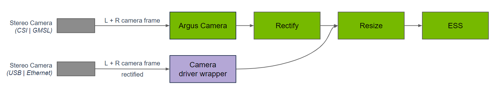
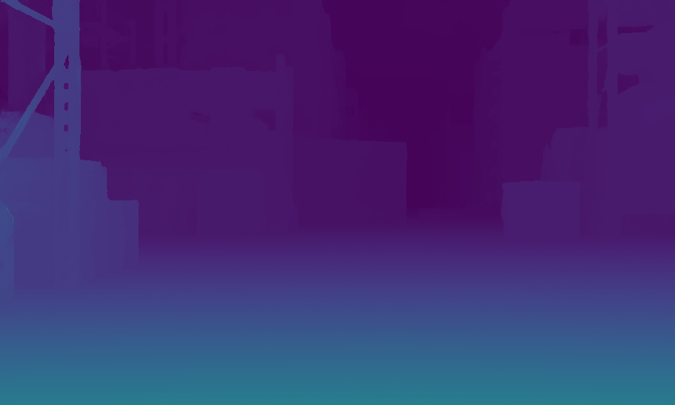
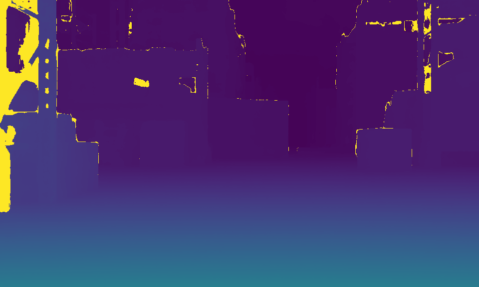

# 9.3 DNN Stereo Depth

> Docker usage reference:
> Module 3.7 Docker

Isaac ROS DNN Depth Network Link: https://nvidia-isaac-ros.github.io/repositories_and_packages/isaac_ros_dnn_stereo_depth/index.html

## Overview



The problem of visual depth perception is common in many areas of robotics, such as estimating the attitude of the arm in an object operation, estimating the distance of static or moving targets in autonomous robotic navigation, tracking targets in delivery robots, etc. Isaac ROS DNN Stereo Decth is for two Isaac applications, Isaac Manipulator and Isaac Perceptor. In the Isaac Manipulator application, ESS is deployed as a plugin node in the Isaac ROS control package to provide a deep sense of mechanical arm movement planning and control. In this scenario, the multi-camera stereo stream of the industrial mechanical arm performing the desktop task is passed to the ESS for the corresponding depth stream. Depth currents are used to divide the relative distance of the mechanical arm from the corresponding object on the desktop; This provides a signal for collision avoidance and fine particle control. Similarly, the Isaac Perceptor application uses several Isaac ROS packages, namely Isaac ROS Nova, Isaac ROS Visual Slam, Isaac ROS Stereo Deep (ESS), Isaac ROS Nvblox and Isaac ROS Image Pipeline.

## Quick Start

In order to simplify development, we mainly use Isaac ROS Dev Docker images and perform impact demonstrations on them. The demonstration does not require the installation of any camera device to simulate data streams from the camera by playing the rosbag file.

Note: If you want to be installed on your own equipment or to connect the camera to develop other features, please refer to the Isaac ROS official network to connect the camera with the specified model of Yveida.

Open a terminal and move into the workspace

```bash

cd ${ISAAC_ROS_WS}/src
Enter the Isaac ROS Dev Docker container
cd ${ISAAC_ROS_WS}/src/isaac_ros_common && \
./scripts/run_dev.sh
```

Runs the following start-up command, of which Threshold: = 0.0 can be modified to 0.4 on start-up, with different effects.

```bash

ros2 launch isaac_ros_examples isaac_ros_examples.launch.py launch_fragments:=ess_disparity \
engine_file_path:=${ISAAC_ROS_WS:?}/isaac_ros_assets/models/dnn_stereo_disparity/dnn_stereo_disparity_v4.1.0_onnx/ess.engine \
  threshold:=0.0
```

Open a second terminal and enter the container.

```bash

cd ${ISAAC_ROS_WS}/src/isaac_ros_common && \
./scripts/run_dev.sh
```

Run the following command:

```bash

ros2 bag play -l ${ISAAC_ROS_WS}/isaac_ros_assets/isaac_ros_ess/rosbags/ess_rosbag \
  --remap /left/camera_info:=/left/camera_info_rect /right/camera_info:=/right/camera_info_rect
```

## View the Result

Open the third terminal and enter the container.

```bash

cd ${ISAAC_ROS_WS}/src/isaac_ros_common && \
./scripts/run_dev.sh
```

Run the following command::

```bash

ros2 run isaac_ros_ess isaac_ros_ess_visualizer.py
```



When set to 0.0, display the following results:

I don't know.



When set to 0.4, the results are shown below:
