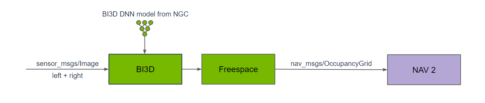
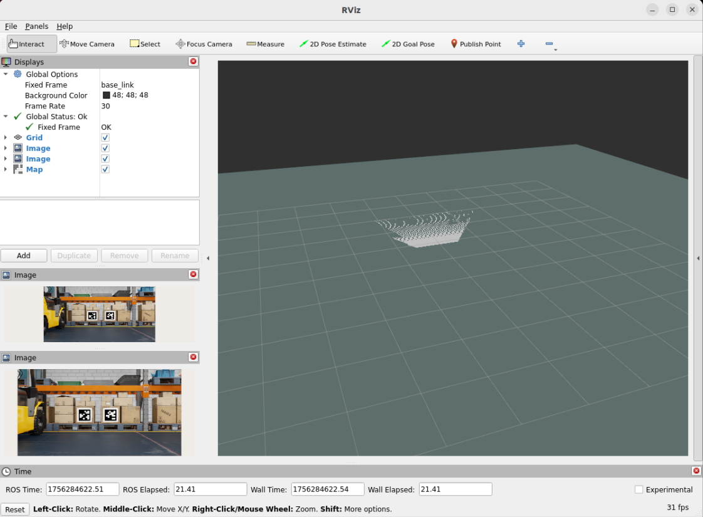

# 9.4 Free Space Segmentation

> Docker usage reference:
> Module 3.7 Docker

Isaac ROS Free Space Division Network link: https://nvidia-isaac-ros.github.io/repositories_and_packages/isaac_ros_freespace_segmentation/index.html

## Overview



Isaac ROS free space partition contains a ROS 2 package to generate a navigational occupancy grid. Bi3D Free Space creates an occupied grid for Nav2 by handling free space masks containing robotics relative to the surface to avoid barriers in navigation. The package is accelerated by GPU and provides real-time, low-delayed results in robotic applications. Bi3D Free Space provides an additional occupancy grid source for mobile robots (ground robots).

## Quick Start

In order to simplify development, we mainly use Isaac ROS Dev Docker images and perform impact demonstrations on them. The demonstration does not require the installation of any camera device to simulate data streams from the camera by playing the rosbag file.

Note: If you want to be installed on your own equipment or to connect the camera to develop other features, please refer to the Isaac ROS official network to connect the camera with the specified model of Yveida.

Open a terminal, move into the workspace, and enter the Isaac ROS development container.

```bash

cd ${ISAAC_ROS_WS}/src

cd ${ISAAC_ROS_WS}/src/isaac_ros_common && \
./scripts/run_dev.sh
```

Run the command below.

```bash

ros2 launch isaac_ros_examples isaac_ros_examples.launch.py \
launch_fragments:=bi3d,bi3d_freespace \
interface_specs_file:=${ISAAC_ROS_WS}/isaac_ros_assets/isaac_ros_bi3d_freespace/rosbag_quickstart_interface_specs.json \
featnet_engine_file_path:=${ISAAC_ROS_WS}/isaac_ros_assets/models/bi3d_proximity_segmentation/featnet.plan \
segnet_engine_file_path:=${ISAAC_ROS_WS}/isaac_ros_assets/models/bi3d_proximity_segmentation/segnet.plan \
max_disparity_values:=10
```

Open a second terminal and enter the container.

```bash

cd ${ISAAC_ROS_WS}/src/isaac_ros_common && \
./scripts/run_dev.sh
```

Run the following command:

```bash

ros2 bag play -l ${ISAAC_ROS_WS}/isaac_ros_assets/isaac_ros_bi3d_freespace/quickstart.bag
```

## View the Result

Open the third terminal and enter the container.

```bash

cd ${ISAAC_ROS_WS}/src/isaac_ros_common && \
./scripts/run_dev.sh
```

Run the following command to view the result:



```bash

rviz2
```
