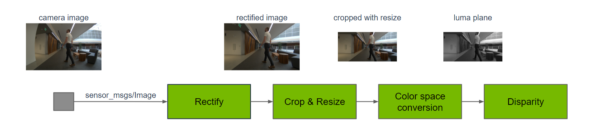
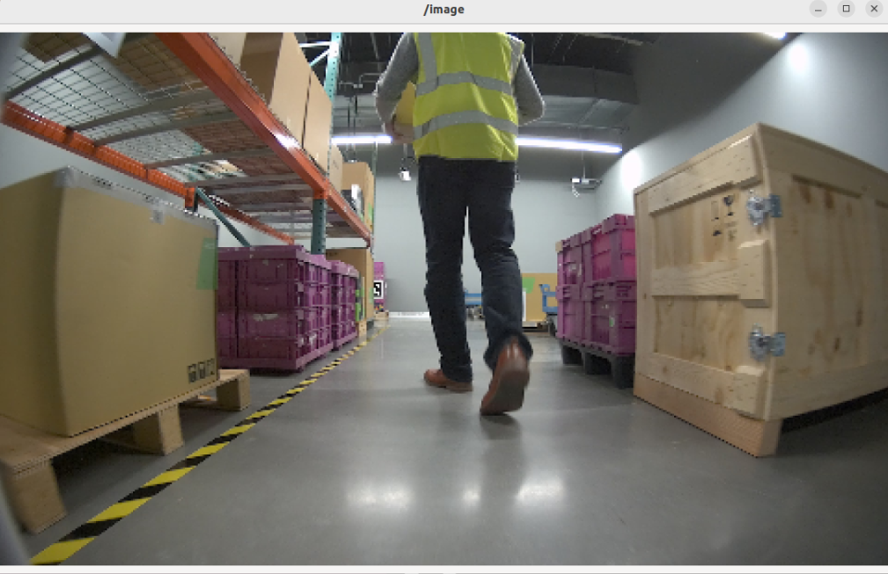
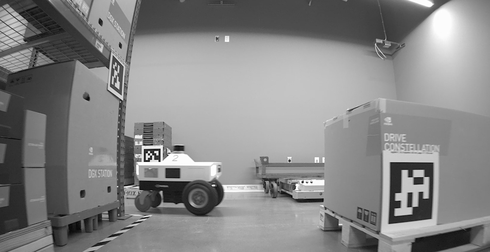
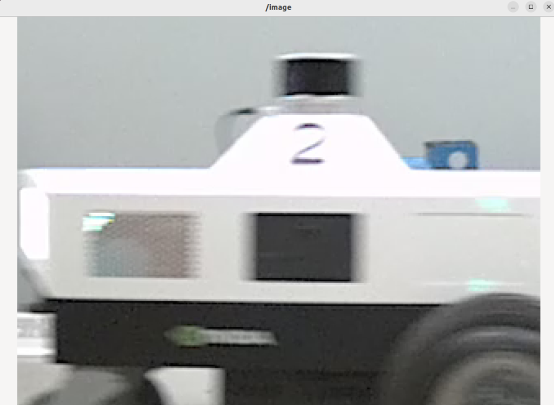
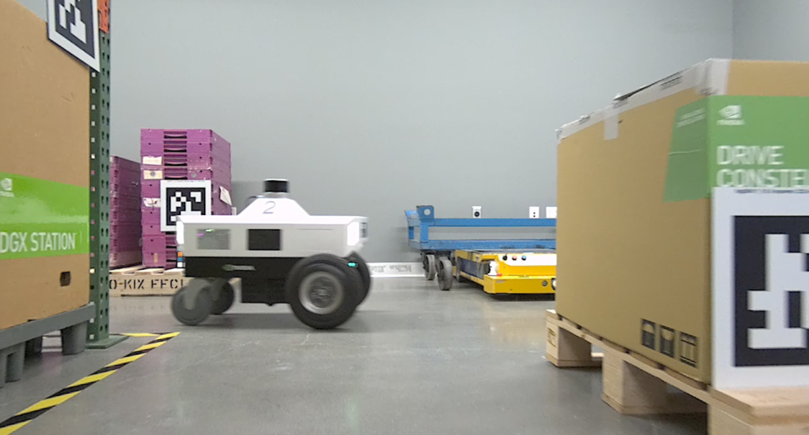
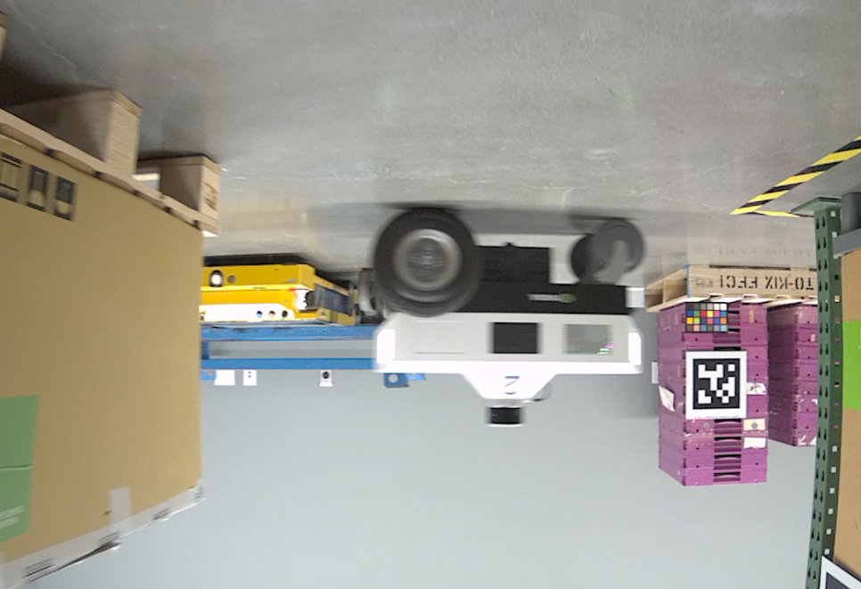

# 9.5 Image Rectification and Preprocessing

> Docker usage reference:
> Module 3.7 Docker

Isaac ROS image malformation processing: https://nvidia-isaac-ros.github.io/repositories_and_packages/isaac_ros_image_pipeline/index.html

## Overview



Isaac ROS image malformation processing uses the Isaac ROS image conduit, a package for image processing functions. Camera output usually requires pre-processing to meet input requirements for a variety of sensor functions. This includes tailoring, resizeing, mirroring, correcting lens malformations and colour space conversion. For stereo cameras, additional processing is required to generate a visual difference between the left and right image and the light cloud, thereby achieving a deep perception.

## Quick Start

In order to simplify development, we mainly use Isaac ROS Dev Docker images and perform impact demonstrations on them. The demonstration does not require the installation of any camera device to simulate data streams from the camera by playing the rosbag file.

Note: If you want to be installed on your own equipment or to connect the camera to develop other features, please refer to the Isaac ROS official network to connect the camera with the specified model of Yveida.

Resize:

Open a terminal, move into the workspace, and enter the Isaac ROS development container.

```bash

cd ${ISAAC_ROS_WS}/src

cd ${ISAAC_ROS_WS}/src/isaac_ros_common && \
./scripts/run_dev.sh
```

Run the following launch command:

```bash

ros2 launch isaac_ros_examples isaac_ros_examples.launch.py launch_fragments:=resize
```

Open a second terminal and enter the container.

```bash

cd ${ISAAC_ROS_WS}/src/isaac_ros_common && \
./scripts/run_dev.sh
```

Run the following command:

```bash

ros2 bag play --loop ${ISAAC_ROS_WS}/isaac_ros_assets/isaac_ros_image_proc/quickstart --remap /hawk_0_left_rgb_image:=/image_raw /hawk_0_left_rgb_camera_info:=/camera_info
```

## View the Result

Open the third terminal and enter the container.

```bash

cd ${ISAAC_ROS_WS}/src/isaac_ros_common && \
./scripts/run_dev.sh
```

Run the following command:



```bash

ros2 run image_view image_view --ros-args --remap image:=resize/image
```

### Color Conversion

Open a terminal and move into the workspace

Note: If the container has been opened and other commands have been operated, then start the command after the first terminal enter exit exit from all docker containers.

Open a terminal, move into the workspace, and enter the Isaac ROS development container.

```bash

cd ${ISAAC_ROS_WS}/src

cd ${ISAAC_ROS_WS}/src/isaac_ros_common && \
./scripts/run_dev.sh
```

Run the following start-up command:

```bash

ros2 launch isaac_ros_examples isaac_ros_examples.launch.py launch_fragments:=color_conversion interface_specs_file:=${ISAAC_ROS_WS}/isaac_ros_assets/isaac_ros_image_proc/quickstart_interface_specs.json
```

Open a second terminal and enter the container.

```bash

cd ${ISAAC_ROS_WS}/src/isaac_ros_common && \
./scripts/run_dev.sh
```

Run the following command::

```bash

ros2 bag play --loop ${ISAAC_ROS_WS}/isaac_ros_assets/isaac_ros_image_proc/quickstart --remap /hawk_0_left_rgb_image:=/image_raw /hawk_0_left_rgb_camera_info:=/camera_info
```

## View the Result

Open the third terminal and enter the container.

```bash

cd ${ISAAC_ROS_WS}/src/isaac_ros_common && \
./scripts/run_dev.sh
```

Run the following command:



```bash

ros2 run image_view image_view --ros-args --remap image:=image_mono
```

### Crop

Open a terminal, move into the workspace, and enter the Isaac ROS development container.

```bash

cd ${ISAAC_ROS_WS}/src

cd ${ISAAC_ROS_WS}/src/isaac_ros_common && \
./scripts/run_dev.sh
```

Run the following launch command:

```bash

ros2 launch isaac_ros_examples isaac_ros_examples.launch.py launch_fragments:=crop interface_specs_file:=${ISAAC_ROS_WS}/isaac_ros_assets/isaac_ros_image_proc/quickstart_interface_specs.json
```

Open a second terminal and enter the container.

```bash

cd ${ISAAC_ROS_WS}/src/isaac_ros_common && \
./scripts/run_dev.sh
```

Run the following command:

```bash

ros2 bag play --loop ${ISAAC_ROS_WS}/isaac_ros_assets/isaac_ros_image_proc/quickstart --remap /hawk_0_left_rgb_image:=/image_raw /hawk_0_left_rgb_camera_info:=/camera_info
```

## View the Result

Open the third terminal and enter the container.

```bash

cd ${ISAAC_ROS_WS}/src/isaac_ros_common && \
./scripts/run_dev.sh
```

Run the following command:



```bash

ros2 run image_view image_view --ros-args --remap image:=crop/image
```

### Rectify

Open a terminal, move into the workspace, and enter the Isaac ROS development container.

```bash

cd ${ISAAC_ROS_WS}/src

cd ${ISAAC_ROS_WS}/src/isaac_ros_common && \
./scripts/run_dev.sh
```

Run the following launch command:

```bash

ros2 launch isaac_ros_examples isaac_ros_examples.launch.py launch_fragments:=rectify_mono interface_specs_file:=${ISAAC_ROS_WS}/isaac_ros_assets/isaac_ros_image_proc/quickstart_interface_specs.json
```

Open a second terminal and enter the container.

```bash

cd ${ISAAC_ROS_WS}/src/isaac_ros_common && \
./scripts/run_dev.sh
```

Run the following command:

```bash

ros2 bag play --loop ${ISAAC_ROS_WS}/isaac_ros_assets/isaac_ros_image_proc/quickstart --remap /hawk_0_left_rgb_image:=/image_raw /hawk_0_left_rgb_camera_info:=/camera_info
```

## View the Result

Open the third terminal and enter the container.

```bash

cd ${ISAAC_ROS_WS}/src/isaac_ros_common && \
./scripts/run_dev.sh
```

Run the following command:



```bash

ros2 run image_view image_view --ros-args --remap image:=image_rect
```

### Flip

Open a terminal, move into the workspace, and enter the Isaac ROS development container.

```bash

cd ${ISAAC_ROS_WS}/src

cd ${ISAAC_ROS_WS}/src/isaac_ros_common && \
./scripts/run_dev.sh
```

Run the following launch command:

```bash

ros2 launch isaac_ros_examples isaac_ros_examples.launch.py launch_fragments:=flip
```

Open a second terminal and enter the container.

```bash

cd ${ISAAC_ROS_WS}/src/isaac_ros_common && \
./scripts/run_dev.sh
```

Run the following command:

```bash

ros2 bag play --loop ${ISAAC_ROS_WS}/isaac_ros_assets/isaac_ros_image_proc/quickstart --remap /hawk_0_left_rgb_image:=/image_raw /hawk_0_left_rgb_camera_info:=/camera_info
```

## View the Result

Open the third terminal and enter the container.

```bash

cd ${ISAAC_ROS_WS}/src/isaac_ros_common && \
./scripts/run_dev.sh
```

Run the following command:



```bash

ros2 run image_view image_view --ros-args --remap image:=image_flipped
```
