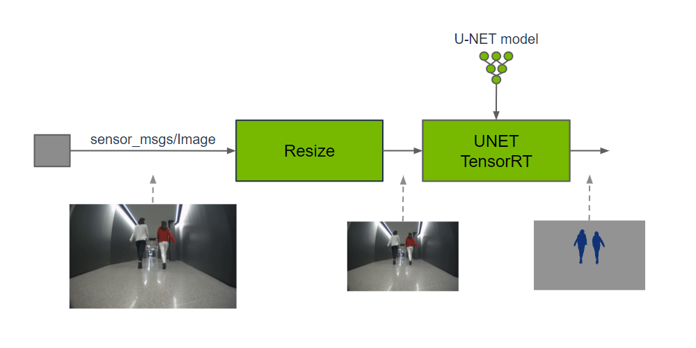
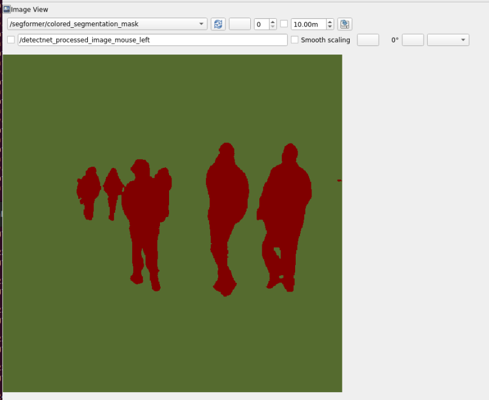

# 9.6 Image Segmentation

> Docker usage reference:
> Module 3.7 Docker

Isaac ROS image split official web link: https://nvidia-isaac-ros.github.io/repositories_and_packages/isaac_ros_image_segmentation/index.html

## Overview

Isaac ROS image partition contains a ROS package for semantic image partition.



These packages provide a pixel-level classification of input images by running GPU acceleration reasoning on the DNN model. Each pixel that enters an image is projected to fall into a defined group of categories. The sensor function can use output predictions to understand the spatial position of each category in a two-dimensional image or to integrate it with the corresponding depth position in a three-dimensional scene.

## Quick Start

In order to simplify development, we mainly use Isaac ROS Dev Docker images and perform impact demonstrations on them. The demonstration does not require the installation of any camera device to simulate data streams from the camera by playing the rosbag file.

If you plan to run the workflow on real hardware or with a connected camera, refer to the official Isaac ROS documentation for supported camera setups.

Open a terminal, move into the workspace, and enter the Isaac ROS development container.

```bash

cd ${ISAAC_ROS_WS}/src

cd ${ISAAC_ROS_WS}/src/isaac_ros_common && \
./scripts/run_dev.sh
```

Run the following launch command:

```bash

ros2 launch isaac_ros_examples isaac_ros_examples.launch.py launch_fragments:=segformer interface_specs_file:=${ISAAC_ROS_WS}/isaac_ros_assets/isaac_ros_segformer/quickstart_interface_specs.json model_name:=peoplesemsegformer model_repository_paths:=[${ISAAC_ROS_WS}/isaac_ros_assets/models]
```

Open a second terminal and enter the container.

```bash

cd ${ISAAC_ROS_WS}/src/isaac_ros_common && \
./scripts/run_dev.sh
```

Run the following command:

```bash

ros2 bag play -l isaac_ros_assets/isaac_ros_segformer/segformer_sample_data
```

## View the Result

Open the third terminal and enter the container.

```bash

cd ${ISAAC_ROS_WS}/src/isaac_ros_common && \
./scripts/run_dev.sh
```

Run the following command to view the result:



```bash

ros2 run rqt_image_view rqt_image_view /segformer/colored_segmentation_mask
```
