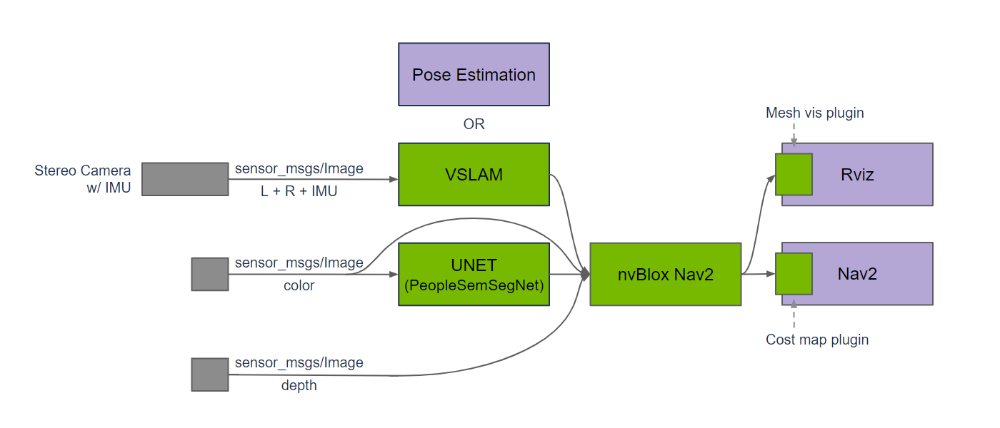
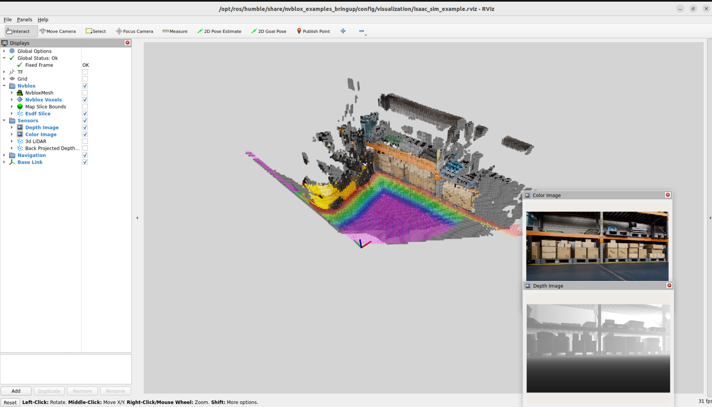

# 9.7 3D Scene Reconstruction and Mapping

> Docker usage reference:
> Module 3.7 Docker

Isaac ROS 3D scene reconstruction and map network link: https://nvidia-isaac-ros.github.io/repositories_and_packages/isaac_ros_nvblox/index.html

## Overview

Isaac ROS Nvblox contains a 3D reconstruction and cost map for navigation. isaac ros nvblox handles depth and attitude data, reconstructs 3D scenes in real time and outputs 2D cost maps for Nav2. Cost maps are used for navigation planning as a visual-based solution to circumvent barriers.



Isaac ros nvblox is designed for use in conjunction with depth cameras and/or 3D laser radars. The package is accelerated using GPU, using the C++ library nvblox independent of the bottom frame to calculate the 3D reconstruction and 2D cost maps.

## Quick Start

In order to simplify development, we mainly use Isaac ROS Dev Docker images and perform impact demonstrations on them. The demonstration does not require the installation of any camera device to simulate data streams from the camera by playing the rosbag file.

If you plan to run the workflow on real hardware or with a connected camera, refer to the official Isaac ROS documentation for supported camera setups.

Open a terminal, move into the workspace, and enter the Isaac ROS development container.

```bash

cd ${ISAAC_ROS_WS}/src

cd ${ISAAC_ROS_WS}/src/isaac_ros_common && \
./scripts/run_dev.sh
```

Run the following launch command:

```bash

ros2 launch nvblox_examples_bringup isaac_sim_example.launch.py \
rosbag:=${ISAAC_ROS_WS}/isaac_ros_assets/isaac_ros_nvblox/quickstart \
navigation:=False
```



Run Results
