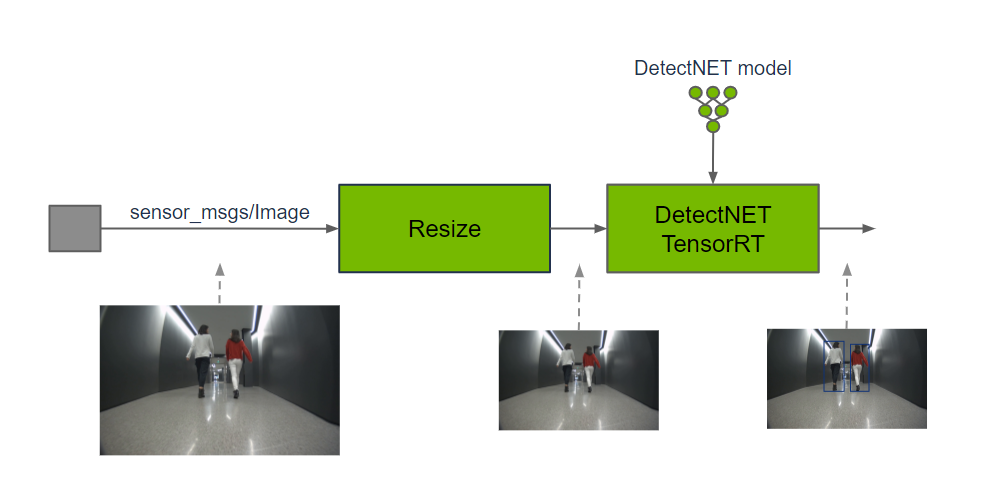
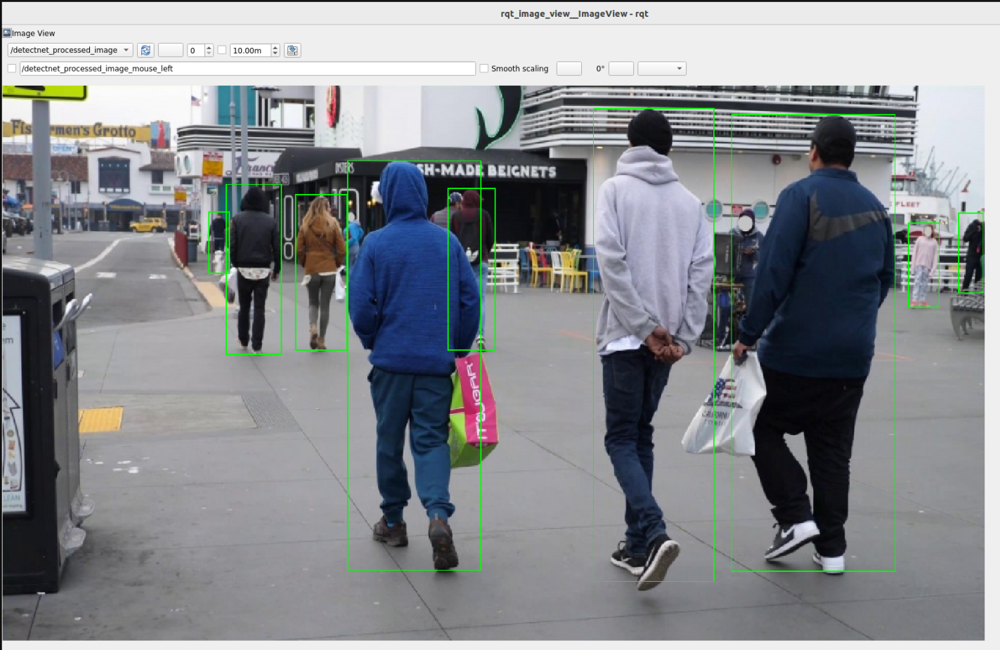

# 9.8 Object Detection

> Docker usage reference:
> Module 3.7 Docker

Isaac ROS Object Checker Network Link: https://nvidia-isaac-ros.github.io/repositories_and_packages/isaac_ros_object_detection/index.html

## Overview

Isaac ROS object detection includes software packages in ROS 2 to perform object detection. Isaac ros rtdetr, Isaac ros dectnet and isaac ros yolov8, respectively, provide a method for spatial classification of input images using boundary frames. The classification is implemented by the GPU acceleration model of the corresponding structure:

isac ros rtdetr: RT-DTR model

isac ros dectnet:DetectNet model

isac ros yolov8:YOLOv8 model



Output predictions can be used to understand the existence of objects in images and their spatial location.

## Quick Start

In order to simplify development, we mainly use Isaac ROS Dev Docker images and perform impact demonstrations on them. The demonstration does not require the installation of any camera device to simulate data streams from the camera by playing the rosbag file.

If you plan to run the workflow on real hardware or with a connected camera, refer to the official Isaac ROS documentation for supported camera setups.

Open a terminal, move into the workspace, and enter the Isaac ROS development container.

```bash

cd ${ISAAC_ROS_WS}/src

cd ${ISAAC_ROS_WS}/src/isaac_ros_common && \
./scripts/run_dev.sh
```

Run the following launch command:

```bash

ros2 launch isaac_ros_examples isaac_ros_examples.launch.py launch_fragments:=detectnet interface_specs_file:=${ISAAC_ROS_WS}/isaac_ros_assets/isaac_ros_detectnet/quickstart_interface_specs.json
```

Open a second terminal and enter the container.

```bash

cd ${ISAAC_ROS_WS}/src/isaac_ros_common && \
./scripts/run_dev.sh
```

Run the following command:

```bash

ros2 bag play -l ${ISAAC_ROS_WS}/isaac_ros_assets/isaac_ros_detectnet/rosbags/detectnet_rosbag --remap image:=image_rect camera_info:=camera_info_rect
```

## View the Result

Open the third terminal and enter the container.

```bash

cd ${ISAAC_ROS_WS}/src/isaac_ros_common && \
./scripts/run_dev.sh
```

Run the following command:

```bash

ros2 run isaac_ros_detectnet isaac_ros_detectnet_visualizer.py --ros-args --remap image:=detectnet_encoder/resize/image
```

Open the fourth terminal and enter the container.

```bash

cd ${ISAAC_ROS_WS}/src/isaac_ros_common && \
./scripts/run_dev.sh
```

Run the following command to view the result:



```bash

ros2 run rqt_image_view rqt_image_view /detectnet_processed_image
```
