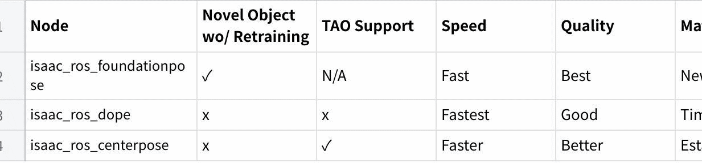
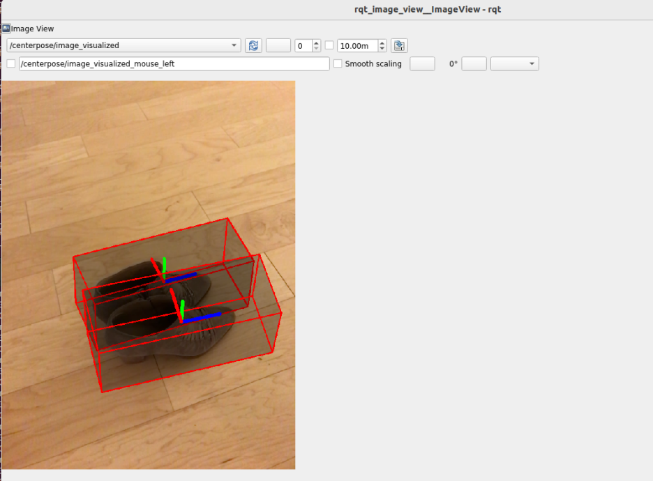

# 9.9 3D Pose Estimation

> Docker usage reference:
> Module 3.7 Docker

Isaac ROS 3D pose estimation official link: https://nvidia-isaac-ros.github.io/repositories_and_packages/isaac_ros_pose_estimation/isaac_ros_centerpose/index.html

## Overview



Isaac ROS Pose Estimation includes three main ROS 2 packages for 6-DoF object pose workflows. The table below summarizes the differences between them.

| Package | Novel object without retraining | TAO support | Relative speed | Relative quality | Best fit |
| --- | --- | --- | --- | --- | --- |
| `isaac_ros_foundationpose` | Yes | N/A | Fast | Best | Zero-shot pose estimation and tracking for unseen objects |
| `isaac_ros_dope` | No | No | Fastest | Good | Mature, lightweight pose estimation for known objects |
| `isaac_ros_centerpose` | No | Yes | Faster | Better | Known-object pose estimation with NVIDIA TAO training support |

These packages use GPU to accelerate DNN reasoning to estimate the object's attitude. The sensor function can use output predictions to integrate with the corresponding depth, thus providing the 3D attitude and distance of the object for navigation or operation.

## Quick Start

In order to simplify development, we mainly use Isaac ROS Dev Docker images and perform impact demonstrations on them. The demonstration does not require the installation of any camera device to simulate data streams from the camera by playing the rosbag file.

If you plan to run the workflow on real hardware or with a connected camera, refer to the official Isaac ROS documentation for supported camera setups.

Open a terminal, move into the workspace, and enter the Isaac ROS development container.

```bash

cd ${ISAAC_ROS_WS}/src

cd ${ISAAC_ROS_WS}/src/isaac_ros_common && \
./scripts/run_dev.sh
```

Run the following launch command:

```bash

ros2 launch isaac_ros_examples isaac_ros_examples.launch.py launch_fragments:=centerpose,centerpose_visualizer interface_specs_file:=${ISAAC_ROS_WS}/isaac_ros_assets/isaac_ros_centerpose/quickstart_interface_specs.json model_name:=centerpose_shoe model_repository_paths:=[${ISAAC_ROS_WS}/isaac_ros_assets/models]
```

Open a second terminal and enter the container.

```bash

cd ${ISAAC_ROS_WS}/src/isaac_ros_common && \
./scripts/run_dev.sh
```

Run the following command:

```bash

ros2 bag play -l ${ISAAC_ROS_WS}/isaac_ros_assets/isaac_ros_centerpose/quickstart.bag
```

## View the Result

Open the third terminal and enter the container.

```bash

cd ${ISAAC_ROS_WS}/src/isaac_ros_common && \
./scripts/run_dev.sh
```

Run the following command to view the result:



```bash

ros2 run rqt_image_view rqt_image_view /centerpose/image_visualized
```
